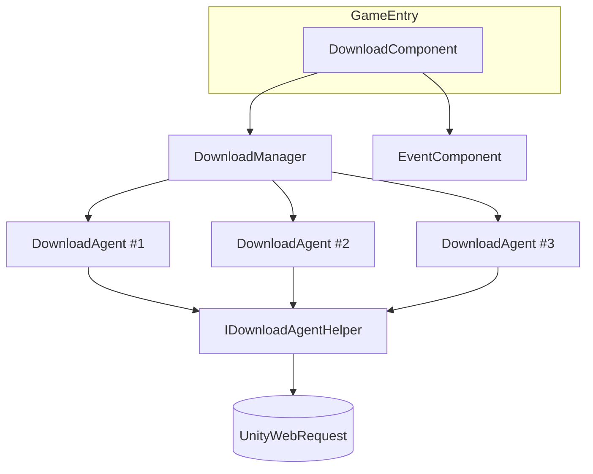

# Introduction to the Download Component

The GameFrameX Download Component is a multi-agent download manager for Unity, responsible for concurrent file downloads, priority queue scheduling, pause/resume, real-time speed reporting, and event callbacks. It exposes `DownloadComponent` (attached to `GameEntry`) as its public entry point and internally encapsulates `DownloadManager` along with pluggable download agent helpers (`IDownloadAgentHelper`), making it well suited for local disk-write download scenarios such as asset bundles, hot-update files, and patches.

## Quick Start

1. **Install the component**: Add the Scoped Registry and dependency in `Packages/manifest.json`:

   ```json
   {
     "scopedRegistries": [
       {
         "name": "GameFrameX",
         "url": "https://gameframex.upm.alianblank.uk",
         "scopes": ["com.gameframex"]
       }
     ],
     "dependencies": {
       "com.gameframex.unity.download": "1.1.2"
     }
   }
   ```

   Source: [README.zh-CN.md](https://github.com/GameFrameX/com.gameframex.unity.download/blob/main/README.zh-CN.md#L68-L84)

2. **Get the component instance**: Retrieve `DownloadComponent` through the framework entry point:

   ```csharp
   var downloadComponent = GameEntry.GetComponent<DownloadComponent>();
   ```

   Source: [DownloadComponent.cs](https://github.com/GameFrameX/com.gameframex.unity.download/blob/main/Runtime/Download/DownloadComponent.cs#L46-L60)

3. **Add a download task** (asynchronous approach):

   ```csharp
   bool success = await downloadComponent.Download(
       "/本地保存路径/file.zip",
       "https://example.com/file.zip"
   );
   ```

   Source: [README.zh-CN.md](https://github.com/GameFrameX/com.gameframex.unity.download/blob/main/README.zh-CN.md#L131-L143)

4. **Or use the event-driven approach**:

   ```csharp
   var eventComponent = GameEntry.GetComponent<EventComponent>();
   eventComponent.Subscribe(DownloadSuccessEventArgs.EventId, OnDownloadSuccess);
   eventComponent.Subscribe(DownloadFailureEventArgs.EventId, OnDownloadFailure);

   int serialId = downloadComponent.AddDownload(
       "/本地保存路径/file.zip",
       "https://example.com/file.zip"
   );
   ```

   Source: [README.zh-CN.md](https://github.com/GameFrameX/com.gameframex.unity.download/blob/main/README.zh-CN.md#L96-L127)

5. **Group by tag and pause/resume**:

   ```csharp
   int id = downloadComponent.AddDownload(path, uri, tag: "assets", priority: 10);
   downloadComponent.GetDownloadInfos("assets");
   downloadComponent.RemoveDownloads("assets");

   downloadComponent.Paused = true;   // Pause all
   downloadComponent.Paused = false;  // Resume
   ```

   Source: [README.zh-CN.md](https://github.com/GameFrameX/com.gameframex.unity.download/blob/main/README.zh-CN.md#L145-L167)

## How It Works at a Glance

Externally, the component exposes only `DownloadComponent`; internally, three types of objects work together:



- `DownloadComponent` manages parameters (agent count, timeout, `FlushSize`, helper type) and forwards calls.
- `DownloadManager` maintains the task queue and agent pool, dispatching tasks by priority.
- `IDownloadAgentHelper` is the abstraction that actually sends network requests; the default implementation is `UnityWebRequestDownloadAgentHelper`, which can be replaced or customized in the Inspector.
- Completion/failure results are broadcast to subscribers through the event bus.

Source: [DownloadComponent.cs](https://github.com/GameFrameX/com.gameframex.unity.download/blob/main/Runtime/Download/DownloadComponent.cs#L46-L80)

## Core Features at a Glance

| Feature | Description |
|------|------|
| Multi-agent concurrency | 3 download agents run in parallel by default; configurable via the Inspector |
| Priority scheduling | Higher values are dispatched first |
| Tag grouping | Supports adding, querying, and removing tasks by tag |
| Pause and resume | `Paused = true/false` applies globally |
| Timeout and disk flushing | `Timeout` (default 30 seconds) and `FlushSize` (default 1 MB) support resumable downloads |
| Real-time metrics | `CurrentSpeed`, `TotalAgentCount`, `WaitingTaskCount` |
| Event-driven | Dispatches `DownloadStart` / `DownloadUpdate` / `DownloadSuccess` / `DownloadFailure` via `EventComponent` |
| Async support | `Download()` returns `Task<bool>` and can be awaited directly |
| Pluggable backend | Ships with `UnityWebRequestDownloadAgentHelper`, or you can implement `IDownloadAgentHelper` yourself |

Source: [README.zh-CN.md](https://github.com/GameFrameX/com.gameframex.unity.download/blob/main/README.zh-CN.md#L28-L38)

## Next Steps

- For adding download tasks and handling results, see *How to Start a Download*.
- For managing tasks by tag, see *How to Manage Downloads Using Tag Grouping*.
- For pause/resume, adjusting timeout, and flush thresholds, see *How to Configure the Download Component*.
- For event subscription and choosing the async interface, see *How to Subscribe to Download Events*.
- For replacing or customizing the download backend, see *How to Replace the Download Agent Helper*.
- For troubleshooting download failures, see *What to Do When a Download Fails*.