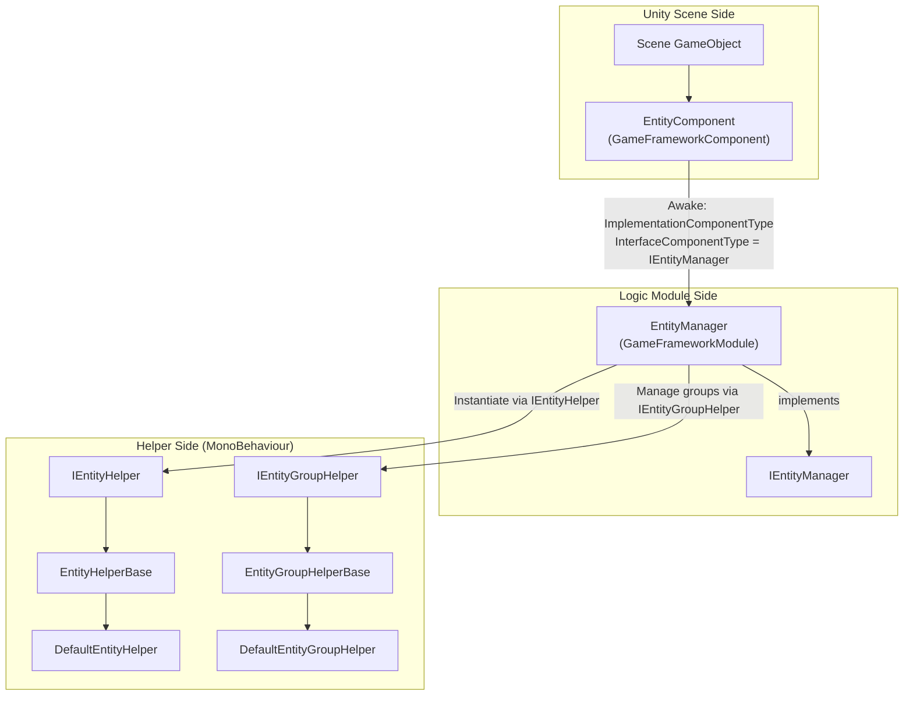

# How It Works: Manager-Component-Helper Architecture and Entity Lifecycle

The Entity module adopts the **Manager + Component + Helper** three-layer architecture common to the GameFrameX framework: on the Unity side, `EntityComponent` is the scene-facing entry point, holding the logic-side `EntityManager` to uniformly schedule the lifecycle of all entities (`Init → Show → Hide → Recycle`), and delegating the concrete behaviors of "how to create / how to group" to user-replaceable implementations via the two Helper interfaces `IEntityHelper` / `IEntityGroupHelper`.

## Overview of the Three Layers

| Layer | Type | Namespace | Responsibilities |
|----|------|--------------|------|
| Component | `EntityComponent : GameFrameworkComponent` | `GameFrameX.Entity.Runtime` | Attached to a scene GameObject as the framework module entry point; binds the `IEntityManager` implementation class to the framework in `Awake`; provides registration and retrieval of entity groups |
| Manager | `EntityManager : GameFrameworkModule, IEntityManager` | `GameFrameX.Entity.Runtime` | A partial class and pure logic module. Responsible for the entity / entity group dictionaries, state machine advancement, and the main `ShowEntity` / `HideEntity` / `RecycleEntity` flows |
| Helper | `IEntityHelper` / `IEntityGroupHelper` and their corresponding `*Base`, `Default*` implementations | `GameFrameX.Entity.Runtime` | `MonoBehaviour`s provided by the user or offered by the framework by default: Helpers decide "how to instantiate entities / which group to attach entities to" |

## Quick Start (Getting the Module Running)

1. Attach an empty GameObject in the scene and add `EntityComponent` (it can be found in the Inspector via Add Component → GameFrameX/Entity).
2. Have a `MonoBehaviour` inherit from `EntityHelperBase` to serve as the entity helper, or simply use the built-in `DefaultEntityHelper`.
3. Have a `MonoBehaviour` inherit from `EntityGroupHelperBase` to serve as the entity group helper, or simply use the built-in `DefaultEntityGroupHelper`.
4. At game startup, get the component via `GameEntry.GetComponent<EntityComponent>()`, call `AddEntityGroup(...)` to register several groups, and then call `ShowEntity` to create instances.

Source code entry: [EntityComponent.cs](https://github.com/GameFrameX/com.gameframex.unity.entity/blob/main/Runtime/Entity/EntityComponent.cs#L100-L120)

## Manager-Component-Helper Relationship



- Startup: `EntityComponent.Awake()` sets `InterfaceComponentType = typeof(IEntityManager)` and `ImplementationComponentType = Utility.Assembly.GetType(componentType)` in the source file, and the framework assembles it into `IEntityManager` for global access.

Source code: [EntityComponent.cs](https://github.com/GameFrameX/com.gameframex.unity.entity/blob/main/Runtime/Entity/EntityComponent.cs)

## Entity Lifecycle

The entire process of an entity, from creation to destruction, is driven forward by the `EntityStatus` state machine; the enum is defined in `Entity/EntityManager.EntityStatus.cs`:

| Status | Meaning | Action Triggered |
|------|------|----------|
| `Unknown` | Default placeholder | — |
| `WillInit` | About to initialize | The Manager prepares resources and calls the Helper |
| `Inited` | Initialized | Resources ready, `OnInit` callback invoked |
| `WillShow` | About to show | Calls the Helper's `CreateEntity` |
| `Showed` | Shown, active in the scene | `OnShow` callback invoked |
| `WillHide` | About to hide | Prepares to reclaim the display |
| `Hidden` | Hidden, instance retained | `OnHide` callback invoked |
| `WillRecycle` | About to recycle | Reference count drops to zero |
| `Recycled` | Recycled, reusable or destroyable | `OnRecycle` callback invoked |

Source code: [EntityManager.EntityStatus.cs](https://github.com/GameFrameX/com.gameframex.unity.entity/blob/main/Runtime/Entity/Entity/EntityManager.EntityStatus.cs#L38-L52)

### Four Steps of State Advancement

The Manager advances through the above states in order via the `ShowEntity` / `HideEntity` main entry points, delegating each step to the Helper:

1. **Init**: `InstantiateEntity(entityAsset)` — `IEntityHelper` instantiates the entity in the corresponding group container.
2. **Show**: `CreateEntity(entityInstance, entityGroup, userData)` — the Helper constructs the `IEntity`, setting up the Transform and parent node.
3. **Hide**: The `EntityManager.Hide*` flow moves the entity through `Showed → WillHide → Hidden`, with the instance retained in the group awaiting reuse.
4. **Recycle**: `ReleaseEntity(entityAsset, entityInstance)` — the Helper destroys it or returns it to the object pool.

The interface definition of `IEntityHelper`:

```csharp
public interface IEntityHelper
{
    object InstantiateEntity(object entityAsset);
    IEntity CreateEntity(object entityInstance, IEntityGroup entityGroup, object userData);
    void ReleaseEntity(object entityAsset, object entityInstance);
}
```

Source code: [IEntityHelper.cs](https://github.com/GameFrameX/com.gameframex.unity.entity/blob/main/Runtime/Entity/Entity/IEntityHelper.cs#L37-L61)

## Helper Replacement Points

| Interface | Default Implementation | Scenarios for Replacing with a Custom Helper |
|------|----------|--------------------------|
| `IEntityHelper` | `DefaultEntityHelper : EntityHelperBase` | When you want to use Addressables, object pools, or a custom preloading strategy, inherit from `EntityHelperBase` |
| `IEntityGroupHelper` | `DefaultEntityGroupHelper : EntityGroupHelperBase` | When you want to attach entities to different parent nodes or display them with hierarchical LOD / split-screen, inherit from `EntityGroupHelperBase` |

Both Helper abstract classes inherit from `MonoBehaviour`, so you can bind them to any GameObject in the Inspector; when the Manager calls them, it obtains their instances through the interfaces.

Source code: [EntityHelperBase.cs](https://github.com/GameFrameX/com.gameframex.unity.entity/blob/main/Runtime/Entity/EntityHelperBase.cs#L38-L40), [EntityGroupHelperBase.cs](https://github.com/GameFrameX/com.gameframex.unity.entity/blob/main/Runtime/Entity/EntityGroupHelperBase.cs#L38-L40)

## Next Steps

- To add an entity group and display an entity, see "How To: Register Entity Groups and ShowEntity".
- If `ShowEntity` throws `Entity ... is not inited` or a similar error, see "What to Do About Entity Lifecycle Exceptions".
- For method signatures and default values of the public API, see "Entity Module API Quick Reference".