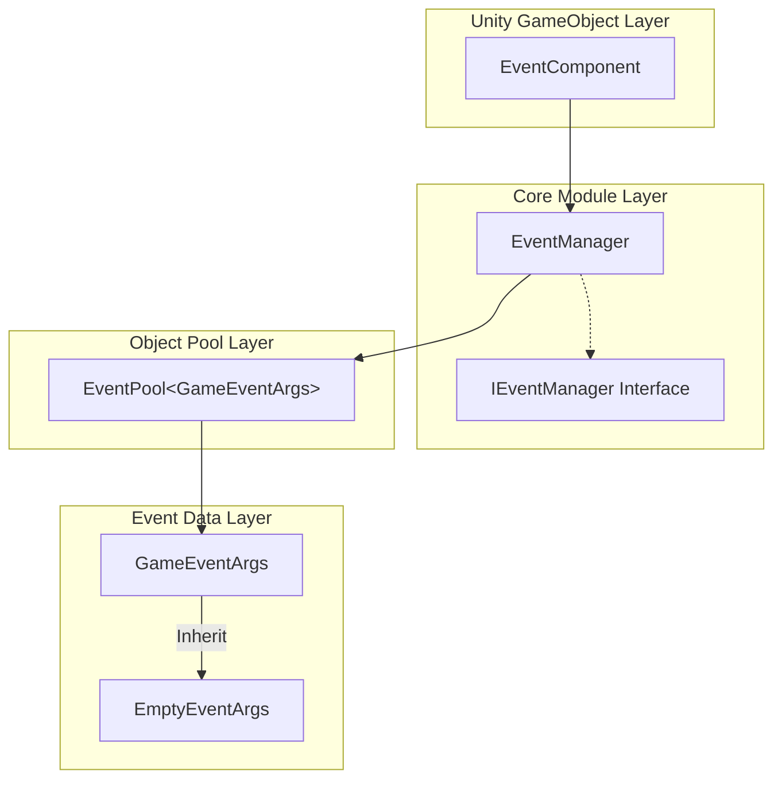
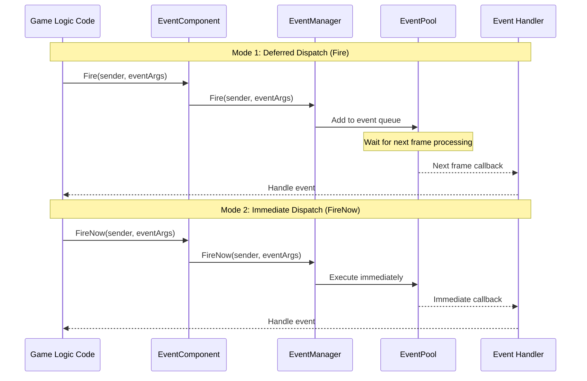
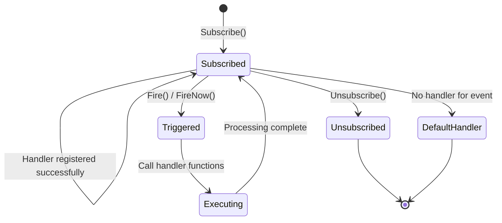

# Plugin Overview

GameFrameX Event plugin is one of the core components of the GameFrameX game framework, providing a complete game event system solution. The plugin implements the Observer Pattern, allowing game objects to communicate in a loosely coupled manner, making it an ideal choice for building event-driven game architectures.

## Overview

GameFrameX Event event system component is a lightweight, high-performance Unity event management framework, designed specifically for game development. It solves many limitations of traditional Unity event systems (such as UnityEvent, SendMessage), providing more powerful and flexible event handling capabilities.

The core design concept of this event system is to decouple the **sender** from the **receiver** of events, allowing different modules of the game to communicate without directly referencing each other. This design pattern greatly improves code maintainability and extensibility, especially for large-scale game projects.

### Core Features

| Feature | Description |
|---------|-------------|
| **Thread Safe** | Supports triggering events in background threads, automatically invoking callback functions on the main thread |
| **Deferred Dispatch** | The Fire() method delays event dispatch to the next frame, avoiding performance spikes |
| **Immediate Dispatch** | The FireNow() method supports immediate event dispatch, suitable for real-time response scenarios |
| **Object Pool** | Internally uses object pool technology, reducing memory allocation and GC pressure |
| **Default Handler** | Supports setting default event handling functions to capture events not explicitly subscribed to |
| **Multi-subscription** | Allows binding multiple handler functions to the same event ID |

### Event System Architecture

The GameFrameX Event event system consists of multiple core components, each with clear responsibilities:



**Architecture Description:**

- **EventComponent**: Exists as a Unity component, providing public APIs for direct invocation by game scripts. It is the bridge between the event system and game code. It inherits from `GameFrameworkComponent` and follows GameFrameX framework component specifications.

- **EventManager**: The core module of the event system, inherits from `GameFrameworkModule` and implements the `IEventManager` interface. Responsible for managing all event subscription, unsubscription, and dispatch logic.

- **EventPool**: The internal event pool implementation, responsible for acquiring and recycling event objects, effectively reducing memory allocation during game runtime.

- **GameEventArgs**: The base class for all game events. Developers need to inherit this class to create custom event types.

- **EmptyEventArgs**: A pre-built simple event class that only contains an event ID, suitable for scenarios where no additional data needs to be carried.

## Event Flow Mechanism

### Event Dispatch Modes

GameFrameX Event provides two event dispatch modes to meet different scenario requirements:



**Deferred Dispatch (Fire) Characteristics:**
- Events are added to a queue and processed uniformly in the next frame
- Completely thread-safe, can be called from any thread
- Suitable for most game logic events
- Avoids performance peaks in a particular frame

**Immediate Dispatch (FireNow) Characteristics:**
- Events are dispatched immediately, all handler functions are executed synchronously
- Not thread-safe, must be called from the main thread
- Suitable for events that require immediate response
- Ideal for handling immediate feedback in games

### Event Lifecycle



## Quick Usage Examples

### Basic Subscription and Trigger

```csharp
// 1. Define custom event class
public class PlayerDeadEventArgs : GameEventArgs
{
    public int PlayerId { get; set; }
    public string Reason { get; set; }
}

// 2. Get EventComponent reference
var eventComponent = UnityEngine.GameObject.Find("GameRoot").GetComponent<EventComponent>();

// 3. Subscribe to event
eventComponent.CheckSubscribe("player_dead", OnPlayerDead);

// 4. Define event handler
private void OnPlayerDead(object sender, GameEventArgs e)
{
    var args = (PlayerDeadEventArgs)e;
    UnityEngine.Debug.Log($"Player {args.PlayerId} died, reason: {args.Reason}");
}

// 5. Trigger event
eventComponent.Fire(this, new PlayerDeadEventArgs
{
    PlayerId = 1001,
    Reason = "Killed by monster"
});
```

> Source: [Runtime/EventComponent.cs](https://github.com/GameFrameX/com.gameframex.unity.event/blob/main/Runtime/EventComponent.cs#L90-L99)

### Using Empty Events

```csharp
// Trigger a simple event without data
eventComponent.Fire(this, "game_start");
```

> Source: [Runtime/EventComponent.cs](https://github.com/GameFrameX/com.gameframex.unity.event/blob/main/Runtime/EventComponent.cs#L140-L144)

### Check and Unsubscribe

```csharp
// Check if event handler exists
bool exists = eventComponent.Check("player_dead", OnPlayerDead);

// Unsubscribe
eventComponent.Unsubscribe("player_dead", OnPlayerDead);
```

> Source: [Runtime/EventComponent.cs](https://github.com/GameFrameX/com.gameframex.unity.event/blob/main/Runtime/EventComponent.cs#L72-L75)

## Event System Design Advantages

### Advantages Over Unity Native Event System

| Feature | UnityEvent / SendMessage | GameFrameX Event |
|---------|-------------------------|------------------|
| Performance | Poor, has reflection overhead | High performance, no reflection |
| Type Safety | Weakly typed | Strongly typed |
| Thread Safe | Not supported | Supported |
| Object Pool | Not supported | Supported |
| Generic Support | Not supported | Supported |

### Typical Application Scenarios

1. **UI and Game Logic Decoupling**: When game data changes, notify the UI layer to update via events, without UI directly referencing game logic code

2. **Inter-module Communication**: Different game modules (such as inventory system, quest system, achievement system) communicate via events, reducing coupling between modules

3. **Plugin System**: Game plugins or extension modules can respond to game events by subscribing to events, without modifying core code

4. **Debugging and Logging**: By subscribing to global events, you can implement monitoring and logging of game behavior

## Technical Implementation Details

### Core Class Description

**EventComponent Class**

EventComponent is the entry point of the event system in Unity. It inherits from `GameFrameworkComponent` and initializes the EventManager module in the `Awake()` method:

```csharp
protected override void Awake()
{
    ImplementationComponentType = Utility.Assembly.GetType(componentType);
    InterfaceComponentType = typeof(IEventManager);
    base.Awake();
    m_EventManager = GameFrameworkEntry.GetModule<IEventManager>();
}
```

> Source: [Runtime/EventComponent.cs](https://github.com/GameFrameX/com.gameframex.unity.event/blob/main/Runtime/EventComponent.cs#L43-L54)

**EventManager Class**

EventManager implements the `IEventManager` interface, internally using `EventPool<GameEventArgs>` for event management:

```csharp
public EventManager()
{
    m_EventPool = new EventPool<GameEventArgs>(EventPoolMode.AllowNoHandler | EventPoolMode.AllowMultiHandler);
}
```

> Source: [Runtime/Event/EventManager.cs](https://github.com/GameFrameX/com.gameframex.unity.event/blob/main/Runtime/Event/EventManager.cs#L24-L27)

**CheckSubscribe Method**

This method implements the "check subscription" pattern, automatically subscribing if the event handler does not exist:

```csharp
public void CheckSubscribe(string id, EventHandler<GameEventArgs> handler)
{
    if (!Check(id, handler))
    {
        m_EventManager.Subscribe(id, handler);
    }
}
```

> Source: [Runtime/EventComponent.cs](https://github.com/GameFrameX/com.gameframex.unity.event/blob/main/Runtime/EventComponent.cs#L82-L88)

This design avoids duplicate subscription causing duplicate invocation issues, simplifying developer usage.

## Related Links

- [Installation](./02.installation.md) - Learn how to install and configure the plugin
- [Quick Start](./03.getting-started.md) - Get started with the event system
- [Event System Architecture](./04.features.md) - Learn more about event system architecture design
- [EventComponent API Reference](./05.event-component.md) - Complete API documentation
- [EventManager API Reference](./06.event-manager.md) - Event manager API documentation
- [GameEventArgs API Reference](./07.game-event-args.md) - Event args class API documentation
