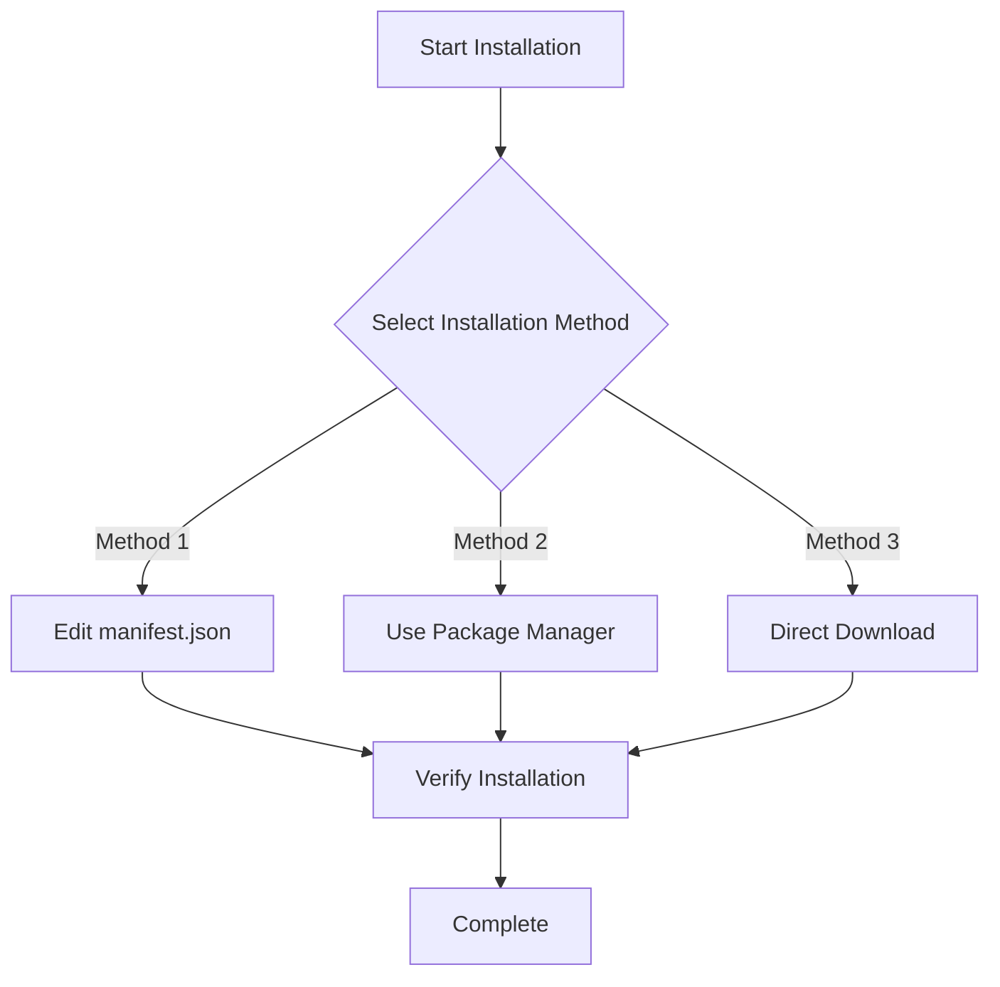
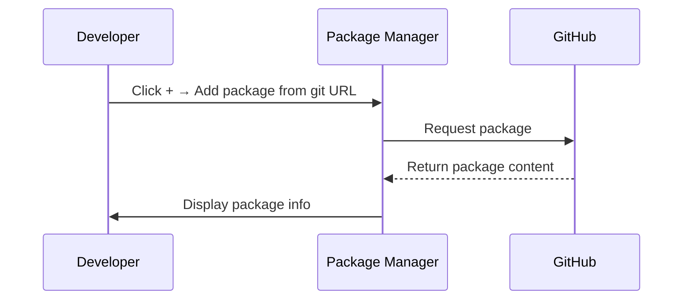

# Installation

This document describes how to install the GameFrameX Event event system component into your Unity project.

## Overview

GameFrameX Event is the event system component of the GameFrameX game framework, providing event subscription, dispatch, and management functionality for in-game events. This component supports thread-safe asynchronous event dispatch and is suitable for various game development scenarios.

**Package Information:**
| Property | Value |
|----------|-------|
| Package Name | com.gameframex.unity.event |
| Version | 1.1.0 |
| Unity Version | 2017.1+ |

## Prerequisites

Before starting installation, ensure your development environment meets the following requirements:

- Unity 2017.1 or higher
- Git tool installed (for installation via Git URL)

## Installation Methods

GameFrameX Event provides three installation methods. You can choose one based on your project requirements.



### Method 1: Installation via manifest.json

This method is suitable for scenarios where the package needs to be version-managed as a project dependency.

1. Open the `Packages` folder in your Unity project
2. Find and edit the `manifest.json` file
3. Add the following content under the `dependencies` node:

```json
{
  "dependencies": {
    "com.gameframex.unity.event": "https://github.com/GameFrameX/com.gameframex.unity.event.git"
  }
}
```

4. Save the file and wait for Unity to automatically download and import the package

> **Note:** This method automatically fetches the latest version from the Git repository. If you need a specific version, you can use Git version tags.

### Method 2: Installation via Unity Package Manager

This is the most commonly used installation method, suitable for most projects.

1. Open Unity Editor
2. Select menu **Window → Package Manager**
3. Click the **+** button in the upper left corner of the Package Manager window
4. Select **Add package from git URL...**
5. Paste the following address in the input field:

```
https://github.com/GameFrameX/com.gameframex.unity.event.git
```

6. Click the **Add** button to start installation
7. Wait for download and import to complete



### Method 3: Direct Download

This method is suitable for offline environments or scenarios requiring custom modifications.

1. Visit the GitHub repository:
   > https://github.com/GameFrameX/com.gameframex.unity.event.git

2. Click the **Code** button and select **Download ZIP** to download the source code
3. Extract the downloaded ZIP file
4. Rename the extracted folder to `com.gameframex.unity.event`
5. Copy the folder to the `Packages` directory of your Unity project
6. Unity will automatically recognize and load the package

> **Tip:** After placement, the package folder needs to contain a `package.json` file for Unity to recognize it correctly.

## Installation Verification

After installation, you can verify successful installation by:

### Method 1: Check Package Manager

Open **Window → Package Manager**, find **Game Frame X Event** in the list, and confirm its status is installed.

### Method 2: Check Script Reference

Create a test script in your project and try referencing the EventComponent:

```csharp
using GameFrameX.Event.Runtime;

// Ensure EventComponent can be used normally
public class TestScript : MonoBehaviour
{
    private EventComponent _eventComponent;

    void Start()
    {
        _eventComponent = GetComponent<EventComponent>();
        Debug.Log("Event component installed successfully!");
    }
}
```

### Method 3: Check Assemblies

Confirm the following assemblies are loaded in your project:
- `GameFrameX.Event.Runtime`
- `GameFrameX.Event.Editor` (if used in editor)

## Dependency Description

GameFrameX Event component depends on the following core modules:

| Dependency Module | Description |
|-------------------|-------------|
| GameFrameX.Runtime | Game framework runtime core |

> **Note:** If GameFrameX.Runtime is not installed in your project, you need to install this dependency first. EventComponent inherits from `GameFrameworkComponent` and requires framework core support.

## Common Issues

### Q1: Error找不到 GameFrameworkComponent after installation

This is because the GameFrameX.Runtime core module is missing. Please install the game framework's core runtime component first, then install the Event module.

### Q2: How to update to the latest version

- **Methods 1/2**: Delete the corresponding entry in manifest.json and add it again, or click the update button in Package Manager
- **Method 3**: Re-download the latest version and replace

### Q3: Which Unity versions are supported

This component supports Unity 2017.1 and above. It is recommended to use a newer LTS version for best compatibility.

## Related Links

- [Plugin Overview](./01.overview.md)
- [Quick Start](./03.getting-started.md)
- [Core Concepts](./04.features.md)
- [GitHub Repository](https://github.com/GameFrameX/com.gameframex.unity.event.git)
- [Official Website](https://gameframex.doc.alianblank.com)
