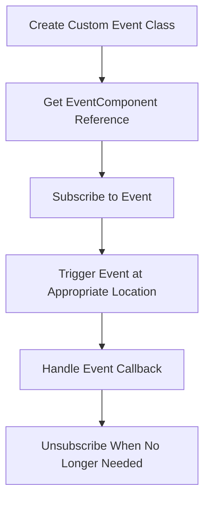

# Quick Start

This document will help you quickly get started with the GameFrameX event system. Through this guide, you will learn how to configure and use the event component in Unity projects to implement event-driven programming in games.

## Overview

The GameFrameX event system is a lightweight event management framework that implements the Observer Pattern, allowing different modules in a game to communicate through events in a loosely coupled manner. You can use strings as event identifiers to subscribe to and handle events.

## Prerequisites

Before using the event system, ensure:

1. Unity 2017.1 or higher
2. GameFrameX core framework is properly installed
3. Event component package is added to your project

> **Tip:** For installation instructions, refer to [Installation](./02.installation.md).

## Basic Usage Flow

The typical usage flow of the event system is as follows:



## Step 1: Create Custom Event Class

First, define an event args class that inherits from `GameEventArgs`:

```csharp
using GameFrameX.Event.Runtime;

/// <summary>
/// Game start event args
/// </summary>
public class GameStartEventArgs : GameEventArgs
{
    /// <summary>
    /// Event ID identifier
    /// </summary>
    public override string Id => "game_start";

    /// <summary>
    /// Current game level
    /// </summary>
    public int CurrentLevel { get; set; }

    /// <summary>
    /// Player name
    /// </summary>
    public string PlayerName { get; set; }

    /// <summary>
    /// Clear event data
    /// </summary>
    public override void Clear()
    {
        CurrentLevel = 0;
        PlayerName = null;
    }
}
```

> Source: [GameEventArgs.cs](https://github.com/GameFrameX/com.gameframex.unity.event/blob/main/Runtime/EventArgs/GameEventArgs.cs#L12-L18)

## Step 2: Add EventComponent to Scene

In Unity Editor, add the event component by following these steps:

1. Create an empty GameObject in the scene (or select an existing GameObject)
2. Click the **Add Component** button
3. Search for the **Event** component
4. Select **Game Framework → Event**

After the component is added, EventComponent will automatically initialize the event manager.

## Step 3: Subscribe to Events

In the script that needs to listen for events, subscribe to the corresponding event:

```csharp
using UnityEngine;
using GameFrameX.Event.Runtime;

/// <summary>
/// Game manager - responsible for game lifecycle management
/// </summary>
public class GameManager : MonoBehaviour
{
    private EventComponent _eventComponent;

    private void Awake()
    {
        // Get event component reference
        _eventComponent = UnityEngine.GameObject.FindObjectOfType<EventComponent>();
    }

    private void OnEnable()
    {
        // Subscribe to game start event
        // CheckSubscribe will auto-subscribe if not existing, avoiding duplicate subscriptions
        _eventComponent.CheckSubscribe("game_start", OnGameStart);
    }

    private void OnDisable()
    {
        // Unsubscribe from game start event
        _eventComponent.Unsubscribe("game_start", OnGameStart);
    }

    /// <summary>
    /// Game start event handler
    /// </summary>
    private void OnGameStart(object sender, GameEventArgs e)
    {
        if (e is GameStartEventArgs args)
        {
            Debug.Log($"Game started! Level: {args.CurrentLevel}, Player: {args.PlayerName}");
        }
    }
}
```

> Source: [EventComponent.cs](https://github.com/GameFrameX/com.gameframex.unity.event/blob/main/Runtime/EventComponent.cs#L82-L88)

## Step 4: Trigger Events

When the game state changes, trigger the corresponding event:

```csharp
// Trigger event in game startup flow
public class GameStarter : MonoBehaviour
{
    public EventComponent eventComponent;

    private void Start()
    {
        // Create event args
        var eventArgs = new GameStartEventArgs
        {
            CurrentLevel = 1,
            PlayerName = "Player1"
        };

        // Trigger event - Fire is thread-safe, will dispatch on next frame
        eventComponent.Fire(this, eventArgs);

        // Or use FireNow for immediate dispatch (not thread-safe)
        // eventComponent.FireNow(this, eventArgs);
    }
}
```

> Source: [EventComponent.cs](https://github.com/GameFrameX/com.gameframex.unity.event/blob/main/Runtime/EventComponent.cs#L130-L144)

## Event Dispatch Modes

The event component provides two event dispatch methods:

| Mode | Method | Thread Safe | Applicable Scenarios |
|------|--------|-------------|----------------------|
| Deferred Dispatch | `Fire()` | Yes | Most cases, recommended |
| Immediate Dispatch | `FireNow()` | No | Urgent events or high certainty requirements |

```csharp
// Deferred dispatch - event will be processed in next frame
eventComponent.Fire(sender, new GameEventArgs());

// Immediate dispatch - event will be processed immediately
eventComponent.FireNow(sender, new GameEventArgs());
```

## Simplified Event Usage

If you don't need to pass complex event data, you can use simplified string events:

```csharp
// Trigger simple event
eventComponent.Fire(this, "player_dead");

// Receive in event handler
private void OnPlayerDead(object sender, GameEventArgs e)
{
    // e.Id will contain "player_dead"
    Debug.Log("Player died!");
}
```

> Source: [EmptyEventArgs.cs](https://github.com/GameFrameX/com.gameframex.unity.event/blob/main/Runtime/EventArgs/EmptyEventArgs.cs#L32-L37)

## Complete Example: Player Death Event

The following is a complete example showing how to implement a player death event system:

```csharp
using UnityEngine;
using GameFrameX.Event.Runtime;

/// <summary>
/// Player death event args
/// </summary>
public class PlayerDeadEventArgs : GameEventArgs
{
    public override string Id => "player_dead";
    public int PlayerId { get; set; }
    public string Reason { get; set; }
    public override void Clear()
    {
        PlayerId = 0;
        Reason = null;
    }
}

/// <summary>
/// Player controller
/// </summary>
public class PlayerController : MonoBehaviour
{
    private EventComponent _eventComponent;
    private int _health = 100;

    private void Awake()
    {
        _eventComponent = FindObjectOfType<EventComponent>();
    }

    private void OnEnable()
    {
        _eventComponent.CheckSubscribe("player_dead", OnPlayerDead);
    }

    private void OnDisable()
    {
        _eventComponent.Unsubscribe("player_dead", OnPlayerDead);
    }

    /// <summary>
    /// Player takes damage
    /// </summary>
    public void TakeDamage(int damage)
    {
        _health -= damage;

        if (_health <= 0)
        {
            // Trigger player death event
            var args = new PlayerDeadEventArgs
            {
                PlayerId = GetInstanceID(),
                Reason = "Health depleted"
            };
            _eventComponent.Fire(this, args);
        }
    }

    private void OnPlayerDead(object sender, GameEventArgs e)
    {
        if (e is PlayerDeadEventArgs args)
        {
            Debug.Log($"Player {args.PlayerId} died, reason: {args.Reason}");
            // Add game over logic here
        }
    }
}
```

## Default Event Handler

You can set a default handler for the event component to capture events not explicitly subscribed to:

```csharp
private void Start()
{
    var eventComponent = GetComponent<EventComponent>();
    eventComponent.SetDefaultHandler(OnUnhandledEvent);
}

private void OnUnhandledEvent(object sender, GameEventArgs e)
{
    Debug.Log($"Unhandled event: {e.Id}");
}
```

> Source: [EventComponent.cs](https://github.com/GameFrameX/com.gameframex.unity.event/blob/main/Runtime/EventComponent.cs#L120-L123)

## Event Statistics

You can get the current event system status at any time:

```csharp
// Get total number of event handlers
int handlerCount = eventComponent.EventHandlerCount;

// Get total number of event types
int eventCount = eventComponent.EventCount;

// Get number of handlers for a specific event
int specificCount = eventComponent.Count("game_start");
```

> Source: [EventComponent.cs](https://github.com/GameFrameX/com.gameframex.unity.event/blob/main/Runtime/EventComponent.cs#L27-L38)

## Best Practices

1. **Unsubscribe Promptly**: Unsubscribe from events in `OnDisable` or `OnDestroy` to avoid memory leaks
2. **Use CheckSubscribe**: Use the `CheckSubscribe` method to avoid duplicate subscriptions
3. **Use Fire Instead of FireNow**: Unless there are special requirements, use the `Fire` method to ensure thread safety
4. **Clear Event Data**: Properly implement the `Clear()` method in custom event classes for object pool reuse

## Related Links

- [Plugin Overview](./01.overview.md) - Learn more about the event system overview
- [Installation](./02.installation.md) - View detailed installation instructions
- [Event System Architecture](./04.features.md) - Learn more about internal architecture
- [EventComponent API Reference](./05.event-component.md) - Complete API documentation
- [EventManager API Reference](./06.event-manager.md) - Event manager API
- [GameEventArgs API Reference](./07.game-event-args.md) - Event args base class
- [FAQ](./08.troubleshooting.md) - Common questions and solutions
