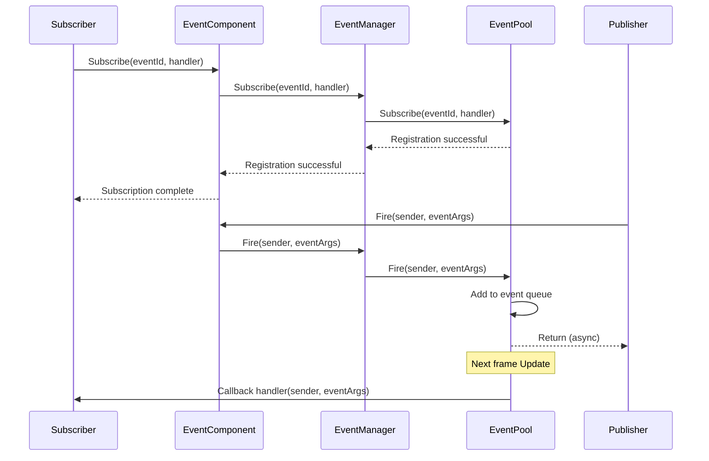
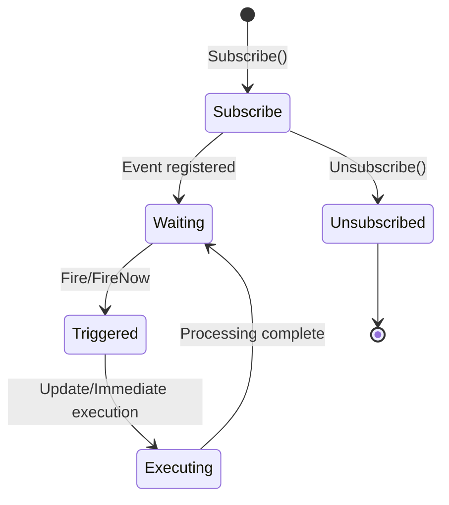
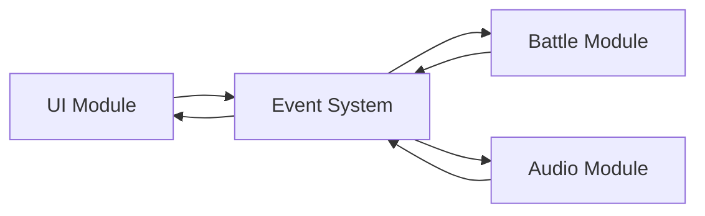
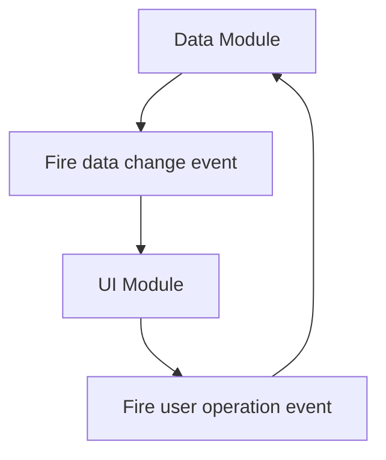

# Event System Architecture

The GameFrameX event system is an event-driven framework based on the Publish-Subscribe (Pub-Sub) pattern, providing thread-safe asynchronous event dispatch mechanism. This system is one of the core components of the GameFrameX architecture, supporting decoupling and event communication in game development.

## Overview

The event system is designed to solve component communication problems in game development. In game development, different modules (such as UI, combat, systems) need to communicate with each other, but direct calls cause tight coupling. The event system introduces an event channel, allowing modules to communicate in a loosely coupled manner:

- **Publisher**: Responsible for firing events, doesn't care who receives them
- **Subscriber**: Responsible for listening to events and handling them, doesn't care who fires them
- **Event Channel**: Responsible for passing events from publisher to subscribers

### Core Features

| Feature | Description |
|---------|-------------|
| Thread Safe | `Fire` method supports cross-thread calls, automatically callbacks on main thread |
| Deferred Dispatch | Asynchronous events are dispatched in the next frame, avoiding logic synchronization issues |
| Immediate Dispatch | `FireNow` method executes callbacks immediately (note thread safety) |
| Multicast Support | Multiple handler functions can be bound to the same event |
| Default Handling | Supports setting default handler to capture un-subscribed events |
| Object Pool | Uses EventPool to reduce memory allocation |

## Architecture Design

### Component Hierarchy

```mermaid
flowchart TB
    subgraph Unity["Unity Engine Layer"]
        Mono[MonoBehaviour Scripts]
    end

    subgraph Component["Component Wrapper Layer"]
        EC[EventComponent]
    end

    subgraph Interface["Interface Abstraction Layer"]
        IEM[IEventManager]
    end

    subgraph Implementation["Implementation Layer"]
        EM[EventManager]
        EP[EventPool]
    end

    subgraph Runtime["Runtime Dependencies"]
        Pool[EventPool Core]
    end

    Mono --> EC
    EC --> IEM
    IEM <|.. EM
    EM --> EP
    EP --> Pool
```

### Core Component Description

#### 1. EventComponent

A Unity component that inherits from `GameFrameworkComponent`, providing Unity-oriented event interface.

```csharp
public sealed class EventComponent : GameFrameworkComponent
{
    private IEventManager m_EventManager = null;

    protected override void Awake()
    {
        ImplementationComponentType = Utility.Assembly.GetType(componentType);
        InterfaceComponentType = typeof(IEventManager);
        base.Awake();
        m_EventManager = GameFrameworkEntry.GetModule<IEventManager>();
    }

    public void Fire(object sender, GameEventArgs e);
    public void FireNow(object sender, GameEventArgs e);
    public void Subscribe(string id, EventHandler<GameEventArgs> handler);
    public void Unsubscribe(string id, EventHandler<GameEventArgs> handler);
}
```
> Source: [EventComponent.cs](https://github.com/GameFrameX/com.gameframex.unity.event/blob/main/Runtime/EventComponent.cs#L1-L155)

#### 2. IEventManager

Event manager interface that defines core operation contracts for the event system:

```csharp
public interface IEventManager
{
    int EventHandlerCount { get; }
    int EventCount { get; }

    void Subscribe(string id, EventHandler<GameEventArgs> handler);
    void Unsubscribe(string id, EventHandler<GameEventArgs> handler);
    void Fire(object sender, GameEventArgs e);
    void FireNow(object sender, GameEventArgs e);
    void SetDefaultHandler(EventHandler<GameEventArgs> handler);
}
```
> Source: [IEventManager.cs](https://github.com/GameFrameX/com.gameframex.unity.event/blob/main/Runtime/Event/IEventManager.cs#L1-L77)

#### 3. EventManager

Implementation class of `IEventManager`, internally using `EventPool` for event management:

```csharp
public sealed class EventManager : GameFrameworkModule, IEventManager
{
    private readonly EventPool<GameEventArgs> m_EventPool;

    public EventManager()
    {
        m_EventPool = new EventPool<GameEventArgs>(
            EventPoolMode.AllowNoHandler | EventPoolMode.AllowMultiHandler);
    }

    public void Fire(object sender, GameEventArgs e)
    {
        m_EventPool.Fire(sender, e);
    }

    public void FireNow(object sender, GameEventArgs e)
    {
        m_EventPool.FireNow(sender, e);
    }
}
```
> Source: [EventManager.cs](https://github.com/GameFrameX/com.gameframex.unity.event/blob/main/Runtime/Event/EventManager.cs#L1-L142)

#### 4. EventPool (depends on GameFrameX.Runtime)

Event pool is the underlying implementation, responsible for:
- Storing event subscription relationships
- Managing event objects (using object pool to reduce GC)
- Dispatching events to handler functions

### Class Inheritance

```mermaid
classDiagram
    class BaseEventArgs {
        <<abstract>>
        +Id: string { get; }
        +Clear() void
    }

    class GameEventArgs {
        <<abstract>>
    }

    class EmptyEventArgs {
        -_eventId: string
        +Create(eventId): EmptyEventArgs
    }

    BaseEventArgs <|-- GameEventArgs
    GameEventArgs <|-- EmptyEventArgs
```

### Event Args System

**GameEventArgs** is the base class for all game events:

```csharp
public abstract class GameEventArgs : BaseEventArgs
{
}
```
> Source: [GameEventArgs.cs](https://github.com/GameFrameX/com.gameframex.unity.event/blob/main/Runtime/EventArgs/GameEventArgs.cs#L1-L19)

**EmptyEventArgs** is used for simple events that don't need to carry data:

```csharp
public sealed class EmptyEventArgs : GameEventArgs
{
    public static EmptyEventArgs Create(string eventId)
    {
        var eventArgs = ReferencePool.Acquire<EmptyEventArgs>();
        eventArgs.SetEventId(eventId);
        return eventArgs;
    }
}
```
> Source: [EmptyEventArgs.cs](https://github.com/GameFrameX/com.gameframex.unity.event/blob/main/Runtime/EventArgs/EmptyEventArgs.cs#L1-L47)

## Event Flow

### Subscription and Dispatch Flow



### Comparison of Two Dispatch Modes

| Mode | Method | Thread Safe | Execution Timing | Applicable Scenarios |
|------|--------|-------------|------------------|----------------------|
| Deferred Dispatch | `Fire()` | Yes | Next frame | Async logic, cross-thread calls |
| Immediate Dispatch | `FireNow()` | Caution | Immediate | Sync logic, main thread确定性 |

**Design Intent:**

- **Fire Method**: Uses deferred dispatch to ensure that even when events are fired from background threads, callbacks execute on the main thread. This is very important for Unity development because Unity APIs can only be called from the main thread. Deferring to the next frame also avoids triggering unexpected calculations in the current frame.

- **FireNow Method**: Executes callbacks immediately with higher performance, but callers must ensure execution on the main thread and that callback execution will not cause problems.

### Event Lifecycle



## Usage Examples

### Basic Subscription and Dispatch

```csharp
public class Player : MonoBehaviour
{
    private EventComponent _eventComponent;

    private void Start()
    {
        // Get event component
        _eventComponent = UnityEngine.Component.FindObjectOfType<EventComponent>();

        // Subscribe to event
        _eventComponent.CheckSubscribe("OnPlayerDead", OnPlayerDead);
    }

    private void OnPlayerDead(object sender, GameEventArgs e)
    {
        UnityEngine.Debug.Log("Player died!");
    }

    private void OnCollisionEnter(UnityEngine.Collision collision)
    {
        // Fire event
        _eventComponent.Fire(this, EmptyEventArgs.Create("OnPlayerDead"));
    }
}
```
> Source: [EventComponent.cs](https://github.com/GameFrameX/com.gameframex.unity.event/blob/main/Runtime/EventComponent.cs#L80-L114)

### Custom Event Args

```csharp
// Define custom event args
public class DamageEventArgs : GameEventArgs
{
    public int Damage { get; set; }
    public UnityEngine.Vector3 Position { get; set; }
}

// Fire event with data
var args = ReferencePool.Acquire<DamageEventArgs>();
args.Damage = 100;
args.Position = transform.position;
eventComponent.Fire(this, args);
```

### Default Handler

```csharp
// Set default handler to capture un-subscribed events
eventComponent.SetDefaultHandler((sender, e) =>
{
    UnityEngine.Debug.Log($"Unhandled event: {e.Id}");
});
```
> Source: [EventManager.cs](https://github.com/GameFrameX/com.gameframex.unity.event/blob/main/Runtime/Event/EventManager.cs#L113-L120)

## Configuration and Inspection

### Event Statistics

```csharp
// Get number of event handlers
int handlerCount = eventComponent.EventHandlerCount;

// Get number of event types
int eventCount = eventComponent.EventCount;
```
> Source: [EventComponentInspector.cs](https://github.com/GameFrameX/com.gameframex.unity.event/blob/main/Editor/Inspector/EventComponentInspector.cs#L27-L33)

### Check Subscription Status

```csharp
// Check if specific event handler exists
bool exists = eventComponent.Check("OnPlayerDead", OnPlayerDeadHandler);
```
> Source: [EventComponent.cs](https://github.com/GameFrameX/com.gameframex.unity.event/blob/main/Runtime/EventComponent.cs#L72-L75)

## Common Usage Patterns

### Pattern 1: Inter-module Decoupling



UI module doesn't know about battle module's existence, only subscribes to "battle start" event; battle module only fires events without caring who receives them.

### Pattern 2: Data-driven UI



When data changes, fire an event and UI automatically responds to update; user operations notify data module through events.

### Pattern 3: Inter-system Communication

Various systems in the game (achievement system, quest system, log system) can subscribe to the same event to implement different responses:

```csharp
// Achievement system
achievementComponent.Subscribe("LevelComplete", OnLevelComplete);

// Quest system
questComponent.Subscribe("LevelComplete", OnLevelComplete);

// Log system
logComponent.Subscribe("LevelComplete", OnLevelComplete);

// When level is complete, all systems receive notification
levelComponent.Fire(this, new LevelCompleteEventArgs { Level = 5 });
```

## Design Advantages

1. **Loose Coupling**: Publishers and subscribers don't directly depend on each other
2. **Extensibility**: Adding new subscribers doesn't require modifying publisher code
3. **Thread Safe**: Supports cross-thread event dispatch
4. **Performance Optimization**: Uses object pool to reduce GC
5. **Flexible Control**: Supports both deferred and immediate dispatch modes

## Notes

1. **Avoid Memory Leaks**: Be sure to unsubscribe when component is destroyed
2. **Fire vs FireNow**: Unless explicitly on main thread, use `Fire`
3. **Event ID Management**: It is recommended to use constants or enums to manage event IDs, avoid string hardcoding
4. **Callback Performance**: Avoid time-consuming operations in callbacks

## Related Links

- [EventComponent API Reference](./05.event-component.md)
- [EventManager API Reference](./06.event-manager.md)
- [GameEventArgs API Reference](./07.game-event-args.md)
- [Quick Start](./03.getting-started.md)
- [FAQ](./08.troubleshooting.md)
