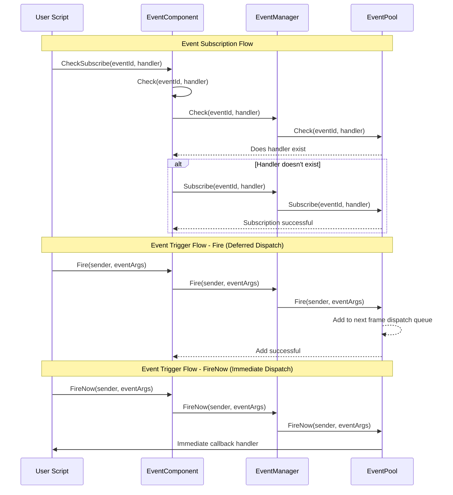

# EventComponent

EventComponent is the Unity component layer of the GameFrameX event system, providing event subscription and publishing functionality based on the Observer Pattern.

## Overview

EventComponent is the core event component in the game framework, inheriting from `GameFrameworkComponent`. It serves as a Unity GameObject component, providing a configurable, easy-to-use event system interface.

### Core Responsibilities

- **Event Subscription**: Allows scripts to subscribe to handler functions for specific event IDs
- **Event Unsubscription**: Allows scripts to unsubscribe from specific events
- **Event Triggering**: Supports triggering events in two modes (deferred dispatch and immediate dispatch)
- **Thread Safe**: Ensures callbacks on main thread when triggering events across threads

### Component Features

- Inherits from `GameFrameworkComponent`, following framework component specifications
- Uses `[DisallowMultipleComponent]` attribute to prevent duplicate additions
- Uses `[AddComponentMenu]` to add menu items in Unity Editor
- Supports multi-handler (MultiHandler) and no-handler (NoHandler) modes

## Architecture

EventComponent's position and interaction in the event system:

```mermaid
flowchart TD
    subgraph UnityLayer["Unity Game Layer"]
        EventComp[EventComponent]
    end

    subgraph FrameworkLayer["Game Framework Core Layer"]
        GFComponent[GameFrameworkComponent]
        GFEntry[GameFrameworkEntry]
    end

    subgraph EventLayer["Event System Layer"]
        IEventMgr[IEventManager]
        EventMgr[EventManager]
        EventPool[EventPool<GameEventArgs>]
    end

    subgraph UserLayer["User Script Layer"]
        ScriptA[User Script A]
        ScriptB[User Script B]
    end

    EventComp -->|Inherit| GFComponent
    EventComp -->|Get Module| GFEntry
    GFEntry -->|Return| IEventMgr
    IEventMgr <|.Implement.| EventMgr
    EventMgr -->|Use| EventPool

    ScriptA -->|Subscribe Event| EventComp
    ScriptB -->|Subscribe Event| EventComp
    EventComp -->|Trigger Event| EventPool
    EventPool -.->|Callback| ScriptA
    EventPool -.->|Callback| ScriptB
```

### Event System Architecture Description

| Layer | Component | Responsibility |
|-------|-----------|----------------|
| Unity Layer | EventComponent | Provides Unity component interface, wraps underlying modules |
| Framework Core Layer | GameFrameworkEntry | Module initialization and dependency injection |
| Event System Layer | IEventManager | Event manager interface definition |
| Event System Layer | EventManager | Event manager implementation |
| Event System Layer | EventPool | Event pool, responsible for event storage and dispatch |

## Core Flow

Complete flow for event subscription and triggering:



### Event Dispatch Mode Comparison

| Mode | Method | Thread Safe | Dispatch Timing | Applicable Scenarios |
|------|--------|-------------|-----------------|----------------------|
| Deferred Dispatch | `Fire()` | Yes | Next frame | Most cases, especially cross-thread triggering |
| Immediate Dispatch | `FireNow()` | No | Immediate | Synchronous scenarios with high certainty requirements |

## Usage Examples

### Basic Usage - Subscribe and Trigger Events

```csharp
using GameFrameX.Event.Runtime;

// Define event args class
public class PlayerDeadEventArgs : GameEventArgs
{
    public int PlayerId { get; set; }
    public string Reason { get; set; }

    public override void Clear()
    {
        PlayerId = 0;
        Reason = string.Empty;
    }

    public override string Id => "player.dead";
}

// In script that needs to listen for events
public class PlayerController : MonoBehaviour
{
    private EventComponent _eventComponent;

    private void Start()
    {
        // Get EventComponent
        _eventComponent = UnityEngine.GameObject.FindObjectOfType<EventComponent>();

        // Subscribe to event - use CheckSubscribe to auto-check if already subscribed
        _eventComponent.CheckSubscribe(PlayerDeadEventArgs args => OnPlayerDead(args));
    }

    private void OnPlayerDead(PlayerDeadEventArgs args)
    {
        UnityEngine.Debug.Log($"Player {args.PlayerId} died: {args.Reason}");
    }

    private void OnDestroy()
    {
        // Unsubscribe from event
        if (_eventComponent != null)
        {
            _eventComponent.Unsubscribe("player.dead", OnPlayerDead);
        }
    }
}

// In script that triggers events
public class GameManager : MonoBehaviour
{
    private EventComponent _eventComponent;

    private void Start()
    {
        _eventComponent = UnityEngine.GameObject.FindObjectOfType<EventComponent>();
    }

    public void KillPlayer(int playerId)
    {
        // Create event args
        var eventArgs = ReferencePool.Acquire<PlayerDeadEventArgs>();
        eventArgs.PlayerId = playerId;
        eventArgs.Reason = "Killed by monster";

        // Trigger event
        _eventComponent.Fire(this, eventArgs);

        // Event args will be automatically recycled
    }
}
```
> Source: [EventComponent.cs](https://github.com/GameFrameX/com.gameframex.unity.event/blob/main/Runtime/EventComponent.cs#L1-L155)
> Source: [GameEventArgs.cs](https://github.com/GameFrameX/com.gameframex.unity.event/blob/main/Runtime/EventArgs/GameEventArgs.cs#L1-L19)

### Simplified Events - Using Empty Event Args

If you only need to pass an event ID without additional data:

```csharp
// Trigger a simple event
_eventComponent.Fire(this, "player.respawn");

// Subscribe to simple event
_eventComponent.CheckSubscribe("player.respawn", args =>
{
    UnityEngine.Debug.Log("Player respawned");
});
```
> Source: [EventComponent.cs](https://github.com/GameFrameX/com.gameframex.unity.event/blob/main/Runtime/EventComponent.cs#L140-L144)

### Using Default Event Handler

You can set a default handler for all unhandled events:

```csharp
// Set default handler
_eventComponent.SetDefaultHandler((sender, args) =>
{
    UnityEngine.Debug.Log($"Unhandled event: {args.Id}");
});
```
> Source: [EventComponent.cs](https://github.com/GameFrameX/com.gameframex.unity.event/blob/main/Runtime/EventComponent.cs#L120-L123)

## API Reference

### Properties

#### `EventHandlerCount`

```csharp
public int EventHandlerCount { get; }
```

Gets the total number of subscribed event handlers.

**Returns:** Total number of event handlers

---

#### `EventCount`

```csharp
public int EventCount { get; }
```

Gets the total number of subscribed event types.

**Returns:** Total number of event types

---

### Methods

#### `Count(id: string): int`

```csharp
public int Count(string id)
```

Gets the number of event handlers for a specified event ID.

**Parameters:**
- `id` (string): Event type identifier

**Returns:** Number of event handlers associated with that event ID

---

#### `Check(id: string, handler: EventHandler<GameEventArgs>): bool`

```csharp
public bool Check(string id, EventHandler<GameEventArgs> handler)
```

Checks whether a specific event handler exists for the specified event ID.

**Parameters:**
- `id` (string): Event type identifier
- `handler` (EventHandler<GameEventArgs>): The event handler to check

**Returns:** Whether the event handler exists

---

#### `CheckSubscribe(id: string, handler: EventHandler<GameEventArgs>): void`

```csharp
public void CheckSubscribe(string id, EventHandler<GameEventArgs> handler)
```

Checks and subscribes to an event handler. If the handler does not exist, it automatically subscribes.

**Design Intent:** This method solves the duplicate subscription problem. In Unity development, events are often subscribed in `Start()` or `OnEnable()`, but if these methods are called multiple times, it can cause the same handler to be subscribed repeatedly. This method checks before subscribing to avoid duplicate subscriptions.

**Parameters:**
- `id` (string): Event type identifier
- `handler` (EventHandler<GameEventArgs>): The event handler callback function to subscribe to

---

#### `Subscribe(id: string, handler: EventHandler<GameEventArgs>): void`

```csharp
[Obsolete("Use CheckSubscribe instead.")]
public void Subscribe(string id, EventHandler<GameEventArgs> handler)
```

> Deprecated, please use `CheckSubscribe` instead.

Subscribes to an event handler callback function.

**Parameters:**
- `id` (string): Event type identifier
- `handler` (EventHandler<GameEventArgs>): The event handler callback function to subscribe to

---

#### `Unsubscribe(id: string, handler: EventHandler<GameEventArgs>): void`

```csharp
public void Unsubscribe(string id, EventHandler<GameEventArgs> handler)
```

Unsubscribes from an event handler callback function.

**Design Intent:** In Unity, when a script is destroyed (such as scene switching, object destruction), event subscriptions must be unsubscribed to avoid null reference exceptions. Usually called in `OnDestroy()` or `OnDisable()`.

**Parameters:**
- `id` (string): Event type identifier
- `handler` (EventHandler<GameEventArgs>): The event handler callback function to unsubscribe from

---

#### `SetDefaultHandler(handler: EventHandler<GameEventArgs>): void`

```csharp
public void SetDefaultHandler(EventHandler<GameEventArgs> handler)
```

Sets the default event handler function. When an event with no subscribers is triggered, the default handler will be called.

**Parameters:**
- `handler` (EventHandler<GameEventArgs>): The default event handler function to set

---

#### `Fire(sender: object, e: GameEventArgs): void`

```csharp
public void Fire(object sender, GameEventArgs e)
```

Fires an event (deferred dispatch mode).

**Design Intent:** This method is thread-safe. Even when `Fire()` is called from a background thread, event callbacks will only execute on the main thread in the next frame. This is the recommended event triggering method, especially suitable for network message callbacks, async operation completion notifications, etc.

**Parameters:**
- `sender` (object): Event sender, usually pass `this`
- `e` (GameEventArgs): Event args object

---

#### `Fire(sender: object, eventId: string): void`

```csharp
public void Fire(object sender, string eventId)
```

Fires an event (using empty event args).

**Design Intent:** Provides a simplified data-less event triggering method. Used when you only need to pass an event ID without carrying additional data.

**Parameters:**
- `sender` (object): Event sender
- `eventId` (string): Event identifier

---

#### `FireNow(sender: object, e: GameEventArgs): void`

```csharp
public void FireNow(object sender, GameEventArgs e)
```

Fires an event (immediate dispatch mode).

**Design Intent:** This method is not thread-safe, events are dispatched synchronously and immediately. Suitable for scenarios requiring deterministic execution order, such as certain frame synchronization logic or when you need to see effects immediately during debugging. **Note:** Do not call this method from background threads.

**Parameters:**
- `sender` (object): Event sender
- `e` (GameEventArgs): Event args object

---

## Configuration Options

EventComponent, as a Unity component, does not require additional configuration. It automatically obtains the `IEventManager` module through the framework's `GameFrameworkEntry`.

| Configuration Item | Type | Default Value | Description |
|-------------------|------|--------------|-------------|
| Component Menu | string | "Game Framework/Event" | Component menu location in Unity Editor |

---

## Related Links

- [EventManager](./06.event-manager.md) - Event manager underlying implementation
- [GameEventArgs](./07.game-event-args.md) - Event args base class
- [Core Concepts: Event System Architecture](./04.features.md) - Learn event system design principles
- [Quick Start](./03.getting-started.md) - Start using the event system
