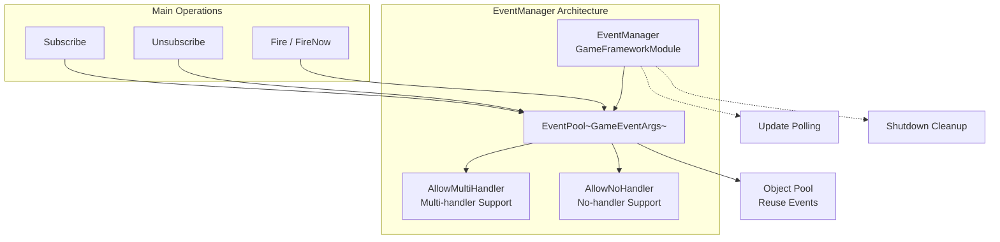
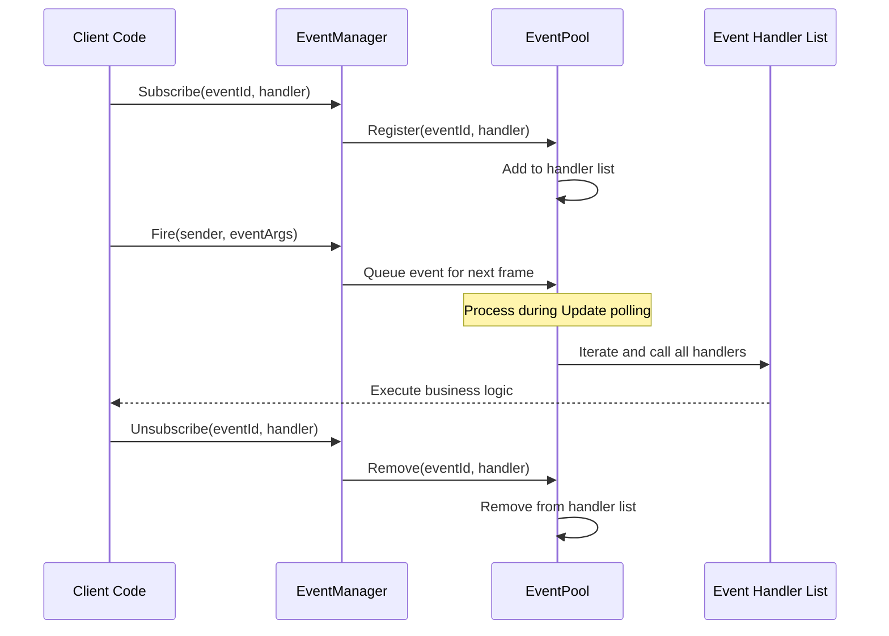
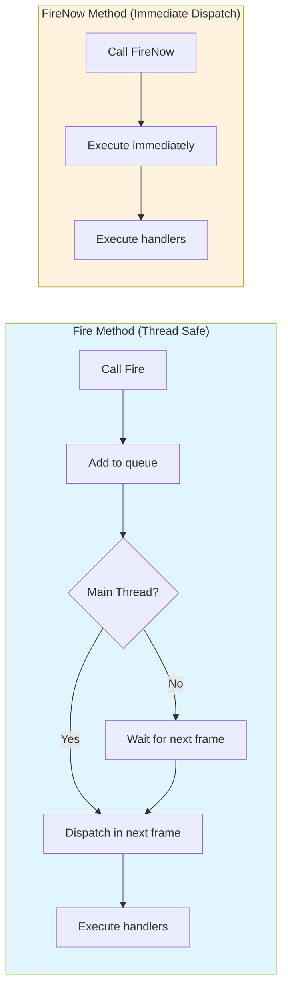

# EventManager

EventManager is the core manager of the GameFrameX event system, responsible for game event subscription, unsubscription, and dispatch management. It is implemented based on EventPool and supports thread-safe event dispatch and multi-handler mode.

## Overview

EventManager is the core component of the GameFrameX event system, inheriting from `GameFrameworkModule` and implementing the `IEventManager` interface. It provides a powerful event system that allows different modules in a game to communicate in a loosely coupled manner through events.

Core functions of EventManager:
- **Event Subscription and Unsubscription**: Register or remove event handler functions by event ID
- **Event Dispatch**: Supports thread-safe deferred dispatch (`Fire`) and immediate dispatch (`FireNow`) modes
- **Event Statistics**: Provides querying for currently subscribed event handler count and event count
- **Default Handler**: Supports setting a default event handler to capture un-subscribed events

> **Note**: EventManager is typically used in Unity scenes through EventComponent. EventComponent is a Unity component wrapper for EventManager, providing a more user-friendly Unity integration interface.
>
> For detailed EventComponent information, refer to [EventComponent](./05.event-component.md).
>
> For detailed GameEventArgs information, refer to [GameEventArgs](./07.game-event-args.md).

## Architecture

EventManager is implemented based on EventPool (Event Pool), which is an efficient event management mode. EventPool supports the following features:



### Design Patterns

EventManager uses the following design patterns:

| Pattern | Application | Advantages |
|---------|-------------|------------|
| **Object Pool Pattern** | EventPool reuses GameEventArgs | Reduce GC, optimize performance |
| **Observer Pattern** | Subscribe/Publish mechanism | Decouple event publishers and subscribers |
| **Deferred Execution Pattern** | Fire defers to next frame dispatch | Ensure thread safety |

## Core Flow

### Event Subscription and Dispatch Flow



### Event Dispatch Mode Comparison



## Usage Examples

### Basic Usage

```csharp
// Define custom event args
public class PlayerDeathEventArgs : GameEventArgs
{
    public int PlayerId { get; set; }
    public string Reason { get; set; }
    public override void Clear()
    {
        PlayerId = 0;
        Reason = string.Empty;
    }
}

// Subscribe to event
EventComponent eventComponent = UnityEngine.Object.FindObjectOfType<EventComponent>();
eventComponent.CheckSubscribe("player_death", OnPlayerDeath);

// Event handler
private void OnPlayerDeath(object sender, GameEventArgs e)
{
    var args = (PlayerDeathEventArgs)e;
    UnityEngine.Debug.Log($"Player {args.PlayerId} died: {args.Reason}");
}

// Fire event
eventComponent.Fire(this, new PlayerDeathEventArgs
{
    PlayerId = 1001,
    Reason = "Killed by monster"
});

// Unsubscribe
eventComponent.Unsubscribe("player_death", OnPlayerDeath);
```
> Source: [EventManager.cs](https://github.com/GameFrameX/com.gameframex.unity.event/blob/main/Runtime/Event/EventManager.cs#L98-L101)

### Using Empty Events (No Data Needed)

```csharp
// Subscribe to simple event (no data needed)
eventComponent.CheckSubscribe("game_start", OnGameStart);

// Fire simple event
eventComponent.Fire(this, "game_start");

// Event handler
private void OnGameStart(object sender, GameEventArgs e)
{
    UnityEngine.Debug.Log("Game started!");
}
```
> Source: [EventComponent.cs](https://github.com/GameFrameX/com.gameframex.unity.event/blob/main/Runtime/EventComponent.cs#L140-L144)

### Setting Default Handler

```csharp
// Set default handler to capture all un-subscribed events
eventComponent.SetDefaultHandler(OnDefaultEvent);

// Default event handler
private void OnDefaultEvent(object sender, GameEventArgs e)
{
    UnityEngine.Debug.Log($"Received unhandled event: {e.Id}");
}
```
> Source: [EventManager.cs](https://github.com/GameFrameX/com.gameframex.unity.event/blob/main/Runtime/Event/EventManager.cs#L117-L120)

## API Reference

### Properties

#### `EventHandlerCount`

```csharp
public int EventHandlerCount { get; }
```

Gets the total number of subscribed event handlers.

**Returns:** Number of event handlers.

---

#### `EventCount`

```csharp
public int EventCount { get; }
```

Gets the number of subscribed event types (number of different event IDs).

**Returns:** Number of event types.

---

### Methods

#### `Count`

```csharp
public int Count(string id)
```

Gets the number of event handlers for a specified event ID.

**Parameters:**
- `id` (string): Event type identifier

**Returns:** Number of event handlers for the specified event ID.

> Source: [EventManager.cs#L77-L80](https://github.com/GameFrameX/com.gameframex.unity.event/blob/main/Runtime/Event/EventManager.cs#L77-L80)

---

#### `Check`

```csharp
public bool Check(string id, EventHandler<GameEventArgs> handler)
```

Checks whether a specified event handler exists.

**Parameters:**
- `id` (string): Event type identifier
- `handler` (`EventHandler<GameEventArgs>`): The event handler to check

**Returns:** Whether the specified event handler exists.

> Source: [EventManager.cs#L88-L91](https://github.com/GameFrameX/com.gameframex.unity.event/blob/main/Runtime/Event/EventManager.cs#L88-L91)

---

#### `Subscribe`

```csharp
public void Subscribe(string id, EventHandler<GameEventArgs> handler)
```

Subscribes to an event handler for a specified event ID.

**Parameters:**
- `id` (string): Event type identifier
- `handler` (`EventHandler<GameEventArgs>`): The event handler to subscribe to

**Description:**
- Multiple handlers can be subscribed to for the same event ID
- When an event is triggered, all subscribed handlers will be called

> Source: [EventManager.cs#L98-L101](https://github.com/GameFrameX/com.gameframex.unity.event/blob/main/Runtime/Event/EventManager.cs#L98-L101)

---

#### `Unsubscribe`

```csharp
public void Unsubscribe(string id, EventHandler<GameEventArgs> handler)
```

Unsubscribes from an event handler for a specified event ID.

**Parameters:**
- `id` (string): Event type identifier
- `handler` (`EventHandler<GameEventArgs>`): The event handler to unsubscribe from

**Description:** If the event handler does not exist, no operation will be performed.

> Source: [EventManager.cs#L108-L111](https://github.com/GameFrameX/com.gameframex.unity.event/blob/main/Runtime/Event/EventManager.cs#L108-L111)

---

#### `SetDefaultHandler`

```csharp
public void SetDefaultHandler(EventHandler<GameEventArgs> handler)
```

Sets the default event handler function.

**Parameters:**
- `handler` (`EventHandler<GameEventArgs>`): The default event handler function to set

**Description:** The default event handler will be called when an event cannot find a corresponding subscribed handler.

> Source: [EventManager.cs#L117-L120](https://github.com/GameFrameX/com.gameframex.unity.event/blob/main/Runtime/Event/EventManager.cs#L117-L120)

---

#### `Fire`

```csharp
public void Fire(object sender, GameEventArgs e)
```

Fires an event (thread-safe mode).

**Parameters:**
- `sender` (object): Event sender
- `e` (GameEventArgs): Event args

**Description:**
- This method is thread-safe
- Even when called from non-main threads, it ensures that event handlers are called back on the main thread
- Events will be dispatched in the frame after firing

> Source: [EventManager.cs#L127-L130](https://github.com/GameFrameX/com.gameframex.unity.event/blob/main/Runtime/Event/EventManager.cs#L127-L130)

---

#### `FireNow`

```csharp
public void FireNow(object sender, GameEventArgs e)
```

Fires an event (immediate mode).

**Parameters:**
- `sender` (object): Event sender
- `e` (GameEventArgs): Event args

**Description:**
- This method is not thread-safe
- Events are dispatched immediately, and all subscribed handlers are called synchronously
- Only use when you are certain the calling thread is safe

> Source: [EventManager.cs#L137-L140](https://github.com/GameFrameX/com.gameframex.unity.event/blob/main/Runtime/Event/EventManager.cs#L137-L140)

---

## Thread Safety

EventManager provides two event dispatch modes to meet different needs:

| Method | Thread Safe | Dispatch Timing | Applicable Scenarios |
|--------|-------------|-----------------|----------------------|
| `Fire` | Yes | Next frame | Cross-thread events, backend notifying frontend |
| `FireNow` | No | Immediate | Synchronous logic within same thread |

**Best Practices:**
- Use `Fire` when triggering events from child threads to ensure callbacks execute on the main thread
- Use `FireNow` when immediate response is needed on the main thread
- Avoid time-consuming operations in `FireNow` event handlers

## Performance Optimization Suggestions

1. **Use Object Pool**: Custom event classes should inherit `GameEventArgs` and implement object pool interface to avoid frequent object creation
2. **Unsubscribe Promptly**: Events no longer needed should be unsubscribed promptly to reduce traversal overhead
3. **Use `CheckSubscribe`**: It is recommended to use the `CheckSubscribe` method to automatically handle duplicate subscription issues
4. **Avoid Frequent Dispatch**: For high-frequency events (such as per-frame updates), consider merging or throttling

## Related Links

- [EventComponent](./05.event-component.md) - Unity component wrapper
- [GameEventArgs](./07.game-event-args.md) - Event args base class
- [Core Concepts: Event System Architecture](../04.features.md) - Learn more design principles
- [Quick Start](../03.getting-started.md) - Start using the event system
