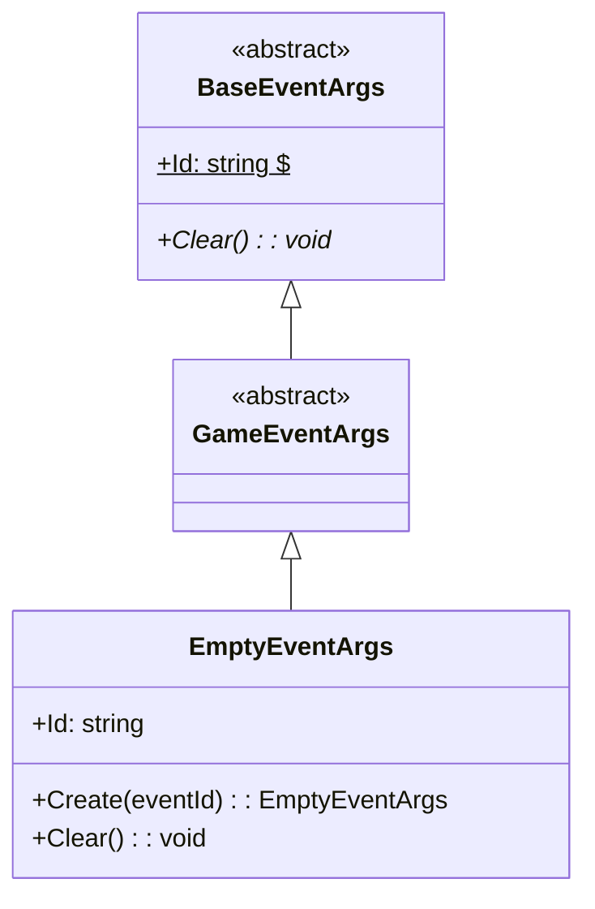
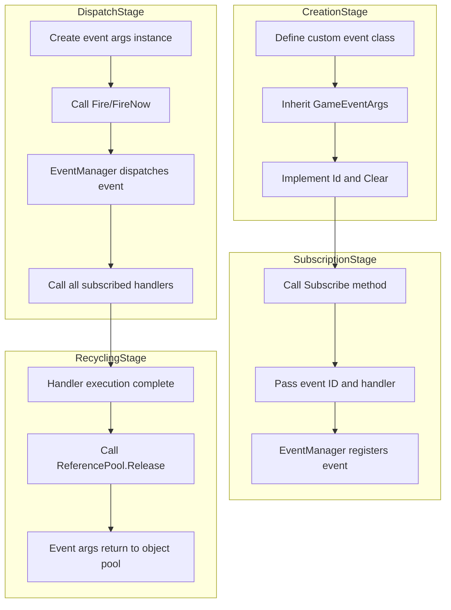

# GameEventArgs

Game event args base class, used to define the base class for all events in the game framework.

## Overview

GameEventArgs is the core base class of the GameFrameX event system. All custom game events should inherit from this class. It inherits from BaseEventArgs and provides the basic structure and interface specifications for the event system.

**Design Intent**: By establishing a unified event args base class, the event system can handle various game events in a type-safe manner while maintaining flexibility in event subscription and dispatch.

## Class Hierarchy



## Core Concepts

### Event ID

Each event args should have a unique event identifier (Event ID) for event subscription and identification. Event IDs typically use string type and can be:

- Predefined constant strings
- Full type name (`typeof(T).FullName`)
- Custom business logic identifier

### Object Pool

GameEventArgs is designed to support object pool pattern for performance optimization. In actual use, event args are typically acquired and recycled through `ReferencePool`:

```csharp
var eventArgs = ReferencePool.Acquire<EmptyEventArgs>();
// ... use event args
ReferencePool.Release(eventArgs);
```

> Source: [EmptyEventArgs.cs](https://github.com/GameFrameX/com.gameframex.unity.event/blob/main/Runtime/EventArgs/EmptyEventArgs.cs#L32-L37)

## Creating Custom Event Args

To create custom event args class, you need to inherit GameEventArgs and implement necessary members. Below is a complete implementation example of EmptyEventArgs:

```csharp
using GameFrameX.Runtime;

namespace GameFrameX.Event.Runtime
{
    /// <summary>
    /// Empty event
    /// </summary>
    public sealed class EmptyEventArgs : GameEventArgs
    {
        private string _eventId = typeof(EmptyEventArgs).FullName;

        public override void Clear()
        {
        }

        public override string Id
        {
            get { return _eventId; }
        }

        /// <summary>
        /// Create empty event
        /// </summary>
        /// <param name="eventId">Event identifier</param>
        /// <returns>Empty event object</returns>
        public static EmptyEventArgs Create(string eventId)
        {
            var eventArgs = ReferencePool.Acquire<EmptyEventArgs>();
            eventArgs.SetEventId(eventId);
            return eventArgs;
        }

        /// <summary>
        /// Set event identifier
        /// </summary>
        /// <param name="eventId"></param>
        private void SetEventId(string eventId)
        {
            _eventId = eventId;
        }
    }
}
```

> Source: [EmptyEventArgs.cs](https://github.com/GameFrameX/com.gameframex.unity.event/blob/main/Runtime/EventArgs/EmptyEventArgs.cs#L1-L48)

### Implementation Points

1. **Id Property** (Required): Returns the unique identifier of the event
2. **Clear Method** (Required): Resets event args state, used for data cleanup when objects are recycled
3. **Create Static Method** (Recommended): Provides factory method to create event instances, supporting object pool

## Event Args and Event System

Usage flow of GameEventArgs in the event system:



## Complete Event Example

The following is a complete example of custom event args with data payload:

```csharp
// Example custom event args (demonstrating pattern)
public class PlayerDieEventArgs : GameEventArgs
{
    private int _playerId;
    private string _deathReason;
    private Vector3 _deathPosition;

    public override void Clear()
    {
        _playerId = 0;
        _deathReason = string.Empty;
        _deathPosition = Vector3.zero;
    }

    public override string Id => "PlayerDie";

    public int PlayerId => _playerId;
    public string DeathReason => _deathReason;
    public Vector3 DeathPosition => _deathPosition;

    public static PlayerDieEventArgs Create(int playerId, string reason, Vector3 position)
    {
        var args = ReferencePool.Acquire<PlayerDieEventArgs>();
        args._playerId = playerId;
        args._deathReason = reason;
        args._deathPosition = position;
        return args;
    }
}
```

> Note: The above example demonstrates the pattern for creating custom event args. Actual code needs to be implemented according to specific requirements.

## Event Dispatch Methods

The event system provides two dispatch methods:

| Method | Method | Thread Safe | Features |
|--------|--------|-------------|----------|
| Deferred Dispatch | `Fire(sender, args)` | Yes | Dispatched in next frame, suitable for cross-thread calls |
| Immediate Dispatch | `FireNow(sender, args)` | No | Dispatched immediately, higher performance but not thread-safe |

```csharp
// Deferred dispatch (thread-safe)
eventComponent.Fire(this, EmptyEventArgs.Create("game_start"));

// Immediate dispatch
eventComponent.FireNow(this, EmptyEventArgs.Create("game_start"));
```

> Source: [EventComponent.cs](https://github.com/GameFrameX/com.gameframex.unity.event/blob/main/Runtime/EventComponent.cs#L130-L154)

## API Reference

### `GameEventArgs`

Game logic event base class.

**Namespace**: `GameFrameX.Event.Runtime`

**Inherits**: `BaseEventArgs`

**Subclasses**:

- `EmptyEventArgs`: Empty event implementation

#### Members

| Member | Type | Description |
|--------|------|-------------|
| `Id` | `string` | Gets the unique event identifier (abstract property) |
| `Clear()` | `void` | Resets event state (abstract method) |

### `EmptyEventArgs`

Empty event implementation, used for events that don't need to carry data.

**Namespace**: `GameFrameX.Event.Runtime`

**Inherits**: `GameEventArgs`

#### Methods

| Method | Return Type | Description |
|--------|-------------|-------------|
| `Create(eventId)` | `EmptyEventArgs` | Creates an empty event instance |

## Related Links

- [EventComponent](./05.event-component.md)
- [EventManager](./06.event-manager.md)
- [Event System Architecture](./04.features.md)
- [Quick Start](./03.getting-started.md)
