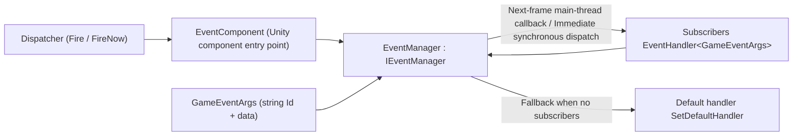

# Package Overview: What Is GameFrameX Event

GameFrameX Event (package name `com.gameframex.unity.event`) is the event system component of the GameFrameX framework: an event bus based on **string IDs** used for decoupled communication between modules. It supports thread-safe deferred dispatch (`Fire`, with the callback on the main thread on the next frame), immediate dispatch (`FireNow`), and can fall back to a default handler for unsubscribed events; this package has no dependencies.

The capabilities it provides:

- Event subscription / unsubscription based on string IDs
- `Fire` — thread-safe deferred dispatch (main-thread callback on the next frame)
- `FireNow` — immediate synchronous dispatch
- `Fire(sender, eventId)` — a shortcut that requires no custom event arguments
- `Check` / `CheckSubscribe` / `CheckUnsubscribe` — check for existence, automatically subscribe when absent, safely unsubscribe when present
- `Count` / `EventHandlerCount` / `EventCount` — handler statistics
- Default handler fallback for unsubscribed events

## Quick Start

1. Install the package (choose one of the following): edit the Unity project's `Packages/manifest.json`, add a scoped registry and declare the dependency; or add a Git URL directly under the `dependencies` node; you can also add it via Git URL in the Unity `Package Manager`, or download the repository and place it in the `Packages` directory.

   ```json
   {
     "scopedRegistries": [
       {
         "name": "GameFrameX",
         "url": "https://gameframex.upm.alianblank.uk",
         "scopes": [
           "com.gameframex"
         ]
       }
     ],
     "dependencies": {
       "com.gameframex.unity.event": "1.1.1"
     }
   }
   ```

   Source: [README.zh-CN.md](https://github.com/GameFrameX/com.gameframex.unity.event/blob/main/README.zh-CN.md#L42-L67)

2. Define a custom event arguments class that inherits from `GameEventArgs`, returns the string event ID via `Id`, and works with the reference pool for reuse:

   ```csharp
   public class LevelUpEventArgs : GameEventArgs
   {
       public override string Id => "level_up";
       public int Level { get; private set; }

       public static LevelUpEventArgs Create(int level)
       {
           var args = ReferencePool.Acquire<LevelUpEventArgs>();
           args.Level = level;
           return args;
       }

       public override void Clear()
       {
           base.Clear();
           Level = 0;
       }
   }
   ```

   Source: [README.zh-CN.md](https://github.com/GameFrameX/com.gameframex.unity.event/blob/main/README.zh-CN.md#L75-L94)

3. Subscribe and unsubscribe via `EventComponent` (`eventComponent` in the example below is a reference to this component):

   ```csharp
   eventComponent.Subscribe("level_up", OnLevelUp);
   eventComponent.Unsubscribe("level_up", OnLevelUp);

   void OnLevelUp(object sender, GameEventArgs e)
   {
       var args = (LevelUpEventArgs)e;
       Debug.Log($"升级到 {args.Level} 级");
   }
   ```

   Source: [README.zh-CN.md](https://github.com/GameFrameX/com.gameframex.unity.event/blob/main/README.zh-CN.md#L99-L107)

4. Fire events — choose any of the three modes: deferred (thread-safe, main-thread callback on the next frame), immediate (main thread only), or the shortcut (no custom arguments needed):

   ```csharp
   eventComponent.Fire(this, LevelUpEventArgs.Create(5));      // Deferred mode
   eventComponent.FireNow(this, LevelUpEventArgs.Create(5));   // Immediate mode
   eventComponent.Fire(this, "level_up");                      // Shortcut
   ```

   Source: [README.zh-CN.md](https://github.com/GameFrameX/com.gameframex.unity.event/blob/main/README.zh-CN.md#L122-L140)

5. (Optional) Set a default handler as a fallback for events that no handler has subscribed to:

   ```csharp
   eventComponent.SetDefaultHandler(OnDefaultEvent);

   void OnDefaultEvent(object sender, GameEventArgs e)
   {
       Debug.Log($"未处理的事件: {e.Id}");
   }
   ```

   Source: [README.zh-CN.md](https://github.com/GameFrameX/com.gameframex.unity.event/blob/main/README.zh-CN.md#L142-L151)

Common APIs (defined on the `IEventManager` interface; `EventComponent` exposes call entry points with the same names):

| Member | Signature | Description |
|------|------|------|
| `EventHandlerCount` | `int { get; }` | Gets the total number of event handlers |
| `EventCount` | `int { get; }` | Gets the number of events |
| `Count` | `int Count(string id)` | Gets the number of handlers for the specified event |
| `Check` | `bool Check(string id, EventHandler<GameEventArgs> handler)` | Checks whether an event handler exists |
| `Subscribe` | `void Subscribe(string id, EventHandler<GameEventArgs> handler)` | Subscribes an event handler |
| `Unsubscribe` | `void Unsubscribe(string id, EventHandler<GameEventArgs> handler)` | Unsubscribes an event handler |
| `CheckUnsubscribe` | `void CheckUnsubscribe(string id, EventHandler<GameEventArgs> handler)` | Checks and unsubscribes; does nothing if the handler does not exist |
| `SetDefaultHandler` | `void SetDefaultHandler(EventHandler<GameEventArgs> handler)` | Sets the default event handler |
| `Fire` | `void Fire(object sender, GameEventArgs e)` | Thread-safe deferred firing; even when fired off the main thread, the callback is guaranteed to happen on the main thread, and the event is dispatched on the next frame |
| `FireNow` | `void FireNow(object sender, GameEventArgs e)` | Fires immediately and dispatches synchronously; not thread-safe |

Source: [IEventManager.cs](https://github.com/GameFrameX/com.gameframex.unity.event/blob/main/Runtime/Event/IEventManager.cs#L38-L105)

## How It Works at a Glance

Events are handed off by `EventComponent` (the Unity component entry point) to the event manager `EventManager` (the implementation of `IEventManager`) for unified processing: subscribers register `EventHandler<GameEventArgs>` by string ID, and the firing side passes a `GameEventArgs` carrying data to the event bus; `Fire` goes through a thread-safe deferred queue and is dispatched on the main thread on the next frame, `FireNow` dispatches immediately and synchronously, and events with no subscribers fall back to the default handler.



Overview of the repository source structure:

| Path | Purpose |
|------|------|
| `Runtime/EventComponent.cs` | Unity component entry point; exposes calls such as subscribe / fire |
| `Runtime/Event/EventManager.cs` | Event manager implementation |
| `Runtime/Event/IEventManager.cs` | Event manager interface (API contract) |
| `Runtime/EventArgs/GameEventArgs.cs` | Base class for event arguments (string `Id`) |
| `Runtime/EventArgs/EmptyEventArgs.cs` | Empty event arguments |
| `Runtime/GameFrameXEventCroppingHelper.cs` | Cropping (code stripping) helper |
| `Editor/Inspector/EventComponentInspector.cs` | Inspector for `EventComponent` in the editor |

Source: [IEventManager.cs](https://github.com/GameFrameX/com.gameframex.unity.event/blob/main/Runtime/Event/IEventManager.cs#L38-L105)

## Common Mistakes

- **Calling `FireNow` off the main thread**: `FireNow` is not thread-safe and dispatches immediately and synchronously. To fire events across threads, use `Fire` instead, which guarantees a main-thread callback (dispatched on the next frame).
- **Reading side effects in the same frame after firing `Fire` from a worker thread**: `Fire` is deferred dispatch; the event is only called back on the **next frame** after it is fired, so do not assume the handler has already executed immediately after firing.
- **Subscribing repeatedly / unsubscribing a handler that does not exist**: use `Check` to test for existence, or simply use `CheckSubscribe` (subscribes only when absent) and `CheckUnsubscribe` (unsubscribes only when present; does nothing otherwise) to avoid exceptions.
- **Forgetting to make event arguments reusable**: `GameEventArgs` is used together with the reference pool; in the example, `ReferencePool.Acquire` is called in `Create`, fields are reset in `Clear`, and the framework recycles and reuses the arguments after they are fired.

Source: [README.zh-CN.md](https://github.com/GameFrameX/com.gameframex.unity.event/blob/main/README.zh-CN.md#L109-L159)

## What's Next

- For detailed signatures and descriptions of each API, see the [IEventManager.cs](https://github.com/GameFrameX/com.gameframex.unity.event/blob/main/Runtime/Event/IEventManager.cs#L38-L105) interface source code.
- For complete usage examples (checking / statistics / default handler), see [README.zh-CN.md](https://github.com/GameFrameX/com.gameframex.unity.event/blob/main/README.zh-CN.md#L71-L159).
- Official documentation: <https://gameframex.doc.alianblank.com>; for the changelog, see [Releases](https://github.com/gameframex/com.gameframex.unity.event/releases).