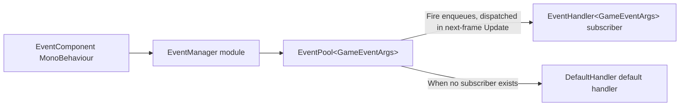

# How It Works: Event Dispatch and Module Lifecycle

This page explains how the Event module internally completes an event dispatch, as well as the initialization, polling, and shutdown flow of `EventManager` as a framework module. Key conclusions: `Fire` enqueues and dispatches during the next frame's `Update` (thread-safe); `FireNow` dispatches immediately and synchronously (not thread-safe); all forwarding goes through the three layers `EventComponent` → `EventManager` → `EventPool<GameEventArgs>`.

## Event Dispatch Flow

The complete path of a single `Fire` involves only four steps:

1. Business code calls `EventComponent.Fire(sender, e)`, and the component forwards the request as-is to the internal `IEventManager` (obtained via `GameFrameworkEntry.GetModule<IEventManager>()`, see `EventComponent.Awake`).
2. `EventManager.Fire` pushes the event into the internal `EventPool<GameEventArgs>` queue and **does not immediately invoke any handler functions**.
3. When the framework polls modules each frame, `EventManager.Update` calls `m_EventPool.Update(elapseSeconds, realElapseSeconds)`, dispatching the queued events in enqueue order on the **main thread** to subscribers of the corresponding `id`.
4. After dispatch, the event arguments are returned to the reference pool (`GameEventArgs` derives from `BaseEventArgs`; empty events are created via `ReferencePool.Acquire<EmptyEventArgs>()`).



The actual code for the two-layer forwarding is as follows — the component layer only delegates, while the manager layer holds the real `EventPool`:

```csharp
public void Fire(object sender, GameEventArgs e)
{
    m_EventManager.Fire(sender, e);
}
```

Source: [EventComponent.cs](https://github.com/GameFrameX/com.gameframex.unity.event/blob/main/Runtime/EventComponent.cs#L147-L150)

```csharp
public sealed class EventManager : GameFrameworkModule, IEventManager
{
    private readonly EventPool<GameEventArgs> m_EventPool;

    public EventManager()
    {
        m_EventPool = new EventPool<GameEventArgs>(EventPoolMode.AllowNoHandler | EventPoolMode.AllowMultiHandler);
    }
```

Source: [EventManager.cs](https://github.com/GameFrameX/com.gameframex.unity.event/blob/main/Runtime/Event/EventManager.cs#L39-L49)

The combination of `EventPoolMode` flags passed in at construction determines this module's dispatch behavior: `AllowNoHandler` allows an event to have no subscribers without raising an error, and `AllowMultiHandler` allows multiple handlers to be attached to the same `id`.

## Differences Between the Two Ways of Firing Events

| Method | Dispatch Timing | Thread-Safe | Applicable Scenarios |
|------|----------|----------|----------|
| `Fire(sender, e)` | The next frame after firing | Yes (main-thread callback guaranteed even when fired from a child thread) | Regular game logic events |
| `FireNow(sender, e)` | Immediate synchronous dispatch | No (main-thread calls only) | Scenarios that need the callback result on the spot |
| `Fire(sender, eventId)` | Same as `Fire` | Yes | Parameterless events; internally constructs an `EmptyEventArgs` automatically |

The `Fire(object sender, string eventId)` overload validates that the event ID is not empty and takes an empty event object from the reference pool:

```csharp
public void Fire(object sender, string eventId)
{
    GameFrameworkGuard.NotNullOrEmpty(eventId, nameof(eventId));
    m_EventManager.Fire(sender, EmptyEventArgs.Create(eventId));
}
```

Source: [EventComponent.cs](https://github.com/GameFrameX/com.gameframex.unity.event/blob/main/Runtime/EventComponent.cs#L157-L161)

The implementation of `EmptyEventArgs.Create` confirms the reference pool path:

```csharp
public static EmptyEventArgs Create(string eventId)
{
    var eventArgs = ReferencePool.Acquire<EmptyEventArgs>();
    eventArgs.SetEventId(eventId);
    return eventArgs;
}
```

Source: [EmptyEventArgs.cs](https://github.com/GameFrameX/com.gameframex.unity.event/blob/main/Runtime/EventArgs/EmptyEventArgs.cs#L33-L38)

## Module Lifecycle

`EventManager` inherits from `GameFrameworkModule` and is driven uniformly by `GameFrameworkEntry`. The three key lifecycle points are all just pass-throughs to the `EventPool`:

| Lifecycle Stage | Triggered By | Implementation in EventManager |
|--------------|--------|----------------------|
| Initialization | Constructor | Creates `EventPool<GameEventArgs>` and sets `EventPoolMode` |
| Per-frame polling | Framework main loop | `Update` calls `m_EventPool.Update(...)` to dispatch backlogged events |
| Shutdown | Framework shutdown flow | `Shutdown` calls `m_EventPool.Shutdown()` to clear subscriptions and the queue |

```csharp
/// <summary>Gets the game framework module priority.</summary>
/// <remarks>Modules with a higher priority are polled first, and their shutdown operation is performed later.</remarks>
protected override int Priority
{
    get { return 7; }
}

protected override void Update(float elapseSeconds, float realElapseSeconds)
{
    m_EventPool.Update(elapseSeconds, realElapseSeconds);
}

protected override void Shutdown()
{
    m_EventPool.Shutdown();
}
```

Source: [EventManager.cs](https://github.com/GameFrameX/com.gameframex.unity.event/blob/main/Runtime/Event/EventManager.cs#L67-L92)

The priority is **7**: the larger the value, the earlier the polling and the later the shutdown. Meanwhile, the `EventComponent` in the scene carries the `[GameFrameXAutoComponent(-7000)]` attribute and is responsible for bridging the Unity-side MonoBehaviour with this module; in `Awake` it obtains the manager instance via `GameFrameworkEntry.GetModule<IEventManager>()`, and outputs `Log.Fatal("Event manager is invalid.")` if the instance cannot be obtained.

```csharp
protected override void Awake()
{
    ImplementationComponentType = Utility.Assembly.GetType(componentType);
    InterfaceComponentType = typeof(IEventManager);
    base.Awake();
    m_EventManager = GameFrameworkEntry.GetModule<IEventManager>();
    if (m_EventManager == null)
    {
        Log.Fatal("Event manager is invalid.");
        return;
    }
}
```

Source: [EventComponent.cs](https://github.com/GameFrameX/com.gameframex.unity.event/blob/main/Runtime/EventComponent.cs#L66-L77)

Therefore, the complete sequence from the user's perspective is: scene load → `EventComponent.Awake` obtains the module → business code `Subscribe` / `Fire` at any time → per-frame `Update` dispatch → `Shutdown` cleanup on exit.

## Internal Behavior of Subscription and Unsubscription

Subscribe, unsubscribe, and check all directly manipulate the `EventPool`'s handler table; `EventManager` itself does not hold any business state:

```csharp
public void Subscribe(string id, EventHandler<GameEventArgs> handler)
{
    m_EventPool.Subscribe(id, handler);
}

public void CheckUnsubscribe(string id, EventHandler<GameEventArgs> handler)
{
    if (m_EventPool.Check(id, handler))
    {
        m_EventPool.Unsubscribe(id, handler);
    }
}
```

Source: [EventManager.cs](https://github.com/GameFrameX/com.gameframex.unity.event/blob/main/Runtime/Event/EventManager.cs#L120-L146)

The component layer additionally provides `CheckSubscribe` to prevent duplicate subscriptions — first `Check`, then `Subscribe` — avoiding the same delegate being registered twice, which would cause a single `Fire` to trigger multiple callbacks:

```csharp
public void CheckSubscribe(string id, EventHandler<GameEventArgs> handler)
{
    if (!Check(id, handler))
    {
        m_EventManager.Subscribe(id, handler);
    }
}
```

Source: [EventComponent.cs](https://github.com/GameFrameX/com.gameframex.unity.event/blob/main/Runtime/EventComponent.cs#L105-L111)

Additionally, `SetDefaultHandler(handler)` can be called to set a default handler: when an event `id` has no subscribers, the event is handed over to the default handler, which is commonly used during debugging to track events that were "fired but nobody handled". The `EventHandlerCount` / `EventCount` / `Count(id)` exposed by `EventManager` allow observing the queue and subscription sizes at runtime.

## Event Argument Inheritance Chain

```csharp
public abstract class GameEventArgs : BaseEventArgs
{
}
```

Source: [GameEventArgs.cs](https://github.com/GameFrameX/com.gameframex.unity.event/blob/main/Runtime/EventArgs/GameEventArgs.cs#L38-L40)

All dispatchable event arguments must inherit from `GameEventArgs` (its base class `BaseEventArgs` comes from the GameFrameX runtime library and is not in this repository; the complete implementation details of `BaseEventArgs` and `EventPool` source code are not provided in this repository). The `EmptyEventArgs` included in this repository is used for parameterless events; custom business events follow the same pattern: inherit from `GameEventArgs`, implement `Id` and `Clear`, and after being fired they are reused by the reference pool to avoid GC.

## Related Links

- For how to subscribe to and fire events in business code, see the "How to Subscribe to and Fire Events" task page (in the same directory).
- For component mounting and Inspector information, see [EventComponent.cs](https://github.com/GameFrameX/com.gameframex.unity.event/blob/main/Runtime/EventComponent.cs) and [EventComponentInspector.cs](https://github.com/GameFrameX/com.gameframex.unity.event/blob/main/Editor/Inspector/EventComponentInspector.cs).
- For the manager's complete API, see [IEventManager.cs](https://github.com/GameFrameX/com.gameframex.unity.event/blob/main/Runtime/Event/IEventManager.cs) and [EventManager.cs](https://github.com/GameFrameX/com.gameframex.unity.event/blob/main/Runtime/Event/EventManager.cs).