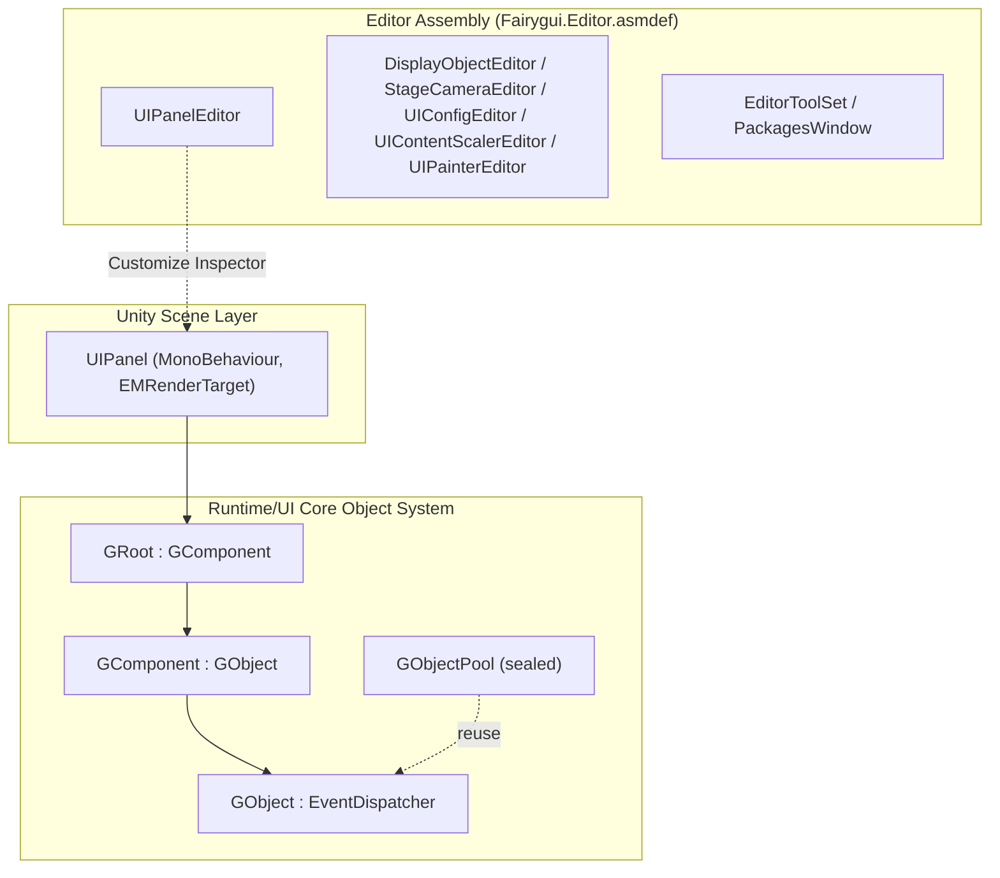

# How It Works: Runtime Structure and Module Division

The FairyGUI Unity runtime (package name `com.gameframex.unity.fairygui.unity`, version 5.3.5, based on the official FairyGUI source code) consists of two major parts: the **Runtime** directory contains the pure C# core UI object system, and the **Editor** directory contains Unity editor extensions. UI objects are rooted at `GObject`, composed level by level through `GComponent → GRoot`, and finally mounted and presented in the Unity scene by `UIPanel` (MonoBehaviour).

## Package Basic Information

| Item | Value |
|------|------|
| Package Name | `com.gameframex.unity.fairygui.unity` |
| Display Name | FairyGUI |
| Version | 5.3.5 |
| Minimum Unity Version | 2019.4 |
| Samples | Built-in Samples examples (displayName: `Samples`) |

The above information comes from [package.json](https://github.com/GameFrameX/com.gameframex.unity.fairygui.unity/blob/main/package.json#L2-L10).

## Directory and Module Division

| Directory/Module | Content | Example Key Files |
|------|------|------|
| `Runtime/UI` | Core of the UI object system: base objects, components, root node, object pool, panel mounting | [GObject.cs](https://github.com/GameFrameX/com.gameframex.unity.fairygui.unity/blob/main/Runtime/UI/GObject.cs) |
| `Editor` | Editor extensions: Inspector customization for each component and tool windows | [UIPanelEditor.cs](https://github.com/GameFrameX/com.gameframex.unity.fairygui.unity/blob/main/Editor/UIPanelEditor.cs) |

Editor extensions confirmed under the `Editor` directory (all located in the namespace `FairyGUI.Editor`, with assembly boundaries defined by the independent [Fairygui.Editor.asmdef](https://github.com/GameFrameX/com.gameframex.unity.fairygui.unity/blob/main/Editor/Fairygui.Editor.asmdef)):

- `DisplayObjectEditor` — Display object Inspector customization
- `StageCameraEditor` — Stage camera Inspector customization
- `UIConfigEditor` — UI configuration Inspector customization
- `UIContentScalerEditor` — Content scaling settings Inspector customization
- `UIPainterEditor` — UI Painter Inspector customization
- `UIPanelEditor` — `UIPanel` component Inspector customization
- `EditorToolSet` / `PackagesWindow` — Editor toolset and package management window

## UI Object Class Hierarchy

All runtime UI objects are located in `Runtime/UI`, with the following inheritance relationships (code is verbatim from the source):

```csharp
public class GObject : EventDispatcher
```

Source: [GObject.cs](https://github.com/GameFrameX/com.gameframex.unity.fairygui.unity/blob/main/Runtime/UI/GObject.cs#L7)

```csharp
public class GComponent : GObject
```

Source: [GComponent.cs](https://github.com/GameFrameX/com.gameframex.unity.fairygui.unity/blob/main/Runtime/UI/GComponent.cs#L14)

```csharp
public class GRoot : GComponent
```

Source: [GRoot.cs](https://github.com/GameFrameX/com.gameframex.unity.fairygui.unity/blob/main/Runtime/UI/GRoot.cs#L10)

```csharp
public sealed class GObjectPool
```

Source: [GObjectPool.cs](https://github.com/GameFrameX/com.gameframex.unity.fairygui.unity/blob/main/Runtime/UI/GObjectPool.cs#L10)

Meaning of the hierarchy:

- **`GObject`**: The base class of all UI objects, inheriting from the event dispatcher `EventDispatcher`, unifying event handling.
- **`GComponent`**: A container component that can hold and manage child `GObject`s, forming the middle layer of the composition tree.
- **`GRoot`**: The root container, inheriting from `GComponent`, serving as the top-level entry point of the UI tree.
- **`GObjectPool`** (sealed): An object pool used for reusing UI objects.

## Unity Scene Mounting: UIPanel

For the UI object tree in `Runtime` to be presented in the Unity scene, it must be mounted onto a GameObject via the MonoBehaviour component `UIPanel`:

```csharp
[AddComponentMenu("FairyGUI/UI Panel")]
public class UIPanel : MonoBehaviour, EMRenderTarget
```

Source: [UIPanel.cs](https://github.com/GameFrameX/com.gameframex.unity.fairygui.unity/blob/main/Runtime/UI/UIPanel.cs#L25-L27)

Key points:

- `UIPanel` also implements the `EMRenderTarget` interface, allowing it to participate in the framework's rendering pipeline as a render target.
- The menu path is `FairyGUI/UI Panel`, i.e., added via the Unity component menu `Add Component → FairyGUI/UI Panel`.
- The corresponding editor customization is `FairyGUI.UIPanelEditor` (`[CustomEditor(typeof(FairyGUI.UIPanel))]`, see [UIPanelEditor.cs](https://github.com/GameFrameX/com.gameframex.unity.fairygui.unity/blob/main/Editor/UIPanelEditor.cs#L12-L14)).

## Module Structure Overview



## Related Links

- UI base class implementation: [GObject.cs](https://github.com/GameFrameX/com.gameframex.unity.fairygui.unity/blob/main/Runtime/UI/GObject.cs)
- Container component: [GComponent.cs](https://github.com/GameFrameX/com.gameframex.unity.fairygui.unity/blob/main/Runtime/UI/GComponent.cs)
- Root container: [GRoot.cs](https://github.com/GameFrameX/com.gameframex.unity.fairygui.unity/blob/main/Runtime/UI/GRoot.cs)
- Unity mounting component: [UIPanel.cs](https://github.com/GameFrameX/com.gameframex.unity.fairygui.unity/blob/main/Runtime/UI/UIPanel.cs)
- Editor extensions: [Editor directory](https://github.com/GameFrameX/com.gameframex.unity.fairygui.unity/blob/main/Editor)
- Package description file: [package.json](https://github.com/GameFrameX/com.gameframex.unity.fairygui.unity/blob/main/package.json)