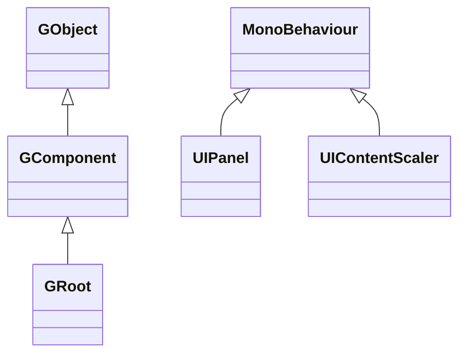

# FairyGUI for Unity Package Introduction

This package is the Unity wrapper of [FairyGUI](https://www.fairygui.com/product.html) under GameFrameX: FairyGUI is a cross-platform UI editor and UI framework. This package packages it as a Unity Package (UPM) and adds the changes needed for game framework integration, such as anti-stripping, mini-game keyboard adaptation, and editor shortcut menus. Once this package is installed, you can use UI resources exported from the FairyGUI editor to build interfaces in Unity.

## Quick Start

### 1. Install the Package

Add `scopedRegistries` and the dependency in your Unity project's `Packages/manifest.json` (choose one of the four installation methods):

```json
{
  "scopedRegistries": [
    {
      "name": "GameFrameX",
      "url": "https://gameframex.upm.alianblank.uk",
      "scopes": [
        "com.gameframex"
      ]
    }
  ],
  "dependencies": {
    "com.gameframex.unity.fairygui.unity": "5.3.3"
  }
}
```

Source: [README.md](https://github.com/GameFrameX/com.gameframex.unity.fairygui.unity/blob/main/README.md#L88-L104)

`scopes` determines which packages are resolved from this registry: only packages starting with `com.gameframex` will be pulled from here.

The other three methods:

- Write the Git URL directly in `manifest.json`'s `dependencies`: `"com.gameframex.unity.fairygui.unity": "https://github.com/gameframex/com.gameframex.unity.fairygui.unity.git"`
- Add via **Git URL** in Unity's **Package Manager**: `https://github.com/gameframex/com.gameframex.unity.fairygui.unity.git`
- Clone the repository into the Unity project's `Packages` directory; it will be loaded automatically

Source: [README.md](https://github.com/GameFrameX/com.gameframex.unity.fairygui.unity/blob/main/README.md#L108-L115)

### 2. Verify the Installation

Return to Unity; if `Tools > FairyGUI` appears in the menu bar, the installation was successful—this is the editor shortcut toggle entry added by this package (used to toggle various compilation macros).

### 3. Using UI

- Download the editor from the [FairyGUI official website](https://www.fairygui.com/product.html) and create your UI, then export the resources to your Unity project;
- Mount interfaces in the scene via `UIPanel` (FairyGUI/UI Panel component), or create them dynamically in code using `GRoot` as the UI root component;
- Use `UIContentScaler` (FairyGUI/UI Content Scaler component) to configure resolution adaptation.

This package is available for Unity 2019.4 and above, with no other dependent packages.

## How It Works at a Glance

The code in the package is divided into three layers (Unity Package standard directories):

| Directory | Content | Key Types |
|------|------|----------|
| `Runtime/UI` | Component layer: GObject component system, UIPackage resource packages, MonoBehaviour bridging for UIPanel/UIContentScaler | `GObject`, `GComponent`, `GRoot`, `GList`, `GButton`, `GLoader`, `UIPanel`, `UIPackage` |
| `Runtime/Core` | Display layer: display objects, rendering meshes, hit testing, blend modes | `DisplayObject`, `Container`, `Image`, `MeshFactory`, `PixelHitTest` |
| `Editor` | Editor extensions: Inspector extensions, macro toggle menus | `UIPanelEditor`, `UIConfigEditor`, `EditorToolSet` |

Component layer inheritance hierarchy (verified against source code):



- `GObject` is the base class for all UI components; `GComponent` is a container that can hold child objects; `GRoot` is the root node of the UI tree ([GObject.cs](https://github.com/GameFrameX/com.gameframex.unity.fairygui.unity/blob/main/Runtime/UI/GObject.cs), [GComponent.cs](https://github.com/GameFrameX/com.gameframex.unity.fairygui.unity/blob/main/Runtime/UI/GComponent.cs#L14), [GRoot.cs](https://github.com/GameFrameX/com.gameframex.unity.fairygui.unity/blob/main/Runtime/UI/GRoot.cs#L10))
- `UIPanel` and `UIContentScaler` are `MonoBehaviour`s attached to Unity GameObjects, responsible for connecting the FairyGUI component tree to the Unity scene and rendering ([UIPanel.cs](https://github.com/GameFrameX/com.gameframex.unity.fairygui.unity/blob/main/Runtime/UI/UIPanel.cs#L26), [UIContentScaler.cs](https://github.com/GameFrameX/com.gameframex.unity.fairygui.unity/blob/main/Runtime/UI/UIContentScaler.cs#L10))

FairyGUI comes with the `FairyBatching` DrawCall optimization technology, and includes built-in common UI capabilities such as mixed text-and-image layout, emoji input, virtual lists/looping lists, pixel-level hit testing, curved UI, gestures, typewriter effects, and more; input from mouse, single touch, multi-touch, VR controllers, etc. is uniformly encapsulated into a single set of interaction code.

## Changes Compared to the Official Version

This package makes the following adjustments on top of the official FairyGUI Unity version ([README.md](https://github.com/GameFrameX/com.gameframex.unity.fairygui.unity/blob/main/README.md#L28-L38)):

1. Added Unity Package Manager support
2. Added `FairyGUICroppingHelper` anti-stripping script
3. Added `link.xml` stripping filter
4. Fixed a bug where asynchronous AssetBundle loading had no callback
5. Added keyboard input adaptation for WeChat Mini Games and Douyin Mini Games
6. Added `ENABLE_WECHAT_MINI_GAME` macro (WeChat mini-game keyboard adaptation; do not enable simultaneously with the Douyin one)
7. Added `ENABLE_DOUYIN_MINI_GAME` macro (Douyin mini-game keyboard adaptation; do not enable simultaneously with the WeChat one)
8. Added Unity editor shortcut toggles: the corresponding `Tools > FairyGUI` menu
9. Added image pixelation feature

## Related Links

- [FairyGUI Official Tutorials](https://www.fairygui.com/docs/guide/index.html)
- [GameFrameX Documentation](https://gameframex.doc.alianblank.com)
- [Release Notes / Changelog](https://github.com/GameFrameX/com.gameframex.unity.fairygui.unity/releases)
- For enabling the pixelation feature and adjusting its parameters, see [README.md](https://github.com/GameFrameX/com.gameframex.unity.fairygui.unity/blob/main/README.md#L40-L70)
- QQ discussion groups: 467608841 / 233840761