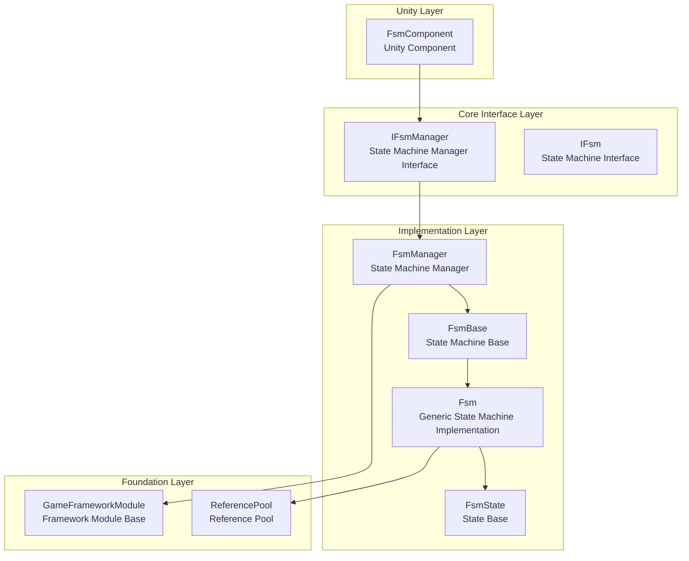
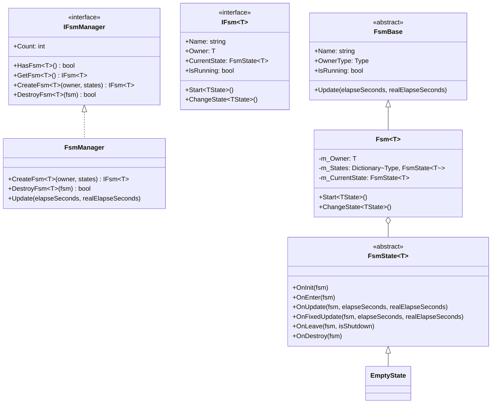
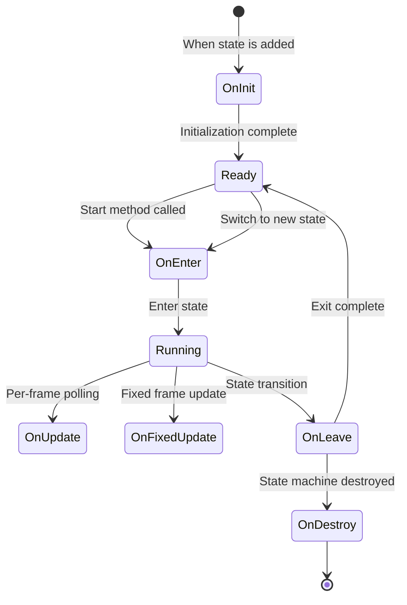
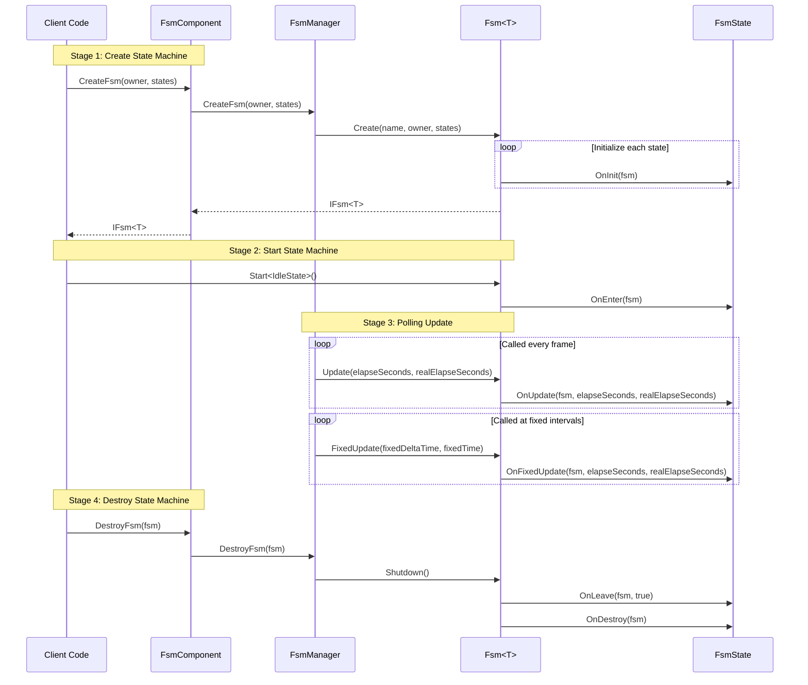

# Overview

GameFrameX Finite State Machine (FSM) component is one of the core modules of the GameFrameX game framework, providing a complete finite state machine implementation for managing game object behavior state transitions. This component is based on Game Framework and supports generic type constraints, providing core features such as state lifecycle management, state data storage, and state transitions.

## Project Introduction

A finite state machine is a behavioral design pattern that allows an object to change its behavior when its internal state changes. The FSM component encapsulates object states as independent state classes, making state transition logic clear and controllable. It is very suitable for handling scenarios such as character behaviors in games, AI state machines, and UI flow control.

**Core Features:**

- **Generic State Machine**: Supports any reference type as the state machine holder
- **Complete Lifecycle**: Provides callbacks for state initialization, entry, update, fixed update, exit, and destruction
- **Data Storage**: Supports storing and retrieving state-related data in the state machine
- **State Transitions**: Provides type-safe and flexible state transition mechanisms
- **Fixed Frame Update**: Supports FixedUpdate for physics updates
- **Object Pool Integration**: Uses reference pool technology to optimize memory allocation

## System Architecture

The FSM component uses a layered architecture design, achieving decoupling through interface abstraction.



**Architecture Description:**

| Layer | Component | Responsibilities |
|-------|-----------|-------------------|
| Unity Layer | FsmComponent | Provides Unity MonoBehaviour wrapper, integrated into Unity lifecycle |
| Core Interface Layer | IFsmManager, IFsm | Defines abstract interfaces for state machine management and state machine |
| Implementation Layer | FsmManager, Fsm, FsmState | Concrete implementations of state machine manager, generic state machine, and state base |
| Foundation Layer | GameFrameworkModule, ReferencePool | Framework foundation modules and object pool support |

## Core Components

The FSM component consists of the following core types:



**Component Responsibilities:**

| Type | Description |
|------|-------------|
| **FsmComponent** | Unity component wrapping FsmManager, providing Editor and runtime access |
| **FsmManager** | State machine manager responsible for creating, retrieving, destroying state machines, managing all state machine instances |
| **Fsm** | Generic state machine implementation class managing state collection, state data, and state transitions |
| **FsmState** | State base class defining state lifecycle callback methods |
| **FsmBase** | Abstract base class for state machines defining common properties and methods |

## State Lifecycle

Each state in the state machine has a complete lifecycle callback:



**Lifecycle Callbacks:**

| Callback Method | When Called | Purpose |
|----------------|-------------|---------|
| `OnInit` | When state is added to state machine | Initialize state data, configure state parameters |
| `OnEnter` | When entering state | State entry logic such as playing animations, sound effects |
| `OnUpdate` | During per-frame polling | State behavior logic, condition checking, state transition checks |
| `OnFixedUpdate` | During fixed frame update | Physics-related logic |
| `OnLeave` | When leaving state | State exit cleanup, resource release |
| `OnDestroy` | When state machine is destroyed | Final cleanup work |

## Quick Start

Here's a basic example of using the FSM component:

### Define States

First, define concrete state classes inheriting from `FsmState<T>`:

```csharp
using GameFrameX.Fsm.Runtime;

// Define character class as state machine owner
public class Character
{
    public string Name;
}

// Idle state
public class IdleState : FsmState<Character>
{
    protected internal override void OnEnter(IFsm<Character> fsm)
    {
        base.OnEnter(fsm);
        UnityEngine.Debug.Log("Entering idle state");
    }

    protected internal override void OnUpdate(IFsm<Character> fsm, float elapseSeconds, float realElapseSeconds)
    {
        base.OnUpdate(fsm, elapseSeconds, realElapseSeconds);
        // Detect if should enter move state
    }
}

// Move state
public class MoveState : FsmState<Character>
{
    protected internal override void OnEnter(IFsm<Character> fsm)
    {
        base.OnEnter(fsm);
        UnityEngine.Debug.Log("Entering move state");
    }

    protected internal override void OnLeave(IFsm<Character> fsm, bool isShutdown)
    {
        base.OnLeave(fsm, isShutdown);
        UnityEngine.Debug.Log("Leaving move state");
    }
}
```

> Source: [README.md](https://github.com/GameFrameX/com.gameframex.unity.fsm/blob/main/README.md#L43-L78)

### Create and Use State Machine

```csharp
// Create character
var character = new Character { Name = "Hero" };

// Create state machine through FsmComponent
var fsm = fsmComponent.CreateFsm(character,
    new IdleState(),
    new MoveState());

// Start state machine from idle state
fsm.Start<IdleState>();

// Switch to another state from within a state
// MoveState newState = fsm.GetState<MoveState>();
// newState.ChangeState<MoveState>(fsm);

// Destroy state machine
fsmComponent.DestroyFsm(fsm);
```

> Source: [README.md](https://github.com/GameFrameX/com.gameframex.unity.fsm/blob/main/README.md#L40-L65)

## Core Workflow

The FSM component's workflow involves three main stages: creation, polling, and destruction:



## State Data Management

The FSM component provides state data storage functionality, allowing data to be saved and retrieved within the state machine:

```csharp
// Set data
fsm.SetData("Health", new VarInt(100));
fsm.SetData("Speed", new VarFloat(5.0f));

// Get data
VarInt health = fsm.GetData<VarInt>("Health");
int healthValue = health.Value;

// Check if data exists
if (fsm.HasData("Speed"))
{
    // Data exists
}

// Remove data
fsm.RemoveData("Health");
```

> Source: [Fsm.cs](https://github.com/GameFrameX/com.gameframex.unity.fsm/blob/main/Runtime/Fsm/Fsm.cs#L445-L507)

## Unity Integration

FsmComponent is integrated into the game scene as a Unity component, automatically managing the state machine lifecycle:

```csharp
[DisallowMultipleComponent]
[AddComponentMenu("Game Framework/FSM")]
public sealed class FsmComponent : GameFrameworkComponent
{
    private IFsmManager m_FsmManager = null;

    protected override void Awake()
    {
        base.Awake();
        m_FsmManager = GameFrameworkEntry.GetModule<IFsmManager>();
    }

    private void FixedUpdate()
    {
        m_FsmManager.FixedUpdate(Time.fixedDeltaTime, Time.fixedTime);
    }
}
```

> Source: [FsmComponent.cs](https://github.com/GameFrameX/com.gameframex.unity.fsm/blob/main/Runtime/Fsm/FsmComponent.cs#L22-L53)

## Related Links

- [Installation Guide](./2-installation)
- [Getting Started](./3-getting-started)
- [Core Concepts](./04.features.md)
- [API Reference](./5-api-reference)
- [Troubleshooting](./6-troubleshooting)
- [GitHub Repository](https://github.com/GameFrameX/com.gameframex.unity.fsm.git)
- [GameFrameX Official Website](https://gameframex.doc.alianblank.com)