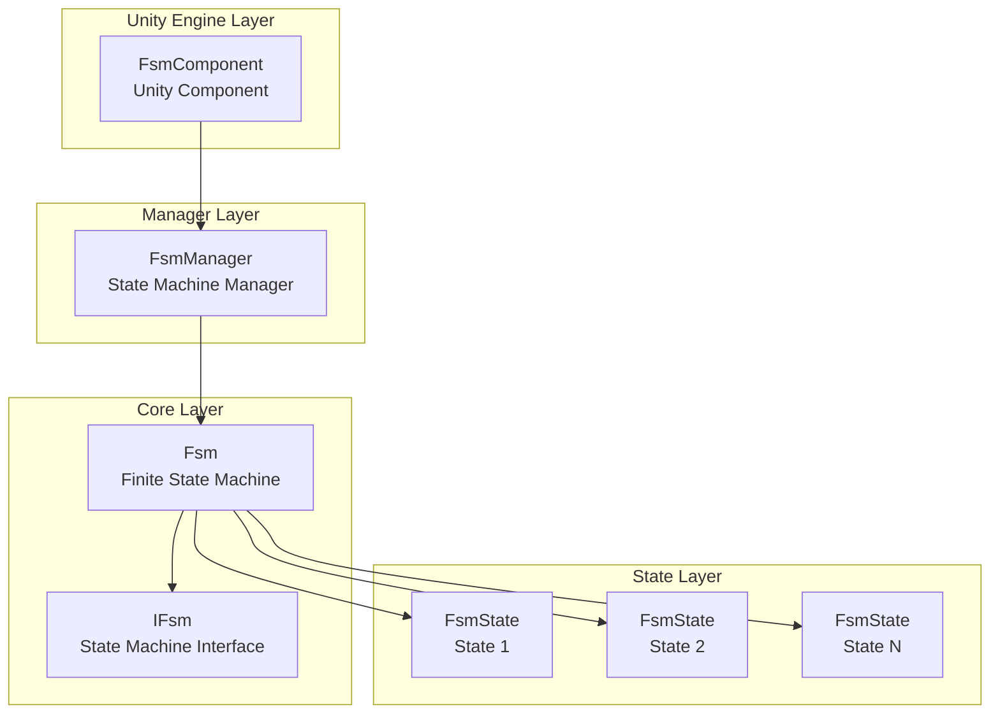
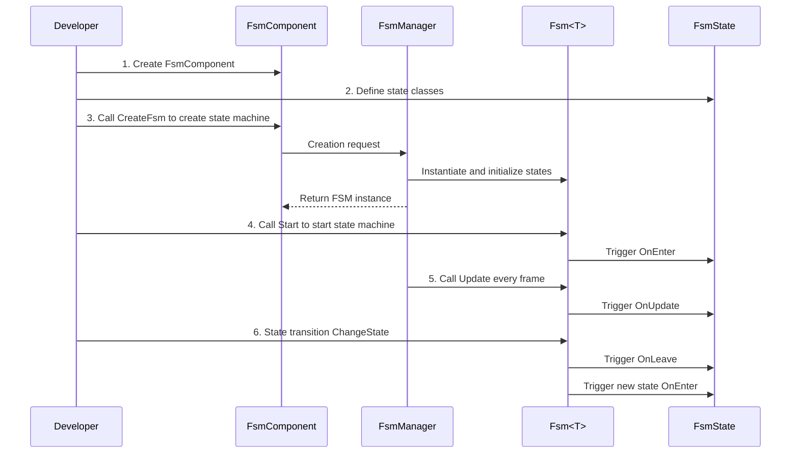

# Getting Started

This guide will help you quickly get started with the GameFrameX FSM finite state machine component. With a few simple steps, you can create and manage finite state machines in your Unity project.

## Overview

GameFrameX FSM is a lightweight but powerful finite state machine system designed for Unity game development. It provides a structured way to manage game object state transitions, particularly suitable for:
- Character behavior state machines (idle, walk, attack, death, etc.)
- UI interface state management
- Game flow control
- AI behavior logic

## Core Concepts

Before starting, understanding these core concepts will be helpful:

| Concept | Description |
|---------|-------------|
| **FsmComponent** | Unity component for managing state machines in the scene |
| **FsmManager** | State machine manager responsible for creating, destroying, and updating all state machines |
| **FsmState<T>** | State base class defining state lifecycle hooks |
| **IFsm<T>** | State machine interface providing state machine operation methods |
| **Owner** | State machine holder, typically a game object or manager class |

## System Architecture



### Component Responsibilities

| Component | Responsibilities |
|-----------|------------------|
| **FsmComponent** | Acts as a Unity component providing FsmManager initialization and Update polling |
| **FsmManager** | Manages all FSM instances, providing creation, retrieval, and destruction methods |
| **Fsm<T>** | Concrete state machine implementation managing state collection and transitions |
| **FsmState<T>** | Defines state callback methods, subclasses implement specific logic |

## Workflow



## Quick Example

### Step 1: Add FsmComponent

Create an empty object in the Unity scene and add the `FsmComponent` component:

```csharp
// FsmComponent is a Unity component, mount it on a GameObject to use
// In Unity Editor: GameObject -> Add Component -> Game Framework -> FSM
```
> Source: [FsmComponent.cs](https://github.com/GameFrameX/com.gameframex.unity.fsm/blob/main/Runtime/Fsm/FsmComponent.cs#L20-L22)

### Step 2: Define State Classes

Create concrete state classes inheriting from `FsmState<T>`:

```csharp
using GameFrameX.Fsm.Runtime;

// Define state machine owner type
public class Player
{
    public string Name;
}

// Idle state
public class IdleState : FsmState<Player>
{
    protected internal override void OnEnter(IFsm<Player> fsm)
    {
        base.OnEnter(fsm);
        UnityEngine.Debug.Log("Player enters idle state");
    }

    protected internal override void OnUpdate(IFsm<Player> fsm, float elapseSeconds, float realElapseSeconds)
    {
        base.OnUpdate(fsm, elapseSeconds, realElapseSeconds);
        // Detect if need to switch to other states
        // For example: detect movement input to switch to walk state
    }

    protected internal override void OnLeave(IFsm<Player> fsm, bool isShutdown)
    {
        base.OnLeave(fsm, isShutdown);
        UnityEngine.Debug.Log("Player leaves idle state");
    }
}

// Walk state
public class RunState : FsmState<Player>
{
    protected internal override void OnEnter(IFsm<Player> fsm)
    {
        base.OnEnter(fsm);
        UnityEngine.Debug.Log("Player enters walk state");
    }

    protected internal override void OnLeave(IFsm<Player> fsm, bool isShutdown)
    {
        base.OnLeave(fsm, isShutdown);
        UnityEngine.Debug.Log("Player leaves walk state");
    }
}
```
> Source: [FsmState.cs](https://github.com/GameFrameX/com.gameframex.unity.fsm/blob/main/Runtime/Fsm/FsmState.cs#L17-L77)

### Step 3: Create and Start State Machine

```csharp
using UnityEngine;
using GameFrameX.Fsm.Runtime;

public class PlayerController : MonoBehaviour
{
    private FsmComponent fsmComponent;
    private IFsm<Player> playerFsm;
    private Player player;

    private void Start()
    {
        // Get FsmComponent
        fsmComponent = GetComponent<FsmComponent>();
        
        // Create player object
        player = new Player { Name = "Hero" };
        
        // Create state machine (using params)
        playerFsm = fsmComponent.CreateFsm(player, 
            new IdleState(), 
            new RunState());
        
        // Start state machine, enter first state
        playerFsm.Start<IdleState>();
    }

    private void Update()
    {
        // State machine is automatically updated by FsmComponent
        // Handle external input here to trigger state transitions
    }

    // Switch to walk state
    public void StartRun()
    {
        ChangeState<RunState>(playerFsm);
    }

    // Switch to idle state
    public void StopRun()
    {
        ChangeState<IdleState>(playerFsm);
    }

    private void OnDestroy()
    {
        // Cleanup state machine when scene is destroyed
        if (fsmComponent != null && playerFsm != null)
        {
            fsmComponent.DestroyFsm(playerFsm);
        }
    }
}
```
> Source: [Fsm.cs](https://github.com/GameFrameX/com.gameframex.unity.fsm/blob/main/Runtime/Fsm/Fsm.cs#L230-L249)

### Step 4: State Transitions Within States

Switch states from within state classes:

```csharp
public class IdleState : FsmState<Player>
{
    protected internal override void OnUpdate(IFsm<Player> fsm, float elapseSeconds, float realElapseSeconds)
    {
        base.OnUpdate(fsm, elapseSeconds, realElapseSeconds);
        
        // Assume there's a method to detect movement input
        if (Input.GetKey(KeyCode.W))
        {
            // Switch to walk state
            ChangeState<RunState>(fsm);
        }
    }
}
```
> Source: [FsmState.cs](https://github.com/GameFrameX/com.gameframex.unity.fsm/blob/main/Runtime/Fsm/FsmState.cs#L84-L93)

## Advanced Usage

### Using Data Storage

FSM provides a key-value pair data storage system for saving and reading data in the state machine:

```csharp
// Set data
playerFsm.SetData("LastAttackTime", 0f);
playerFsm.SetData("Health", 100);

// Read data
float lastAttackTime = playerFsm.GetData<float>("LastAttackTime");
int health = playerFsm.GetData<int>("Health");

// Check if data exists
if (playerFsm.HasData("Health"))
{
    // Data exists
}
```
> Source: [Fsm.cs](https://github.com/GameFrameX/com.gameframex.unity.fsm/blob/main/Runtime/Fsm/Fsm.cs#L390-L481)

### Getting Current State Information

```csharp
// Get current state name
string currentStateName = playerFsm.CurrentStateName;

// Get current state duration
float stateTime = playerFsm.CurrentStateTime;

// Get current state instance
FsmState<Player> currentState = playerFsm.CurrentState;

// Check if state machine is running
bool isRunning = playerFsm.IsRunning;

// Get state count
int stateCount = playerFsm.FsmStateCount;
```
> Source: [Fsm.cs](https://github.com/GameFrameX/com.gameframex.unity.fsm/blob/main/Runtime/Fsm/Fsm.cs#L56-L102)

### State Machine Destruction

```csharp
// Method 1: Destroy via generic type
fsmComponent.DestroyFsm<Player>();

// Method 2: Destroy via instance
fsmComponent.DestroyFsm(playerFsm);

// Method 3: Destroy by name
fsmComponent.DestroyFsm<Player>("MyFsm");
```
> Source: [FsmComponent.cs](https://github.com/GameFrameX/com.gameframex.unity.fsm/blob/main/Runtime/Fsm/FsmComponent.cs#L206-L267)

## Common Example: Character State Machine

Here's a complete example of a typical character state machine:

```csharp
// Character class
public class Character
{
    public string Name;
    public int Health = 100;
}

// State definitions
public class CharacterIdleState : FsmState<Character> { }
public class CharacterWalkState : FsmState<Character> { }
public class CharacterAttackState : FsmState<Character> { }
public class CharacterDeadState : FsmState<Character> { }

// Usage
public class CharacterController : MonoBehaviour
{
    private FsmComponent fsmComponent;
    private IFsm<Character> characterFsm;

    private void Start()
    {
        fsmComponent = GetComponent<FsmComponent>();
        var character = new Character { Name = "Hero" };
        
        // Create state machine with all states
        characterFsm = fsmComponent.CreateFsm(character,
            new CharacterIdleState(),
            new CharacterWalkState(),
            new CharacterAttackState(),
            new CharacterDeadState());
        
        // Start initial state
        characterFsm.Start<CharacterIdleState>();
    }

    private void Update()
    {
        // External control of state transitions
        if (Input.GetKeyDown(KeyCode.W))
            ChangeState<CharacterWalkState>(characterFsm);
        else if (Input.GetKeyDown(KeyCode.J))
            ChangeState<CharacterAttackState>(characterFsm);
        else if (Input.GetKeyDown(KeyCode.K))
            ChangeState<CharacterDeadState>(characterFsm);
    }
}
```
> Source: [FsmComponent.cs](https://github.com/GameFrameX/com.gameframex.unity.fsm/blob/main/Runtime/Fsm/FsmComponent.cs#L156-L204)

## Best Practices

### 1. State Count Control

It's recommended to keep the state count within 5-10 per state machine. If there are too many states, consider splitting them into multiple independent state machines.

### 2. State Transition Logic

- **External transition**: Transition states in MonoBehaviour's Update based on input
- **Internal transition**: Auto-transition in FsmState's OnUpdate based on conditions

### 3. Data Management

Use FSM's data storage feature instead of storing state-related data in MonoBehaviour, which:
- Maintains state logic integrity
- Facilitates data passing during state transitions
- Makes debugging and tracing easier

### 4. Resource Cleanup

Ensure to destroy state machines no longer in use during OnDestroy or scene changes:

```csharp
private void OnDestroy()
{
    if (fsmComponent != null && playerFsm != null)
    {
        fsmComponent.DestroyFsm(playerFsm);
    }
}
```

## Related Links

- [Core Concepts](./04.features.md) - In-depth understanding of FSM core design
- [API Reference](./5-api-reference) - Complete API documentation
- [Installation Guide](./2-installation) - Installation and configuration
- [Overview](./1-overview) - Project overall introduction