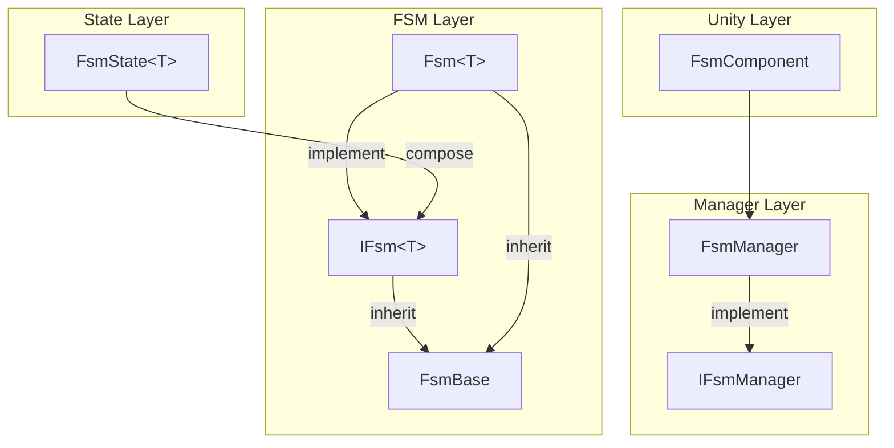
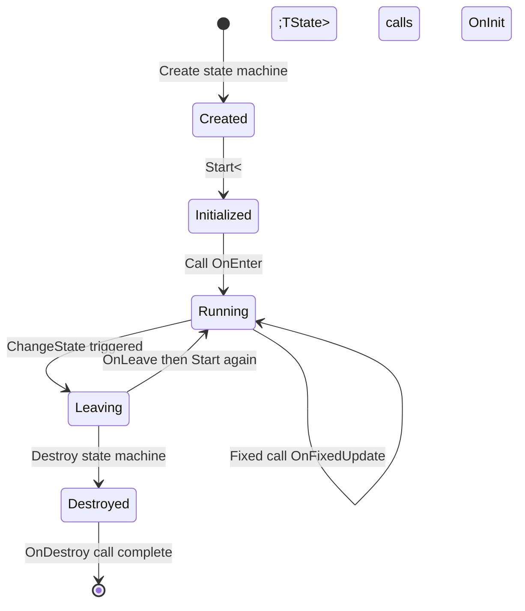
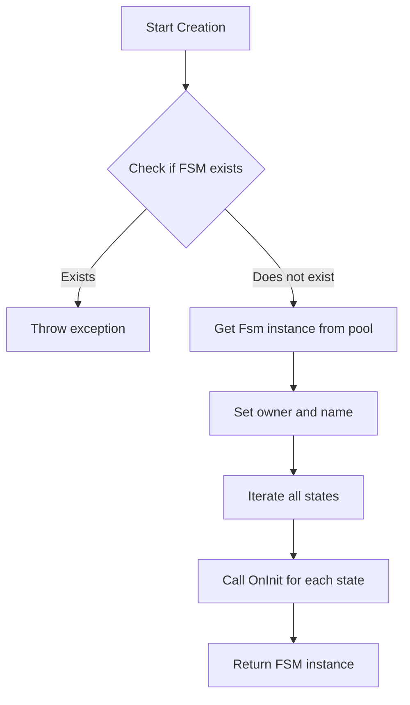

# Core Concepts

This document provides a detailed introduction to the core concepts, architecture design, and key mechanisms of the GameFrameX finite state machine (FSM) component. The FSM component provides robust state management capabilities for Unity game development, supporting state lifecycle management, state transitions, and data storage.

## Overview

A finite state machine (FSM) is a behavioral design pattern that allows an object to switch between a finite number of states. In game development, FSM is widely used in AI behavior management, game flow control, and character state transitions.

GameFrameX FSM component is designed based on Game Framework architecture, providing the following core capabilities:

- **Generic State Machine** - Supports strongly-typed state machine definitions with compile-time type checking
- **State Lifecycle Management** - Complete state initialization, entry, update, exit, and destruction callbacks
- **State Data Storage** - Built-in key-value pair data storage mechanism
- **Object Pool Support** - Automatic memory management and object reuse
- **Unity Component Integration** - Provides FsmComponent for easy use in Unity scenes

## System Architecture

GameFrameX FSM adopts a layered architecture design, from bottom to top: state layer, FSM layer, and manager layer. This layered design ensures responsibility separation and code maintainability.



### Layer Responsibilities

**State Layer (FsmState<T>)** is the concrete implementation base class for states. Developers define concrete states by inheriting from this class, each state implements its own business logic. The state layer defines six lifecycle callback methods for states to respond to various state machine events.

**FSM Layer (IFsm<T> and Fsm<T>)** is the core implementation of the state machine. The IFsm<T> interface defines all operations of the state machine, including state queries, state transitions, and data access. Fsm<T> is the generic implementation of this interface, maintaining runtime data such as state collection, current state, and state duration.

**Manager Layer (IFsmManager and FsmManager)** is responsible for managing the lifecycle of all FSM instances in the system. FsmManager inherits from GameFrameworkModule and serves as a module of the game framework. It maintains references to all FSM instances, responsible for creation, querying, destruction, and polling updates.

## Core Components

### FsmState<T> State Base Class

FsmState<T> is the abstract base class for all concrete states. It defines six lifecycle callback methods for states, which are automatically called by the state machine at appropriate times. Developers only need to override the methods they need without worrying about timing.

```csharp
public abstract class FsmState<T> where T : class
{
    // Called when state is initialized
    protected internal virtual void OnInit(IFsm<T> fsm) { }
    
    // Called when entering state
    protected internal virtual void OnEnter(IFsm<T> fsm) { }
    
    // Called every frame during state update
    protected internal virtual void OnUpdate(IFsm<T> fsm, float elapseSeconds, float realElapseSeconds) { }
    
    // Called during fixed update (physics-related)
    protected internal virtual void OnFixedUpdate(IFsm<T> fsm, float elapseSeconds, float realElapseSeconds) { }
    
    // Called when leaving state
    protected internal virtual void OnLeave(IFsm<T> fsm, bool isShutdown) { }
    
    // Called when state is destroyed
    protected internal virtual void OnDestroy(IFsm<T> fsm) { }
    
    // Transition to other state
    public void ChangeToState<TState>(IFsm<T> fsm) where TState : FsmState<T>
    protected void ChangeState<TState>(IFsm<T> fsm) where TState : FsmState<T>
}
```

> Source: [FsmState.cs](https://github.com/GameFrameX/com.gameframex.unity.fsm/blob/main/Runtime/Fsm/FsmState.cs#L17-L136)

**Design Intent**: Uses the Template Method pattern to define the standard behavior framework for states. Each state only needs to focus on its specific logic, and the state machine is responsible for calling the correct methods at the right times. This design abstracts common state behaviors into the base class, leaving specific behaviors for subclasses to implement.

### IFsm<T> State Machine Interface

IFsm<T> interface defines the complete operation set for state machines. Through the generic parameter T, the state machine can hold any type of object in a type-safe manner.

```csharp
public interface IFsm<T> where T : class
{
    // Properties
    string Name { get; }
    string FullName { get; }
    T Owner { get; }
    int FsmStateCount { get; }
    bool IsRunning { get; }
    bool IsDestroyed { get; }
    FsmState<T> CurrentState { get; }
    float CurrentStateTime { get; }
    
    // Methods
    void Start<TState>() where TState : FsmState<T>;
    void Start(Type stateType);
    bool HasState<TState>() where TState : FsmState<T>;
    TState GetState<TState>() where TState : FsmState<T>;
    FsmState<T>[] GetAllStates();
    bool HasData(string name);
    TData GetData<TData>(string name) where TData : Variable;
    void SetData<TData>(string name, TData data) where TData : Variable;
    bool RemoveData(string name);
}
```

> Source: [IFsm.cs](https://github.com/GameFrameX/com.gameframex.unity.fsm/blob/main/Runtime/Fsm/IFsm.cs#L18-L179)

**Design Intent**: A typical application of the Interface Segregation Principle. Through the IFsm<T> interface, states can obtain full control of the state machine at runtime, including state transitions, data storage, etc. This design allows state classes to fully control state machine behavior.

### FsmManager State Machine Manager

FsmManager is the core manager of the system, responsible for lifecycle management of all FSM instances.

```csharp
public sealed class FsmManager : GameFrameworkModule, IFsmManager
{
    // Create state machine
    public IFsm<T> CreateFsm<T>(T owner, params FsmState<T>[] states) where T : class;
    public IFsm<T> CreateFsm<T>(string name, T owner, params FsmState<T>[] states) where T : class;
    
    // Get state machine
    public IFsm<T> GetFsm<T>() where T : class;
    public IFsm<T> GetFsm<T>(string name) where T : class;
    
    // Check state machine existence
    public bool HasFsm<T>() where T : class;
    
    // Destroy state machine
    public bool DestroyFsm<T>(IFsm<T> fsm) where T : class;
    
    // Polling update
    public void FixedUpdate(float fixedDeltaTime, float fixedTime);
}
```

> Source: [FsmManager.cs](https://github.com/GameFrameX/com.gameframex.unity.fsm/blob/main/Runtime/Fsm/FsmManager.cs#L18-L436)

**Design Intent**: A typical application of the Singleton Manager pattern in game development. FsmManager, as a module of the game framework, automatically participates in the initialization and shutdown process of the game framework. Getting module instances through GameFrameworkEntry ensures the module is globally unique in the system.

### FsmComponent Unity Component

FsmComponent is the Unity engine-facing component wrapper, providing an editor-friendly state machine management approach.

```csharp
[DisallowMultipleComponent]
[AddComponentMenu("Game Framework/FSM")]
public sealed class FsmComponent : GameFrameworkComponent
{
    // All operations delegate to m_FsmManager
    private IFsmManager m_FsmManager = null;
    
    protected override void Awake()
    {
        base.Awake();
        m_FsmManager = GameFrameworkEntry.GetModule<IFsmManager>();
    }
    
    private void FixedUpdate()
    {
        m_FsmManager.FixedUpdate(Time.fixedDeltaTime, Time.fixedTime);
    }
}
```

> Source: [FsmComponent.cs](https://github.com/GameFrameX/com.gameframex.unity.fsm/blob/main/Runtime/Fsm/FsmComponent.cs#L22-L53)

**Design Intent**: An embodiment of the Adapter pattern. FsmComponent adapts the underlying FsmManager functionality to Unity component form, allowing developers to directly add and manage state machine components in the Unity Editor without writing initialization code manually.

## State Lifecycle

Understanding the six lifecycle callbacks of states is key to correctly using FSM. Each callback has its specific design purpose and timing.



### Lifecycle Details

**OnInit - Initialization Stage**

When the state machine is created, OnInit is called once for all states. At this time, the state machine has not started yet, and the current state is null. This stage is suitable for static state initialization, such as caching references to other states.

```csharp
protected internal override void OnInit(IFsm<Character> fsm)
{
    // Cache resident state references
    var idleState = fsm.GetState<IdleState>();
    var runState = fsm.GetState<RunState>();
    // ...
}
```

**OnEnter - Entry Stage**

Called when a state is set as the current state. Called after state transition is complete and before the new state starts executing. Suitable for state entry logic, such as playing animations, setting parameters, etc.

```csharp
protected internal override void OnEnter(IFsm<Character> fsm)
{
    // Play entry animation
    Owner.PlayAnimation("Idle");
    // Reset state data
    fsm.SetData("AttackCount", 0);
}
```

**OnUpdate - Update Stage**

Called once per frame, receiving logic elapsed time (elapseSeconds) and real elapsed time (realElapseSeconds). Suitable for per-frame logic, such as input detection, AI decisions, etc.

```csharp
protected internal override void OnUpdate(IFsm<Character> fsm, float elapseSeconds, float realElapseSeconds)
{
    // Detect if need to switch states
    if (fsm.GetData<bool>("IsHurt"))
    {
        ChangeState<HurtState>(fsm);
    }
}
```

**OnFixedUpdate - Fixed Update Stage**

Similar to OnUpdate but called at fixed time intervals, suitable for physics-related logic.

**OnLeave - Exit Stage**

Called when a state is about to leave. The parameter isShutdown indicates whether it's a normal state transition (false) or state machine shutdown (true). Suitable for cleanup work, such as stopping animations, saving state, etc.

```csharp
protected internal override void OnLeave(IFsm<Character> fsm, bool isShutdown)
{
    // Save state data
    var attackCount = fsm.GetData<int>("AttackCount");
    // Stop current animation
    Owner.StopAnimation();
}
```

**OnDestroy - Destruction Stage**

Called when the state machine is destroyed. This is the last lifecycle callback for states, suitable for final cleanup work, releasing all resources.

## State Transition Mechanism

State transition is the core functionality of FSM. FsmState<T> provides three ways to switch states, applicable to different usage scenarios.

```mermaid
sequenceDiagram
    participant StateA as Current State
    participant FSM as Fsm<T>
    participant StateB as Target State
    
    StateA->>FSM: OnUpdate detects transition condition
    StateA->>FSM: ChangeState&lt;TargetState&gt;(fsm)
    FSM->>StateA: OnLeave(this, false)
    FSM->>FSM: Reset CurrentStateTime
    FSM->>FSM: Update CurrentState
    FSM->>StateB: OnEnter(this)
```

### State Transition Methods

**Public Method (exposed to external callers)**

```csharp
// Called within FsmState
public void ChangeToState<TState>(IFsm<T> fsm) where TState : FsmState<T>
```

> Source: [FsmState.cs](https://github.com/GameFrameX/com.gameframex.unity.fsm/blob/main/Runtime/Fsm/FsmState.cs#L84-L93)

This method allows triggering state transitions from within a state. It first calls the old state's OnLeave method, then updates the current state reference, and finally calls the new state's OnEnter method.

**Protected Method (for subclasses to call)**

```csharp
// For subclasses to call in OnUpdate, etc.
protected void ChangeState<TState>(IFsm<T> fsm) where TState : FsmState<T>
```

This is the most commonly used state switching method. Developers typically detect transition conditions in OnUpdate and then call this method to switch to the next state.

**Type Parameter Method**

```csharp
// Switch state via Type object
protected void ChangeState(IFsm<T> fsm, Type stateType)
```

Applicable to scenarios where the target state type needs to be determined dynamically, such as selecting states based on configuration tables or runtime data.

## State Data Storage

FSM provides a built-in key-value pair data storage mechanism, allowing data sharing between state machines and states. This design avoids using global variables or additional data passing mechanisms.

### Data Storage Interface

```csharp
// Check if data exists
bool HasData(string name);

// Get data
TData GetData<TData>(string name) where TData : Variable;
Variable GetData(string name);

// Set data
void SetData<TData>(string name, TData data) where TData : Variable;
void SetData(string name, Variable data);

// Remove data
bool RemoveData(string name);
```

> Source: [IFsm.cs](https://github.com/GameFrameX/com.gameframex.unity.fsm/blob/main/Runtime/Fsm/IFsm.cs#L136-L178)

### Usage Example

```csharp
// Store data
fsm.SetData("Score", new Variable<int>(100));
fsm.SetData("PlayerName", new Variable<string>("Hero"));

// Read data
var score = fsm.GetData<Variable<int>>("Score");
var playerName = fsm.GetData<Variable<string>>("PlayerName");

// Check existence
if (fsm.HasData("Power"))
{
    var power = fsm.GetData<Variable<int>>("Power");
}
```

**Design Intent**: Uses Variable to wrap primitive types, enabling more flexible data storage. Through ReferencePool, data objects can be recycled after use, reducing garbage collection pressure.

## State Machine Creation Flow

Creating a state machine is the first step in using FSM. Understanding the creation flow helps correctly initialize the state machine.



### Creation Code Example

```csharp
// Method 1: Without specifying name
IFsm<Character> fsm = FsmManager.Instance.CreateFsm(character,
    new IdleState(),
    new RunState(),
    new JumpState(),
    new AttackState());

// Method 2: Specify name (for multiple FSMs of same type)
IFsm<Character> fsm = FsmManager.Instance.CreateFsm("PlayerFSM", character,
    new IdleState(),
    new RunState(),
    new JumpState(),
    new AttackState());

// Method 3: Using List
var states = new List<FsmState<Character>>
{
    new IdleState(),
    new RunState(),
    new JumpState()
};
IFsm<Character> fsm = FsmManager.Instance.CreateFsm(character, states);

// Start state machine
fsm.Start<IdleState>();
```

> Source: [FsmManager.cs](https://github.com/GameFrameX/com.gameframex.unity.fsm/blob/main/Runtime/Fsm/FsmManager.cs#L268-L325)

**Important Note**: At least one state must be added when creating a state machine, otherwise an exception will be thrown. The state machine needs to explicitly call the Start method to start after creation.

## Memory Management

GameFrameX FSM component uses object pool technology for memory optimization, reducing garbage collection pressure during game runtime.

### Object Pool Mechanism

Both FSM instances and state data are managed through ReferencePool:

```csharp
// Get from pool when creating
Fsm<T> fsm = ReferencePool.Acquire<Fsm<T>>();

// Return to pool when destroying
internal override void Shutdown()
{
    ReferencePool.Release(this);
}
```

> Source: [Fsm.cs](https://github.com/GameFrameX/com.gameframex.unity.fsm/blob/main/Runtime/Fsm/Fsm.cs#L123-L145)

### Cleanup Flow

```csharp
public void Clear()
{
    // 1. Call OnLeave for current state (shutdown = true)
    if (m_CurrentState != null)
    {
        m_CurrentState.OnLeave(this, true);
    }
    
    // 2. Call OnDestroy for all states
    foreach (KeyValuePair<Type, FsmState<T>> state in m_States)
    {
        state.Value.OnDestroy(this);
    }
    
    // 3. Clear data (return to pool)
    if (m_Datas != null)
    {
        foreach (KeyValuePair<string, Variable> data in m_Datas)
        {
            ReferencePool.Release(data.Value);
        }
    }
    
    // 4. Release FSM instance to pool
    ReferencePool.Release(this);
}
```

> Source: [Fsm.cs](https://github.com/GameFrameX/com.gameframex.unity.fsm/blob/main/Runtime/Fsm/Fsm.cs#L193-L227)

**Design Intent**: Proper resource cleanup is crucial for long-running games. FSM calls destruction callbacks for all states during cleanup, ensuring resources are correctly released. At the same time, object pooling reuses objects, avoiding frequent memory allocation and garbage collection.

## Use Cases and Best Practices

### Typical Use Cases

**Character AI State Management**

The most typical application of FSM is character AI behavior control. Each behavior state (idle, patrol, chase, attack, retreat, etc.) corresponds to an FsmState subclass. The state machine is responsible for managing transition logic between states.

```csharp
// Character state machine example
public class CharacterAI : MonoBehaviour
{
    private IFsm<Character> _fsm;
    
    void Start()
    {
        _fsm = FsmManager.Instance.CreateFsm(this,
            new IdleState(),
            new PatrolState(),
            new ChaseState(),
            new AttackState());
        _fsm.Start<IdleState>();
    }
    
    void Update()
    {
        // FsmManager automatically calls Update
    }
}
```

**Game Flow Control**

FSM can also manage overall game flow, such as state transitions between main menu, game start, pause, and settlement.

**UI Interface State Management**

Complex UI interfaces can use FSM to manage different display states, ensuring orderly state transitions.

### Best Practices

**1. State Count Control**

It's recommended to keep the state count within 10 per FSM. If there are too many states, consider splitting into multiple FSMs.

**2. Single State Responsibility**

Each state should only be responsible for one type of behavior logic. Complex logic should be decomposed into multiple states.

**3. Avoid Heavy Computation in OnUpdate**

OnUpdate is called every frame and should remain lightweight. Complex computations should be arranged at other times.

**4. Correctly Implement State Transition Conditions**

State transition conditions should be clear and unambiguous, avoiding state uncertainty issues caused by overlapping conditions.

**5. Destroy Unused FSMs in Time**

When a state machine is no longer needed, call DestroyFsm to release resources.

```csharp
// Destroy state machine
FsmManager.Instance.DestroyFsm(fsm);
```

## Related Links

- [Getting Started](./3-getting-started) - Quick start with FSM component
- [API Reference](./5-api-reference) - Complete API documentation
- [Installation Guide](./2-installation) - Install and configure FSM component
- [Troubleshooting](./6-troubleshooting) - FAQ