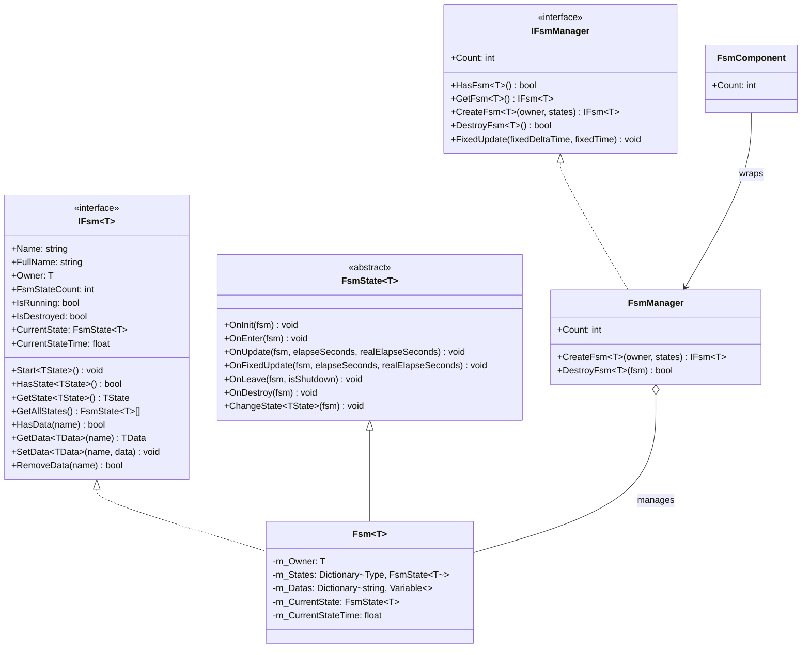

# API Reference

This document provides a detailed listing of the complete API interfaces, classes, and methods of the GameFrameX Unity FSM finite state machine system.

## Overview

The FSM (finite state machine) module provides fully-featured game state management capabilities, supporting:
- Generic type-safe finite state machine implementation
- State lifecycle management (initialization, entry, update, exit, destruction)
- Data sharing mechanism between states
- Unity component integration

## Core Interfaces

### IFsm<T>

Finite state machine interface defining core operations of the state machine.

> Source: [IFsm.cs](https://github.com/GameFrameX/com.gameframex.unity.fsm/blob/main/Runtime/Fsm/IFsm.cs#L18-L179)

#### Properties

| Property | Type | Description |
|----------|------|-------------|
| `Name` | `string` | Gets the finite state machine name |
| `FullName` | `string` | Gets the full name of the finite state machine (includes owner type and name) |
| `Owner` | `T` | Gets the owner object of the finite state machine |
| `FsmStateCount` | `int` | Gets the number of states in the finite state machine |
| `IsRunning` | `bool` | Gets whether the finite state machine is running |
| `IsDestroyed` | `bool` | Gets whether the finite state machine has been destroyed |
| `CurrentState` | `FsmState<T>` | Gets the current finite state machine state |
| `CurrentStateTime` | `float` | Gets the time the current state has been running (in seconds) |

#### Methods

**Start**

```csharp
void Start<TState>() where TState : FsmState<T>
void Start(Type stateType)
```

Start the finite state machine and enter the specified state.

**HasState**

```csharp
bool HasState<TState>() where TState : FsmState<T>
bool HasState(Type stateType)
```

Check if the specified state exists.

**GetState**

```csharp
TState GetState<TState>() where TState : FsmState<T>
FsmState<T> GetState(Type stateType)
```

Get the state instance of the specified type.

**GetAllStates**

```csharp
FsmState<T>[] GetAllStates()
void GetAllStates(List<FsmState<T>> results)
```

Get all states of the finite state machine.

**Data Operations**

```csharp
bool HasData(string name)
TData GetData<TData>(string name) where TData : Variable
Variable GetData(string name)
void SetData<TData>(string name, TData data) where TData : Variable
void SetData(string name, Variable data)
bool RemoveData(string name)
```

Internal data access operations for the state machine, supporting generic typed data storage.

---

### IFsmManager

Finite state machine manager interface responsible for managing all finite state machine instances.

> Source: [IFsmManager.cs](https://github.com/GameFrameX/com.gameframex.unity.fsm/blob/main/Runtime/Fsm/IFsmManager.cs#L16-L184)

#### Properties

| Property | Type | Description |
|----------|------|-------------|
| `Count` | `int` | Gets the number of finite state machines currently managed |

#### Methods

**HasFsm**

```csharp
bool HasFsm<T>() where T : class
bool HasFsm(Type ownerType)
bool HasFsm<T>(string name) where T : class
bool HasFsm(Type ownerType, string name)
```

Check if the specified finite state machine exists.

**GetFsm**

```csharp
IFsm<T> GetFsm<T>() where T : class
FsmBase GetFsm(Type ownerType)
IFsm<T> GetFsm<T>(string name) where T : class
FsmBase GetFsm(Type ownerType, string name)
```

Get the specified finite state machine instance.

**GetAllFsms**

```csharp
FsmBase[] GetAllFsms()
void GetAllFsms(List<FsmBase> results)
```

Get all finite state machines.

**CreateFsm**

```csharp
IFsm<T> CreateFsm<T>(T owner, params FsmState<T>[] states) where T : class
IFsm<T> CreateFsm<T>(string name, T owner, params FsmState<T>[] states) where T : class
IFsm<T> CreateFsm<T>(T owner, List<FsmState<T>> states) where T : class
IFsm<T> CreateFsm<T>(string name, T owner, List<FsmState<T>> states) where T : class
```

Create a new finite state machine.

**DestroyFsm**

```csharp
bool DestroyFsm<T>() where T : class
bool DestroyFsm(Type ownerType)
bool DestroyFsm<T>(string name) where T : class
bool DestroyFsm(Type ownerType, string name)
bool DestroyFsm<T>(IFsm<T> fsm) where T : class
bool DestroyFsm(FsmBase fsm)
```

Destroy the specified finite state machine.

**FixedUpdate**

```csharp
void FixedUpdate(float fixedDeltaTime, float fixedTime)
```

Poll all finite state machines for fixed updates.

---

## Core Classes

### FsmState<T>

Base class for finite state machine states. Inherit this class to create concrete state implementations.

> Source: [FsmState.cs](https://github.com/GameFrameX/com.gameframex.unity.fsm/blob/main/Runtime/Fsm/FsmState.cs#L17-L136)

#### Lifecycle Methods

```csharp
protected internal virtual void OnInit(IFsm<T> fsm)
```

Called when state is initialized. Used for initializing state-related data.

```csharp
protected internal virtual void OnEnter(IFsm<T> fsm)
```

Called when entering state. Used for executing state entry initialization logic.

```csharp
protected internal virtual void OnUpdate(IFsm<T> fsm, float elapseSeconds, float realElapseSeconds)
```

Called during state polling. Executed every frame for state logic updates.

- `elapseSeconds`: Logic elapsed time
- `realElapseSeconds`: Real elapsed time

```csharp
protected internal virtual void OnFixedUpdate(IFsm<T> fsm, float elapseSeconds, float realElapseSeconds)
```

Called during state fixed polling. Uses fixed timestep for updates.

```csharp
protected internal virtual void OnLeave(IFsm<T> fsm, bool isShutdown)
```

Called when leaving state.

- `isShutdown`: Whether triggered when shutting down the entire state machine

```csharp
protected internal virtual void OnDestroy(IFsm<T> fsm)
```

Called when state is destroyed. Used for resource cleanup.

#### State Transition Methods

```csharp
public void ChangeToState<TState>(IFsm<T> fsm) where TState : FsmState<T>
protected void ChangeState<TState>(IFsm<T> fsm) where TState : FsmState<T>
protected void ChangeState(IFsm<T> fsm, Type stateType)
```

Transition to the specified state.

---

### FsmComponent

Unity component integrating the state machine manager into Unity scenes.

> Source: [FsmComponent.cs](https://github.com/GameFrameX/com.gameframex.unity.fsm/blob/main/Runtime/Fsm/FsmComponent.cs#L22-L268)

FsmComponent is a Unity GameObject component providing the same API interface as IFsmManager, usable directly in the Unity Editor.

#### Properties

| Property | Type | Description |
|----------|------|-------------|
| `Count` | `int` | Gets the number of finite state machines currently managed |

#### Methods

FsmComponent provides a set of methods fully consistent with IFsmManager:

- `HasFsm<T>()`, `HasFsm(Type)`, `HasFsm<T>(string)`, `HasFsm(Type, string)`
- `GetFsm<T>()`, `GetFsm(Type)`, `GetFsm<T>(string)`, `GetFsm(Type, string)`
- `GetAllFsmList()`, `GetAllFsmList(List<FsmBase>)`
- `CreateFsm<T>(T, params FsmState<T>[])`, `CreateFsm<T>(string, T, params FsmState<T>[])`
- `CreateFsm<T>(T, List<FsmState<T>>)`, `CreateFsm<T>(string, T, List<FsmState<T>>)`
- `DestroyFsm<T>()`, `DestroyFsm(Type)`, `DestroyFsm<T>(string)`, `DestroyFsm(Type, string)`
- `DestroyFsm<T>(IFsm<T>)`, `DestroyFsm(FsmBase)`

---

## Data Types

### Variable

Base class for data used in finite state machines.

> Source: [IFsm.cs](https://github.com/GameFrameX/com.gameframex.unity.fsm/blob/main/Runtime/Fsm/IFsm.cs#L148-L171)

The state machine supports storing any data type inheriting from `Variable`:

```csharp
void SetData<TData>(string name, TData data) where TData : Variable
TData GetData<TData>(string name) where TData : Variable
```

---

## Architecture Diagram



---

## Usage Examples

### Creating State Machine

Create a state machine through FsmComponent:

```csharp
public class Character : MonoBehaviour
{
    private IFsm<Character> _fsm;
    
    private void Start()
    {
        var fsmComponent = GetComponent<FsmComponent>();
        _fsmComponent = fsmComponent.CreateFsm<Character>(this,
            new IdleState(),
            new RunState(),
            new JumpState());
        _fsm.Start<IdleState>();
    }
    
    private void Update()
    {
        // State machine is automatically updated in FsmComponent
    }
}
```

> Source: [FsmComponent.cs](https://github.com/GameFrameX/com.gameframex.unity.fsm/blob/main/Runtime/Fsm/FsmComponent.cs#L163-L166)

### Defining States

Create custom state classes:

```csharp
public class IdleState : FsmState<Character>
{
    protected internal override void OnEnter(IFsm<Character> fsm)
    {
        // Enter idle state
    }
    
    protected internal override void OnUpdate(IFsm<Character> fsm, float elapseSeconds, float realElapseSeconds)
    {
        // Detect if need to switch states
        if (Input.GetKeyDown(KeyCode.Space))
        {
            ChangeState<JumpState>(fsm);
        }
    }
    
    protected internal override void OnLeave(IFsm<Character> fsm, bool isShutdown)
    {
        // Leave idle state
    }
}
```

> Source: [FsmState.cs](https://github.com/GameFrameX/com.gameframex.unity.fsm/blob/main/Runtime/Fsm/FsmState.cs#L38-L69)

### Data Sharing

Share data between states:

```csharp
// Set data in some state
fsm.SetData("health", new VarInt(100));
fsm.SetData("score", new VarInt(0));

// Read data in another state
VarInt health = fsm.GetData<VarInt>("health");
int currentHealth = health.Value;
```

> Source: [Fsm.cs](https://github.com/GameFrameX/com.gameframex.unity.fsm/blob/main/Runtime/Fsm/Fsm.cs#L452-L481)

---

## Related Links

- [Overview](./1-overview) - Finite state machine system overview
- [Installation](./2-installation) - Installation and configuration guide
- [Getting Started](./3-getting-started) - Quick start tutorial
- [Core Concepts](./04.features.md) - Core concepts details
- [Troubleshooting](./6-troubleshooting) - FAQ