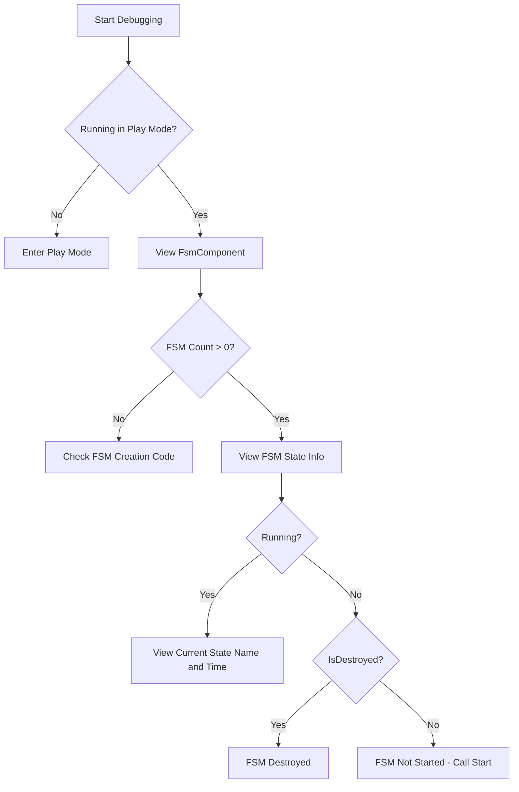

# Troubleshooting

This document collects common errors and their solutions when using the GameFrameX Unity FSM finite state machine component.

## Overview

The FSM (finite state machine) component is one of the core modules of the GameFrameX framework, used for managing and controlling game object state transitions. During use, developers may encounter various errors and issues. This document aims to provide diagnostic methods and solutions for these common problems.

## General Errors

### 1. FSM Manager Not Initialized

**Error Message:**
```
FSM manager is invalid.
```

**Root Cause:**
This error indicates that `FsmComponent` cannot retrieve the `IFsmManager` module from `GameFrameworkEntry`. This is usually because the Game Framework core component is not correctly initialized.

**Solution:**

1. Ensure `FsmComponent` is added to the scene:
```csharp
// In Unity Editor, add via Game Framework menu
// Game Framework -> Add Component -> Fsm
```

2. Ensure Game Framework core components are correctly initialized. FsmManager is automatically retrieved in FsmComponent's `Awake` method:
```csharp
// Source: Runtime/Fsm/FsmComponent.cs
protected override void Awake()
{
    ImplementationComponentType = Utility.Assembly.GetType(componentType);
    InterfaceComponentType = typeof(IFsmManager);
    base.Awake();
    m_FsmManager = GameFrameworkEntry.GetModule<IFsmManager>();
    if (m_FsmManager == null)
    {
        Log.Fatal("FSM manager is invalid.");
        return;
    }
}
```

> Source: [FsmComponent.cs](https://github.com/GameFrameX/com.gameframex.unity.fsm/blob/main/Runtime/Fsm/FsmComponent.cs#L37-L48)

---

### 2. Owner is Null When Creating FSM

**Error Message:**
```
FSM owner is invalid.
```

**Root Cause:**
When creating a finite state machine, `null` was passed as the owner parameter. FSM must have a valid owner object.

**Solution:**

Ensure a valid owner object is passed when creating FSM:

```csharp
// Incorrect example
IFsm<MyCharacter> fsm = fsmComponent.CreateFsm<MyCharacter>(null, states);

// Correct example
MyCharacter character = GetComponent<MyCharacter>();
IFsm<MyCharacter> fsm = fsmComponent.CreateFsm(character, states);
```

> Source: [Fsm.cs](https://github.com/GameFrameX/com.gameframex.unity.fsm/blob/main/Runtime/Fsm/Fsm.cs#L113-L116)

---

### 3. State Array Invalid

**Error Message:**
```
FSM states is invalid.
```

**Root Cause:**
When creating FSM, the state array is `null` or has length 0. FSM requires at least one state.

**Solution:**

Ensure at least one valid state is provided when creating FSM:

```csharp
// Incorrect example - empty state array
IFsm<MyCharacter> fsm = fsmComponent.CreateFsm(character);

// Correct example - at least one state
IFsm<MyCharacter> fsm = fsmComponent.CreateFsm(character, 
    new IdleState(), 
    new MoveState()
);
```

> Source: [Fsm.cs](https://github.com/GameFrameX/com.gameframex.unity.fsm/blob/main/Runtime/Fsm/Fsm.cs#L118-L121)

---

### 4. Duplicate State Type

**Error Message:**
```
FSM 'TypeNamePair' state 'StateType' is already exist.
```

**Root Cause:**
When creating FSM, attempting to add two states of the same type. Each state type can only exist once in the same FSM.

**Solution:**

Ensure each state type is added only once:

```csharp
// Incorrect example - adding duplicate state type
IFsm<MyCharacter> fsm = fsmComponent.CreateFsm(character,
    new IdleState(),  // First addition
    new IdleState()   // Duplicate addition - ERROR!
);

// Correct example - each state type added only once
IFsm<MyCharacter> fsm = fsmComponent.CreateFsm(character,
    new IdleState(),
    new MoveState(),
    new AttackState()
);
```

> Source: [Fsm.cs](https://github.com/GameFrameX/com.gameframex.unity.fsm/blob/main/Runtime/Fsm/Fsm.cs#L135-L138)

---

## State Machine Runtime Errors

### 5. FSM Already Running

**Error Message:**
```
FSM is running, can not start again.
```

**Root Cause:**
Attempting to start an FSM that is already running. FSM does not allow calling the `Start` method multiple times during operation.

**Solution:**

1. Check if FSM is already running before starting:
```csharp
IFsm<MyCharacter> fsm = fsmComponent.GetFsm<MyCharacter>();
if (fsm != null && !fsm.IsRunning)
{
    fsm.Start<IdleState>();
}
```

2. If restart is needed, destroy existing FSM first:
```csharp
// Destroy existing FSM
fsmComponent.DestroyFsm<MyCharacter>();
// Recreate
IFsm<MyCharacter> fsm = fsmComponent.CreateFsm(character, new IdleState());
fsm.Start<IdleState>();
```

> Source: [Fsm.cs](https://github.com/GameFrameX/com.gameframex.unity.fsm/blob/main/Runtime/Fsm/Fsm.cs#L235-L238)

---

### 6. State Does Not Exist

**Error Message:**
```
FSM 'TypeNamePair' can not start state 'StateType' which is not exist.
```

**Root Cause:**
Attempting to start or transition to a non-existent state. The state was not added to the FSM's state list when creating FSM.

**Solution:**

1. Ensure the state to start/switch to is added when creating FSM:
```csharp
// Add all required states when creating FSM
IFsm<MyCharacter> fsm = fsmComponent.CreateFsm(character,
    new IdleState(),
    new MoveState(),
    new AttackState()
);

// Start existing state
fsm.Start<IdleState>();

// Switch to existing state - correct
fsm.GetState<AttackState>().ChangeToState<MoveState>(fsm);
```

2. Check if state exists before transitioning:
```csharp
if (fsm.HasState<MoveState>())
{
    fsm.GetState<AttackState>().ChangeToState<MoveState>(fsm);
}
```

> Source: [Fsm.cs](https://github.com/GameFrameX/com.gameframex.unity.fsm/blob/main/Runtime/Fsm/Fsm.cs#L241-L244)

---

### 7. Invalid State Type

**Error Message:**
```
State type 'StateType' is invalid.
```

**Root Cause:**
The passed state type is not a valid `FsmState<T>` derived class.

**Solution:**

Ensure the state class inherits from `FsmState<T>`:

```csharp
// Incorrect example - regular class cannot be a state
public class MyClass { }

// Correct example - must inherit FsmState<T>
public class IdleState : FsmState<MyCharacter>
{
    protected internal override void OnEnter(IFsm<MyCharacter> fsm)
    {
        // Enter state logic
    }
    
    protected internal override void OnUpdate(IFsm<MyCharacter> fsm, float elapseSeconds, float realElapseSeconds)
    {
        // State update logic
    }
    
    protected internal override void OnLeave(IFsm<MyCharacter> fsm, bool isShutdown)
    {
        // Leave state logic
    }
}
```

> Source: [Fsm.cs](https://github.com/GameFrameX/com.gameframex.unity.fsm/blob/main/Runtime/Fsm/Fsm.cs#L267-L270)

---

### 8. Current State Invalid, Cannot Transition

**Error Message:**
```
Current state is invalid.
```

**Root Cause:**
Attempting to transition states when FSM has not started or has been destroyed.

**Solution:**

Ensure FSM is running before transitioning:

```csharp
// Incorrect example - trying to transition before FSM starts
IFsm<MyCharacter> fsm = fsmComponent.CreateFsm(character,
    new IdleState(),
    new MoveState()
);
// Trying to transition without calling Start - ERROR!
fsm.GetState<IdleState>().ChangeToState<MoveState>(fsm);

// Correct example - start FSM first
IFsm<MyCharacter> fsm = fsmComponent.CreateFsm(character,
    new IdleState(),
    new MoveState()
);
fsm.Start<IdleState>();  // Start first

// Then transition from within state
protected internal override void OnUpdate(IFsm<MyCharacter> fsm, float elapseSeconds, float realElapseSeconds)
{
    if (shouldMove)
    {
        ChangeState<MoveState>(fsm);  // Correct: transition from within state
    }
}
```

> Source: [Fsm.cs](https://github.com/GameFrameX/com.gameframex.unity.fsm/blob/main/Runtime/Fsm/Fsm.cs#L558-L567)

---

## Data Management Errors

### 9. Creating FSM with Same Name Already Exists

**Error Message:**
```
Already exist FSM 'TypeNamePair'.
```

**Root Cause:**
Attempting to create an FSM that already exists (same owner type and name).

**Solution:**

1. Check if FSM exists before creating:
```csharp
if (!fsmComponent.HasFsm<MyCharacter>())
{
    IFsm<MyCharacter> fsm = fsmComponent.CreateFsm(character,
        new IdleState(),
        new MoveState()
    );
}
```

2. Or destroy existing FSM first:
```csharp
fsmComponent.DestroyFsm<MyCharacter>();
IFsm<MyCharacter> fsm = fsmComponent.CreateFsm(character,
    new IdleState(),
    new MoveState()
);
```

> Source: [FsmManager.cs](https://github.com/GameFrameX/com.gameframex.unity.fsm/blob/main/Runtime/Fsm/FsmManager.cs#L284-L287)

---

### 10. Invalid Data Name

**Error Message:**
```
Data name is invalid.
```

**Root Cause:**
Using `null` or empty string as FSM data key.

**Solution:**

Always use valid strings as data keys:

```csharp
// Incorrect example
fsm.SetData<string>(null, "value");
fsm.SetData<string>("", "value");

// Correct example
fsm.SetData<string>("health", 100);
fsm.SetData<float>("speed", 5.0f);
```

> Source: [Fsm.cs](https://github.com/GameFrameX/com.gameframex.unity.fsm/blob/main/Runtime/Fsm/Fsm.cs#L396-L399)

---

### 11. Invalid Results Parameter

**Error Message:**
```
Results is invalid.
```

**Root Cause:**
Passing `null` as the variable list parameter for storing results.

**Solution:**

Ensure a valid list object is passed:

```csharp
// Incorrect example
List<FsmBase> fsms = null;
fsmComponent.GetAllFsmList(fsms);

// Correct example
List<FsmBase> fsms = new List<FsmBase>();
fsmComponent.GetAllFsmList(fsms);
```

> Source: [Fsm.cs](https://github.com/GameFrameX/com.gameframex.unity.fsm/blob/main/Runtime/Fsm/Fsm.cs#L377-L380)

---

## Unity Editor Related Issues

### 12. FsmComponent Not Displaying in Editor

**Problem Description:**
Added FsmComponent in Unity Editor but cannot see FSM information in the Inspector panel.

**Root Cause:**
`FsmComponentInspector` only displays information at runtime and must be on a GameObject in the hierarchy.

**Solution:**

1. Ensure viewing in **Play Mode**:
```csharp
// Source: Editor/Inspector/FsmComponentInspector.cs
public override void OnInspectorGUI()
{
    if (!EditorApplication.isPlaying)
    {
        EditorGUILayout.HelpBox("Available during runtime only.", MessageType.Info);
        return;
    }
    // ...
}
```

2. Ensure FsmComponent is attached to a GameObject in the scene, not a prefab:
```csharp
// Inspector checks if GameObject is in hierarchy
if (IsPrefabInHierarchy(t.gameObject))
{
    // Display FSM information
}
```

> Source: [FsmComponentInspector.cs](https://github.com/GameFrameX/com.gameframex.unity.fsm/blob/main/Editor/Inspector/FsmComponentInspector.cs#L21-L25)

---

## Debugging Tips

### Using FsmComponentInspector to View FSM State

In Unity Editor's play mode, you can view real-time state of all FSMs:

1. Add `FsmComponent` component to the scene
2. Enter play mode
3. Select the GameObject with `FsmComponent`
4. View FSM count and each FSM's state in the Inspector



### Common FSM State Descriptions

| Property | Description |
|----------|-------------|
| `IsRunning` | Whether FSM is running (Start called) |
| `IsDestroyed` | Whether FSM has been destroyed |
| `CurrentStateName` | Full type name of current state |
| `CurrentStateTime` | Time current state has been running (seconds) |

---

## Best Practices

### 1. Always Check FSM Exists Before Operations

```csharp
// Recommended approach
if (fsmComponent.HasFsm<MyCharacter>())
{
    var fsm = fsmComponent.GetFsm<MyCharacter>();
    // Operate FSM
}
```

### 2. Correctly Manage FSM Lifecycle

```csharp
// Create
IFsm<MyCharacter> fsm = fsmComponent.CreateFsm(owner, states);
fsm.Start<IdleState>();

// Use
// ... game logic ...

// Destroy
fsmComponent.DestroyFsm(fsm);
```

### 3. Use FsmState Built-in Methods to Transition States

```csharp
// Recommended: use protected methods within state class
protected internal override void OnUpdate(IFsm<MyCharacter> fsm, float elapseSeconds, float realElapseSeconds)
{
    // Use protected ChangeState method
    if (someCondition)
    {
        ChangeState<NextState>(fsm);
    }
}
```

---

## Related Links

- [Overview](./1-overview) - FSM component overview
- [Installation](./2-installation) - Installation and configuration
- [Getting Started](./3-getting-started) - Quick start guide
- [Core Concepts](./04.features.md) - Core concepts details
- [API Reference](./5-api-reference) - Complete API documentation