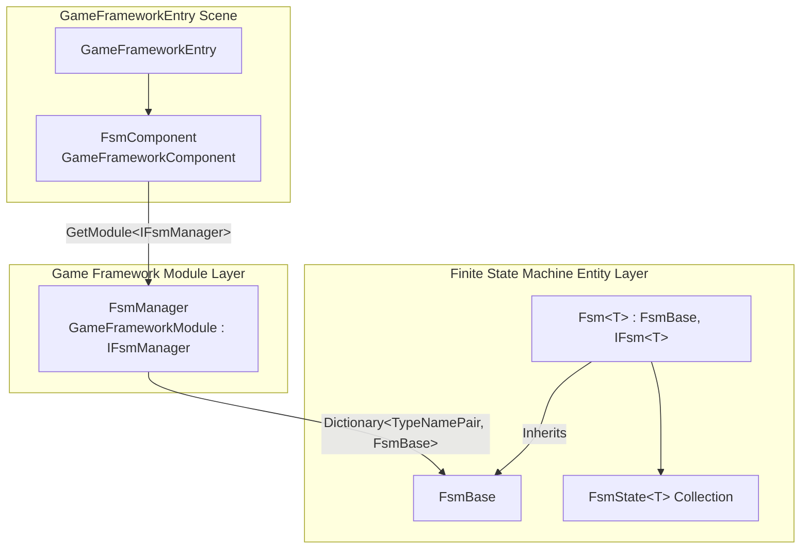

# How It Works: Components, Managers, and the FSM Three-Layer Architecture

GameFrameX FSM is organized in a three-layer structure within Unity: the **Component layer (FsmComponent)** attaches to the GameFramework entry point and handles external calls; the **Manager layer (FsmManager)** serves as a `GameFrameworkModule` that uniformly polls all registered FSMs; and the **State Machine layer (Fsm<T> / FsmState<T>)** is the actual entity that holds the owner, state collection, and state transition logic. Once you understand these three layers, creating, polling, and destroying an FSM follows the standard path from the component entry point down to the concrete state machine.

## Quick Start

1. Add the `GameFrameX/FSM` component (auto-registered via `[AddComponentMenu("GameFrameX/FSM")]`) to the `GameFrameworkEntry` object in your GameFramework startup scene.
2. Get the component via `GameEntry.GetComponent<FsmComponent>()`, then call `CreateFsm` to create a finite state machine.
3. Use the `IFsmManager` interface or methods provided by `FsmComponent` such as `HasFsm`, `GetFsm`, `DestroyFsm` to look up, poll, and destroy FSMs.

The component retrieves the `IFsmManager` module from `GameFrameworkEntry` and caches the reference during the `Awake()` phase:

```csharp
// Runtime/Fsm/FsmComponent.cs#L63-L74
protected override void Awake()
{
    ImplementationComponentType = Utility.Assembly.GetType(componentType);
    InterfaceComponentType = typeof(IFsmManager);
    base.Awake();
    m_FsmManager = GameFrameworkEntry.GetModule<IFsmManager>();
    if (m_FsmManager == null)
    {
        Log.Fatal("FSM manager is invalid.");
        return;
    }
}
```

Source: [FsmComponent.cs#L63-L74](https://github.com/GameFrameX/com.gameframex.unity.fsm/blob/main/Runtime/Fsm/FsmComponent.cs#L63-L74)

## How It Works Overview

Each layer has its own responsibilities. Data and calls flow top-down from "Component → Manager → FSM Entity".



| Layer | Type | Key Responsibilities |
|----|------|----------|
| Component Layer | `FsmComponent : GameFrameworkComponent` | Exposes high-level APIs such as `CreateFsm` / `GetFsm` / `DestroyFsm`; forwards the fixed timestep to the manager in `FixedUpdate` |
| Manager Layer | `FsmManager : GameFrameworkModule, IFsmManager` | Maintains `Dictionary<TypeNamePair, FsmBase>`; enters the polling loop by `Priority`; drives each FSM's `Update` / `FixedUpdate` |
| Entity Layer | `FsmBase` and generic subclass `Fsm<T> : IFsm<T>` | Holds the owner, state dictionary `m_States`, data dictionary `m_Datas`, current state `m_CurrentState`, and dwell time `m_CurrentStateTime`; performs state transitions |

- **Component Layer**: `[GameFrameXAutoComponent(-6000)]` and `[AddComponentMenu("GameFrameX/FSM")]` allow it to be automatically loaded by GameFramework and displayed in the Inspector menu; all external entry points go through it, and it forwards internally to `m_FsmManager`.
- **Manager Layer**: `Priority` returns `1` (the larger the value, the earlier it is polled); in `Update` / `FixedUpdate` it iterates over a snapshot (copied into `m_TempFsms` / `m_TempFixedFsms`) before invoking each FSM, avoiding collection modification during iteration.
- **Entity Layer**: Each concrete `Fsm<T>` knows its owner type `T` and a set of `FsmState<T>`, transitions between states via `ChangeState<TState>()`, and tracks `CurrentStateTime` for checks like "how long has it been in this state".

## Next Steps

- For a complete example of creating and starting your first state machine, see "How to Create a Finite State Machine".
- For lifecycle callbacks of the state class `FsmState<T>` and variable data, see "State Class and Variables Quick Reference".
- For Inspector debugging and editor extensions, see "FsmComponent Inspector Guide".

## Related Links

- [FsmComponent.cs](https://github.com/GameFrameX/com.gameframex.unity.fsm/blob/main/Runtime/Fsm/FsmComponent.cs)
- [FsmManager.cs](https://github.com/GameFrameX/com.gameframex.unity.fsm/blob/main/Runtime/Fsm/FsmManager.cs)
- [Fsm.cs](https://github.com/GameFrameX/com.gameframex.unity.fsm/blob/main/Runtime/Fsm/Fsm.cs)
- [FsmBase.cs](https://github.com/GameFrameX/com.gameframex.unity.fsm/blob/main/Runtime/Fsm/FsmBase.cs)
- [IFsmManager.cs](https://github.com/GameFrameX/com.gameframex.unity.fsm/blob/main/Runtime/Fsm/IFsmManager.cs)
- [IFsm.cs](https://github.com/GameFrameX/com.gameframex.unity.fsm/blob/main/Runtime/Fsm/IFsm.cs)
- [FsmState.cs](https://github.com/GameFrameX/com.gameframex.unity.fsm/blob/main/Runtime/Fsm/FsmState.cs)