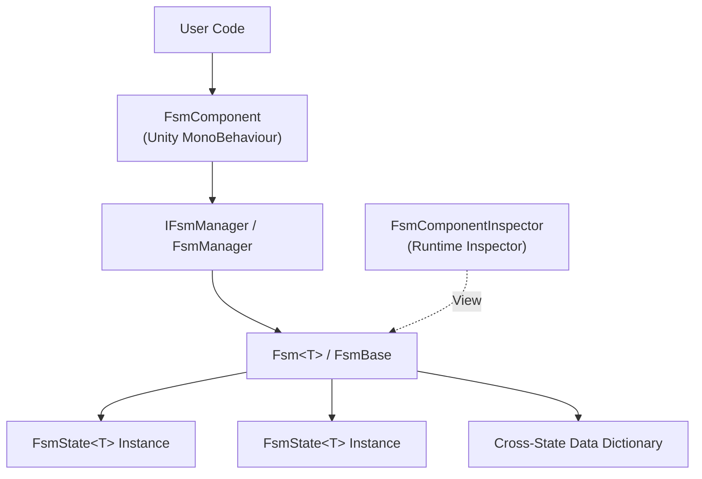

# What is GameFrameX FSM

GameFrameX FSM is the Finite State Machine module provided by the GameFrameX framework, used to manage object state creation, lifecycle, and state transitions in a type-safe manner within Unity. It is a submodule of the GameFrameX framework and must be integrated into the GameFrameX component system through `FsmComponent`.

## Quick Start

### 1. Install the Package

Add the following `scopedRegistries` and dependency to `Packages/manifest.json` in your Unity project:

```json
{
  "scopedRegistries": [
    {
      "name": "GameFrameX",
      "url": "https://gameframex.upm.alianblank.uk",
      "scopes": [
        "com.gameframex"
      ]
    }
  ],
  "dependencies": {
    "com.gameframex.unity.fsm": "1.1.1"
  }
}
```

Source: [README.md](https://github.com/GameFrameX/com.gameframex.unity.fsm/blob/main/README.md#L44-L63)

You can also install it directly via Git URL (`https://github.com/gameframex/com.gameframex.unity.fsm.git`) or by cloning it into the `Packages` directory.

### 2. Define States

Inherit from `FsmState<T>` and override the lifecycle methods, where `T` is the owner type of the state machine:

```csharp
using GameFrameX.Fsm;

public class IdleState : FsmState<Player>
{
    protected override void OnEnter(IFsm<Player> fsm)
    {
        // Triggered when entering Idle
    }

    protected override void OnUpdate(IFsm<Player> fsm, float elapseSeconds, float realElapseSeconds)
    {
        // Polled every frame
        if (Input.GetKeyDown(KeyCode.W))
        {
            ChangeState<MoveState>(fsm);
        }
    }

    protected override void OnLeave(IFsm<Player> fsm, bool isShutdown)
    {
        // Triggered when leaving Idle
    }
}
```

Source: [README.md](https://github.com/GameFrameX/com.gameframex.unity.fsm/blob/main/README.md#L101-L123), [FsmState.cs](https://github.com/GameFrameX/com.gameframex.unity.fsm/blob/main/Runtime/Fsm/FsmState.cs#L41-L67)

### 3. Create and Start the FSM

Get the component via `GameEntry.GetComponent<FsmComponent>()`, then use `CreateFsm` to assemble the state collection and `Start<TState>` to launch it:

```csharp
var fsmComponent = GameEntry.GetComponent<FsmComponent>();
IFsm<Player> fsm = fsmComponent.CreateFsm(player, new IdleState(), new MoveState());
fsm.Start<IdleState>();
```

Source: [README.md](https://github.com/GameFrameX/com.gameframex.unity.fsm/blob/main/README.md#L127-L136), [FsmComponent.cs](https://github.com/GameFrameX/com.gameframex.unity.fsm/blob/main/Runtime/Fsm/FsmComponent.cs#L204-L222)

### 4. Cross-State Data Access (Optional)

Use `SetData` / `GetData<T>` to share data between states, with an internal object pool implementation for zero GC:

```csharp
fsm.SetData("Health", 100);
int hp = fsm.GetData<int>("Health");

if (fsm.HasData("Health"))
{
    fsm.RemoveData("Health");
}
```

Source: [README.md](https://github.com/GameFrameX/com.gameframex.unity.fsm/blob/main/README.md#L140-L149)

## How It Works

The FSM module consists of three layers: the component layer exposes the external API, the manager layer holds all running FSMs and drives their `Update` / `FixedUpdate`, and the state machine layer manages specific state collections and cross-state data.



- `FsmComponent` inherits from `GameFrameworkComponent` and is attached to the `GameFramework` entry object, with a component priority of `-6000` ([FsmComponent.cs#L46-L47](https://github.com/GameFrameX/com.gameframex.unity.fsm/blob/main/Runtime/Fsm/FsmComponent.cs#L46-L47)).
- `FsmManager` holds all FSM instances and handles polling scheduling. The dual-path `Update` / `FixedUpdate` is driven in `FsmComponent.FixedUpdate` ([FsmComponent.cs#L76-L84](https://github.com/GameFrameX/com.gameframex.unity.fsm/blob/main/Runtime/Fsm/FsmComponent.cs#L76-L84)).
- `FsmState<T>` exposes 6 lifecycle hooks: `OnInit`, `OnEnter`, `OnUpdate`, `OnFixedUpdate`, `OnLeave`, `OnDestroy`.
- `FsmComponentInspector` in the Editor directory provides an inspector for viewing the current state and runtime duration in real time during Play mode.

## Next Steps

- How to implement your first state machine: see the task page "How to Create and Start an FSM"
- What to do when cross-state data passing fails: see the related entries on the troubleshooting page
- Complete API reference: see the reference page "IFsm / FsmState API Cheat Sheet"