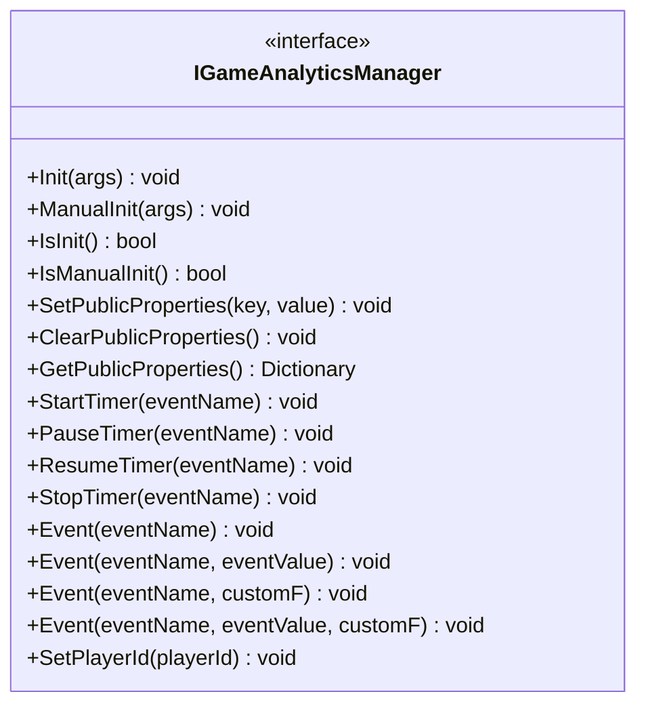
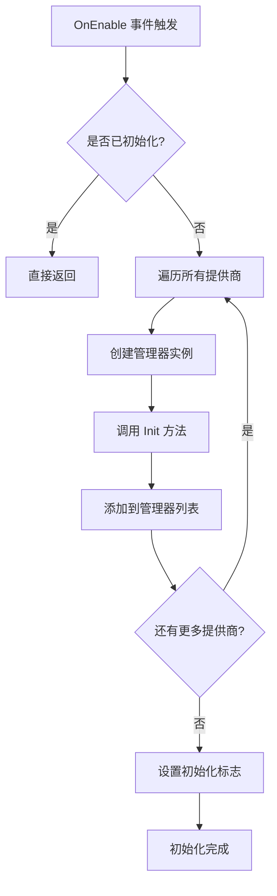
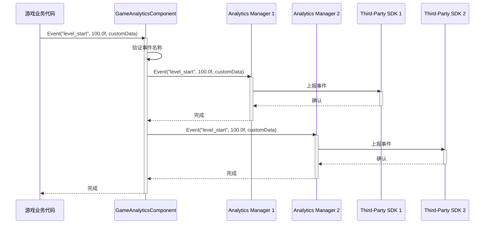
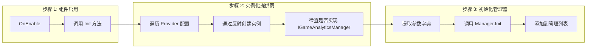

# 核心架构

本文档详细介绍 GameFrameX 游戏数据分析插件的核心架构设计，包括主要组件、数据流和设计模式。

## 概述

GameFrameX 游戏数据分析插件（GameAnalytics）是 GameFrameX 框架的核心模块之一，负责为 Unity 游戏提供统一的事件上报、计时器和玩家数据分析功能。该插件采用模块化设计，支持多种第三方分析服务集成，同时提供公共属性管理机制，确保数据分析的一致性和可扩展性。

## 架构设计

### 整体架构图

```mermaid
flowchart TD
    subgraph UnityLayer["Unity 引擎层"]
        GameObject[GameObject]
    end

    subgraph GameAnalyticsComponentLayer["组件层 (GameAnalyticsComponent)"]
        GAComponent[GameAnalyticsComponent]
        Providers[GameAnalyticsComponentProvider]
    end

    subgraph ManagerLayer["管理器层"]
        IManager[IGameAnalyticsManager]
        BaseManager[BaseGameAnalyticsManager]
    end

    subgraph ImplementationLayer["实现层"]
        ImplA[Analytics Provider A]
        ImplB[Analytics Provider B]
        ImplC[Analytics Provider N]
    end

    GameObject --> GAComponent
    GAComponent --> Providers
    Providers -.->|配置| IManager
    IManager <|..| BaseManager
    BaseManager -->|继承| ImplA
    BaseManager -->|继承| ImplB
    BaseManager -->|继承| ImplC
```

### 架构分层说明

| 层级 | 组件 | 职责 |
|------|------|------|
| **Unity 引擎层** | GameObject | Unity 场景中的游戏对象宿主 |
| **组件层** | GameAnalyticsComponent | 提供 Unity 组件接口，管理工作管理器生命周期 |
| **管理器层** | IGameAnalyticsManager / BaseGameAnalyticsManager | 定义统一 API，实现通用功能 |
| **实现层** | 具体分析服务实现 | 集成第三方分析 SDK（GameAnalytics、Firebase 等） |

## 核心组件

### 1. IGameAnalyticsManager 接口

`IGameAnalyticsManager` 是插件的核心接口，定义了所有分析功能的标准契约。该接口采用面向抽象设计，使得上层代码无需关心具体实现细节。

> Source: [IGameAnalyticsManager.cs](https://github.com/GameFrameX/com.gameframex.unity.gameanalytics/blob/main/Runtime/GameAnalytics/IGameAnalyticsManager.cs#L1-L106)

**接口方法分类：**



### 2. BaseGameAnalyticsManager 抽象基类

`BaseGameAnalyticsManager` 继承自 `GameFrameworkModule`，是所有分析管理器实现的基础类。它封装了通用功能，包括：

- **初始化状态管理** - 跟踪管理器是否已初始化
- **公共属性管理** - 提供公共属性的设置、获取和清除功能
- **设备信息采集** - 自动收集设备相关的公共属性

```csharp
public abstract class BaseGameAnalyticsManager : GameFrameworkModule, IGameAnalyticsManager
{
    protected bool m_IsInit = false;
    protected readonly Dictionary<string, object> m_PublicProperties = new Dictionary<string, object>();
    
    protected virtual void AddDeviceInfoToPublicProperties()
    {
        // 设备基本信息
        m_PublicProperties["device_id"] = SystemInfo.deviceUniqueIdentifier;
        m_PublicProperties["device_model"] = SystemInfo.deviceModel;
        // ... 更多设备信息
    }
}
```

> Source: [BaseGameAnalyticsManager.cs](https://github.com/GameFrameX/com.gameframex.unity.gameanalytics/blob/main/Runtime/GameAnalytics/BaseGameAnalyticsManager.cs#L10-L203)

**设计意图：** 抽象基类模式允许不同分析服务提供商继承该类并实现特定逻辑，同时复用公共属性管理和设备信息采集等通用功能。

### 3. GameAnalyticsComponent Unity 组件

`GameAnalyticsComponent` 是 Unity 引擎的组件类，负责在游戏场景中提供数据分析功能。它继承自 `GameFrameworkComponent`，是开发者主要交互的入口点。

```csharp
[DisallowMultipleComponent]
[AddComponentMenu("Game Framework/GameAnalytics")]
public sealed class GameAnalyticsComponent : GameFrameworkComponent
{
    [SerializeField] private List<GameAnalyticsComponentProvider> m_gameAnalyticsComponentProviders = new List<GameAnalyticsComponentProvider>();
    private List<IGameAnalyticsManager> m_GameAnalyticsManager;
}
```

> Source: [GameAnalyticsComponent.cs](https://github.com/GameFrameX/com.gameframex.unity.gameanalytics/blob/main/Runtime/GameAnalytics/GameAnalyticsComponent.cs#L1-L386)

**核心职责：**

1. **多提供商支持** - 支持同时配置多个分析服务提供商
2. **自动初始化** - 在 `OnEnable` 时自动初始化所有提供商
3. **手动初始化** - 支持延迟手动初始化以满足特殊需求
4. **事件广播** - 将事件同时发送给所有已配置的提供商



### 4. 配置模型

插件使用两个配置类来管理分析服务提供商的设置：

- **GameAnalyticsComponentProvider** - 提供商配置，包含组件类型和参数设置
- **GameAnalyticsComponentParamKV** - 键值对配置，用于存储具体参数

```csharp
[Serializable]
public class GameAnalyticsComponentProvider
{
    public string ComponentType;
    public int ComponentTypeNameIndex;
    public List<GameAnalyticsComponentParamKV> Setting = new List<GameAnalyticsComponentParamKV>();
}

[Serializable]
public class GameAnalyticsComponentParamKV
{
    public string Key;
    public string Value;
}
```

> Source: [GameAnalyticsComponent.cs](https://github.com/GameFrameX/com.gameframex.unity.gameanalytics/blob/main/Runtime/GameAnalytics/GameAnalyticsComponent.cs#L361-L385)

## 数据流

### 事件上报流程

当游戏代码调用 `GameAnalyticsComponent.Event()` 方法时，事件数据通过以下流程传播：



### 初始化流程



## 公共属性机制

### 概述

公共属性（Public Properties）是自动附加到所有事件的上下文数据，用于提供玩家会话的详细信息。这些属性在 `BaseGameAnalyticsManager` 中自动采集，包括设备信息、操作系统信息、应用程序信息等。

### 自动采集的属性

| 分类 | 属性键名 | 描述 |
|------|----------|------|
| 设备信息 | `device_id` | 设备唯一标识符 |
| 设备信息 | `device_model` | 设备型号 |
| 设备信息 | `device_type` | 设备类型 |
| 操作系统 | `os` | 操作系统版本 |
| 应用程序 | `app_version` | 应用版本号 |
| 应用程序 | `unity_version` | Unity 引擎版本 |
| 应用程序 | `platform` | 运行平台 |
| 硬件信息 | `processor_type` | 处理器类型 |
| 硬件信息 | `processor_count` | 处理器核心数 |
| 硬件信息 | `system_memory_size` | 系统内存大小 |
| 图形信息 | `graphics_device_name` | 显卡名称 |
| 图形信息 | `graphics_memory_size` | 显存大小 |
| 屏幕信息 | `screen_width` | 屏幕宽度 |
| 屏幕信息 | `screen_height` | 屏幕高度 |
| 屏幕信息 | `screen_dpi` | 屏幕 DPI |
| 网络信息 | `network_type` | 网络类型 (WiFi/Mobile Data) |

> Source: [BaseGameAnalyticsManager.cs](https://github.com/GameFrameX/com.gameframex.unity.gameanalytics/blob/main/Runtime/GameAnalytics/BaseGameAnalyticsManager.cs#L88-L144)

### 自定义公共属性

开发者可以通过 `SetPublicProperties` 方法添加自定义公共属性，这些属性会自动附加到后续所有事件中：

```csharp
// 设置自定义公共属性
gameAnalyticsComponent.SetPublicProperties("player_level", 10);
gameAnalyticsComponent.SetPublicProperties("player_name", "Hero");
```

### 属性优先级

公共属性的优先级顺序为：
1. **系统自动采集** - 设备信息、操作系统等（最先添加）
2. **开发者自定义** - 通过 `SetPublicProperties` 设置（覆盖同名键）
3. **手动清除后重置** - 调用 `ClearPublicProperties` 后重新采集系统属性

## 设计模式详解

### 1. 接口抽象模式

**应用场景：** `IGameAnalyticsManager` 接口定义

**优势：**
- 解耦上层代码与具体实现
- 支持多提供商并行运行
- 便于单元测试（可使用 Mock）

### 2. 模板方法模式

**应用场景：** `BaseGameAnalyticsManager` 基类

**优势：**
- 复用通用逻辑（初始化、公共属性管理）
- 子类只需关注特定实现
- 统一代码结构

### 3. 提供商模式

**应用场景：** `GameAnalyticsComponent` 管理多个 `IGameAnalyticsManager`

**优势：**
- 支持多分析服务同时使用
- 灵活的配置机制
- 便于扩展新服务商

### 4. 反射实例化

**应用场景：** Editor 中动态加载分析管理器类型

```csharp
var gameAnalyticsComponentType = Utility.Assembly.GetType(gameAnalyticsComponentProvider.ComponentType);
if (Activator.CreateInstance(gameAnalyticsComponentType) is IGameAnalyticsManager gameAnalyticsManager)
{
    gameAnalyticsManager.Init(args);
    m_GameAnalyticsManager.Add(gameAnalyticsManager);
}
```

**优势：**
- 运行时动态加载，无需编译时引用
- 插件化架构，易于扩展

## 相关链接

- [插件介绍](./1-overview.index) - 插件概述和功能简介
- [快速开始](./3-getting-started.index) - 快速上手指南
- [API 接口](./5-api-reference.index) - 完整 API 参考文档
- [编辑器配置](./6-configuration.index) - 编辑器配置说明
- [故障排除](./7-troubleshooting.index) - 常见问题与解决方案
