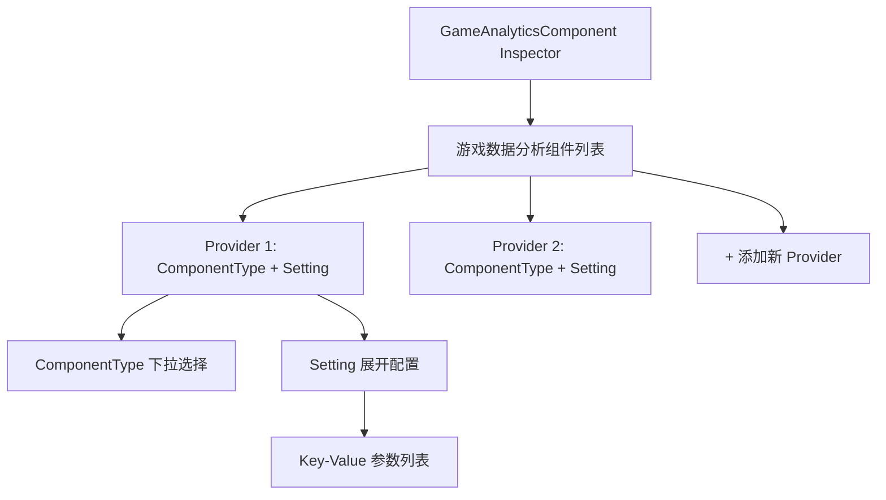
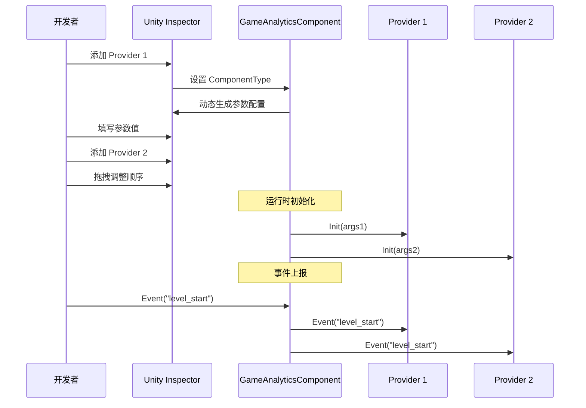

# 编辑器配置

本文档详细介绍如何在 Unity 编辑器中配置 GameAnalytics 插件，包括组件添加、 Provider 配置和参数设置。

## 概述

GameAnalytics 插件采用基于 Provider 的可扩展架构，允许在同一个项目中配置多个数据分析服务提供商。编辑器配置主要通过 Unity Inspector 面板完成，核心组件为 `GameAnalyticsComponent`。通过自定义 Inspector 界面，开发者可以可视化地添加、排序和配置多个分析服务提供商。

> 详细的核心架构设计请参考 [核心架构](./04.features.md) 文档。

## 配置流程

### 添加组件

在 Unity 场景中创建或选择需要添加数据分析的 GameObject，然后通过以下方式添加 `GameAnalyticsComponent`：

1. 在 Inspector 面板中点击 **Add Component** 按钮
2. 搜索 "GameAnalytics" 或 "游戏数据分析"
3. 选择 **Game Framework/GameAnalytics** 组件

```csharp
// 组件定义 - GameAnalyticsComponent.cs
[DisallowMultipleComponent]
[AddComponentMenu("Game Framework/GameAnalytics")]
public sealed class GameAnalyticsComponent : GameFrameworkComponent
{
    [SerializeField] private List<GameAnalyticsComponentProvider> m_gameAnalyticsComponentProviders = new List<GameAnalyticsComponentProvider>();
    // ... 事件上报方法
}
```
> Source: [GameAnalyticsComponent.cs](https://github.com/GameFrameX/com.gameframex.unity.gameanalytics/blob/main/Runtime/GameAnalytics/GameAnalyticsComponent.cs#L12-L17)

### Inspector 界面说明

添加组件后，Inspector 面板将显示自定义的配置界面，主要包含以下区域：



**主要 UI 元素：**

| 元素 | 说明 |
|------|------|
| 组件列表 | 显示已配置的所有数据分析 Provider |
| 添加按钮 | 在列表末尾添加新的 Provider |
| 删除按钮 | 移除指定位置的 Provider |
| 拖拽手柄 | 调整 Provider 的上报顺序 |
| ComponentType | 选择具体的数据分析服务实现类 |
| Setting | 展开配置该服务所需的参数 |

## Provider 配置详解

### 组件类型选择

每个 Provider 需要选择实现 `IGameAnalyticsManager` 接口的具体类型。Inspector 会自动扫描所有可用的分析服务实现类并显示在下拉菜单中：

```csharp
// Inspector 代码 - 类型刷新逻辑
protected override void RefreshTypeNames()
{
    List<string> managerTypeNameList = new List<string> { NoneOptionName };
    managerTypeNameList.AddRange(Type.GetRuntimeTypeNames(typeof(IGameAnalyticsManager)));
    m_ManagerTypeNames = managerTypeNameList.ToArray();
}
```
> Source: [GameAnalyticsComponentInspector.cs](https://github.com/GameFrameX/com.gameframex.unity.gameanalytics/blob/main/Editor/Inspector/GameAnalyticsComponentInspector.cs#L42-L50)

**选择逻辑说明：**
- 默认选项为 "None"（无）
- 下拉菜单自动列出所有继承自 `IGameAnalyticsManager` 的类型
- 选择类型后，Inspector 会动态生成对应的参数配置界面

### 参数配置

当选择具体的 ComponentType 后，Inspector 会自动读取该实现类的字段定义，并生成对应的参数配置项：

```csharp
// Provider 数据结构
[Serializable]
public class GameAnalyticsComponentProvider
{
    /// <summary>
    /// 实现组件类型
    /// </summary>
    public string ComponentType;

    /// <summary>
    /// 这个是给编辑器用的
    /// </summary>
    public int ComponentTypeNameIndex = 0;

    /// <summary>
    /// 参数
    /// </summary>
    public List<GameAnalyticsComponentParamKV> Setting = new List<GameAnalyticsComponentParamKV>();
}

[Serializable]
public class GameAnalyticsComponentParamKV
{
    public string Key;
    public string Value;
}
```
> Source: [GameAnalyticsComponent.cs](https://github.com/GameFrameX/com.gameframex.unity.gameanalytics/blob/main/Runtime/GameAnalytics/GameAnalyticsComponent.cs#L361-L385)

### Provider 上报顺序

多个 Provider 存在时，事件会按列表顺序依次上报。可以通过拖拽调整顺序，确保数据按预期优先级发送。

## 配置示例

### 基础配置步骤

1. **创建游戏对象**：在场景中创建空对象或选择现有对象
2. **添加组件**：Add Component → Game Framework/GameAnalytics
3. **配置 Provider**：
   - 点击列表下方的 "+" 按钮添加 Provider
   - 在 ComponentType 下拉框中选择分析服务实现类
   - 展开 Setting 填写所需的参数（如 AppId、AppKey 等）

```csharp
// 初始化时的参数传递
public void Init()
{
    foreach (var gameAnalyticsComponentProvider in m_gameAnalyticsComponentProviders)
    {
        if (gameAnalyticsComponentProvider.ComponentType.IsNotNullOrWhiteSpace())
        {
            var gameAnalyticsComponentType = Utility.Assembly.GetType(gameAnalyticsComponentProvider.ComponentType);
            if (Activator.CreateInstance(gameAnalyticsComponentType) is IGameAnalyticsManager gameAnalyticsManager)
            {
                Dictionary<string, string> args = new Dictionary<string, string>();
                foreach (var param in gameAnalyticsComponentProvider.Setting)
                {
                    args[param.Key] = param.Value;
                }
                gameAnalyticsManager.Init(args);
                m_GameAnalyticsManager.Add(gameAnalyticsManager);
            }
        }
    }
}
```
> Source: [GameAnalyticsComponent.cs](https://github.com/GameFrameX/com.gameframex.unity.gameanalytics/blob/main/Runtime/GameAnalytics/GameAnalyticsComponent.cs#L47-L80)

### 多 Provider 配置

支持同时配置多个分析服务，事件会依次发送到所有已配置的 Provider：



## 常见配置问题

### Provider 未显示在列表中

如果下拉菜单中没有显示所需的分析服务实现类，请检查：

1. **程序集定义**：确保实现类所在的程序集已正确引用
2. **接口继承**：确认实现类正确继承自 `BaseGameAnalyticsManager` 并实现了 `IGameAnalyticsManager`
3. **程序集扫描**：Editor 程序集可能需要刷新才能检测到新的类型

### 参数配置无效

如果配置参数后运行时未生效：

1. **确认字段名称**：参数 Key 必须与实现类中的字段名称完全匹配
2. **检查初始化**：确认 `Init()` 方法被正确调用
3. **查看日志**：检查 Unity Console 中是否有错误信息

### 重复组件警告

添加组件时出现重复警告：

```csharp
[DisallowMultipleComponent]  // 此属性防止在同一 GameObject 上添加多个实例
public sealed class GameAnalyticsComponent : GameFrameworkComponent
```

> 这是预期行为，确保每个场景中只有一个 GameAnalyticsComponent 实例。

## 相关链接

- [快速开始](./3-getting-started.index) - 了解如何快速集成
- [核心架构](./04.features.md) - 深入了解系统设计
- [API 接口](./5-api-reference.index) - 完整的 API 参考文档
- [故障排除](./7-troubleshooting.index) - 常见问题与解决方案
