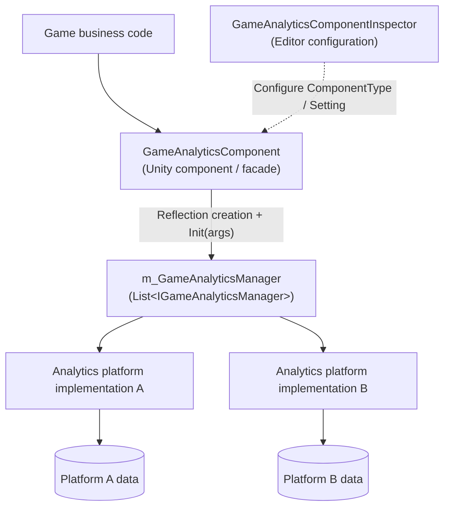

# Introduction to the Game Analytics Component

The GameAnalytics game analytics component provides a unified game analytics reporting entry point for Unity projects: you only need to attach `GameAnalyticsComponent` in the Inspector and configure analytics Providers, and you can use the same set of APIs to report events, manage timers, and send data to multiple third-party analytics platforms simultaneously. The component has zero external dependencies and supports Unity 2019.4 and above (current package version 1.2.1).

## Quick Start

### 1. Install the Package

Choose any one of the following methods (either one will work):

**Method 1: scopedRegistries (Recommended)** — Edit the Unity project's `Packages/manifest.json`:

```json
{
  "scopedRegistries": [
    {
      "name": "GameFrameX",
      "url": "https://gameframex.upm.alianblank.uk",
      "scopes": [
        "com.gameframex"
      ]
    }
  ],
  "dependencies": {
    "com.gameframex.unity.gameanalytics": "1.2.0"
  }
}
```

`scopes` controls which packages are resolved through this registry; only packages starting with `com.gameframex` will be fetched from this registry.

Source: [README.zh-CN.md](https://github.com/GameFrameX/com.gameframex.unity.gameanalytics/blob/main/README.zh-CN.md#L34-L52)

**Method 2: Git URL** — Add the following under the `dependencies` node of `manifest.json`:

```json
{
   "com.gameframex.unity.gameanalytics": "https://github.com/gameframex/com.gameframex.unity.gameanalytics.git"
}
```

You can also add it via `Git URL` in Unity's `Package Manager`, using the address `https://github.com/gameframex/com.gameframex.unity.gameanalytics.git`; or download the repository directly into the Unity project's `Packages` directory for automatic loading.

Source: [README.zh-CN.md](https://github.com/GameFrameX/com.gameframex.unity.gameanalytics/blob/main/README.zh-CN.md#L54-L61)

### 2. Attach the Component and Configure Providers

Create the `Game Framework/GameAnalytics` component (`GameAnalyticsComponent`) in the scene. The component collects Providers in `Awake` and automatically calls `Init()` on `OnEnable`: it uses reflection to create instances implementing `IGameAnalyticsManager` based on the `ComponentType` configured in the Inspector, and passes each Provider's `Setting` key-value pairs as initialization parameters.

```csharp
public void Init()
{
    if (m_IsInit)
    {
        return;
    }

    foreach (var gameAnalyticsComponentProvider in m_gameAnalyticsComponentProviders)
    {
        if (gameAnalyticsComponentProvider.ComponentType.IsNotNullOrWhiteSpace())
        {
            var gameAnalyticsComponentType = Utility.Assembly.GetType(gameAnalyticsComponentProvider.ComponentType);
            if (gameAnalyticsComponentType == null)
            {
                Log.Error($"Can not find component type '{gameAnalyticsComponentProvider.ComponentType}'.");
                continue;
            }

            if (Activator.CreateInstance(gameAnalyticsComponentType) is IGameAnalyticsManager gameAnalyticsManager)
            {
                Dictionary<string, string> args = new Dictionary<string, string>();
                foreach (var param in gameAnalyticsComponentProvider.Setting)
                {
                    args[param.Key] = param.Value;
                }

                gameAnalyticsManager.Init(args);
                m_GameAnalyticsManager.Add(gameAnalyticsManager);
            }
        }
    }

    m_IsInit = true;
}
```

Source: [GameAnalyticsComponent.cs](https://github.com/GameFrameX/com.gameframex.unity.gameanalytics/blob/main/Runtime/GameAnalytics/GameAnalyticsComponent.cs#L47-L80)

### 3. Report Your First Event

Once initialization is complete, you can call the event reporting and timer APIs:

```csharp
// Simple event reporting
public void Event(string eventName)
{
    if (!_isInit) return;
    _gameAnalyticsManager.Event(eventName);
}

// Event reporting with a value
public void Event(string eventName, float eventValue)
{
    if (!_isInit) return;
    _gameAnalyticsManager.Event(eventName, eventValue);
}

// Start timer / stop timer
public void StartTimer(string eventName)
{
    if (!_isInit) return;
    _gameAnalyticsManager.StartTimer(eventName);
}

public void StopTimer(string eventName)
{
    if (!_isInit) return;
    _gameAnalyticsManager.StopTimer(eventName);
}
```

Source: [README.zh-CN.md](https://github.com/GameFrameX/com.gameframex.unity.gameanalytics/blob/main/README.zh-CN.md#L76-L118)

Note: Make sure the component is properly initialized before using any of its methods; reported event names should be representative and unique to ensure the accuracy of data analysis.

## How It Works at a Glance

The component adopts a "facade + multiple Providers" structure: `GameAnalyticsComponent` is the single external entry point (inheriting from `GameFrameworkComponent`), it holds zero or more manager instances implementing `IGameAnalyticsManager`, and all public methods iterate over the list to broadcast to every configured analytics platform, so a single call can report to multiple platforms simultaneously.



The responsibilities of each type are as follows:

| Type | Description |
|------|------|
| `GameAnalyticsComponent` | Unity component facade; collects Providers in `Awake`, automatically calls `Init()` on `OnEnable`, and broadcasts all methods to every Manager |
| `IGameAnalyticsManager` | Game analytics manager interface; defines APIs for initialization, public properties, timers, event reporting, player ID, and more |
| `BaseGameAnalyticsManager` | Manager base class for concrete platform implementations to inherit and reuse |
| `GameAnalyticsComponentInspector` | Editor extension for visually configuring Providers and Settings in the Inspector |
| `GameFrameXGameAnalyticsCroppingHelper` | Cropping (module removal) helper class |

Overview of the core APIs provided by `IGameAnalyticsManager` (see the interface file for complete signatures):

| Method | Signature | Description |
|------|------|------|
| Auto initialization | `void Init(Dictionary<string, string> args)` | Called automatically when the component is enabled |
| Manual initialization | `void ManualInit(Dictionary<string, string> args)` | Forwarded by the component only when `IsManualInit()` is true |
| Set public property | `void SetPublicProperties(string key, object value)` | Common fields attached to all events |
| Clear/get public properties | `void ClearPublicProperties()` / `Dictionary<string, object> GetPublicProperties()` | Clears or reads public properties |
| Timers | `StartTimer` / `PauseTimer` / `ResumeTimer` / `StopTimer(string eventName)` | Start/pause/resume/stop timing an event's duration |
| Event reporting | `Event(string eventName)` and overloads with `float` / `Dictionary<string, object>` | 4 overloads in total |
| Set player ID | `void SetPlayerId(string playerId)` | Identifies the current player |

Source: [IGameAnalyticsManager.cs](https://github.com/GameFrameX/com.gameframex.unity.gameanalytics/blob/main/Runtime/GameAnalytics/IGameAnalyticsManager.cs#L8-L105)

## Next Steps

- For specific usage of event reporting and timers, see the "Event Reporting and Timer Features" task page
- To configure analytics Providers and Settings in the Inspector, see the "Configure Analytics Providers" task page
- For troubleshooting initialization failures, `Can not find component type` errors, and other issues, see the "Initialization and Reporting Failure Troubleshooting" page
- For the version history, see the repository's [CHANGELOG.md](https://github.com/GameFrameX/com.gameframex.unity.gameanalytics/blob/main/CHANGELOG.md)