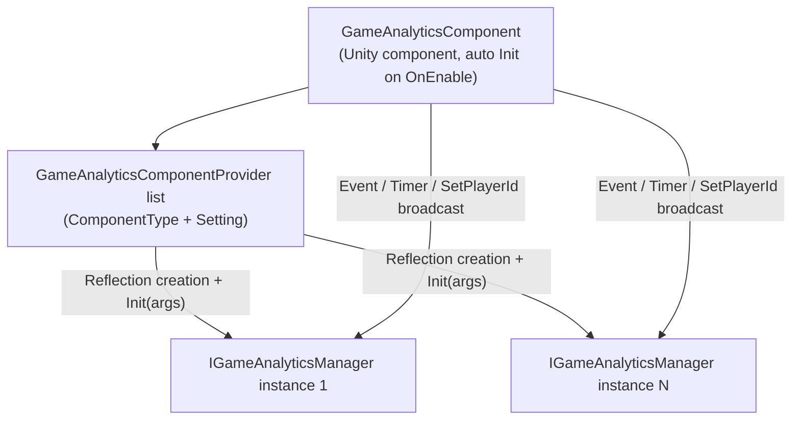

# Installation & Quick Start

The GameAnalytics game data analytics component provides a unified interface for event reporting and timer functionality in Unity projects: once the package is installed, `GameAnalyticsComponent` is attached to a scene and Providers are configured, a single line of `Event(...)` is all it takes to report data to any data analytics SDK. This page walks you from installation to your first report.

## Prerequisites

- Unity `2019.4` or higher (see `"unity": "2019.4"` in [package.json](https://github.com/GameFrameX/com.gameframex.unity.gameanalytics/blob/main/package.json#L7)).
- The project already contains the GameFrameX framework base components: `GameAnalyticsComponent` inherits from `GameFrameworkComponent` and uses infrastructure such as `Utility.Assembly` and `Log` from the `GameFrameX.Runtime` namespace (see [GameAnalyticsComponent.cs](https://github.com/GameFrameX/com.gameframex.unity.gameanalytics/blob/main/Runtime/GameAnalytics/GameAnalyticsComponent.cs#L1-L14)).
- This package itself declares `"dependencies": {}` in `package.json`, with no additional third-party dependencies.

## Quick Start

### Step 1: Install the Package

Choose any of the following methods (the current repository version is `1.2.1`; the `1.2.0` shown in the README examples is a historical version number):

1. Edit the Unity project's `Packages/manifest.json` and add a `scopedRegistries` section:

```json
{
  "scopedRegistries": [
    {
      "name": "GameFrameX",
      "url": "https://gameframex.upm.alianblank.uk",
      "scopes": [
        "com.gameframex"
      ]
    }
  ],
  "dependencies": {
    "com.gameframex.unity.gameanalytics": "1.2.0"
  }
}
```

`scopes` controls which packages are resolved through this registry; only packages starting with `com.gameframex` will be fetched from this registry.

Source: [README.zh-CN.md](https://github.com/GameFrameX/com.gameframex.unity.gameanalytics/blob/main/README.zh-CN.md#L34-L52)

2. Add the Git URL directly under the `dependencies` node of `manifest.json`:

```json
{
   "com.gameframex.unity.gameanalytics": "https://github.com/gameframex/com.gameframex.unity.gameanalytics.git"
}
```

Source: [README.zh-CN.md](https://github.com/GameFrameX/com.gameframex.unity.gameanalytics/blob/main/README.zh-CN.md#L54-L59)

3. In Unity's `Package Manager`, select `Add package from git URL` and enter `https://github.com/gameframex/com.gameframex.unity.gameanalytics.git`.
4. Download the repository directly and place it in the Unity project's `Packages` directory; Unity will automatically load and recognize it.

### Step 2: Attach the Component

In the Unity menu, select `Component → Game Framework → GameAnalytics` to add `GameAnalyticsComponent` to the GameFrameX component carrier GameObject in the scene. The component is marked with `[DisallowMultipleComponent]`, so only one can be attached to the same GameObject.

```csharp
[DisallowMultipleComponent]
[AddComponentMenu("Game Framework/GameAnalytics")]
public sealed class GameAnalyticsComponent : GameFrameworkComponent
```

Source: [GameAnalyticsComponent.cs](https://github.com/GameFrameX/com.gameframex.unity.gameanalytics/blob/main/Runtime/GameAnalytics/GameAnalyticsComponent.cs#L12-L14)

### Step 3: Configure Data Analytics Providers

In the Inspector (for the custom editor, see [GameAnalyticsComponentInspector.cs](https://github.com/GameFrameX/com.gameframex.unity.gameanalytics/blob/main/Editor/Inspector/GameAnalyticsComponentInspector.cs)), add Provider entries to the component and fill in:

| Field | Description |
|------|------|
| `ComponentType` | The fully qualified name (string) of a type implementing `IGameAnalyticsManager` |
| `Setting` | Key-value pair configuration passed to the SDK (e.g., AppKey, SecretKey, etc.) |

When the component is enabled, `Init()` runs automatically in `OnEnable()`: instances are created via reflection based on `ComponentType`, `Setting` is aggregated into a `Dictionary<string, string>` and passed to `gameAnalyticsManager.Init(args)`, and the instances are added to the management list — from then on, all reporting calls are broadcast to every registered Provider.

```csharp
public void Init()
{
    if (m_IsInit)
    {
        return;
    }

    foreach (var gameAnalyticsComponentProvider in m_gameAnalyticsComponentProviders)
    {
        if (gameAnalyticsComponentProvider.ComponentType.IsNotNullOrWhiteSpace())
        {
            var gameAnalyticsComponentType = Utility.Assembly.GetType(gameAnalyticsComponentProvider.ComponentType);
            if (gameAnalyticsComponentType == null)
            {
                Log.Error($"Can not find component type '{gameAnalyticsComponentProvider.ComponentType}'.");
                continue;
            }

            if (Activator.CreateInstance(gameAnalyticsComponentType) is IGameAnalyticsManager gameAnalyticsManager)
            {
                Dictionary<string, string> args = new Dictionary<string, string>();
                foreach (var param in gameAnalyticsComponentProvider.Setting)
                {
                    args[param.Key] = param.Value;
                }

                gameAnalyticsManager.Init(args);
                m_GameAnalyticsManager.Add(gameAnalyticsManager);
            }
        }
    }

    m_IsInit = true;
}
```

Source: [GameAnalyticsComponent.cs](https://github.com/GameFrameX/com.gameframex.unity.gameanalytics/blob/main/Runtime/GameAnalytics/GameAnalyticsComponent.cs#L47-L80)

### Step 4: Report Your First Event and Timer

Initialization is handled automatically by the component; you can simply call it from your business code (namespace `GameFrameX.GameAnalytics.Runtime`):

```csharp
// Start/stop timer
GameEntry.GameAnalytics.StartTimer("level_1");
GameEntry.GameAnalytics.StopTimer("level_1");

// Simple event report
GameEntry.GameAnalytics.Event("level_complete");

// Event report with a numeric value
GameEntry.GameAnalytics.Event("coin_gain", 100f);

// Event report with custom fields
GameEntry.GameAnalytics.Event("purchase",
    new Dictionary<string, object> { { "sku", "gem_100" }, { "price", "0.99" } });

// Event report with a numeric value and custom fields
GameEntry.GameAnalytics.Event("boss_kill", 1f,
    new Dictionary<string, object> { { "boss_id", "b_003" } });
```

Source: [README.zh-CN.md](https://github.com/GameFrameX/com.gameframex.unity.gameanalytics/blob/main/README.zh-CN.md#L80-L148)

> **Note:** When the component is not initialized (`m_IsInit == false`), all methods except `Init()` simply `return`, neither throwing errors nor reporting. Event names should be representative and unique to ensure the accuracy of data analytics.

## How It Works at a Glance

The component is a "multi-broadcast" shell; the actual data analytics logic is handled by the `IGameAnalyticsManager` implementations you inject (e.g., connecting to multiple platforms such as GA and Firebase at the same time):



## Common Issues

| Symptom | Cause | Fix |
|------|------|------|
| Calling `Event` / `StartTimer` produces no reports and no errors | Component not initialized; the method's opening `if (!_isInit) return;` returns directly | Confirm the component is enabled along with the GameObject, triggering `OnEnable → Init()`; or call `Init()` first |
| Console shows `Can not find component type '...'.` | The Provider's `ComponentType` type name is misspelled, or the assembly containing the type is not referenced | Verify the fully qualified type name; confirm the implementing class is `public` and the assembly is loaded |
| Cannot attach a second component to the same GameObject | `[DisallowMultipleComponent]` restriction | Keep only one `GameAnalyticsComponent`; use multiple Providers for multiple platforms |
| SDKs that require login are not receiving parameters | The Provider is marked for manual initialization, and business parameters are not passed during automatic `Init` | Call `ManualInit(Dictionary<string, string> extraArgs)` after successful login (see [GameAnalyticsComponent.cs](https://github.com/GameFrameX/com.gameframex.unity.gameanalytics/blob/main/Runtime/GameAnalytics/GameAnalyticsComponent.cs#L86-L100)) |

## Next Steps

- For the complete interface list and method signatures, see [IGameAnalyticsManager.cs](https://github.com/GameFrameX/com.gameframex.unity.gameanalytics/blob/main/Runtime/GameAnalytics/IGameAnalyticsManager.cs#L8-L105) (including `PauseTimer` / `ResumeTimer` / `SetPublicProperties` / `SetPlayerId`, etc.).
- For the base class default implementation, see [BaseGameAnalyticsManager.cs](https://github.com/GameFrameX/com.gameframex.unity.gameanalytics/blob/main/Runtime/GameAnalytics/BaseGameAnalyticsManager.cs).
- For the custom Inspector editor, see [GameAnalyticsComponentInspector.cs](https://github.com/GameFrameX/com.gameframex.unity.gameanalytics/blob/main/Editor/Inspector/GameAnalyticsComponentInspector.cs).
- For version history, see the repository's [CHANGELOG.md](https://github.com/GameFrameX/com.gameframex.unity.gameanalytics/blob/main/CHANGELOG.md).
- Official documentation site: https://gameframex.doc.alianblank.com ; community QQ groups: 467608841 / 233840761.

## Background

In `Awake`, the component sets `IsAutoRegister = false` and creates an empty `IGameAnalyticsManager` list; the actual instantiation is deferred to `Init()` triggered by `OnEnable`. Therefore, Provider types must be resolvable via `Utility.Assembly.GetType` at the time the component is enabled. This "reflection + string configuration" design lets you integrate any data analytics SDK that implements `IGameAnalyticsManager` without modifying this package's source code.

Source: [GameAnalyticsComponent.cs](https://github.com/GameFrameX/com.gameframex.unity.gameanalytics/blob/main/Runtime/GameAnalytics/GameAnalyticsComponent.cs#L20-L30)