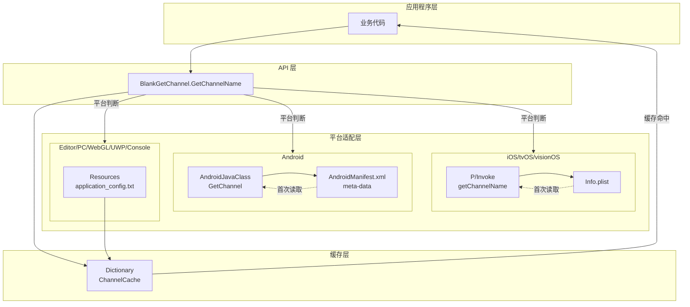
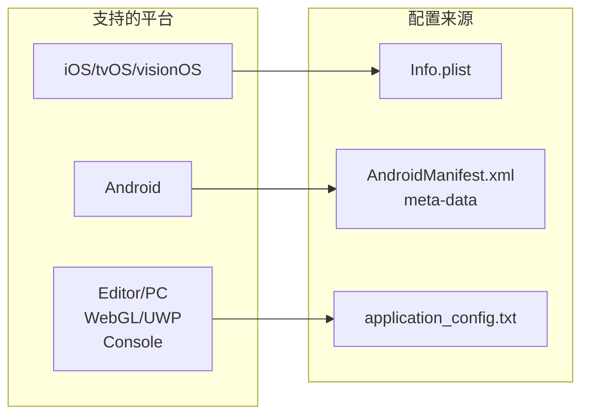
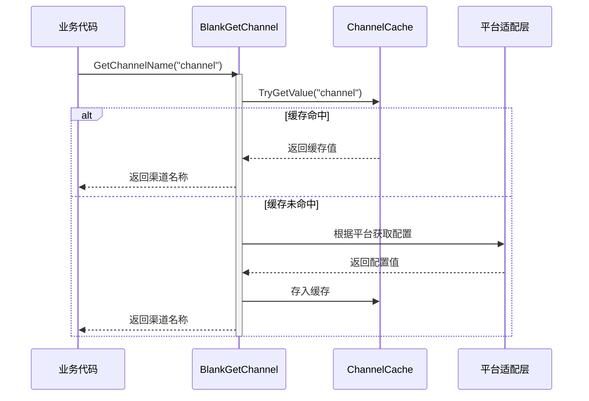

# 概述

Unity Get Channel 是一个用于在 Unity 项目中获取多平台分发渠道号的插件，支持 iOS、tvOS、visionOS、Android、Editor、PC（Windows/Mac/Linux）、WebGL、UWP 以及主流游戏主机平台（PS4、PS5、Xbox One、Nintendo Switch）。该插件是 GameFrameX 项目的重要组成部分，为游戏开发者提供了统一的渠道信息获取解决方案。

## 项目背景

在游戏分发过程中，开发者通常需要针对不同的发行渠道（如 App Store、Google Play、国内安卓市场等）配置不同的渠道标识符。传统做法是为每个平台编写独立的渠道获取逻辑，导致代码重复和维护困难。Unity Get Channel 插件通过抽象化的设计，将各平台的渠道获取逻辑统一封装，开发者只需调用一个简单的 API 即可获取当前平台的渠道信息，大大简化了多渠道游戏配置的工作量。

## 核心功能

本插件提供以下核心功能：

- **多平台统一接口**：通过 `BlankGetChannel.GetChannelName()` 方法，在任何支持的平台上获取渠道信息，无需编写平台特定代码。
- **多渠道支持**：支持获取主渠道和子渠道信息，可根据业务需求灵活配置多个渠道键。
- **自动配置**：iOS 构建时自动在 Info.plist 中添加默认渠道配置，无需手动操作。
- **缓存机制**：内置缓存功能，避免重复读取配置文件，提高运行时性能。
- **代码裁剪保护**：提供 link.xml 文件，防止关键代码被 Unity 代码裁剪功能移除。

## 架构设计



如上图所示，该插件采用分层架构设计。应用程序层通过调用 API 层的统一接口获取渠道信息，平台适配层根据当前运行的 Unity 平台自动选择合适的配置读取方式，缓存层则负责存储已读取的渠道信息以提高后续访问的性能。

## 平台配置方式

不同平台获取渠道信息的配置方式各不相同，以下是各平台的配置概述：



### iOS/tvOS/visionOS 平台

在 iOS、tvOS 和 visionOS 平台上，渠道信息存储在应用的 Info.plist 文件中。插件通过 P/Invoke 调用原生 Objective-C 方法来读取配置值。构建时，如果检测到 Info.plist 中尚未配置渠道信息，系统会自动添加键为 "channel"、值为 "default" 的默认条目。

### Android 平台

在 Android 平台上，渠道信息通过 AndroidManifest.xml 文件中的 `<meta-data>` 标签定义。插件使用 Unity 的 AndroidJavaClass 调用 Android 原生方法获取这些配置值。

### Editor/PC/WebGL/UWP/主机平台

对于 Editor、PC、WebGL、UWP 以及游戏主机平台，插件从 Unity 项目 Resources 文件夹下的 `application_config.txt` 文本文件中读取渠道配置。这种设计允许开发者在编辑器环境和其他桌面平台上进行测试和调试。

## 工作流程



首次调用渠道获取方法时，插件会检查缓存是否存在对应键名。如果缓存命中，直接返回缓存值以提高性能；如果缓存未命中，则根据当前 Unity 平台调用相应的平台适配层获取配置，并将结果存入缓存供后续使用。

## 快速使用

在您的 C# 脚本中，只需一行代码即可获取渠道信息：

```csharp
using UnityEngine;

public class GameStartup : MonoBehaviour
{
    void Start()
    {
        // 获取默认渠道（键名为 "channel"）
        string channel = BlankGetChannel.GetChannelName();
        Debug.Log("当前渠道: " + channel);

        // 获取自定义键名的渠道
        string customChannel = BlankGetChannel.GetChannelName("channelName");
        Debug.Log("自定义渠道: " + customChannel);

        // 获取渠道并指定默认值
        string subChannel = BlankGetChannel.GetChannelName("sub_channel", "unknown");
        Debug.Log("子渠道: " + subChannel);
    }
}
```

> Source: [BlankGetChannel.cs](https://github.com/GameFrameX/com.gameframex.unity.getchannel/blob/main/Runtime/BlankGetChannel.cs#L84-L96)

## 项目结构

```
com.gameframex.unity.getchannel/
├── Editor/
│   └── PostProcessBuildHandler.cs    # iOS 构建后处理器
├── Runtime/
│   └── BlankGetChannel.cs            # 核心渠道获取类
├── Sample~/
│   └── BlankGetChannelExample.cs     # 使用示例
├── README.md                          # 英文文档
├── README.zh-CN.md                    # 简体中文文档
└── LICENSE.md                        # 许可证
```

核心代码位于 `Runtime/BlankGetChannel.cs` 文件中，包含静态方法 `GetChannelName()` 的完整实现。`Editor/PostProcessBuildHandler.cs` 负责 iOS 构建时的自动配置，而 `Sample~/BlankGetChannelExample.cs` 提供了简单的使用示例。

## 相关链接

- [安装指南](./2-installation) - 了解如何将插件添加到您的 Unity 项目
- [快速开始](./3-getting-started) - 快速上手使用本插件
- [平台配置](./4-platform-configuration) - 各平台的详细配置方法
- [示例代码](./5-samples) - 更多使用示例
- [API 参考](./6-api-reference) - 完整的 API 方法说明
- [常见问题](./7-troubleshooting) - 常见问题解答
- [GitHub 仓库](https://github.com/GameFrameX/com.gameframex.unity.getchannel) - 查看最新版本
