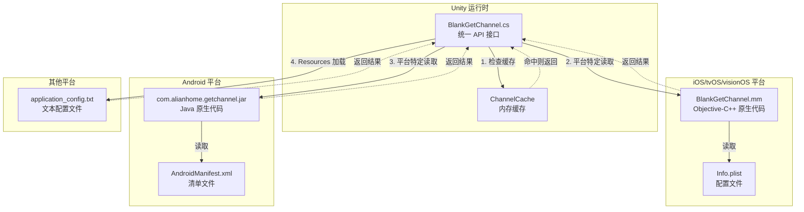
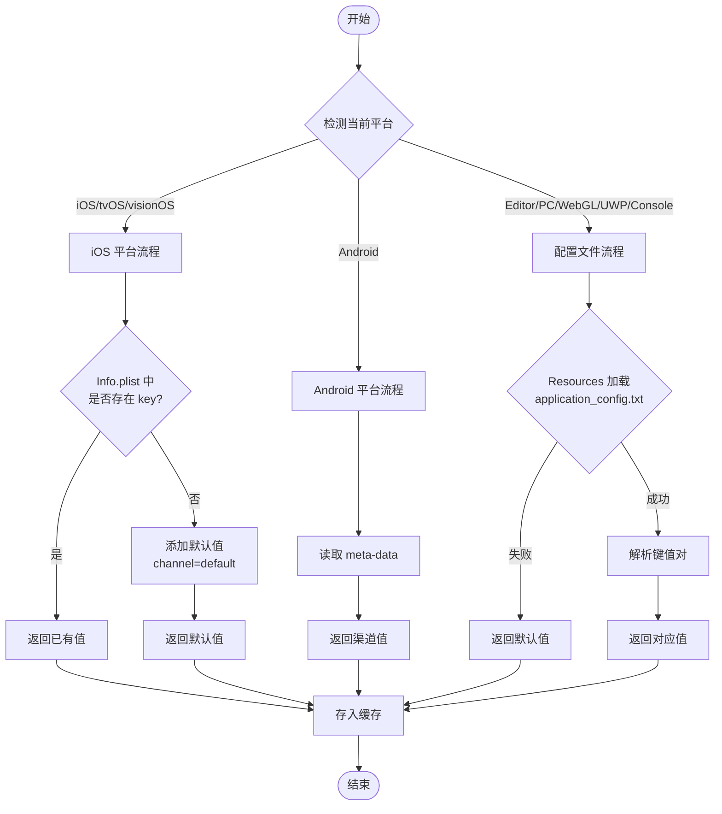
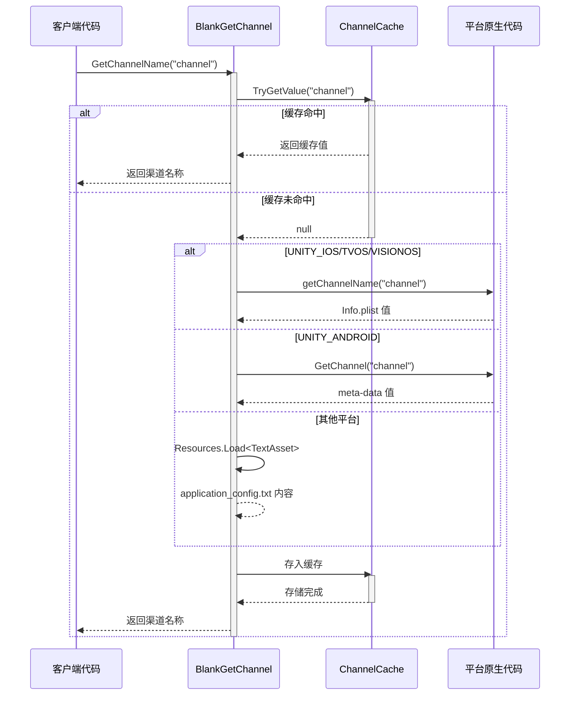

# 平台配置

本章节详细介绍 GameFrameX GetChannel 插件在不同平台上的配置方法，包括 iOS/tvOS/visionOS、Android、Editor、PC、WebGL、UWP 和主机平台（PS4、PS5、Xbox One、Nintendo Switch）的配置文件设置。

## 概述

GameFrameX GetChannel 插件通过统一的 API 接口获取各平台的渠道信息。为了实现跨平台支持，每个平台都有其特定的数据来源和读取方式：

| 平台 | 配置源 | 读取方式 |
|------|--------|----------|
| iOS/tvOS/visionOS | Info.plist | 原生 Objective-C++ 方法调用 |
| Android | AndroidManifest.xml | Android Java 反射调用 |
| Editor/PC/WebGL/UWP/Console | application_config.txt | Unity Resources 加载 |

## 架构设计



### 组件说明

| 组件 | 位置 | 职责 |
|------|------|------|
| BlankGetChannel | Runtime/BlankGetChannel.cs | 提供统一的 C# API，管理缓存和平台分支 |
| PostProcessBuildHandler | Editor/PostProcessBuildHandler.cs | iOS 构建后自动添加默认渠道配置 |
| BlankGetChannel.mm | Plugins/iOS/BlankGetChannel/ | iOS 平台原生实现，读取 Info.plist |
| com.alianhome.getchannel.jar | Plugins/Android/ | Android 平台原生实现，读取 meta-data |

## iOS/tvOS/visionOS 平台配置

### Info.plist 配置

在 Xcode 项目的 `Info.plist` 文件中添加渠道信息。使用 **String** 类型键值对：

```xml
<!-- 必选：主渠道 -->
<key>channel</key>
<string>ios_cn_taptap</string>

<!-- 可选：子渠道 -->
<key>sub_channel</key>
<string>beta</string>

<!-- 可选：其他自定义键 -->
<key>app_id</key>
<string>123456789</string>
```
> Source: [README.md](https://github.com/GameFrameX/com.gameframex.unity.getchannel/blob/main/README.md#L96-L104)

### 自动默认配置

插件包含构建后处理器 `PostProcessBuildHandler.cs`，会在 iOS 构建时自动执行以下逻辑：

```csharp
// PostProcessBuildHandler.cs 核心逻辑
const string channelKey = "channel";
const string channelValue = "default";

string plistPath = path + "/Info.plist";
PlistDocument plist = new PlistDocument();
plist.ReadFromString(File.ReadAllText(plistPath));
if (!plist.root.values.TryGetValue(channelKey, out var value))
{
    plist.root.SetString(channelKey, channelValue);
    plist.WriteToFile(plistPath);
    Debug.Log("配置渠道成功=>" + channelValue);
}
```
> Source: [PostProcessBuildHandler.cs](https://github.com/GameFrameX/com.gameframex.unity.getchannel/blob/main/Editor/PostProcessBuildHandler.cs#L31-L48)

**自动配置规则：**
- 如果 `Info.plist` 中**不存在** `channel` 键 → 自动添加 `channel = "default"`
- 如果 `Info.plist` 中**已存在** `channel` 键 → 跳过修改，保留原值

### iOS 原生实现

iOS 平台通过 Objective-C++ 实现渠道读取：

```cpp
// Plugins/iOS/BlankGetChannel/BlankGetChannel.mm
char * getChannelName(char * channel_name) {
    NSString* channel_name_String = [NSString stringWithUTF8String:channel_name];
    NSString* File = [[NSBundle mainBundle] pathForResource:@"Info" ofType:@"plist"];
    NSMutableDictionary* dict = [[NSMutableDictionary alloc] initWithContentsOfFile:File];
    NSString * channel_value = [dict objectForKey:channel_name_String];
    if (channel_value != nil) {
        return StringToCharArray(channel_value);
    }
    channel_value = @"unknown";
    return StringToCharArray(channel_value);
}
```
> Source: [BlankGetChannel.mm](https://github.com/GameFrameX/com.gameframex.unity.getchannel/blob/main/Plugins/iOS/BlankGetChannel/BlankGetChannel.mm#L25-L35)

## Android 平台配置

### AndroidManifest.xml 配置

在 `AndroidManifest.xml` 的 `<application>` 标签内添加 `<meta-data>` 标签：

```xml
<application ...>
    <activity ...>
        <!-- 活动配置 -->
    </activity>

    <!-- 必选：主渠道 -->
    <meta-data
        android:name="channel"
        android:value="android_cn_taptap" />

    <!-- 可选：子渠道 -->
    <meta-data
        android:name="sub_channel"
        android:value="beta" />

    <!-- 可选：其他自定义键 -->
    <meta-data
        android:name="app_id"
        android:value="123456789" />
</application>
```
> Source: [README.md](https://github.com/GameFrameX/com.gameframex.unity.getchannel/blob/main/README.md#L112-L128)

### Android 原生实现

插件内置了 Android 原生 JAR 包 (`com.alianhome.getchannel.jar`)，通过 Android Java 反射调用：

```csharp
// BlankGetChannel.cs 中的 Android 读取逻辑
#if UNITY_ANDROID
using (AndroidJavaClass androidJavaClass = new AndroidJavaClass("com.alianhome.getchannel.MainActivity"))
{
    channelName = androidJavaClass.CallStatic<string>("GetChannel", channelKey);
}
#endif
```
> Source: [BlankGetChannel.cs](https://github.com/GameFrameX/com.gameframex.unity.getchannel/blob/main/Runtime/BlankGetChannel.cs#L131-L135)

## Editor/PC/WebGL/UWP/主机平台配置

### 配置文件创建

在 Unity 项目的 `Assets/Resources` 文件夹下创建 `application_config.txt` 文件：

**文件位置：** `Assets/Resources/application_config.txt`

**文件格式：**
```
# 每行一个键值对，格式为 key=value
# # 开头为注释

# 必选：主渠道
channel=editor_cn_test

# 可选：子渠道
sub_channel=beta

# 可选：其他自定义键
app_id=123456789
```
> Source: [README.md](https://github.com/GameFrameX/com.gameframex.unity.getchannel/blob/main/README.md#L136-L142)

### 读取实现

```csharp
// BlankGetChannel.cs 中的文本配置读取逻辑
var textAsset = Resources.Load<TextAsset>("application_config");
if (textAsset != null)
{
    var lines = textAsset.text.Split(new string[] { "\n", "\r", "\r\n" }, StringSplitOptions.RemoveEmptyEntries);
    foreach (var line in lines)
    {
        var split = line.Split(new string[] { "=" }, StringSplitOptions.RemoveEmptyEntries);
        if (split.Length > 1)
        {
            var key = split[0].Trim();
            var channelValue = split[1].Trim();
            ChannelCache[key] = channelValue;
        }
    }
}
```
> Source: [BlankGetChannel.cs](https://github.com/GameFrameX/com.gameframex.unity.getchannel/blob/main/Runtime/BlankGetChannel.cs#L106-L121)

### 支持的平台

此配置方式适用于以下平台：

| 平台 | 宏定义 |
|------|--------|
| Unity Editor | `UNITY_EDITOR` |
| Windows PC | `UNITY_STANDALONE_WIN` |
| macOS PC | `UNITY_STANDALONE_OSX` |
| Linux PC | `UNITY_STANDALONE_LINUX` |
| WebGL | `UNITY_WEBGL` |
| UWP/WSA | `UNITY_WSA` |
| PlayStation 4 | `UNITY_PS4` |
| PlayStation 5 | `UNITY_PS5` |
| Xbox One | `UNITY_XBOXONE` |
| Nintendo Switch | `UNITY_SWITCH` |

## 配置流程图



## 渠道获取流程



## 配置注意事项

### 键名一致性

**重要：** 调用 `BlankGetChannel.GetChannelName(string key)` 时使用的键名必须与对应平台配置文件中设置的键名完全一致。

| 平台 | 配置键名 | 读取方式 |
|------|----------|----------|
| iOS/tvOS/visionOS | 区分大小写 | 直接匹配 |
| Android | 区分大小写 | 直接匹配 |
| 文本文件 | 区分大小写 | 直接匹配 |

### 默认值处理

当指定键名不存在时，API 会返回默认值：

```csharp
// 默认参数
BlankGetChannel.GetChannelName();  // key="channel", defaultValue="default"

// 指定默认值
BlankGetChannel.GetChannelName("sub_channel", "unknown");
```
> Source: [BlankGetChannel.cs](https://github.com/GameFrameX/com.gameframex.unity.getchannel/blob/main/Runtime/BlankGetChannel.cs#L98)

### 缓存机制

插件使用内存缓存避免重复读取配置文件：

```csharp
private static readonly Dictionary<string, string> ChannelCache = new Dictionary<string, string>(32);
```
> Source: [BlankGetChannel.cs](https://github.com/GameFrameX/com.gameframex.unity.getchannel/blob/main/Runtime/BlankGetChannel.cs#L57)

**缓存特点：**
- 首次调用时读取配置文件
- 后续调用直接从内存返回
- 进程结束时缓存销毁
- 不同 key 分别缓存

## 平台配置快速参考表

| 平台 | 配置文件 | 键类型 | 示例键值 |
|------|-----------|--------|----------|
| iOS/tvOS/visionOS | Info.plist | String | `<key>channel</key><string>ios_cn_taptap</string>` |
| Android | AndroidManifest.xml | meta-data | `android:name="channel" android:value="android_cn_taptap"` |
| 其他平台 | application_config.txt | key=value | `channel=editor_cn_test` |

## 常见问题

### Q1: Android 平台返回 "default" 而非实际配置值

**原因：** Android 原生 JAR 包的 Java 类路径可能与实际项目不匹配。

**解决方案：**
- 检查 AndroidManifest.xml 中的 `<meta-data>` 标签是否正确配置在 `<application>` 标签内
- 确保 `android:name` 属性值与代码中传入的键名一致
- 可在 Android Studio 中检查 Logcat 输出确认调用结果

### Q2: iOS 构建后渠道值为 "unknown"

**原因：** iOS 原生代码读取 Info.plist 失败或键名不匹配。

**解决方案：**
- 确认 Info.plist 中存在对应的键名
- 检查键名大小写是否完全匹配
- 确认 Info.plist 已正确打包到 Xcode 项目中

### Q3: Editor 模式下读取不到配置

**原因：** application_config.txt 文件位置或格式不正确。

**解决方案：**
- 确保文件位于 `Assets/Resources/application_config.txt`
- 确保文件扩展名为 `.txt` 而非 `.json` 或其他
- 检查文件编码，建议使用 UTF-8 无 BOM 格式
- 文件格式必须为标准的 `key=value` 格式

### Q4: Unity 代码裁剪导致获取不到渠道

**原因：** Unity 的 IL2CPP 代码裁剪可能移除了插件相关代码。

**解决方案：**
- 插件已包含 `link.xml` 文件防止代码被裁剪
- 如仍有问题，可在项目的 `link.xml` 中添加：
```xml
<linker>
    <assembly fullname="BlankGetChannel.Runtime" preserve="all"/>
</linker>
```

## 相关链接

- [快速开始](./3-getting-started) - 快速集成指南
- [示例](./5-samples) - 代码示例
- [API 参考](./6-api-reference) - 完整 API 文档
- [常见问题](./7-troubleshooting) - 故障排除
- [GitHub 仓库](https://github.com/GameFrameX/com.gameframex.unity.getchannel) - 官方仓库
