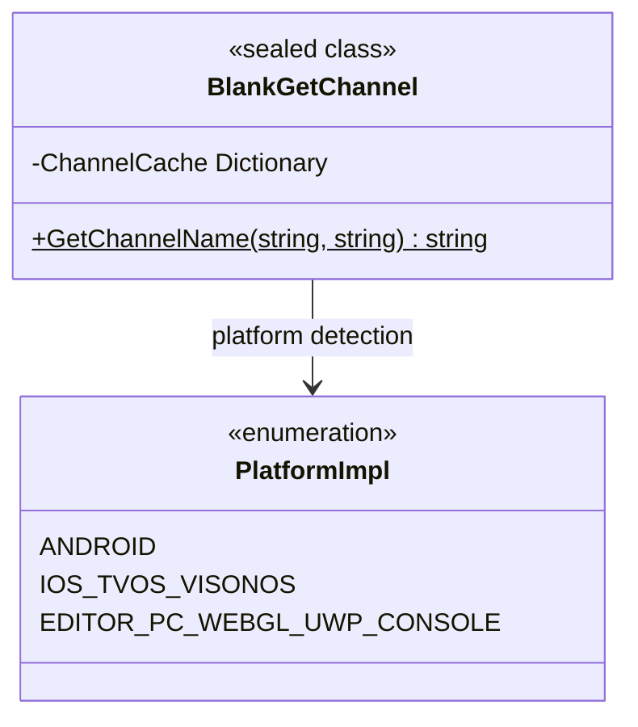

# API 参考

本文档详细介绍 `BlankGetChannel` 类提供的所有公共 API 方法，包括方法签名、参数说明、返回值以及平台行为差异。

## 概述

`BlankGetChannel` 是一个跨平台的渠道信息获取工具类，为 Unity 项目提供统一的接口来获取不同平台的渠道标识符。该类支持 iOS、tvOS、visionOS、Android、Editor、PC、WebGL、UWP 以及多种主机平台（PS4、PS5、Xbox One、Nintendo Switch）。

**设计意图**：通过统一的 API 抽象底层平台差异，开发者只需调用同一方法即可获取渠道信息，无需关心各平台的具体实现细节。



## API Reference

### `BlankGetChannel.GetChannelName(string channelKey = "channel", string defaultValue = "default"): string`

获取指定渠道键对应的渠道名称。

**方法签名：**
```csharp
[UnityEngine.Scripting.Preserve]
public static string GetChannelName(string channelKey = "channel", string defaultValue = "default")
```
> Source: [Runtime/BlankGetChannel.cs](https://github.com/GameFrameX/com.gameframex.unity.getchannel/blob/main/Runtime/BlankGetChannel.cs#L98-L141)

**功能说明：**
根据当前运行平台从对应的配置源读取渠道信息，并返回指定键名对应的值。该方法内部实现了缓存机制，首次读取后会缓存结果，后续调用直接返回缓存值，避免重复读取配置文件带来的性能开销。

**参数说明：**

| 参数名 | 类型 | 默认值 | 必填 | 说明 |
|--------|------|--------|------|------|
| `channelKey` | `string` | `"channel"` | 否 | 渠道键名，用于标识要获取的渠道配置项。默认值为 `"channel"`，对应各平台的主渠道配置。 |
| `defaultValue` | `string` | `"default"` | 否 | 当未找到渠道配置时返回的默认值。当平台配置文件中不存在指定的键时，会返回此默认值。 |

**返回值：**

| 类型 | 说明 |
|------|------|
| `string` | 渠道名称字符串。如果在配置源中找到了 `channelKey` 对应的值，则返回该值；否则返回 `defaultValue`。 |

**平台行为差异：**

| 平台 | 配置源 | 读取方式 |
|------|--------|----------|
| Android | `AndroidManifest.xml` 中的 `<meta-data>` 标签 | 通过 `AndroidJavaClass` 调用 Java 原生方法 `GetChannel()` |
| iOS/tvOS/visionOS | `Info.plist` 中的键值对 | 通过 P/Invoke 调用原生方法 `getChannelName()` |
| Editor/PC/WebGL/UWP/Console | `Resources/application_config.txt` 文件 | 通过 `Resources.Load<TextAsset>()` 读取文本文件并解析 |

**内部实现细节：**

1. **缓存机制**：方法内部使用静态字典 `ChannelCache` 存储已读取的渠道信息，避免重复读取配置文件。

```csharp
private static readonly Dictionary<string, string> ChannelCache = new Dictionary<string, string>(32);
```
> Source: [Runtime/BlankGetChannel.cs](https://github.com/GameFrameX/com.gameframex.unity.getchannel/blob/main/Runtime/BlankGetChannel.cs#L57)

2. **条件编译**：不同平台使用 `#if UNITY_ANDROID`、`#if UNITY_IOS || UNITY_TVOS || UNITY_VISIONOS` 等预处理指令进行平台分支处理。

3. **配置解析**：对于 Editor/PC/WebGL/UWP/Console 平台，配置文件解析逻辑如下：

```csharp
var lines = textAsset.text.Split(new string[] { "\n", "\r", "\r\n" }, StringSplitOptions.RemoveEmptyEntries);
foreach (var line in lines)
{
    var split = line.Split(new string[] { "=" }, StringSplitOptions.RemoveEmptyEntries);
    if (split.Length > 1)
    {
        var key = split[0].Trim();
        var channelValue = split[1].Trim();
        ChannelCache[key] = channelValue;
    }
}
```
> Source: [Runtime/BlankGetChannel.cs](https://github.com/GameFrameX/com.gameframex.unity.getchannel/blob/main/Runtime/BlankGetChannel.cs#L110-L120)

**使用示例：**

```csharp
// 使用默认参数获取主渠道
string channel = BlankGetChannel.GetChannelName();
```
> Source: [Runtime/BlankGetChannel.cs](https://github.com/GameFrameX/com.gameframex.unity.getchannel/blob/main/Runtime/BlankGetChannel.cs#L91)

```csharp
// 获取指定键的渠道，并设置默认值
string subChannel = BlankGetChannel.GetChannelName("sub_channel", "unknown");
```
> Source: [Runtime/BlankGetChannel.cs](https://github.com/GameFrameX/com.gameframex.unity.getchannel/blob/main/Runtime/BlankGetChannel.cs#L94)

```csharp
// 在实际项目中的使用示例
string appChannel = BlankGetChannel.GetChannelName("appchannel");
Debug.Log("Current channel: " + appChannel);
```
> Source: [Sample~/BlankGetChannelExample.cs](https://github.com/GameFrameX/com.gameframex.unity.getchannel/blob/main/Sample~/BlankGetChannelExample.cs#L12)

**异常情况：**

| 场景 | 行为 |
|------|------|
| 配置文件中未找到指定键 | 返回 `defaultValue` 参数值 |
| Android 平台 Java 类调用失败 | 返回 `defaultValue`（由 Java 层处理） |
| iOS/tvOS/visionOS 平台原生方法调用失败 | 返回 `defaultValue`（由原生层处理） |
| Resources 文件不存在 | 返回 `defaultValue`，并将 `defaultValue` 存入缓存 |

## 内部方法

### iOS/tvOS/visionOS 原生方法接口

```csharp
#if UNITY_IOS || UNITY_TVOS || UNITY_VISIONOS
[DllImport("__Internal")]
private static extern string getChannelName(string channelKey);
#endif
```
> Source: [Runtime/BlankGetChannel.cs](https://github.com/GameFrameX/com.gameframex.unity.getchannel/blob/main/Runtime/BlankGetChannel.cs#L47-L48)

**说明：** 此方法为私有方法，通过 P/Invoke 调用 iOS/tvOS/visionOS 平台的原生代码，从 `Info.plist` 中读取渠道信息。开发者无需直接调用此方法，应使用 `GetChannelName()` 公有方法。

## 配置要求汇总

| 平台 | 配置文件 | 键名设置方式 |
|------|----------|--------------|
| Android | `AndroidManifest.xml` | `<meta-data android:name="channel" android:value="xxx" />` |
| iOS/tvOS/visionOS | `Info.plist` | `<key>channel</key><string>xxx</string>` |
| Editor/PC/WebGL/UWP/Console | `Resources/application_config.txt` | `channel=xxx` |

> 详细配置说明请参阅 [平台配置](./4-platform-configuration) 文档。

## 相关链接

- [概述](./1-overview) - 项目整体介绍与功能概述
- [安装](./2-installation) - 包安装与环境配置
- [快速开始](./3-getting-started) - 快速上手指南
- [平台配置](./4-platform-configuration) - 各平台详细配置说明
- [示例](./5-samples) - 完整代码示例
- [常见问题](./7-troubleshooting) - 常见问题与解决方案
