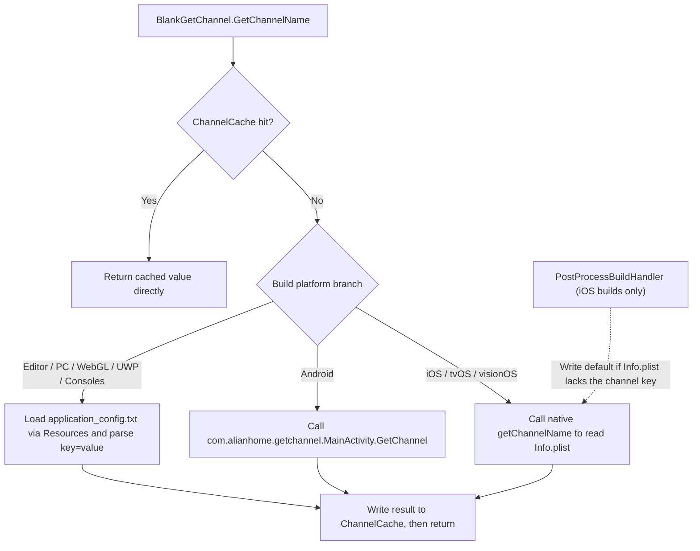

# How It Works: Channel Reading Process

When `BlankGetChannel.GetChannelName()` is called, the component first checks the in-process cache `ChannelCache`. On a cache miss, it takes one of three different read paths depending on the current build platform (native jar for Android, native Info.plist for iOS, or reading `Resources/application_config.txt` for Editor/PC), and returns the result after writing it back to the cache. The entire entry point is a single static method, defined in [Runtime/BlankGetChannel.cs](https://github.com/GameFrameX/com.gameframex.unity.getchannel/blob/main/Runtime/BlankGetChannel.cs#L98-L141).

## Reading Process Overview



## Reading Sources by Platform

| Platform (Compilation Define) | Configuration Source | Code Entry Point |
|------|------|------|
| `UNITY_ANDROID` | The `meta-data android:name="channel"` of the main launch Activity in AndroidManifest.xml | `new AndroidJavaClass("com.alianhome.getchannel.MainActivity")` calls the static method `GetChannel`; the native implementation is packaged in [Plugins/Android/com.alianhome.getchannel.jar](https://github.com/GameFrameX/com.gameframex.unity.getchannel/blob/main/Plugins/Android/com.alianhome.getchannel.jar) |
| `UNITY_IOS` / `UNITY_TVOS` / `UNITY_VISIONOS` | The String key `channel` in Info.plist | `[DllImport("__Internal")] getChannelName(channelKey)`; see the native implementation at [Plugins/iOS/BlankGetChannel/BlankGetChannel.mm](https://github.com/GameFrameX/com.gameframex.unity.getchannel/blob/main/Plugins/iOS/BlankGetChannel/BlankGetChannel.mm) |
| `UNITY_STANDALONE` / `UNITY_EDITOR` / `UNITY_WEBGL` / `UNITY_WSA` / `UNITY_PS4` / `UNITY_PS5` / `UNITY_XBOXONE` / `UNITY_SWITCH` | `Resources/application_config.txt` (each line is `key=value`) | `Resources.Load<TextAsset>("application_config")`, parsed line by line |

Default values in the method signature: the first parameter is `channelKey = "channel"` and the second is `defaultValue = "default"`, meaning the string `"default"` is returned when no channel is configured.

## Step 1: Cache Hit Check

The method entry first checks the static dictionary `ChannelCache` (initial capacity 32). On a hit it returns immediately without triggering any platform reads:

```csharp
private static readonly Dictionary<string, string> ChannelCache = new Dictionary<string, string>(32);

public static string GetChannelName(string channelKey = "channel", string defaultValue = "default")
{
    if (ChannelCache.TryGetValue(channelKey, out var value))
    {
        return value;
    }

    string channelName = defaultValue;
```

Source: [Runtime/BlankGetChannel.cs](https://github.com/GameFrameX/com.gameframex.unity.getchannel/blob/main/Runtime/BlankGetChannel.cs#L57-L105)

Note: The cache has no invalidation mechanism; the value read first within the process's lifetime will be reused indefinitely.

## Step 2: Editor/PC Path — Parsing application_config.txt

Editor, Standalone, WebGL, UWP, and console platforms take the `Resources.Load` branch. The entire file is parsed line by line and **all key-value pairs** are written to the cache (not just the currently requested key), so subsequent reads of other keys (such as `sub_channel`) also go straight to the cache:

```csharp
var textAsset = Resources.Load<TextAsset>("application_config");
if (textAsset != null)
{
    var lines = textAsset.text.Split(new string[] { "\n", "\r", "\r\n" }, StringSplitOptions.RemoveEmptyEntries);
    foreach (var line in lines)
    {
        var split = line.Split(new string[] { "=" }, StringSplitOptions.RemoveEmptyEntries);
        if (split.Length > 1)
        {
            var key = split[0].Trim();
            var channelValue = split[1].Trim();
            ChannelCache[key] = channelValue;
        }
    }
}
else
{
    ChannelCache[channelKey] = defaultValue;
}
```

Source: [Runtime/BlankGetChannel.cs](https://github.com/GameFrameX/com.gameframex.unity.getchannel/blob/main/Runtime/BlankGetChannel.cs#L106-L125)

When the file does not exist or the key is not configured, `defaultValue` is written to the cache and returned. Parsing splits at the first `=`; the content after the equals sign is trimmed as a whole and used as the value, so values can contain ordinary characters other than `=`.

## Step 3: Android Path — Calling the Native jar

```csharp
using (AndroidJavaClass androidJavaClass = new AndroidJavaClass("com.alianhome.getchannel.MainActivity"))
{
    channelName = androidJavaClass.CallStatic<string>("GetChannel", channelKey);
}
```

Source: [Runtime/BlankGetChannel.cs](https://github.com/GameFrameX/com.gameframex.unity.getchannel/blob/main/Runtime/BlankGetChannel.cs#L131-L135)

The C# side simply passes `channelKey` through; the value-retrieval logic lives inside the jar (reading the Manifest's meta-data).

## Step 4: iOS/tvOS/visionOS Path — P/Invoke to a Native Method

```csharp
[DllImport("__Internal")]
private static extern string getChannelName(string channelKey);
```

Source: [Runtime/BlankGetChannel.cs](https://github.com/GameFrameX/com.gameframex.unity.getchannel/blob/main/Runtime/BlankGetChannel.cs#L47-L48)

## Step 5: Writing the Result Back to the Cache

The return values of all three branches converge on these two lines at the end of the method, so subsequent calls with the same key will not trigger platform reads again:

```csharp
ChannelCache[channelKey] = channelName;
return channelName;
```

Source: [Runtime/BlankGetChannel.cs](https://github.com/GameFrameX/com.gameframex.unity.getchannel/blob/main/Runtime/BlankGetChannel.cs#L139-L140)

## Companion Build Post-Processing: iOS Fallback Write

After an iOS build completes, the editor script `PostProcessBuildHandler` (`[PostProcessBuild(99)]`, `BuildTarget.iOS` only) reads the generated Info.plist: if the `channel` key is missing, it writes `"default"` and writes the file back; if the key already exists, it skips and logs `已有渠道,跳过设置=>`:

```csharp
string plistPath = path + "/Info.plist";
PlistDocument plist = new PlistDocument();
plist.ReadFromString(File.ReadAllText(plistPath));
if (!plist.root.values.TryGetValue(channelKey, out var value))
{
    plist.root.SetString(channelKey, channelValue);
    plist.WriteToFile(plistPath);
    Debug.Log("配置渠道成功=>" + channelValue);
}
else
{
    Debug.Log("已有渠道,跳过设置=>" + value);
}
```

Source: [Editor/PostProcessBuildHandler.cs](https://github.com/GameFrameX/com.gameframex.unity.getchannel/blob/main/Editor/PostProcessBuildHandler.cs#L31-L49)

In other words, the `channel` key read at runtime on a real iOS device is guaranteed to exist (values manually configured in Info.plist take precedence). Exceptions are wrapped in `try/catch`; a failure only triggers `Debug.LogException` and does not interrupt the build.

## Usage Example

The sample component reads the channel with the custom key `appchannel` when the button is clicked:

```csharp
public class BlankGetChannelExample : MonoBehaviour
{
    private string value;
    void OnGUI()
    {
        GUILayout.Label(value);
        if (GUILayout.Button("GET", GUILayout.Width(200), GUILayout.Height(100)))
        {
            value = BlankGetChannel.GetChannelName("appchannel");
        }
    }
}
```

Source: [Sample~/BlankGetChannelExample.cs](https://github.com/GameFrameX/com.gameframex.unity.getchannel/blob/main/Sample~/BlankGetChannelExample.cs#L4-L15)

## Common Errors

| Symptom | Cause | Workaround |
|------|------|------|
| Always returns `"default"` | Under Editor/PC, the Resources directory lacks `application_config.txt`, or the file does not contain the corresponding key | Place this file under `Assets/Resources/` and write `channel=xxx`; note that the file is loaded without its extension, while the actual file is a `.txt` file |
| Android fails to get the value | The main launch Activity in the Manifest does not configure `meta-data android:name="channel"` | Add `<meta-data android:name="channel" android:value="android_cn_taptap" />` inside the main Activity |
| iOS fails to get the value | If the Info.plist lacks the `channel` key, the build post-processor writes `"default"`, and `default` is then read throughout runtime | Before building, configure a String-typed `channel` key in the Xcode project's Info.plist |
| Configuration changes have no effect at runtime | `ChannelCache` has no in-process invalidation mechanism; the value from the first read is reused forever | Restart the app / re-enter Play Mode |

## Related Links

- For detailed steps on configuring channels for each platform: [README.zh-CN.md](https://github.com/GameFrameX/com.gameframex.unity.getchannel/blob/main/README.zh-CN.md) in the repository
- Version history: [CHANGELOG.md](https://github.com/GameFrameX/com.gameframex.unity.getchannel/blob/main/CHANGELOG.md)