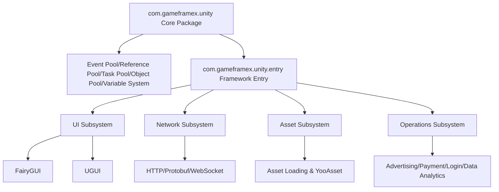

# Project Introduction and Features

GameFrameX Unity is the Unity client implementation of the GameFrameX comprehensive solution, providing 90+ modular components covering the entire game development and operations pipeline — from core framework, asset management, UI system, and network communication to advertising, payment, login, and data analytics. The framework is compatible with Unity 2019.4 and above, and is positioned as an "integrated front-end and back-end solution for indie games."

## Core Features

- **Modular Design** — Each component is an independent package, imported on demand into the Unity project's `Packages/manifest.json`, without interfering with each other
- **Hot Update Support** — Integrates HybridCLR, supporting C# hot updates; also provides an XLua adapter package
- **Multiple UI Solutions** — Supports both FairyGUI and UGUI, freely chosen based on your team's tech stack
- **Async-First** — Async/await asynchronous programming model based on UniTask
- **Full Platform Coverage** — iOS, Android, WebGL, WeChat/Douyin/Alipay mini-games
- **Rich Operations Components** — Advertising (Pangle, TopOn), payment (Alipay, Apple, Google), login (QQ, WeChat, Apple, Facebook, Google), data analytics, object storage, and more, ready out of the box

## Quick Start

### 1. Configure Scoped Registry

Add GameFrameX's scoped registry to the Unity project's `Packages/manifest.json`:

```json
{
  "scopedRegistries": [
    {
      "name": "GameFrameX",
      "url": "https://gameframex.upm.alianblank.uk",
      "scopes": [
        "com.gameframex"
      ]
    }
  ],
  "dependencies": {
    "com.gameframex.unity": "1.11.0"
  }
}
```

Source: [README.zh-CN.md](https://github.com/GameFrameX/GameFrameX.Unity/blob/main/README.zh-CN.md#L38-L57)

### 2. Add Required Components

Add component packages on demand in `dependencies`; version numbers can be found on the [Releases](https://github.com/GameFrameX/GameFrameX.Unity/releases) page. Example of a common combination:

```json
{
  "dependencies": {
    "com.gameframex.unity": "1.11.0",
    "com.gameframex.unity.asset": "2.0.0",
    "com.gameframex.unity.ui": "2.1.1",
    "com.gameframex.unity.ui.fairygui": "3.0.0",
    "com.gameframex.unity.procedure": "1.0.4",
    "com.gameframex.unity.event": "1.0.2",
    "com.gameframex.unity.fsm": "1.0.3",
    "com.gameframex.unity.network": "2.5.1",
    "com.gameframex.unity.sound": "1.0.6",
    "com.gameframex.unity.localization": "2.0.0"
  }
}
```

Source: [README.zh-CN.md](https://github.com/GameFrameX/GameFrameX.Unity/blob/main/README.zh-CN.md#L59-L82)

## How It Works at a Glance

The core package of GameFrameX, `com.gameframex.unity`, provides the framework runtime and foundational editor capabilities, covering the event pool, reference pool, task pool, object pool, and variable system. Other components (such as UI, network, and asset management) all build on this foundation as independent packages, distributed on demand through the Unity Package Manager's scoped registry mechanism.



Source: [README.zh-CN.md](https://github.com/GameFrameX/GameFrameX.Unity/blob/main/README.zh-CN.md#L85-L113)

## Component Overview

Version numbers are automatically obtained via the [GameFrameX UPM Registry](https://gameframex.upm.alianblank.uk). The table below summarizes the key components of each group; see [README.zh-CN.md](https://github.com/GameFrameX/GameFrameX.Unity/blob/main/README.zh-CN.md) for the complete list.

| Group | Representative Components | Purpose |
|------|---------|------|
| Core Framework | com.gameframex.unity, entry, event, fsm, procedure | Runtime skeleton, event system, state machine, procedure management |
| Asset Management | com.gameframex.unity.asset, download, builder | Asset loading, file downloading, build pipeline |
| UI Framework | com.gameframex.unity.ui, ui.fairygui, ui.ugui | UI foundation and FairyGUI/UGUI adaptation |
| Network Communication | com.gameframex.unity.web, web.protobuff, psygames.unitywebsocket, webview | HTTP, Protobuf, WebSocket, WebView |
| Data & Configuration | com.gameframex.unity.config, localization, focus-creative-games.luban | Configuration management, localization, Luban config generation |
| Audio & Animation | com.gameframex.unity.sound, demigiant.dotween, esotericsoftware.spine | Audio, DoTween animation, Spine skeletal animation |
| Scene & Settings | com.gameframex.unity.scene, setting | Scene switching, player settings |
| Hot Update | com.gameframex.unity.tencent.xlua, xlua | XLua hot update solution |
| Advertising | advertisement, advertisement.csj, advertisement.topon and mini-game ads | Pangle (CSJ), TopOn, WeChat/Douyin/Alipay/Kuaishou mini-game ads |
| Payment | com.gameframex.unity.payment, payment.alipay, payment.apple, payment.google | Unified payment interface and third-party implementations |
| Login | login.apple, login.facebook, login.google, login.qq, login.wechat | Login SDKs for various platforms |
| Data Analytics | gameanalytics, sentry, adjust, etc. | Data statistics, error tracking, attribution analysis |
| Object Storage | objectstorage, objectstorage.aliyun, objectstorage.qiniu, objectstorage.tencent | Alibaba Cloud OSS, Qiniu, Tencent Cloud COS |
| Mini-games | minigame.wechat, tuyoogame.yooasset.minigame.* | WeChat/YooAsset mini-game adaptation |
| Platform Tools | getchannel, operationclipboard, systeminfo, sharesdk, etc. | Channel ID, clipboard, device identifier, sharing |

Source: [README.zh-CN.md](https://github.com/GameFrameX/GameFrameX.Unity/blob/main/README.zh-CN.md#L85-L239)

## Next Steps

- View complete component versions and descriptions: [README.zh-CN.md](https://github.com/GameFrameX/GameFrameX.Unity/blob/main/README.zh-CN.md)
- Integrate procedure management: [Procedure Component](https://github.com/GameFrameX/GameFrameX.Unity/blob/main/README.zh-CN.md)
- Integrate the event system: [Event Component](https://github.com/GameFrameX/GameFrameX.Unity/blob/main/README.zh-CN.md)
- Integrate network communication: [Network/Web Component](https://github.com/GameFrameX/GameFrameX.Unity/blob/main/README.zh-CN.md)
- Official documentation site: [GameFrameX Documentation](https://gameframex.doc.alianblank.com)
- Community support: QQ Group 467608841