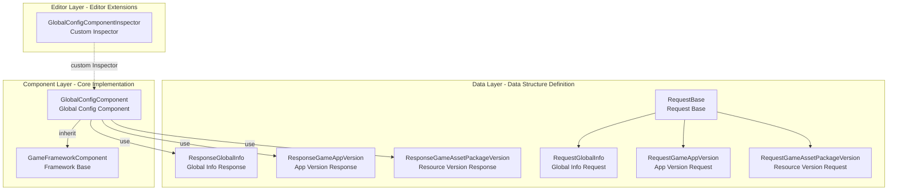

# Overview

The GlobalConfig component is a core part of the GameFrameX framework, providing global configuration management capabilities for Unity game projects. This component centrally manages application version check, resource version check, AOT code list, and other global configuration information, supporting both editor visual configuration and code dynamic settings.

## Overview

The GlobalConfig component is designed to solve the problem of scattered and difficult-to-manage global configurations in game projects. During game development, there are many configuration data items that need global access, such as server addresses, version check interfaces, app store links, etc. The traditional approach of hard-coding these configurations or scattering them across multiple configuration files leads to difficult maintenance and easy errors.

GlobalConfig component centrally manages all global configurations through a unified interface and standardized data model. This component inherits from `GameFrameworkComponent` and can be directly added to scenes as a Unity component, with global access provided through the GameFrameX framework's component management system. This design makes setting and retrieving configuration data simple and unified, while supporting both editor configuration and runtime dynamic settings modes.

The component's core features include four aspects: First, the `CheckAppVersionUrl` property stores the URL address for application version checking, enabling the game to query if new versions are available; second, the `CheckResourceVersionUrl` property stores the URL address for resource version checking, supporting resource management for hot update functionality; third, the `AOTCodeList` and `AOTCodeLists` properties configure AOT supplementary metadata lists, solving generic issues in IL2CPP build mode; finally, the `Content` property allows storing any additional content to meet business extension needs.

## Architecture Design

The GlobalConfig component uses a layered architecture design, divided into three parts: data layer, component layer, and editor layer. The data layer contains request and response classes for defining data structures for communication with servers; the component layer is the core `GlobalConfigComponent` class responsible for storing and accessing configuration data; the editor layer provides custom Inspector to simplify configuration work in the editor.

The data layer organizes request classes using an inheritance structure. `RequestBase` is the base class for all request classes, defining common properties including Language, AppVersion, Platform, PackageName, Channel, and SubChannel. Specific request classes like `RequestGlobalInfo`, `RequestGameAppVersion`, and `RequestGameAssetPackageVersion` inherit from this base class and can extend their own business fields as needed.

Response classes use a similar design pattern. `ResponseGlobalInfo` contains configuration information such as CheckAppVersionUrl, CheckResourceVersionUrl, AOTCodeList, and Content; `ResponseGameAppVersion` contains app version check results including whether mandatory update is required, download address, whether update is needed, update announcement, and update title; `ResponseGameAssetPackageVersion` contains resource version information including language, version number, asset package name, path, platform, download root path, package name, game version, and channel name.

The component layer's `GlobalConfigComponent` class inherits from `GameFrameworkComponent`, marked with `[DisallowMultipleComponent]` and `[AddComponentMenu("Game Framework/Global Config")]` attributes to ensure only one instance exists in the scene and facilitate finding in the editor menu. This class stores configuration data through serialized fields and provides property accessors supporting runtime modifications.

The editor layer's `GlobalConfigComponentInspector` inherits from `GameFrameworkInspector`, providing a custom Inspector interface for the component. This inspector displays configuration items by category, supporting visual configuration of various properties in edit mode while prohibiting editing at runtime to ensure data consistency.

## Core Features

GlobalConfig component provides the following core features:

**Version Check Interface Management** — The component provides `CheckAppVersionUrl` and `CheckResourceVersionUrl` properties for configuring application version check interface and resource version check interface. These two interfaces are key components of the game's hot update system. When the game starts, it queries the latest version information through these interfaces to determine whether to update the application or download new resource packages.

**AOT Code List Configuration** — When using IL2CPP for Unity project builds, some generic types may not work properly due to AOT compilation limitations. The component provides `AOTCodeList` and `AOTCodeLists` properties, allowing developers to configure AOT metadata lists that need supplementation, ensuring runtime generic instantiation works properly.

**Runtime Configuration Updates** — The component supports dynamically updating configuration data via code. Through the `SetOriginalData` method, you can set the original data string; through the `SetGlobalConfig` method, you can set the complete `ResponseGlobalInfo` object. This allows the game to fetch the latest global configuration from the server, achieving dynamic configuration updates without re-publishing.

**Global Configuration Access** — Components inheriting from GameFrameworkComponent can be conveniently accessed anywhere in the game through the framework's component management system. This ensures configuration data consistency and manageability, avoiding coupling issues caused by accessing via singletons or static variables.

## Use Cases

GlobalConfig component is suitable for the following typical use cases:

**Game Startup Configuration** — Game startup requires fetching server addresses, version check interfaces, and other basic configuration information. Storing these configurations in the GlobalConfig component allows other systems (such as network modules, update modules) to directly retrieve the required information from the component.

**Hot Update System Integration** — The hot update system needs to know the resource version check URL address. Through GlobalConfig component's centralized management of these URLs, the hot update system can flexibly read from the configuration without hard-coding.

**Multi-Channel Packaging** — Different channels may require different server addresses or configuration parameters. Through the GlobalConfig component, you can dynamically set corresponding configuration values based on channels, achieving single code supporting multiple channels.

**Dynamic Configuration Updates** — Some configuration parameters may need adjustment after the game goes live. Through the `SetGlobalConfig` method, fetch the latest configuration from the server to achieve dynamic configuration updates without players downloading the installation package again.

## Related Links

- [Installation](../2-installation.1-install-methods) - Learn how to install GlobalConfig component
- [Add to Scene](../3-getting-started.1-add-to-scene) - Learn how to use component in Unity scenes
- [Configure Properties](../3-getting-started.2-configure-properties) - Detailed description of each configuration property
- [Code Access](../3-getting-started.3-code-access) - Learn how to access global configuration in code
- [GlobalConfigComponent Details](../4-core-component.1-global-config-component) - Complete API reference for core component
- [Request Classes Details](../5-data-structures.1-request-classes) - Request data structure description
- [Response Classes Details](../5-data-structures.2-response-classes) - Response data structure description
- [Custom Inspector](../6-editor-configuration.1-custom-inspector) - Editor configuration details
- [AOT Code List Configuration](../7-aot-configuration.1-aot-code-list) - AOT configuration description
- [FAQ](../8-troubleshooting.1-faq) - FAQ