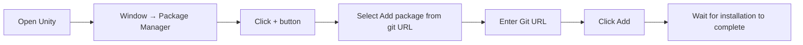
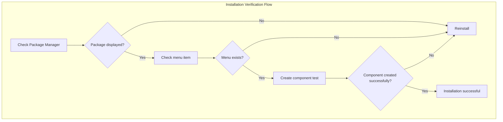

# Installation

This document describes how to install the GlobalConfig global configuration component in a Unity project.

## Overview

GlobalConfig is one of the core components of the GameFrameX framework, used for managing global configuration information for games, including application version check addresses, resource version check addresses, server addresses, etc. This component uses Unity Package Manager (UPM) for management and supports multiple installation methods to accommodate different development workflows.

## Installation Prerequisites

Before installing the GlobalConfig component, please ensure your development environment meets the following requirements:

| Requirement | Minimum Version | Description |
|-------------|-----------------|-------------|
| Unity Editor | 2017.1 | Supported Unity version |
| Package Manager | Built-in | Built-in from Unity 2017.1+ |

### Dependencies

GlobalConfig component depends on the following GameFrameX core packages:

| Dependency Package | Version Requirement | Description |
|-------------------|-------------------|-------------|
| com.gameframex.unity | 1.1.1 | GameFrameX core framework |
| com.gameframex.unity.web | 1.1.2 | Web network request component |

> **Note**: When using UPM installation, dependencies are automatically resolved and installed. You do not need to manually handle dependencies.

## Installation Methods

GlobalConfig component provides three installation methods. You can choose the one most suitable for your project needs.

### Method 1: Install via manifest.json (Recommended)

This is the most recommended installation method, facilitating version management and team collaboration. You need to add the package dependency in your project's `Packages/manifest.json` file.

**Steps:**

1. Find your Unity project's `Packages` folder
2. Open the `manifest.json` file with a text editor
3. Add the following under the `dependencies` node:

```json
{
  "dependencies": {
    "com.gameframex.unity.globalconfig": "https://github.com/GameFrameX/com.gameframex.unity.globalconfig.git"
  }
}
```

> **Note**: If you are using an old Git URL (`https://github.com/GameFrameX/com.gameframex.unity.globalconfig.git`), you can continue to use it, but it is recommended to update to the new official repository address.

**Example complete manifest.json:**

```json
{
  "dependencies": {
    "com.gameframex.unity.globalconfig": "https://github.com/GameFrameX/com.gameframex.unity.globalconfig.git",
    "com.unity.collab-proxy": "1.15.18",
    "com.unity.ide.rider": "3.0.15",
    "com.unity.ide.visualstudio": "2.0.16",
    "com.unity.ide.vscode": "1.2.5",
    "com.unity.test-framework": "1.1.31",
    "com.unity.textmeshpro": "3.0.6",
    "com.unity.timeline": "1.6.4",
    "com.unity.ugui": "1.0.0",
    "com.unity.modules.ai": "1.0.0",
    "com.unity.modules.androidjni": "1.0.0",
    "com.unity.modules.animation": "1.0.0",
    "com.unity.modules.assetbundle": "1.0.0",
    "com.unity.modules.audio": "1.0.0",
    "com.unity.modules.cloth": "1.0.0",
    "com.unity.modules.director": "1.0.0",
    "com.unity.modules.imageconversion": "1.0.0",
    "com.unity.modules.imgui": "1.0.0",
    "com.unity.modules.jsonserialize": "1.0.0",
    "com.unity.modules.particlesystem": "1.0.0",
    "com.unity.modules.physics": "1.0.0",
    "com.unity.modules.physics2d": "1.0.0",
    "com.unity.modules.screencapture": "1.0.0",
    "com.unity.modules.terrain": "1.0.0",
    "com.unity.modules.terrainphysics": "1.0.0",
    "com.unity.modules.tilemap": "1.0.0",
    "com.unity.modules.ui": "1.0.0",
    "com.unity.modules.uielements": "1.0.0",
    "com.unity.modules.umbra": "1.0.0",
    "com.unity.modules.unityanalytics": "1.0.0",
    "com.unity.modules.unitywebrequest": "1.0.0",
    "com.unity.modules.unitywebrequestassetbundle": "1.0.0",
    "com.unity.modules.unitywebrequestaudio": "1.0.0",
    "com.unity.modules.unitywebrequesttexture": "1.0.0",
    "com.unity.modules.unitywebrequestwww": "1.0.0",
    "com.unity.modules.vehicles": "1.0.0",
    "com.unity.modules.video": "1.0.0",
    "com.unity.modules.vr": "1.0.0",
    "com.unity.modules.wind": "1.0.0",
    "com.unity.modules.xr": "1.0.0"
  }
}
```

4. Save the file and return to Unity Editor
5. Wait for Package Manager to automatically download and import dependency packages

### Method 2: Install via Unity Package Manager

If you prefer using a graphical interface, you can install through Unity's built-in Package Manager.

**Steps:**

1. Open Unity Editor
2. Navigate to menu: **Window** -> **Package Manager**
3. In the Package Manager window, click the **+** button in the top left
4. Select **Add package from git URL...** option
5. Paste the following Git URL in the input field:

```
https://github.com/GameFrameX/com.gameframex.unity.globalconfig.git
```

6. Click the **Add** button to start installation
7. Wait for download and import to complete



### Method 3: Manual Installation (Local Development)

If you need to use a local development version or cannot access the network, you can use manual installation.

**Steps:**

1. Download the source code from GitHub repository:

   ```
   https://github.com/GameFrameX/com.gameframex.unity.globalconfig.git
   ```

2. Copy the downloaded folder contents to your Unity project's `Packages` directory
3. Unity will automatically recognize and load packages that conform to the specification
4. If you need to update the version, simply replace the folder contents

**Notes:**
- The package folder needs to contain a `package.json` file to be correctly recognized by Unity
- It is recommended to use a meaningful folder name, for example: `Packages/com.gameframex.unity.globalconfig/`

## Installation Verification

After installation, you can verify success by:

1. **Check Package Manager**: Confirm that `Game Frame X Global Config` package is displayed in the Package Manager window
2. **Check Menu Item**: Confirm that **Game Framework** -> **Global Config** menu item appears in Unity menu bar
3. **Create Component**: Create an empty object in the scene, right-click **Add Component**, search for "Global Config", and confirm the component can be added normally



## Common Issues

### Q1: Installation failed with network error

**Solution:**
- Check if network connection is normal
- Try using a proxy or VPN
- Use Method 3 for manual installation

### Q2: Dependency version conflict

**Solution:**
- Check other packages' version requirements for `com.gameframex.unity`
- Specify compatible version numbers in manifest.json

### Q3: Package version is outdated

**Solution:**
- Git URL installation method gets the latest version by default
- If you need a specific version, you can add a version tag after the URL, for example:
  ```
  https://github.com/GameFrameX/com.gameframex.unity.globalconfig.git#1.3.0
  ```

## Related Links

- [GitHub Repository](https://github.com/GameFrameX/com.gameframex.unity.globalconfig.git)
- [GameFrameX Official Documentation](https://gameframex.doc.alianblank.com)
- [Add to Scene](./3-getting-started.1-add-to-scene)
- [Configure Properties](./3-getting-started.2-configure-properties)
- [Code Access](./3-getting-started.3-code-access)