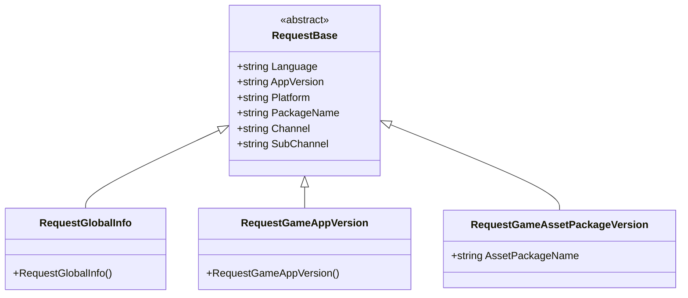
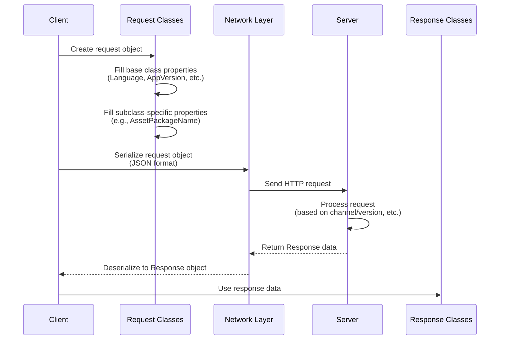

# Request Classes

Request classes are DTO (Data Transfer Object) classes in the GlobalConfig system used to encapsulate client request data. They are responsible for carrying client environment information to request configuration data from the server.

## Overview

Request classes use an object-oriented design pattern, implementing a unified data structure by inheriting from the `RequestBase` base class, while allowing each specific request type to extend its own specific fields. This design ensures:

- **Code Reuse**: All common properties (such as language, version, platform, etc.) are uniformly managed in the base class
- **Type Safety**: Each request type has clear semantics, facilitating distinction and management
- **Extensibility**: New request types can be easily added or existing requests extended through inheritance

### Core Design Intent

The GlobalConfig system needs to fetch configuration data from the server. The client needs to tell the server **who I am** (channel, package name), **where I am** (platform), **what version I am** (app version), etc. Request classes take on this responsibility—serializing client context information and sending it to the server.

## Class Hierarchy



This class diagram shows the complete inheritance relationship of request classes. All specific request types inherit from the abstract base class `RequestBase`, which defines properties common to all requests.

## RequestBase Base Class

`RequestBase` is the abstract base class for all request classes, defining common information that needs to be carried when the client makes requests.

```csharp
namespace GameFrameX.GlobalConfig.Runtime
{
    /// <summary>
    /// Request base class
    /// </summary>
    public abstract class RequestBase
    {
        /// <summary>
        /// Language
        /// </summary>
        public string Language { get; set; }

        /// <summary>
        /// App version
        /// </summary>
        public string AppVersion { get; set; }

        /// <summary>
        /// Runtime platform
        /// </summary>
        public string Platform { get; set; }

        /// <summary>
        /// Package name
        /// </summary>
        public string PackageName { get; set; }

        /// <summary>
        /// Channel
        /// </summary>
        public string Channel { get; set; }

        /// <summary>
        /// Sub-channel
        /// </summary>
        public string SubChannel { get; set; }
    }
}
```

> Source: [RequestBase.cs](https://github.com/GameFrameX/com.gameframex.unity.globalconfig/blob/main/Runtime/GlobalConfig/RequestBase.cs#L1-L38)

### Property Description

| Property | Type | Description |
|----------|------|-------------|
| Language | string | Current language used by the client, used for the server to return configuration in the corresponding language |
| AppVersion | string | Application version number, used for version validation and differentiated configuration |
| Platform | string | Runtime platform (such as iOS, Android, Windows, etc.) |
| PackageName | string | Application package name, used to distinguish different applications |
| Channel | string | Distribution channel identifier, used for per-channel configuration |
| SubChannel | string | Sub-channel identifier, used for more granular channel distinction |

### Design Intent

These common properties are common partitioning dimensions in game and application configuration systems. By carrying this information in requests, the server can:
- Return different configurations based on version (hot updates)
- Return different resource paths based on platform
- Return different activity configurations based on channel
- Return localized content based on language

## Specific Request Classes

### RequestGlobalInfo

Global info request class, used to obtain global configuration information for the game.

```csharp
namespace GameFrameX.GlobalConfig.Runtime
{
    /// <summary>
    /// Global info request object, can be inherited to implement custom fields
    /// </summary>
    public class RequestGlobalInfo : RequestBase
    {
    }
}
```

> Source: [RequestGlobalInfo.cs](https://github.com/GameFrameX/com.gameframex.unity.globalconfig/blob/main/Runtime/GlobalConfig/RequestGlobalInfo.cs#L1-L9)

**Design Intent**: This class inherits from `RequestBase` and is used to request response data containing global game configuration (such as server addresses, version check interfaces, etc.). The documentation comment indicates that developers are allowed to inherit this class to add custom fields.

### RequestGameAppVersion

Game version request class, used to check if there are new versions of the application available.

```csharp
namespace GameFrameX.GlobalConfig.Runtime
{
    /// <summary>
    /// Game version request object, can be inherited to implement custom fields
    /// </summary>
    public class RequestGameAppVersion : RequestBase
    {
    }
}
```

> Source: [RequestGameAppVersion.cs](https://github.com/GameFrameX/com.gameframex.unity.globalconfig/blob/main/Runtime/GlobalConfig/RequestGameAppVersion.cs#L1-L9)

**Design Intent**: This class is used to query the current application version status from the server. The server can return version comparison results, prompting users whether they need to update.

### RequestGameAssetPackageVersion

Game asset package version request class, used to check if specific asset packages need to be updated.

```csharp
namespace GameFrameX.GlobalConfig.Runtime
{
    /// <summary>
    /// Game resource version request object, can be inherited to implement custom fields
    /// </summary>
    public class RequestGameAssetPackageVersion : RequestBase
    {
        /// <summary>
        /// Asset package name
        /// </summary>
        public string AssetPackageName { get; set; }
    }
}
```

> Source: [RequestGameAssetPackageVersion.cs](https://github.com/GameFrameX/com.gameframex.unity.globalconfig/blob/main/Runtime/GlobalConfig/RequestGameAssetPackageVersion.cs#L1-L13)

**Design Intent**: Different from `RequestGameAppVersion`, this class is specifically for asset package version checking. Through the `AssetPackageName` property, you can specify which specific asset package to check. This supports the game's asset hot update functionality, allowing only changed parts to be updated rather than the entire application.

## Request Flow



This flow chart shows the complete lifecycle of a request object from creation to server response. Request objects carry the necessary context information to help the server make correct response decisions.

## Extending Request Classes

If the built-in request classes cannot meet your needs, developers can extend through inheritance:

```csharp
// Custom request example
public class RequestCustomConfig : RequestBase
{
    /// <summary>
    /// Custom field: Scene ID
    /// </summary>
    public int SceneId { get; set; }

    /// <summary>
    /// Custom field: Player ID
    /// </summary>
    public string PlayerId { get; set; }
}
```

**Extension Steps:**
1. Inherit from `RequestBase`
2. Add properties required for your business
3. Create an instance and fill in the data when sending the request

## Related Links

- [Response Classes](./5-data-structures.2-response-classes) - Understand the response data structure corresponding to requests
- [GlobalConfigComponent](./4-core-component.1-global-config-component) - Understand how to use requests to get configuration
- [Getting Started - Code Access](./3-getting-started.3-code-access) - Understand how to use these request classes in code