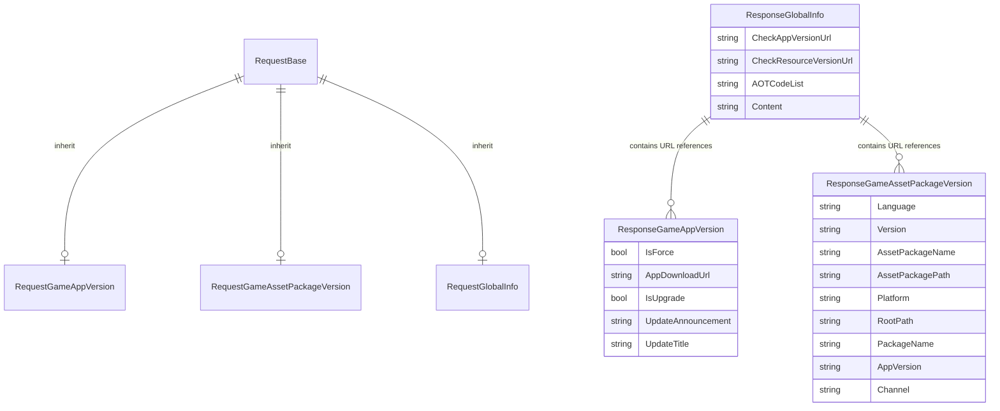

# Response Classes

Response classes are DTO (Data Transfer Object) classes in the GlobalConfig system used to carry configuration data returned from the server. Each response class corresponds to a specific type of configuration information.

## Overview

In the GlobalConfig system, after the client sends a request to the server, the server returns the corresponding configuration data. These returned data are structured and typed through response classes, allowing code to access configuration information in a type-safe manner.

GlobalConfig provides three main response classes:

| Response Class | Purpose |
|---------------|---------|
| ResponseGameAppVersion | Game application version information |
| ResponseGameAssetPackageVersion | Game asset package version information |
| ResponseGlobalInfo | Global configuration information |

### Design Intent

Response class design follows these principles:

1. **Simplicity**: Uses simple POCO classes without introducing extra dependencies
2. **Type Safety**: Each configuration type has a dedicated class providing strongly-typed access
3. **Extensibility**: Can extend new response types through inheritance or composition

## Class Structure Details

### ResponseGameAppVersion

Game version information response class containing all information related to app upgrades.

```csharp
namespace GameFrameX.GlobalConfig.Runtime
{
    /// <summary>
    /// Game version information
    /// </summary>
    public class ResponseGameAppVersion
    {
        /// <summary>
        /// Whether forced update
        /// </summary>
        public bool IsForce { get; set; }

        /// <summary>
        /// Program download address
        /// </summary>
        public string AppDownloadUrl { get; set; }

        /// <summary>
        /// Whether update needed
        /// </summary>
        public bool IsUpgrade { get; set; }

        /// <summary>
        /// Update announcement
        /// </summary>
        public string UpdateAnnouncement { get; set; }

        /// <summary>
        /// Update title
        /// </summary>
        public string UpdateTitle { get; set; }
    }
}
```

> Source: [ResponseGameAppVersion.cs](https://github.com/GameFrameX/com.gameframex.unity.globalconfig/blob/main/Runtime/GlobalConfig/ResponseGameAppVersion.cs#L1-L33)

**Property Description:**

| Property | Type | Description |
|----------|------|-------------|
| IsForce | bool | Whether forced update, true means user must update to continue playing |
| AppDownloadUrl | string | Download URL address for new version app |
| IsUpgrade | bool | Whether update is available, true means there is a new version on the server |
| UpdateAnnouncement | string | Update announcement content, usually displayed to user |
| UpdateTitle | string | Update prompt title |

### ResponseGameAssetPackageVersion

Game asset package version information response class containing configuration related to resource updates.

```csharp
namespace GameFrameX.GlobalConfig.Runtime
{
    /// <summary>
    /// Game resource version information
    /// </summary>
    public class ResponseGameAssetPackageVersion
    {
        /// <summary>
        /// Language
        /// </summary>
        public string Language { get; set; }

        /// <summary>
        /// Resource version
        /// </summary>
        public string Version { get; set; }

        /// <summary>
        /// Asset package name
        /// </summary>
        public string AssetPackageName { get; set; }

        /// <summary>
        /// Asset package path
        /// </summary>
        public string AssetPackagePath { get; set; }

        /// <summary>
        /// Platform
        /// </summary>
        public string Platform { get; set; }

        /// <summary>
        /// Download root path
        /// </summary>
        public string RootPath { get; set; }

        /// <summary>
        /// Package name
        /// </summary>
        public string PackageName { get; set; }

        /// <summary>
        /// Game version
        /// </summary>
        public string AppVersion { get; set; }

        /// <summary>
        /// Channel name
        /// </summary>
        public string Channel { get; set; }
    }
}
```

> Source: [ResponseGameAssetPackageVersion.cs](https://github.com/GameFrameX/com.gameframex.unity.globalconfig/blob/main/Runtime/GlobalConfig/ResponseGameAssetPackageVersion.cs#L1-L53)

**Property Description:**

| Property | Type | Description |
|----------|------|-------------|
| Language | string | Current language setting, such as "zh-CN", "en-US" |
| Version | string | Asset package version number, such as "1.0.0" |
| AssetPackageName | string | Asset package name |
| AssetPackagePath | string | Asset package relative path |
| Platform | string | Runtime platform, such as "Android", "iOS", "Windows" |
| RootPath | string | Root directory URL for asset downloads |
| PackageName | string | Application package name |
| AppVersion | string | Application version number |
| Channel | string | Channel identifier |

### ResponseGlobalInfo

Global info response class containing system-level configuration endpoints and global parameters.

```csharp
namespace GameFrameX.GlobalConfig.Runtime
{
    /// <summary>
    /// Global info response object
    /// </summary>
    public class ResponseGlobalInfo
    {
        /// <summary>
        /// Check app version address
        /// </summary>
        public string CheckAppVersionUrl { get; set; }

        /// <summary>
        /// Check resource version address
        /// </summary>
        public string CheckResourceVersionUrl { get; set; }

        /// <summary>
        /// AOT code list
        /// </summary>
        public string AOTCodeList { get; set; }

        /// <summary>
        /// Extended content
        /// </summary>
        public string Content { get; set; }
    }
}
```

> Source: [ResponseGlobalInfo.cs](https://github.com/GameFrameX/com.gameframex.unity.globalconfig/blob/main/Runtime/GlobalConfig/ResponseGlobalInfo.cs#L1-L28)

**Property Description:**

| Property | Type | Description |
|----------|------|-------------|
| CheckAppVersionUrl | string | Server interface address for checking application version |
| CheckResourceVersionUrl | string | Server interface address for checking asset package version |
| AOTCodeList | string | JSON string of AOT compilation code list |
| Content | string | Additional extended content, can be used for custom configuration |

## Data Flow Relationship

The following chart shows the correspondence between request classes and response classes:



## Usage Examples

### Basic Usage

Get global configuration from server at game startup:

```csharp
using GameFrameX.GlobalConfig.Runtime;
using UnityEngine;

public class ConfigManager : MonoBehaviour
{
    public void LoadGlobalConfig(string jsonData)
    {
        // Parse global config response
        var globalInfo = new ResponseGlobalInfo
        {
            CheckAppVersionUrl = "https://api.example.com/check-app-version",
            CheckResourceVersionUrl = "https://api.example.com/check-resource-version",
            AOTCodeList = "[\"Method1\", \"Method2\"]",
            Content = "{\"config\": \"value\"}"
        };

        Debug.Log($"App Version URL: {globalInfo.CheckAppVersionUrl}");
        Debug.Log($"Resource Version URL: {globalInfo.CheckResourceVersionUrl}");
    }
}
```

### Handling Game Version Check Response

```csharp
using GameFrameX.GlobalConfig.Runtime;
using UnityEngine;

public class VersionChecker
{
    public void HandleVersionResponse(ResponseGameAppVersion response)
    {
        if (response.IsUpgrade)
        {
            Debug.Log($"New version found: {response.UpdateTitle}");
            Debug.Log($"Update announcement: {response.UpdateAnnouncement}");
            
            if (response.IsForce)
            {
                Debug.LogWarning("Current version is outdated, forced update required!");
                // Show forced update UI
            }
            else
            {
                // Show optional update UI
            }
            
            // Open download page
            Application.OpenURL(response.AppDownloadUrl);
        }
        else
        {
            Debug.Log("Already on latest version");
        }
    }
}
```

### Handling Asset Package Version Response

```csharp
using GameFrameX.GlobalConfig.Runtime;
using UnityEngine;

public class AssetUpdater
{
    public void HandleAssetVersionResponse(ResponseGameAssetPackageVersion response)
    {
        Debug.Log($"Resource version: {response.Version}");
        Debug.Log($"Asset package: {response.AssetPackageName}");
        Debug.Log($"Platform: {response.Platform}");
        Debug.Log($"Channel: {response.Channel}");
        Debug.Log($"Download root path: {response.RootPath}");
        
        // Build asset download path based on response
        string fullAssetPath = $"{response.RootPath}/{response.AssetPackagePath}";
        Debug.Log($"Full asset path: {fullAssetPath}");
    }
}
```

## Integration with GlobalConfigComponent

ResponseGlobalInfo is used in GlobalConfigComponent to store global configuration fetched from the server:

```csharp
namespace GameFrameX.GlobalConfig.Runtime
{
    public sealed class GlobalConfigComponent : GameFrameworkComponent
    {
        /// <summary>
        /// Get global config info
        /// </summary>
        /// <returns>Returns global config info object</returns>
        public ResponseGlobalInfo GlobalInfo
        {
            get { return m_responseGlobalInfo; }
        }

        /// <summary>
        /// Global config info object
        /// </summary>
        private ResponseGlobalInfo m_responseGlobalInfo;

        /// <summary>
        /// Set global config info
        /// </summary>
        /// <param name="globalInfo">Global config info object</param>
        public void SetGlobalConfig(ResponseGlobalInfo globalInfo)
        {
            m_responseGlobalInfo = globalInfo;
        }
    }
}
```

> Source: [GlobalConfigComponent.cs](https://github.com/GameFrameX/com.gameframex.unity.globalconfig/blob/main/Runtime/GlobalConfig/GlobalConfigComponent.cs#L131-L158)

## Correspondence Between Request and Response Classes

| Request Class | Response Class | Description |
|--------------|-----------------|-------------|
| RequestGameAppVersion | ResponseGameAppVersion | Client sends app info, server returns version check results |
| RequestGameAssetPackageVersion | ResponseGameAssetPackageVersion | Client sends asset package name, server returns resource version info |
| RequestGlobalInfo | ResponseGlobalInfo | Client requests global config, server returns various service interface addresses |

## Extending Response Classes

If you need to extend response classes, you can create custom classes to receive additional server-returned data:

```csharp
using GameFrameX.GlobalConfig.Runtime;

/// <summary>
/// Custom global info response class
/// </summary>
[System.Serializable]
public class CustomResponseGlobalInfo : ResponseGlobalInfo
{
    /// <summary>
    /// Server timestamp
    /// </summary>
    public long ServerTimestamp { get; set; }

    /// <summary>
    /// Server region
    /// </summary>
    public string ServerRegion { get; set; }

    /// <summary>
    /// Extra config data
    /// </summary>
    public Dictionary<string, object> ExtraData { get; set; }
}
```

## Related Links

- [Request Classes](./5-data-structures.1-request-classes) - Detailed documentation for request classes
- [GlobalConfigComponent](./4-core-component.1-global-config-component) - Core component documentation
- [Add to Scene](./3-getting-started.1-add-to-scene) - How to add component to scene
- [Configure Properties](./3-getting-started.2-configure-properties) - Configuration property description
- [Code Access](./3-getting-started.3-code-access) - Access configuration via code