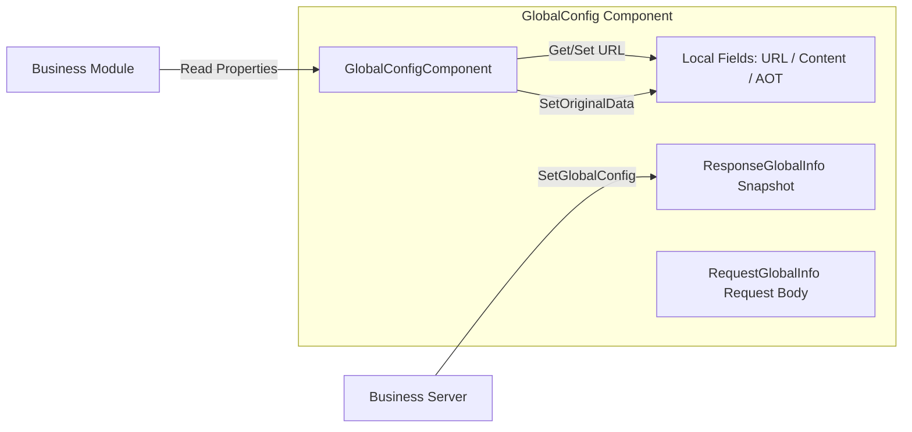

# Introduction

GameFrameX GlobalConfig is the global configuration component in the GameFrameX framework. It is used to centrally manage global parameters dispatched by the server or configured locally, including the application version check URL, resource version check URL, host server address, AOT metadata list, and custom extension content, etc. The component is attached as a Unity MonoBehaviour and connected to the framework lifecycle through `GameFrameworkComponent`, allowing business modules to read on demand.

## Quick Start

### 1. Installation

Choose any of the following methods to add the component to your Unity project:

1. Add the scoped registry in `Packages/manifest.json`:

   ```json
   {
     "scopedRegistries": [
       {
         "name": "GameFrameX",
         "url": "https://gameframex.upm.alianblank.uk",
         "scopes": ["com.gameframex"]
       }
     ],
     "dependencies": {
       "com.gameframex.unity.globalconfig": "1.3.2"
     }
   }
   ```

2. Add the Git URL directly under the `dependencies` node:

   ```json
   {
     "com.gameframex.unity.globalconfig": "https://github.com/gameframex/com.gameframex.unity.globalconfig.git"
   }
   ```

3. Add the above address via `Add package from git URL` in the Unity Package Manager.

4. Clone the repository directly into the `Packages/` directory of your Unity project.

### 2. Attach the Component

Add the `Global Config` component to the `GameFrameX` framework entry object in the scene (menu path `Add Component → GameFrameX → Global Config`). The component inherits from `GameFrameworkComponent` and disables automatic registration in `Awake`, so it is managed uniformly by the framework entry.

Source: [GlobalConfigComponent.cs#L11-L13](https://github.com/GameFrameX/com.gameframex.unity.globalconfig/blob/main/Runtime/GlobalConfig/GlobalConfigComponent.cs#L11-L13)

### 3. Configuration Fields

The component exposes the following fields in the Inspector, which can be filled in directly in the editor or assigned at runtime through properties:

| Field | Type | Description |
|------|------|------|
| `Check App Version Url` | string | Application version check interface address |
| `Check Resource Version Url` | string | Resource version check interface address |
| `AOT Code List` | string | AOT supplementary metadata list (JSON string), automatically parsed into `AOTCodeLists` when assigned |
| `Host Server Url` | string | Host server address, used to connect to the backend |
| `Content` | string | Custom extension content |
| `Original Data` | string (read-only) | Raw data written through `SetOriginalData` |

Source: [GlobalConfigComponent.cs#L18-L134](https://github.com/GameFrameX/com.gameframex.unity.globalconfig/blob/main/Runtime/GlobalConfig/GlobalConfigComponent.cs#L18-L134)

### 4. Runtime Reading

After obtaining the component instance through the framework entry, simply read the properties directly:

```csharp
var globalConfig = GameFrameXEntry.GetComponent<GlobalConfigComponent>();
string hostUrl = globalConfig.HostServerUrl;
string appVersionUrl = globalConfig.CheckAppVersionUrl;
string content = globalConfig.Content;
```

## How It Works Overview

The component internally maintains a `ResponseGlobalInfo` object used to store the snapshot of the global configuration dispatched by the server; the local fields store URL, raw data, AOT list, and other extension information. Request and response types are defined separately, making it convenient for the business side to inherit and extend.



## Related Links

- [GlobalConfigComponent.cs](https://github.com/GameFrameX/com.gameframex.unity.globalconfig/blob/main/Runtime/GlobalConfig/GlobalConfigComponent.cs)
- [RequestGlobalInfo.cs](https://github.com/GameFrameX/com.gameframex.unity.globalconfig/blob/main/Runtime/GlobalConfig/RequestGlobalInfo.cs)
- [ResponseGlobalInfo.cs](https://github.com/GameFrameX/com.gameframex.unity.globalconfig/blob/main/Runtime/GlobalConfig/ResponseGlobalInfo.cs)
- [RequestBase.cs](https://github.com/GameFrameX/com.gameframex.unity.globalconfig/blob/main/Runtime/GlobalConfig/RequestBase.cs)
- [Editor/Inspector/GlobalConfigComponentInspector.cs](https://github.com/GameFrameX/com.gameframex.unity.globalconfig/blob/main/Editor/Inspector/GlobalConfigComponentInspector.cs)
- [README.zh-CN.md](https://github.com/GameFrameX/com.gameframex.unity.globalconfig/blob/main/README.zh-CN.md)