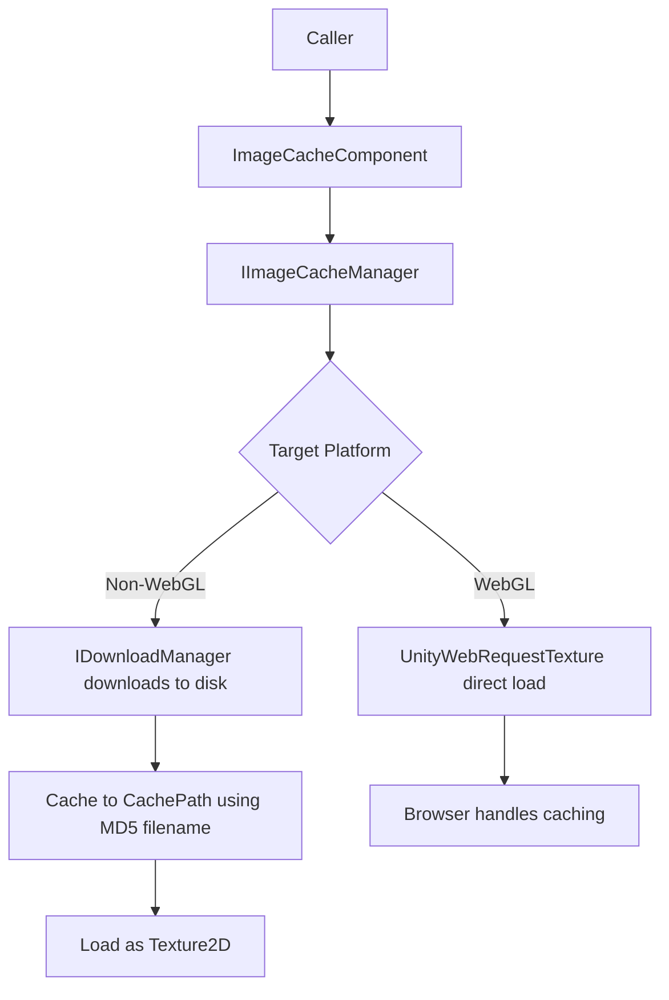

# Overview

GameFrameX.ImageCache is the image caching component of the GameFrameX framework. It is responsible for downloading remote images, saving them to disk using the MD5 hash of the URL as the filename, and reading them directly from disk as `Texture2D` on subsequent loads. This avoids redundant downloads and shortens UI image display time.

## Quick Start

1. Add the GameFrameX registry to your Unity project's `Packages/manifest.json`:

```json
{
  "scopedRegistries": [
    {
      "name": "GameFrameX",
      "url": "https://gameframex.upm.alianblank.uk",
      "scopes": [
        "com.gameframex"
      ]
    }
  ]
}
```

2. Add the dependency to `dependencies`:

```json
{
  "dependencies": {
    "com.gameframex.unity.imagecache": "0.0.1"
  }
}
```

3. Add `ImageCacheComponent` to the scene (menu `GameFrameX/Image Cache`), and adjust `CachePath`, `MaxDiskSize`, `ExpireDays` in the Inspector as needed. The component synchronizes the configuration to `IImageCacheManager` during `Awake`, with the default cache path being `Application path + "/cache/images/"`.

4. Call the interface to load a remote image:

```csharp
// Get the image cache component
var imageCache = GameEntry.GetComponent<ImageCacheComponent>();

// Asynchronously load a remote image
Texture2D texture = await imageCache.LoadImageAsync("https://example.com/image.png");

// Check whether the image is cached
bool cached = imageCache.IsCached("https://example.com/image.png");

// Remove a specific cache
imageCache.RemoveCache("https://example.com/image.png");

// Clear all caches
imageCache.ClearCache();
```

Source: [ImageCacheComponent.cs](https://github.com/GameFrameX/com.gameframex.unity.imagecache/blob/main/Runtime/ImageCache/ImageCacheComponent.cs#L73-L76), [README.zh-CN.md](https://github.com/GameFrameX/com.gameframex.unity.imagecache/blob/main/README.zh-CN.md#L78-L93)

## How It Works



- **Non-WebGL platforms**: Images are downloaded to disk via `IDownloadManager`, with files named by the MD5 of the URL; on load, the cache is checked first, and the image is only downloaded on a miss.
- **WebGL platform**: Images are loaded directly via `UnityWebRequestTexture`, and caching is fully managed by the browser. The local interfaces `IsCached` / `RemoveCache` / `ClearCache` are not effective.

Source: [ImageCacheManager.cs](https://github.com/GameFrameX/com.gameframex.unity.imagecache/blob/main/Runtime/ImageCache/ImageCacheManager.cs), [IImageCacheManager.cs](https://github.com/GameFrameX/com.gameframex.unity.imagecache/blob/main/Runtime/ImageCache/IImageCacheManager.cs#L26-L47)

## Next Steps

- Cache parameters and default values: see 《reference/config》
- Tuning parameters in the Inspector: see 《tasks/configure-cache》
- Troubleshooting image loading failures: see 《troubleshooting/load-failed》
- Platform differences and WebGL behavior: see 《reference/platform-support》