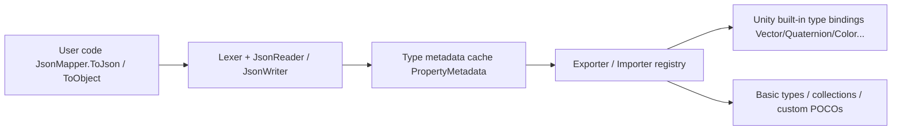

# Overview

GameFrameX.LitJSON is a JSON serialization library for Unity, built on top of [LitJSON](https://github.com/LitJSON/litjson) with additional wrappers and integrated into the GameFrameX ecosystem. It provides native support for Unity built-in types, `float`, attribute-driven field control, and IL2CPP code stripping protection. The namespace is `GameFrameX.LitJSON.Runtime`.

## Quick Start

### 1. Installation

Add the package via scoped registry in your Unity project's `Packages/manifest.json`:

```json
{
  "scopedRegistries": [
    {
      "name": "GameFrameX",
      "url": "https://gameframex.upm.alianblank.uk",
      "scopes": ["com.gameframex"]
    }
  ],
  "dependencies": {
    "com.gameframex.unity.litjson": "1.1.3"
  }
}
```

For other installation methods (Git URL, manual clone), see [README.md](https://github.com/GameFrameX/com.gameframex.unity.litjson/blob/main/README.md#L60-L96).

### 2. Serialization and Deserialization

```csharp
using GameFrameX.LitJSON.Runtime;

class PlayerData
{
    public int Id { get; set; }
    public string Name { get; set; }
    public float Hp { get; set; }
}

// Serialize (outputs formatted JSON by default)
var player = new PlayerData { Id = 42, Name = "Blank", Hp = 100.5f };
string json = JsonMapper.ToJson(player);
// {"Id":42,"Name":"Blank","Hp":100.5} (pass false for compact output)

// Deserialize
PlayerData restored = JsonMapper.ToObject<PlayerData>(json);
```

Source: [README.md](https://github.com/GameFrameX/com.gameframex.unity.litjson/blob/main/README.md#L100-L128)

### 3. Controlling Field Output

Use `[JsonIgnore]` to skip members, and `[JsonProperty("name")]` to customize JSON key names:

```csharp
class Account
{
    [JsonProperty("user_name")]
    public string UserName { get; set; }

    [JsonIgnore]
    public string Password { get; set; }
}
```

Source: [README.md](https://github.com/GameFrameX/com.gameframex.unity.litjson/blob/main/README.md#L131-L143)

## How It Works (Brief Overview)



The entry point type [JsonMapper](https://github.com/GameFrameX/com.gameframex.unity.litjson/blob/main/Runtime/JsonMapper.cs) handles dispatching between readers/writers, type caching, and the custom converter registry. Properties/fields read via reflection are cached by [PropertyMetadata](https://github.com/GameFrameX/com.gameframex.unity.litjson/blob/main/Runtime/JsonMapper.cs#L31-L56). Unity built-in value type conversions are registered centrally in [UnityTypeBindings.cs](https://github.com/GameFrameX/com.gameframex.unity.litjson/blob/main/Runtime/UnityTypeBindings.cs). IL2CPP stripping protection is provided jointly by [link.xml](https://github.com/GameFrameX/com.gameframex.unity.litjson/blob/main/link.xml) and [LitJsonCroppingHelper](https://github.com/GameFrameX/com.gameframex.unity.litjson/blob/main/Runtime/LitJsonCroppingHelper.cs), which is triggered by runtime reflection.

## Next Steps

- To learn how to write Unity types (such as `Vector3`, `Color`) into JSON, see "How to Serialize Unity Built-in Types"
- When fields need to be skipped or renamed, see "How to Control Field Output"
- If deserialization throws `MissingMethodException` after building, see "What to Do When IL2CPP Stripping Causes Deserialization to Fail"
- For a complete API quick reference, see "API Reference"
- For upgrade notes, see [CHANGELOG.md](https://github.com/GameFrameX/com.gameframex.unity.litjson/blob/main/CHANGELOG.md)