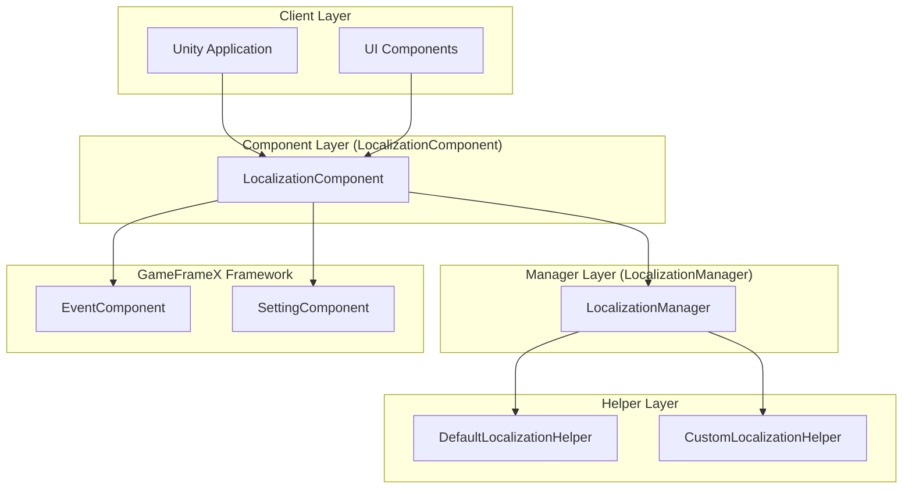
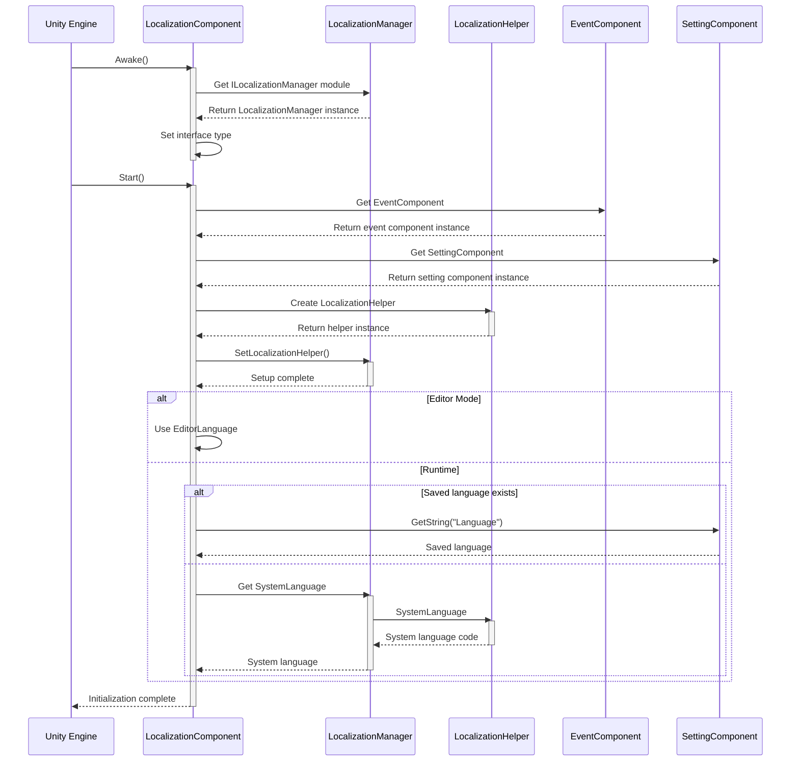
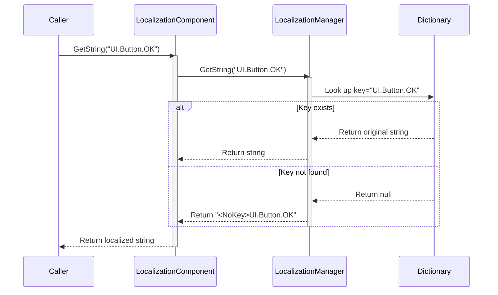
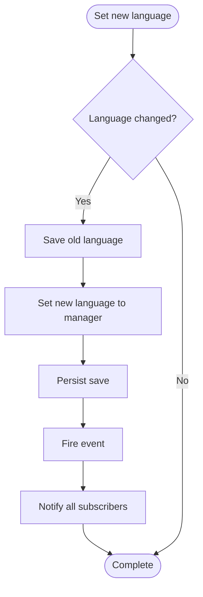
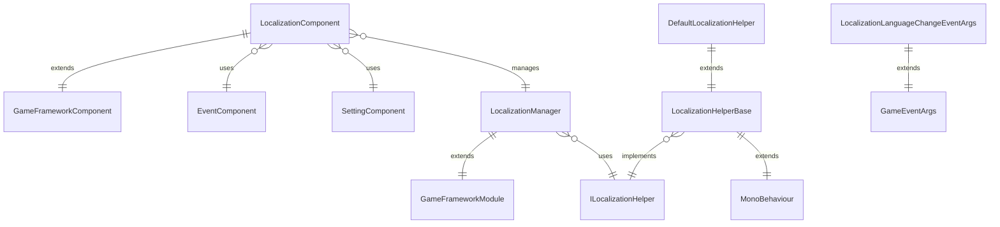

# Overview

GameFrameX Localization is one of the core components of the GameFrameX game framework, providing a complete Unity localization solution. This component supports multi-language dynamic switching, string formatting, system language detection, and complete dictionary management functionality, enabling developers to easily implement internationalization for their games.

## Overview

The GameFrameX Localization component is a module specifically designed to handle multi-language localization in the Unity game framework. It uses a three-layer architecture design with Component-Manager-Helper, achieving a flexible and extensible localization solution through interface separation and dependency injection design patterns.

The main responsibilities of this component include: managing multi-language dictionary data, providing localized string retrieval interfaces, handling runtime language switching, detecting system language environment, and notifying language changes through the event system. Developers can implement complex internationalization functionality through simple API calls without caring about underlying implementation details.

This component is one of the core modules of the GameFrameX framework, working closely with modules such as Event (event system), Setting (settings management), and Asset (resource management) to jointly build a complete game development infrastructure.

## System Architecture

GameFrameX Localization uses a clear three-layer architecture design with well-defined responsibilities for each layer. Layers communicate through interfaces, achieving the design goal of high cohesion and low coupling.



### Core Component Description

**LocalizationComponent** is the Unity layer component, inherited from GameFrameworkComponent, serving as the entry point for external services. It implements Awake and Start lifecycle methods, creating and registering the localization helper with the manager during initialization. The component provides rich GetString overload methods, supporting string formatting requirements with 0 to 16 parameters.

**LocalizationManager** is the core business logic manager, inherited from GameFrameworkModule and implementing the ILocalizationManager interface. It maintains a Dictionary<string, string> data structure, responsible for string storage, querying, and formatting operations. The manager does not directly interact with Unity but obtains system language information through the ILocalizationHelper interface.

**ILocalizationHelper** interface defines the specification for the localization helper. Currently, it contains only a SystemLanguage property for obtaining the current system language code. This design allows developers to control language detection logic by implementing custom helpers, such as obtaining language settings from a server or determining the initial language based on user configuration.

**LocalizationHelperBase** is the abstract base class for helpers, inherited from MonoBehaviour and implementing ILocalizationHelper interface. This allows helpers to be attached to Unity GameObjects for easy configuration and management in the editor.

**DefaultLocalizationHelper** is the default helper implementation, obtaining the system language through .NET's CultureInfo.CurrentCulture.Name, and replacing hyphens with underscores to comply with RFC 5646 standard (e.g., zh-CN converts to zh_CN).

## Core Flow

The initialization and string retrieval flow of the localization component reflects the core design philosophy of the framework. The following flowchart shows the complete process from component startup to obtaining localized strings.



### String Retrieval Flow

When the application needs to retrieve a localized string, it calls the GetString method of LocalizationComponent. This method forwards the request to LocalizationManager, which looks up the corresponding string in the dictionary and performs formatting as needed.



### Language Switching Flow

Language switching is one of the core features of the localization system. When the application needs to change the current language, it needs to be set through the Language property of LocalizationComponent.



When switching languages, the LocalizationLanguageChangeEventArgs event is triggered, and the application can respond to language changes by subscribing to this event, such as refreshing UI display or updating game content.

## Dependencies

The GameFrameX Localization component depends on other core modules of the GameFrameX framework. These dependencies ensure that the localization functionality can run normally and work with other systems.



### Dependency Module Description

| Dependency Module | Description | Usage |
|-------------------|-------------|-------|
| GameFrameX.Runtime | Core runtime module | Provides basic framework functionality including module system, object pool, logging, etc. |
| GameFrameX.Event.Runtime | Event system module | Implements language switching event publishing and subscription mechanism |
| GameFrameX.Setting.Runtime | Settings management module | Persistently saves user's language settings |

## Key Features

GameFrameX Localization provides rich functional features to meet various localization needs in game development.

**Multi-language Support**: The component does not limit the number of languages; developers can add any number of language variants. Each language is identified by a unique language code, such as zh_CN (Simplified Chinese), en_US (American English), ja_JP (Japanese), etc.

**Dynamic Language Switching**: Supports seamless language switching during game runtime. The switching process automatically triggers event notifications, allowing the application to respond to language changes in real-time without restarting the application.

**Parameterized Strings**: Provides powerful string formatting capabilities, supporting up to 16 formatting parameters. Developers can define template strings with placeholders in the dictionary, such as "Player level: {0}, EXP: {1]", and dynamically replace parameter values at runtime.

**System Language Detection**: By default, the component automatically detects the operating system language and adopts the corresponding language. Custom language detection logic can be implemented through a custom helper.

**Dictionary Management**: Provides complete dictionary CRUD operations, including checking if a key exists, getting raw values, adding new dictionary entries, removing dictionary entries, and clearing all dictionaries.

**Editor Support**: Provides editor mode, allowing preview of different language display effects in the Unity editor, facilitating development and debugging.

## Quick Usage

Using GameFrameX Localization in a Unity project is very simple. Here is the basic usage flow.

First, you need to add the LocalizationComponent component to the GameFrameX manager in the scene. The component will automatically initialize and load the localization functionality.

```csharp
// Get localization component
var localization = GameEntry.GetComponent<LocalizationComponent>();

// Set language
localization.Language = "zh_CN"; // Simplified Chinese
localization.Language = "en_US"; // English

// Get localized string
string text = localization.GetString("UI.Button.OK");

// Localized string with parameters
string message = localization.GetString("UI.Message.Welcome", playerName);
string info = localization.GetString("UI.Info.Score", score, level);
```
> Source: [LocalizationComponent.cs](https://github.com/GameFrameX/com.gameframex.unity.localization/blob/main/Runtime/Localization/LocalizationComponent.cs#L246-L262)

### Dictionary Management

Applications can dynamically manage dictionary data at runtime to implement hot-update language resources.

```csharp
// Check if dictionary exists
bool exists = localization.HasRawString("UI.Button.Cancel");

// Get raw string
string rawText = localization.GetRawString("UI.Button.Cancel");

// Add dictionary entry
localization.AddRawString("UI.Button.NewButton", "New Button");

// Remove dictionary entry
bool removed = localization.RemoveRawString("UI.Button.Cancel");

// Clear all dictionaries
localization.RemoveAllRawStrings();
```
> Source: [LocalizationComponent.cs](https://github.com/GameFrameX/com.gameframex.unity.localization/blob/main/Runtime/Localization/LocalizationComponent.cs#L717-L758)

### Event Listening

By subscribing to language change events, applications can execute custom logic when language is switched, such as refreshing UI display.

```csharp
// Subscribe to language change event
GameEntry.GetComponent<EventComponent>().Subscribe(
    LocalizationLanguageChangeEventArgs.EventId, 
    OnLanguageChanged);

private void OnLanguageChanged(object sender, GameEventArgs e)
{
    var args = (LocalizationLanguageChangeEventArgs)e;
    Debug.Log($"Language changed from {args.OldLanguage} to {args.Language}");
    
    // Update UI display
    RefreshUI();
}
```
> Source: [LocalizationLanguageChangeEventArgs.cs](https://github.com/GameFrameX/com.gameframex.unity.localization/blob/main/Runtime/EventArgs/LocalizationLanguageChangeEventArgs.cs#L52-L58)

## Language Code Standards

GameFrameX Localization follows the RFC 5646 language tag standard, using underscore-separated language code format. Here are common language code examples:

| Language Code | Description |
|---------------|-------------|
| zh_CN | Simplified Chinese (China) |
| zh_TW | Traditional Chinese (Taiwan) |
| en_US | American English (USA) |
| en_GB | British English (UK) |
| ja_JP | Japanese (Japan) |
| ko_KR | Korean (Korea) |
| fr_FR | French (France) |
| de_DE | German (Germany) |
| es_ES | Spanish (Spain) |
| ru_RU | Russian (Russia) |

When defining language codes, developers should note: language codes are case-sensitive; it is recommended to use standard naming conventions; each language code consists of a language and an optional region两部分组成，使用下划线分隔而非连字符。

## Related Links

- [Installation Guide](./2-installation)
- [Getting Started](./3-getting-started)
- [Core Features - Get Localized Strings](./4-core-features.get-string)
- [Core Features - Dictionary Management](./4-core-features.dictionary-management)
- [Core Features - Language Switching and Events](./4-core-features.language-switching)
- [API Reference](./5-api-reference)
- [Configuration](./6-configuration)
- [Best Practices](./7-best-practices)
- [GitHub Repository](https://github.com/GameFrameX/com.gameframex.unity.localization.git)
- [Official Documentation](https://gameframex.doc.alianblank.com/)