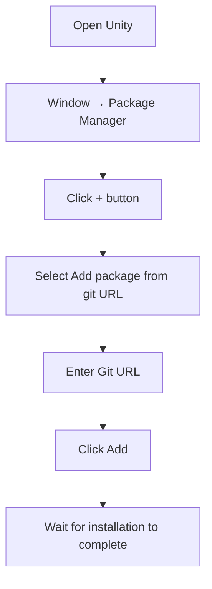
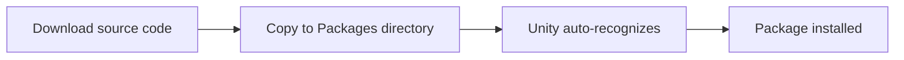
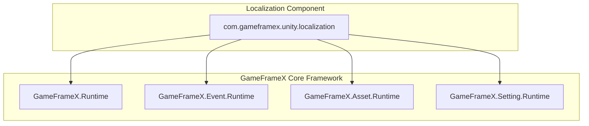

# Installation

This document describes how to install the GameFrameX Localization component into your Unity project.

## Overview

GameFrameX Localization is the localization functionality component of the GameFrameX game framework, providing a complete multi-language localization solution. This component supports dynamic language switching, string formatting, system language detection, and other features to help developers quickly implement game internationalization.

**Version Requirements:**
- Unity 2019.4 or higher

**Package Information:**
- Package Name: `com.gameframex.unity.localization`
- Display Name: GameFrameX Localization
- Current Version: 2.2.1

## Installation Methods

### Method 1: Install via Unity Package Manager (Recommended)

This is the recommended installation method, providing easy access to the latest version and dependency management.

**Steps:**

1. Open Unity Editor
2. Go to menu **Window → Package Manager**
3. Click the **+** button in the upper left corner
4. Select **Add package from git URL...**
5. Enter the following Git URL in the input field:

```
https://github.com/GameFrameX/com.gameframex.unity.localization.git
```

6. Click **Add** button and wait for installation to complete



### Method 2: Install via manifest.json

Edit the project's `Packages/manifest.json` file directly to add dependencies.

**Steps:**

1. Find the `Packages` folder in the project root
2. Open `manifest.json` file with a text editor
3. Add the following content to the `dependencies` node:

```json
{
  "dependencies": {
    "com.gameframex.unity.localization": "https://github.com/GameFrameX/com.gameframex.unity.localization.git"
  }
}
```

4. Save the file and return to Unity
5. Unity will automatically resolve and install the dependency package

> Note: This method attempts to pull the latest version from Git every time the project is opened. If you need to lock a version, use the following format to specify the version number:
> ```json
> "com.gameframex.unity.localization": "2.2.1"
> ```

### Method 3: Local Source Installation

If you need to customize the source code or are in an offline environment, you can use the local installation method.

**Steps:**

1. Clone or download the source code from GitHub repository:
   ```bash
   https://github.com/GameFrameX/com.gameframex.unity.localization.git
   ```
2. Copy the entire repository folder to your Unity project's `Packages` directory
3. Unity will automatically recognize and load the package
4. To update, simply replace the folder contents



## Dependency Description

The GameFrameX Localization component depends on the following GameFrameX core modules:

| Dependency Package | Version | Description |
|-------------------|---------|-------------|
| com.gameframex.unity | 1.1.1 | Core runtime module |
| com.gameframex.unity.asset | 1.0.6 | Resource management module |
| com.gameframex.unity.event | 1.0.0 | Event system module |

**Automatic Dependency Resolution:**

When using Package Manager or manifest.json for installation, Unity will automatically resolve and download all dependencies.

If using local installation method, ensure the following modules are also installed:

| Module | Assembly Definition | Description |
|--------|---------------------|-------------|
| GameFrameX.Runtime | GameFrameX.Runtime | Core framework |
| GameFrameX.Event.Runtime | GameFrameX.Event.Runtime | Event system |
| GameFrameX.Asset.Runtime | GameFrameX.Asset.Runtime | Resource management |
| GameFrameX.Setting.Runtime | GameFrameX.Setting.Runtime | Settings management |



## Verify Installation

After installation, please verify by following these steps:

### 1. Check Package Manager

In the Package Manager window, confirm that `GameFrameX Localization` appears in the list and shows a normal status.

### 2. Check Assemblies

The following assembly definition files should exist in the project directory:

- `Packages/com.gameframex.unity.localization/Runtime/GameFrameX.Localization.Runtime.asmdef`
- `Packages/com.gameframex.unity.localization/Editor/GameFrameX.Localization.Editor.asmdef`

### 3. Create Test Scene

1. Create an empty GameObject in the Unity scene
2. Add **LocalizationComponent** component (menu path: **Component → GameFrameX → Localization**)
3. Check if the component Inspector panel displays configuration options correctly

> Source: [LocalizationComponent.cs](https://github.com/GameFrameX/com.gameframex.unity.localization/blob/main/Runtime/Localization/LocalizationComponent.cs#L44-L47)

### 4. Run Basic Code Test

```csharp
using GameFrameX.Runtime;

// Get localization component
var localization = GameEntry.GetComponent<LocalizationComponent>();

// Get system language
Debug.Log($"System language: {localization.SystemLanguage}");

// Get a localized string test
string text = localization.GetString("Test.Key");
Debug.Log($"Test result: {text}");
```

## Component Configuration

After adding LocalizationComponent to the scene, you can configure the following options in the Inspector panel:

| Configuration Item | Type | Default Value | Description |
|-------------------|------|---------------|-------------|
| Editor Language | string | zh_CN | Language used in editor mode |
| Default Language | string | zh_CN | Default language (fallback language when loading fails) |
| Enable Load Dictionary Update Event | bool | false | Whether to enable dictionary loading update events |
| Is Enable Editor Mode | bool | false | Whether to enable editor mode |
| Localization Helper Type Name | string | DefaultLocalizationHelper | Localization helper type name |
| Custom Localization Helper | LocalizationHelperBase | null | Custom localization helper instance |

> Note: Editor Language is only effective in Unity Editor and will not affect the built game.

## Common Issues

### Q1: Compilation errors after installation

**Cause:** Missing dependencies

**Solution:** Ensure all GameFrameX dependencies are correctly installed. Try reopening Package Manager and checking the dependency status.

### Q2: Cannot find LocalizationComponent

**Cause:** Assembly not loaded correctly

**Solution:**
1. Check if Assembly Definition file exists
2. Try reimporting all assets: **Assets → Reimport All**
3. Check error messages in the Console window

### Q3: Version incompatibility

**Cause:** Unity version too low or dependency package version conflict

**Solution:**
1. Confirm Unity version is not lower than 2019.4
2. Check if any other packages declare different versions of GameFrameX dependencies

## Related Links

- [Getting Started](./3-getting-started) - Start using localization features
- [Core Features](./4-core-features.get-string) - Learn core features
- [API Reference](./5-api-reference) - Complete API documentation
- [GitHub Repository](https://github.com/GameFrameX/com.gameframex.unity.localization.git) - Get source code and latest version
- [Official Documentation](https://gameframex.doc.alianblank.com/) - GameFrameX complete documentation