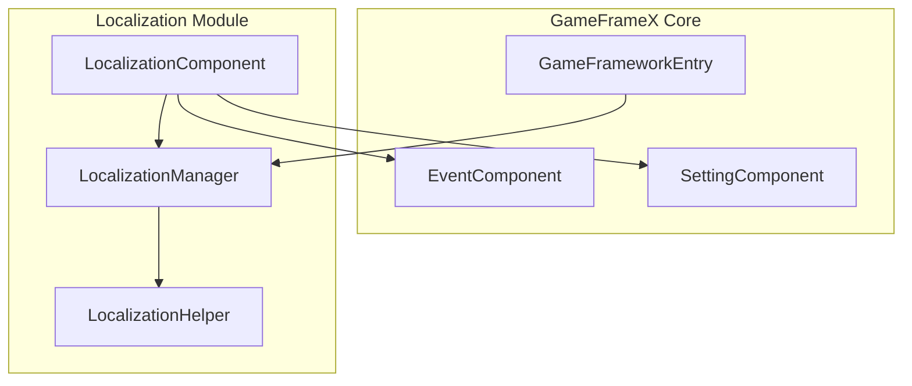
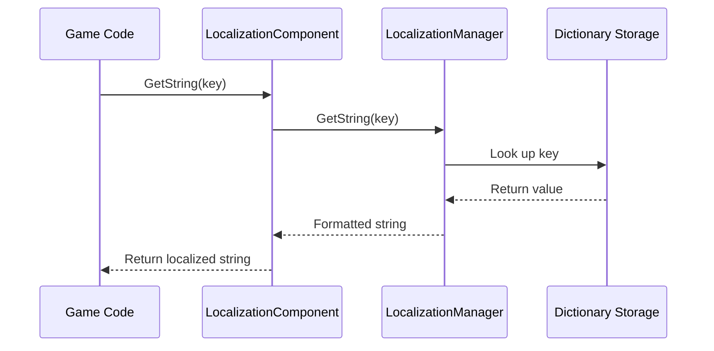
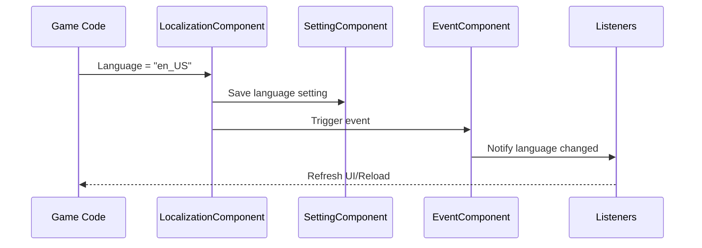

# Getting Started

This guide will help you quickly get started with the GameFrameX Localization component and implement localization functionality for your Unity game.

## Overview

GameFrameX Localization is the localization component of the GameFrameX game framework, providing a complete game localization solution. This component supports:
- Multi-language string management (dictionary format)
- Dynamic parameter interpolation (supports up to 16 parameters)
- Runtime language switching
- System language auto-detection
- Language settings persistence

## Architecture Overview



**Component Description:**
- **LocalizationComponent**: Unity component, integrated into Game Framework, responsible for initialization and coordination
- **LocalizationManager**: Core manager, handles dictionary storage and string retrieval
- **LocalizationHelper**: Helper, used to detect system language
- **EventComponent**: Event system, used to publish language change events
- **SettingComponent**: Settings system, used to persist language preferences

## Core Flow

### String Retrieval Flow



### Language Switching Flow



## Usage Examples

### Basic Usage

After adding the LocalizationComponent component to a Unity scene, you can retrieve localized strings in the following way:

```csharp
using GameFrameX.Localization.Runtime;

// Get LocalizationComponent instance
var localization = GameEntry.GetComponent<LocalizationComponent>();

// Get simple string
string greeting = localization.GetString("greeting"); // Output: Hello

// Get string with parameters
string playerName = localization.GetString("welcome_player", "ZhangSan"); // Output: Welcome, ZhangSan!
```

> Source: [LocalizationComponent.cs](https://github.com/GameFrameX/com.gameframex.unity.localization/blob/main/Runtime/Localization/LocalizationComponent.cs#L246-L262)

### Advanced Usage: Multi-parameter Interpolation

The component supports string interpolation with up to 16 parameters:

```csharp
// Two parameters
string message = localization.GetString("level_complete", 5, "1000"); 
// Assuming dictionary: level_complete = "Level {0} complete! Score: {1}"
// Output: Level 5 complete! Score: 1000

// Four parameters
string complex = localization.GetString("battle_result", "Victory", 1000, 500, 50);
// Assuming dictionary: battle_result = "{0}! EXP+{1}, Gold+{2}, Diamond+{3}"
// Output: Victory! EXP+1000, Gold+500, Diamond+50
```

> Source: [LocalizationManager.cs](https://github.com/GameFrameX/com.gameframex.unity.localization/blob/main/Runtime/Localization/Localization/LocalizationManager.cs#L168-L311)

### Dictionary Management

Manually add and manage dictionaries:

```csharp
// Add dictionary
localization.AddRawString("game_title", "My Game");
localization.AddRawString("start_game", "Start Game");

// Check if dictionary exists
bool exists = localization.HasRawString("game_title"); // true

// Get raw value (without formatting)
string rawValue = localization.GetRawString("game_title"); // My Game

// Remove dictionary
localization.RemoveRawString("game_title");

// Clear all dictionaries
localization.RemoveAllRawStrings();
```

### Language Switching and Event Listening

Listen to language switching events:

```csharp
using GameFrameX.Event.Runtime;

// Subscribe to language change event
EventComponent eventComponent = GameEntry.GetComponent<EventComponent>();
eventComponent.Subscribe(LocalizationLanguageChangeEventArgs.EventId, OnLanguageChanged);

// Event handler method
private void OnLanguageChanged(object sender, GameEventArgs e)
{
    var args = (LocalizationLanguageChangeEventArgs)e;
    Debug.Log($"Language changed from {args.OldLanguage} to {args.Language}");
    
    // Refresh all UI text
    RefreshAllUI();
}

// Switch language
localization.Language = "en_US";
```

> Source: [LocalizationLanguageChangeEventArgs.cs](https://github.com/GameFrameX/com.gameframex.unity.localization/blob/main/Runtime/EventArgs/LocalizationLanguageChangeEventArgs.cs#L52-L58)

## Configuration Description

Configure LocalizationComponent in Unity Editor:

| Configuration Item | Type | Default Value | Description |
|-------------------|------|---------------|-------------|
| EditorLanguage | string | "zh_CN" | Language used in editor |
| DefaultLanguage | string | "zh_CN" | Default language (used when loading fails) |
| EnableLoadDictionaryUpdateEvent | bool | false | Whether to enable dictionary loading update events |
| IsEnableEditorMode | bool | false | Whether to enable editor mode |
| LocalizationHelperTypeName | string | "GameFrameX.Localization.Runtime.DefaultLocalizationHelper" | Localization helper type |

> Source: [LocalizationComponent.cs](https://github.com/GameFrameX/com.gameframex.unity.localization/blob/main/Runtime/Localization/LocalizationComponent.cs#L60-L69)

## Dictionary Format Example

Typical localization dictionary format is as follows:

```json
{
  "zh_CN": {
    "greeting": "Hello",
    "welcome_player": "Welcome, {0}!",
    "level_complete": "Level {0} complete! Score: {1}",
    "battle_result": "{0}! EXP+{1}, Gold+{2}"
  },
  "en_US": {
    "greeting": "Hello",
    "welcome_player": "Welcome, {0}!",
    "level_complete": "Level {0} Complete! Score: {1}",
    "battle_result": "{0}! EXP+{1}, Gold+{2}"
  }
}
```

## Dependencies

This component depends on the following GameFrameX core modules:
- `com.gameframex.unity` (>= 1.1.1)
- `com.gameframex.unity.asset` (>= 1.0.6)
- `com.gameframex.unity.event` (>= 1.0.0)

## Next Steps

- To learn more core features, see [Get Localized Strings](./4-core-features.get-string)
- To learn dictionary management, see [Dictionary Management](./4-core-features.dictionary-management)
- To learn language switching mechanism, see [Language Switching and Events](./4-core-features.language-switching)
- For complete API, see [API Reference](./5-api-reference)