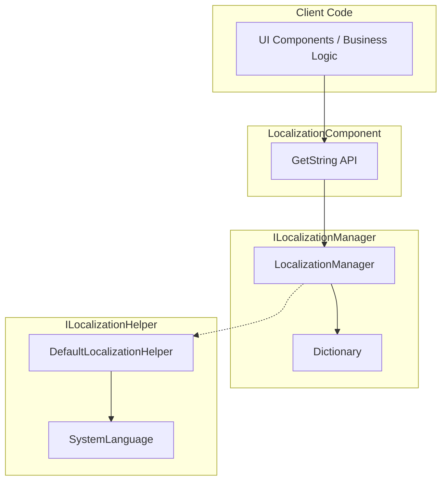
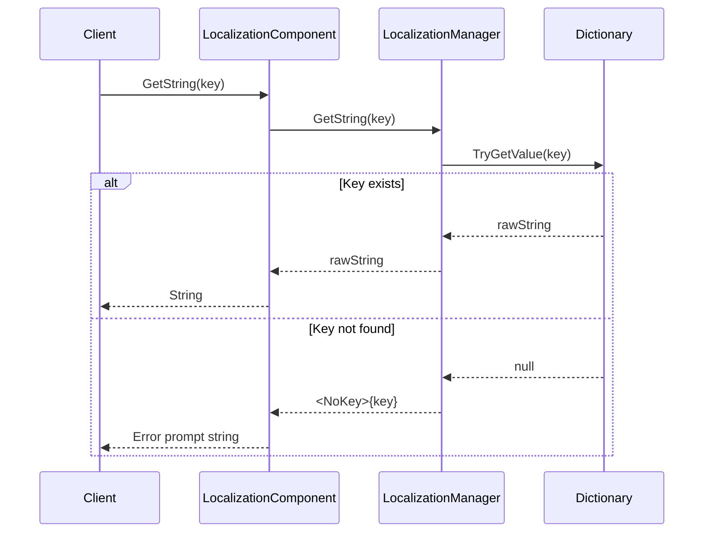
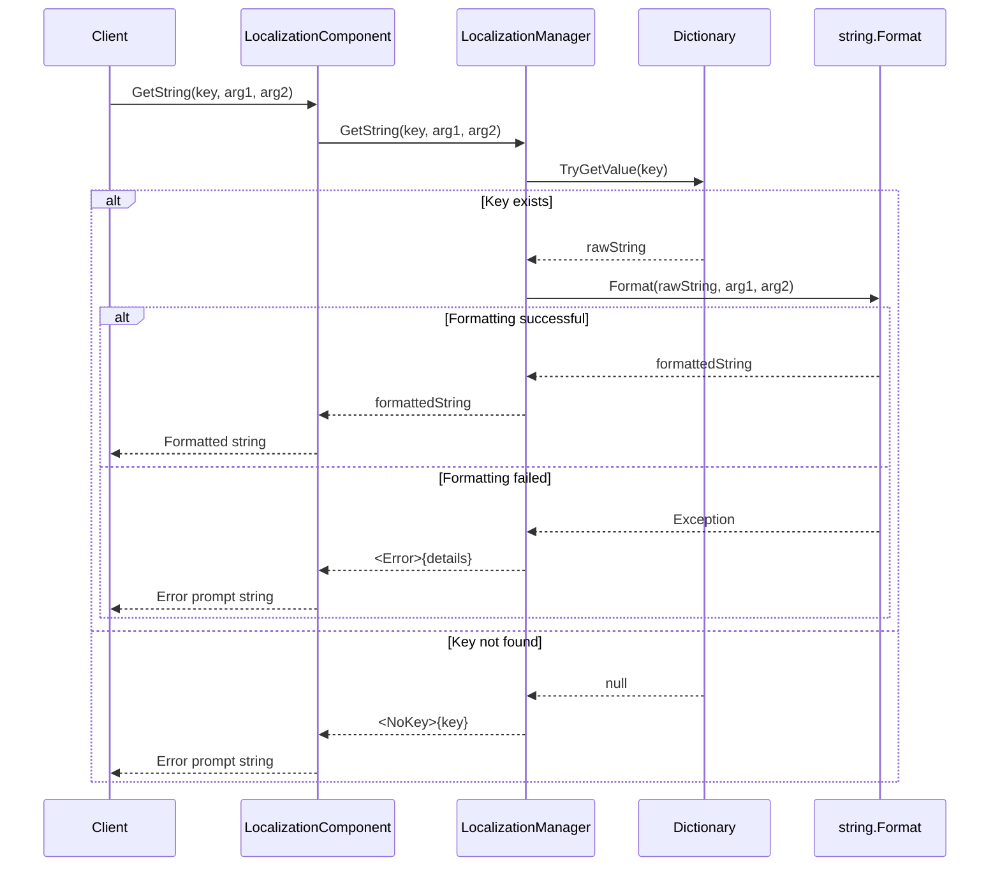

# Get Localized Strings

Getting localized strings is the core function of the GameFrameX Localization module. You can obtain string content in the corresponding language through the dictionary key, and support dynamic parameter replacement functionality.

## Overview

The LocalizationComponent provides rich `GetString` methods to retrieve localized strings. These methods support:

- **Basic Retrieval**: Get string directly by key
- **Parameter Replacement**: Support 0-16 parameters, enabling dynamic string formatting
- **Error Handling**: Return meaningful error prompts when key does not exist or formatting fails

Design Intent: Provide type-safe parameterized string retrieval to avoid runtime string concatenation errors while maintaining usage similar to .NET string.Format.

## Architecture



### Component Description

| Component | Responsibilities |
|-----------|-------------------|
| LocalizationComponent | Unity component layer, exposes public API |
| ILocalizationManager | Defines interface contract for localization management |
| LocalizationManager | Implements dictionary storage and string formatting logic |
| ILocalizationHelper | System language detection interface |

## Core Flow





## Usage Examples

### Basic Usage

The simplest usage is to get a string by key:

```csharp
using GameFrameX.Localization.Runtime;

// Get LocalizationComponent instance
var localization = GameEntry.GetComponent<LocalizationComponent>();

// Get simple string (no parameters)
string welcome = localization.GetString("UI_Welcome");
```

> Source: [LocalizationComponent.cs](https://github.com/GameFrameX/com.gameframex.unity.localization/blob/main/Runtime/Localization/LocalizationComponent.cs#L246-L249)

### Single Parameter Usage

Use a single parameter to replace placeholder `{0}` in the string:

```csharp
// Dictionary content: "Hello {0}, welcome to {1}!"
// Get string with parameter
string message = localization.GetString<string>("UI_Greeting", "Player");
// Result: "Hello Player, welcome to {1}!"
```

> Source: [LocalizationComponent.cs](https://github.com/GameFrameX/com.gameframex.unity.localization/blob/main/Runtime/Localization/LocalizationComponent.cs#L272-L275)

### Multi Parameter Usage

Supports up to 16 parameters, suitable for complex message formatting:

```csharp
// Dictionary content: "{0} found {1} items in {2}"
// Use two parameters
string result = localization.GetString<string, int, string>("UI_FindItems", "Player", 100);
// Result: "Player found 100 items in {2}"

// Use three parameters (complete formatting)
string fullResult = localization.GetString<string, int, string>("UI_FindItems", "Player", 100, "Dungeon");
// Result: "Player found 100 items in Dungeon"
```

> Source: [LocalizationComponent.cs](https://github.com/GameFrameX/com.gameframex.unity.localization/blob/main/Runtime/Localization/LocalizationComponent.cs#L287-L290)

### Dynamic Parameter Array Usage

Use `params` to pass an uncertain number of parameters:

```csharp
// Use params array
object[] args = new object[] { "Alice", 25, "Beijing" };
string message = localization.GetString("UI_UserInfo", args);
```

> Source: [LocalizationComponent.cs](https://github.com/GameFrameX/com.gameframex.unity.localization/blob/main/Runtime/Localization/LocalizationComponent.cs#L259-L262)

### Dictionary Operations

Before getting strings, you need to add data to the dictionary:

```csharp
// Add dictionary entry
localization.AddRawString("UI_StartGame", "Start Game");
localization.AddRawString("UI_Score", "Score: {0}");

// Check if key exists
if (localization.HasRawString("UI_StartGame"))
{
    // Get string
    string text = localization.GetString("UI_StartGame");
}

// Remove dictionary entry
localization.RemoveRawString("UI_StartGame");

// Clear all dictionaries
localization.RemoveAllRawStrings();
```

> Source: [LocalizationComponent.cs](https://github.com/GameFrameX/com.gameframex.unity.localization/blob/main/Runtime/Localization/LocalizationComponent.cs#L737-L758)

## API Reference

### LocalizationComponent

#### `GetString(string key): string`

Get localized string without parameters.

**Parameters:**
- `key` (string): Dictionary key

**Returns:** String content, returns `<NoKey>{key}` if key does not exist

**Example:**
```csharp
string text = localization.GetString("UI_Title");
```

---

#### `GetString<T>(string key, T arg): string`

Get localized string with single parameter.

**Parameters:**
- `key` (string): Dictionary key
- `arg` (T): Replacement parameter

**Returns:** Formatted string

**Example:**
```csharp
string text = localization.GetString<int>("UI_Score", 100);
// Dictionary: "Score: {0}" → Result: "Score: 100"
```

---

#### `GetString<T1, T2>(string key, T1 arg1, T2 arg2): string`

Get localized string with two parameters.

**Parameters:**
- `key` (string): Dictionary key
- `arg1` (T1): First parameter
- `arg2` (T2): Second parameter

**Returns:** Formatted string

---

#### `GetString(string key, params object[] args): string`

Get localized string using parameter array.

**Parameters:**
- `key` (string): Dictionary key
- `args` (object[]): Parameter array

**Returns:** Formatted string

---

#### `HasRawString(string key): bool`

Check if the specified key exists in the dictionary.

**Parameters:**
- `key` (string): Dictionary key

**Returns:** Returns true if exists, otherwise false

---

#### `GetRawString(string key): string`

Get raw dictionary value (without formatting).

**Parameters:**
- `key` (string): Dictionary key

**Returns:** Raw string, returns empty string when key does not exist

---

#### `AddRawString(string key, string value): void`

Add new entry to dictionary.

**Parameters:**
- `key` (string): Dictionary key
- `value` (string): Dictionary value

---

#### `RemoveRawString(string key): bool`

Remove specified entry from dictionary.

**Parameters:**
- `key` (string): Dictionary key

**Returns:** Returns true on successful removal, false if key does not exist

---

#### `RemoveAllRawStrings(): void`

Clear all dictionary entries.

---

### ILocalizationManager

The ILocalizationManager interface defines core localization management functionality. For the complete method list, please refer to the [API Reference](./5-api-reference) document.

## Error Handling

The system provides friendly handling for error situations:

| Error Scenario | Return Value Example |
|---------------|---------------------|
| Key does not exist | `<NoKey>UI_MissingKey` |
| Format parameter mismatch | `<Error>UI_Format,{0}actual content,arg,System.FormatException` |

This design ensures:
1. Missing keys can be quickly discovered during development
2. Application will not crash due to errors at runtime
3. Error information contains key data needed for debugging

## Related Links

- [Overview](./1-overview) - Understand the overall architecture of the localization module
- [Installation](./2-installation) - Install and configure the localization module
- [Getting Started](./3-getting-started) - Quick start with localization functionality
- [Dictionary Management](./4-core-features.dictionary-management) - Manage localization dictionaries
- [Language Switching and Events](./4-core-features.language-switching) - Switch languages and handle events
- [API Reference](./5-api-reference) - Complete API documentation
- [Configuration](./6-configuration) - Module configuration options
- [Best Practices](./7-best-practices) - Usage suggestions and tips