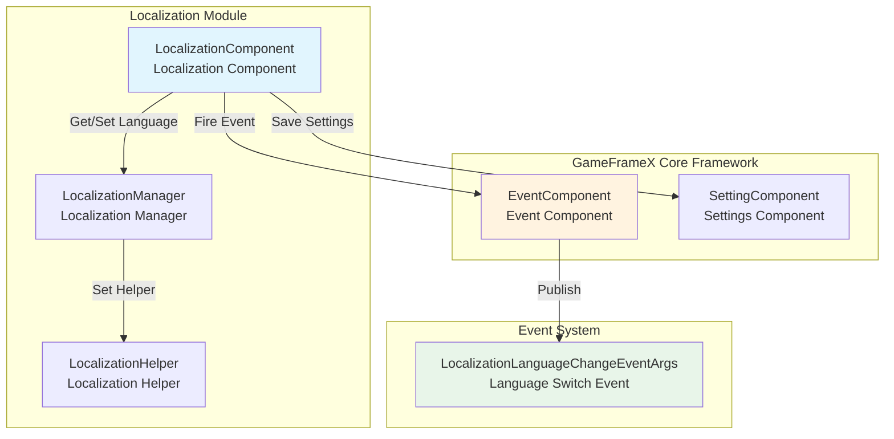
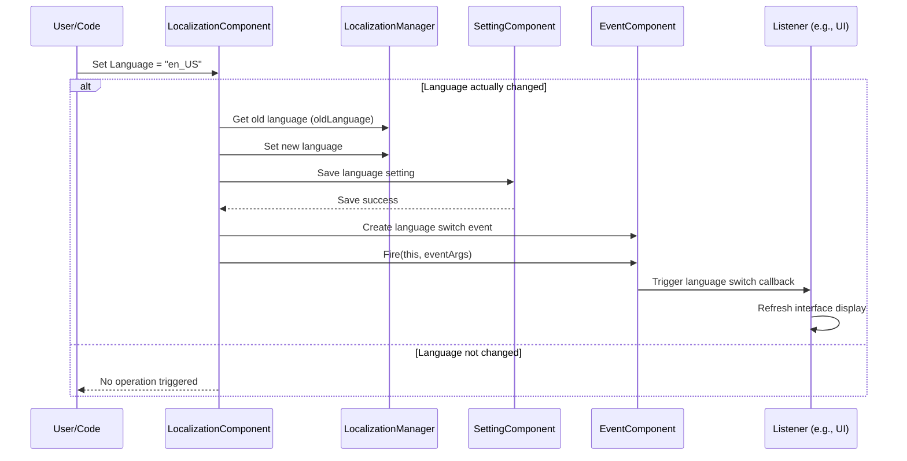

# Language Switching and Events

Language switching and events are one of the core features of the GameFrameX localization system, allowing developers to dynamically switch application language at runtime and notify all listeners that the language has changed through an event mechanism, thereby achieving automatic refresh of UI, text, and other content.

## Overview

The GameFrameX localization system uses an **event-driven architecture** to implement language switching functionality. When the application's language setting changes, the system:

1. Updates internal language state
2. Persistently saves the new language setting
3. Publishes language switching event through the event system
4. Listeners execute corresponding operations upon receiving the event (such as refreshing UI display)

This design achieves **loose coupling**: the initiator of language switching does not need to know who will respond to language changes, and responders do not need to care about how the language was switched.

> **Design Intent**: Using event mechanism to handle language switching allows multiple systems (such as UI system, audio system, date formatting system) to independently respond to language changes without directly depending on these systems in the language switching code. This conforms to the **Observer pattern** design philosophy, improving system extensibility and maintainability.

## Architecture Design

### Component Relationship Diagram



### Language Switching Flow



## Language Switching Details

### Set Language

You can set the current language through the `Language` property of `LocalizationComponent`:

```csharp
// Get localization component
var localizationComponent = GameEntry.GetComponent<LocalizationComponent>();

// Set language to English
localizationComponent.Language = "en_US";

// Set language to Chinese
localizationComponent.Language = "zh_CN";

// Set language to Japanese
localizationComponent.Language = "ja_JP";
```
> Source: [LocalizationComponent.cs](https://github.com/GameFrameX/com.gameframex.unity.localization/blob/main/Runtime/Localization/LocalizationComponent.cs#L116-L143)

**Internal implementation logic of language switching:**

```csharp
public string Language
{
    get { /* ... */ }
    set
    {
        if (m_LocalizationManager.Language != value)  // Only process when language actually changes
        {
            var oldLanguage = m_LocalizationManager.Language;  // Record old language
            m_LocalizationManager.Language = value;            // Set new language
            m_SettingComponent.SetString(...);                 // Persist save
            m_SettingComponent.Save();
            
            // Trigger language switch event
            var eventArgs = LocalizationLanguageChangeEventArgs.Create(oldLanguage, value);
            m_EventComponent.Fire(this, eventArgs);
        }
    }
}
```
> Source: [LocalizationComponent.cs](https://github.com/GameFrameX/com.gameframex.unity.localization/blob/main/Runtime/Localization/LocalizationComponent.cs#L131-L142)

### Get Current Language

```csharp
var localizationComponent = GameEntry.GetComponent<LocalizationComponent>();

// Get current language
string currentLanguage = localizationComponent.Language;

// Get system language
string systemLanguage = localizationComponent.SystemLanguage;

// Get default language
string defaultLanguage = localizationComponent.DefaultLanguage;
```

### Get System Language

System language refers to the current regional language setting of the device:

```csharp
var localizationComponent = GameEntry.GetComponent<LocalizationComponent>();
string systemLang = localizationComponent.SystemLanguage;
```

## Event Details

### Language Switch Event

When language is switched, the system publishes `LocalizationLanguageChangeEventArgs` event.

#### Event Parameter Structure

```csharp
public sealed class LocalizationLanguageChangeEventArgs : GameEventArgs
{
    /// <summary>
    /// Event ID
    /// </summary>
    public static readonly string EventId = typeof(LocalizationLanguageChangeEventArgs).FullName;

    /// <summary>
    /// Current language
    /// </summary>
    public string Language { get; set; }

    /// <summary>
    /// Old language
    /// </summary>
    public string OldLanguage { get; set; }
}
```
> Source: [LocalizationLanguageChangeEventArgs.cs](https://github.com/GameFrameX/com.gameframex.unity.localization/blob/main/Runtime/EventArgs/LocalizationLanguageChangeEventArgs.cs#L11-L33)

#### Subscribe to Language Switch Event

```csharp
using GameFrameX.Event.Runtime;
using GameFrameX.Localization.Runtime;

public class MyLanguageListener : MonoBehaviour
{
    private EventComponent _eventComponent;

    private void Start()
    {
        _eventComponent = GameEntry.GetComponent<EventComponent>();
        
        // Subscribe to language switch event
        _eventComponent.Subscribe(LocalizationLanguageChangeEventArgs.EventId, OnLanguageChanged);
    }

    private void OnLanguageChanged(object sender, GameEventArgs e)
    {
        var args = e as LocalizationLanguageChangeEventArgs;
        Debug.Log($"Language changed from {args.OldLanguage} to {args.Language}");
        
        // Here you can refresh UI display, reload localized strings, etc.
        RefreshUI();
    }

    private void OnDestroy()
    {
        // Remember to unsubscribe to avoid memory leaks
        if (_eventComponent != null)
        {
            _eventComponent.Unsubscribe(LocalizationLanguageChangeEventArgs.EventId, OnLanguageChanged);
        }
    }

    private void RefreshUI()
    {
        // Implement UI refresh logic
    }
}
```
> Source: [LocalizationLanguageChangeEventArgs.cs](https://github.com/GameFrameX/com.gameframex.unity.localization/blob/main/Runtime/EventArgs/LocalizationLanguageChangeEventArgs.cs#L52-L58)

### Dictionary Loading Events

In addition to language switch events, the system also provides dictionary loading related events (currently commented out in code, but classes are defined):

| Event | Description |
|-------|-------------|
| `LoadDictionarySuccessEventArgs` | Dictionary loading success event |
| `LoadDictionaryFailureEventArgs` | Dictionary loading failure event |

```csharp
// Dictionary loading success event parameters
public sealed class LoadDictionarySuccessEventArgs : GameEventArgs
{
    /// <summary>
    /// Event ID
    /// </summary>
    public static readonly string EventId = typeof(LoadDictionarySuccessEventArgs).FullName;

    /// <summary>
    /// Dictionary resource name
    /// </summary>
    public string DictionaryAssetName { get; private set; }

    /// <summary>
    /// Loading duration
    /// </summary>
    public float Duration { get; private set; }

    /// <summary>
    /// User custom data
    /// </summary>
    public object UserData { get; private set; }
}
```
> Source: [LoadDictionarySuccessEventArgs.cs](https://github.com/GameFrameX/com.gameframex.unity.localization/blob/main/Runtime/EventArgs/LoadDictionarySuccessEventArgs.cs#L42-L85)

## Best Practices

### 1. Listen to Language Switch and Auto-refresh UI

Create a generic language switch listener to automatically refresh all UI elements that need localization:

```csharp
using UnityEngine;
using GameFrameX.Event.Runtime;
using GameFrameX.Localization.Runtime;

public class LanguageChangedListener : MonoBehaviour
{
    private EventComponent _eventComponent;

    private void Awake()
    {
        _eventComponent = GameEntry.GetComponent<EventComponent>();
    }

    private void OnEnable()
    {
        _eventComponent.Subscribe(LocalizationLanguageChangeEventArgs.EventId, OnLanguageChanged);
    }

    private void OnDisable()
    {
        _eventComponent.Unsubscribe(LocalizationLanguageChangeEventArgs.EventId, OnLanguageChanged);
    }

    private void OnLanguageChanged(object sender, GameEventArgs e)
    {
        var args = e as LocalizationLanguageChangeEventArgs;
        Debug.Log($"Language switched: {args.OldLanguage} → {args.Language}");
        
        // Notify all components that need refresh
        BroadcastMessage("OnLanguageChanged", SendMessageOptions.DontRequireReceiver);
    }
}
```

### 2. Save User Language Preference

Language settings are automatically saved locally, but you can also manually control the save timing:

```csharp
var localizationComponent = GameEntry.GetComponent<LocalizationComponent>();

// Get user's last saved language
string savedLanguage = localizationComponent.Language;

// After changing language, it will be automatically saved, but if you need immediate save you can call:
 // (Set property already includes automatic save logic)

// Set default language (only used on first launch)
string defaultLang = localizationComponent.DefaultLanguage;
```

### 3. Handle Resources When Switching Language

When switching languages, you may need to reload some language-related resources:

```csharp
private void OnLanguageChanged(object sender, GameEventArgs e)
{
    var args = e as LocalizationLanguageChangeEventArgs;
    
    // Clear old dictionary cache
    var localizationComponent = GameEntry.GetComponent<LocalizationComponent>();
    localizationComponent.RemoveAllRawStrings();
    
    // Reload new language dictionary
    // LoadNewLanguageDictionary(args.Language);
    
    // Refresh interface
    RefreshAllLocalizedContent();
}
```

## Common Issues

### Q: UI did not automatically update after language switch?

**A**: You need to subscribe to language switch event and implement UI refresh logic. GameFrameX will not automatically refresh UI; developers need to listen to events and manually refresh.

### Q: How to get the current system language?

```csharp
var localizationComponent = GameEntry.GetComponent<LocalizationComponent>();
string systemLang = localizationComponent.SystemLanguage;
```

### Q: Where is the language switch event triggered?

**A**: The language switch event is triggered in the setter of `LocalizationComponent.Language` property. The event is only triggered when the set value is different from the current language.

### Q: How to prevent duplicate triggering of language switch events?

**A**: `LocalizationComponent` has already made a judgment internally; the event is only triggered when the new language is different from the current language:

```csharp
if (m_LocalizationManager.Language != value)
{
    // Only execute when values are different
}
```

## Related Links

- [Get Localized Strings](./4-core-features.get-string) - Learn how to get localized text
- [Dictionary Management](./4-core-features.dictionary-management) - Learn dictionary loading and management
- [API Reference](./5-api-reference) - Complete API documentation
- [Configuration](./6-configuration) - Localization system configuration description
- [Best Practices](./7-best-practices) - More usage tips