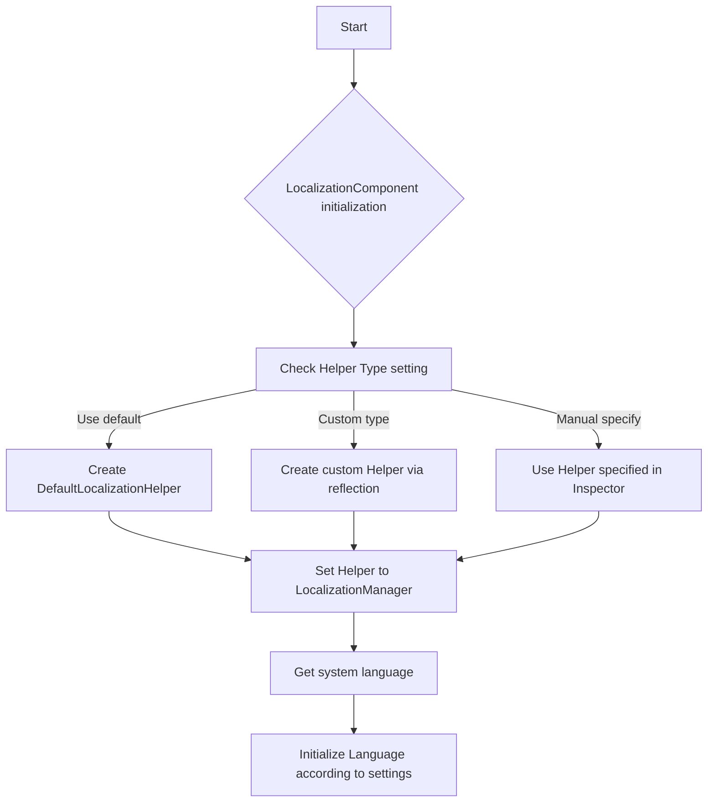
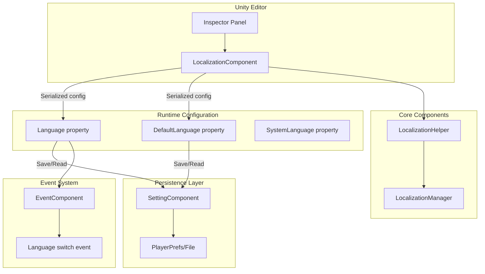

# Configuration

This document provides detailed information on various configuration options for the GameFrameX Localization component, including editor configuration and runtime configuration.

## Overview

The GameFrameX Localization component provides a flexible localization configuration mechanism, supporting both Unity Editor interface configuration and code runtime configuration. The configuration system uses a layered design, allowing developers to customize the localization helper, set default language, enable editor test mode, and other features.

LocalizationComponent is the core component of the Unity engine, inherited from GameFrameworkComponent, providing configuration options through serialized fields. These configurations take effect during component initialization and control the behavior of the localization system.

> Source files:
> - [LocalizationComponent.cs](https://github.com/GameFrameX/com.gameframex.unity.localization/blob/main/Runtime/Localization/LocalizationComponent.cs#L48-L777)
> - [LocalizationManager.cs](https://github.com/GameFrameX/com.gameframex.unity.localization/blob/main/Runtime/Localization/Localization/LocalizationManager.cs#L43-L937)

## Editor Configuration

### Adding Localization Component

In Unity Editor, add the localization component through the following steps:

1. Create an empty GameObject in the scene or select an existing object
2. Click menu **GameObject → GameFrameX → Localization**
3. Or click **Add Component** in the Inspector panel and search for "Localization"

After adding the component, the Inspector panel will display configuration options.

### Configuration Options Description

```csharp
// LocalizationComponent core configuration fields
[SerializeField] private string m_EditorLanguage = "zh_CN";           // Editor language
[SerializeField] private string m_DefaultLanguage = "zh_CN";         // Default language
[SerializeField] private bool m_IsEnableEditorMode = false;          // Enable editor mode
[SerializeField] private string m_LocalizationHelperTypeName;        // Helper type name
[SerializeField] private LocalizationHelperBase m_CustomLocalizationHelper; // Custom helper instance
```

> Source: [LocalizationComponentInspector.cs](https://github.com/GameFrameX/com.gameframex.unity.localization/blob/main/Editor/Inspector/LocalizationComponentInspector.cs#L42-L46)

The following table details each configuration item:

| Configuration Item | Type | Default Value | Description |
|-------------------|------|---------------|-------------|
| **Default Language** | string | "zh_CN" | Default language code, used when loading localization fails |
| **Is Enable Editor Mode** | bool | false | Whether to enable editor mode, when enabled uses editor language instead of runtime language |
| **Editor Language** | string | "zh_CN" | Language used in editor mode, only effective in editor |
| **Localization Helper** | HelperInfo | DefaultLocalizationHelper | Localization helper type, can be customized |

### Language Code Reference

Language codes follow the RFC 5646 standard, format is `[language code]_[country/region code]`, for example:
- `zh_CN` - Simplified Chinese (China)
- `zh_TW` - Traditional Chinese (Taiwan)
- `en_US` - English (USA)
- `ja_JP` - Japanese (Japan)
- `ko_KR` - Korean (Korea)

The system pre-defines abundant language code constants that can be directly referenced through the `LocalizationCode` class:

```csharp
// Use predefined language code constants
LocalizationComponent component = gameObject.GetComponent<LocalizationComponent>();
component.DefaultLanguage = LocalizationCode.Chinese;        // zh_CN
component.DefaultLanguage = LocalizationCode.English;         // en_US
component.DefaultLanguage = LocalizationCode.Japanese;        // ja_JP
```

> Source: [LocalizationCode.cs](https://github.com/GameFrameX/com.gameframex.unity.localization/blob/main/Runtime/Localization/LocalizationCode.cs#L45-L986)

## Runtime Configuration

### Configure Language via Code

At game runtime, you can dynamically configure language settings via code:

```csharp
using GameFrameX.Localization.Runtime;

// Get localization component
var localizationComponent = GameEntry.GetComponent<LocalizationComponent>();

// Set current language
localizationComponent.Language = "en_US";

// Set default language (used when loading fails)
localizationComponent.DefaultLanguage = "zh_CN";

// Get current language
string currentLanguage = localizationComponent.Language;

// Get system language
string systemLanguage = localizationComponent.SystemLanguage;
```

> Source: [LocalizationComponent.cs](https://github.com/GameFrameX/com.gameframex.unity.localization/blob/main/Runtime/Localization/LocalizationComponent.cs#L116-L143)

### Configuration Persistence Mechanism

Language and DefaultLanguage settings are automatically persisted to the local settings system. On first run, the system language will be used as the default language:

```csharp
// Initialization flow pseudocode
if (Language == UnknownLocalization)
{
    Language = SystemLanguage;  // Use system language
}
DefaultLanguage = m_DefaultLanguage != UnknownLocalization ? m_DefaultLanguage : SystemLanguage;
```

> Source: [LocalizationComponent.cs](https://github.com/GameFrameX/com.gameframex.unity.localization/blob/main/Runtime/Localization/LocalizationComponent.cs#L232-L237)

### Configuration Property Details

#### Language Property

Get or set the current localization language. Setting a new language triggers a language switch event:

```csharp
public string Language
{
    get
    {
        if (m_LocalizationManager.Language == UnknownLocalization)
        {
            var value = m_SettingComponent.GetString(nameof(LocalizationComponent) + "." + nameof(Language));
            if (value.IsNotNullOrWhiteSpace())
            {
                m_LocalizationManager.Language = value;
            }
        }
        return m_LocalizationManager.Language;
    }
    set
    {
        if (m_LocalizationManager.Language != value)
        {
            var oldLanguage = m_LocalizationManager.Language;
            m_LocalizationManager.Language = value;
            m_SettingComponent.SetString(nameof(LocalizationComponent) + "." + nameof(Language), value);
            m_SettingComponent.Save();
            var localizationLanguageChangeEventArgs = LocalizationLanguageChangeEventArgs.Create(oldLanguage, value);
            m_EventComponent.Fire(this, localizationLanguageChangeEventArgs);
        }
    }
}
```

**Design Intent**: The Language property uses lazy loading mechanism to read the last saved language setting from persistent storage. When setting a new value, it automatically saves to ensure language preferences persist across sessions. At the same time, it triggers an event to notify other systems that the language has changed.

#### DefaultLanguage Property

Get or set the default localization language, used when loading localization fails:

```csharp
public string DefaultLanguage
{
    get
    {
        if (m_LocalizationManager.DefaultLanguage == UnknownLocalization)
        {
            var value = m_SettingComponent.GetString(nameof(LocalizationComponent) + "." + nameof(DefaultLanguage));
            if (value.IsNotNullOrWhiteSpace())
            {
                m_LocalizationManager.DefaultLanguage = value;
            }
        }
        return m_LocalizationManager.DefaultLanguage;
    }
    set
    {
        if (m_LocalizationManager.DefaultLanguage != value)
        {
            m_LocalizationManager.DefaultLanguage = value;
            m_SettingComponent.SetString(nameof(LocalizationComponent) + "." + nameof(DefaultLanguage), value);
            m_SettingComponent.Save();
        }
    }
}
```

**Design Intent**: DefaultLanguage serves as a fallback mechanism to ensure content can still be displayed when target language resources are missing, improving user experience.

#### SystemLanguage Property

Get the device system language:

```csharp
public string SystemLanguage
{
    get { return m_LocalizationManager.SystemLanguage; }
}
```

The system language is provided by LocalizationHelper. DefaultLocalizationHelper obtains it through CultureInfo:

```csharp
public override string SystemLanguage
{
    get { return _regionName; }  // Such as "zh_CN", "en_US"
}
```

> Source: [DefaultLocalizationHelper.cs](https://github.com/GameFrameX/com.gameframex.unity.localization/blob/main/Runtime/Localization/DefaultLocalizationHelper.cs#L43-L57)

## Custom Localization Helper

### Why Custom Helper

The default LocalizationHelper obtains system language through `CultureInfo.CurrentCulture.Name`. In some scenarios, you may need custom logic to determine system language, for example:
- Get language settings from server
- Determine language based on player account settings
- Use language settings from configuration file

### Create Custom Helper

1. Inherit LocalizationHelperBase:

```csharp
using GameFrameX.Localization.Runtime;
using UnityEngine;

public class CustomLocalizationHelper : LocalizationHelperBase
{
    // Custom system language acquisition logic
    public override string SystemLanguage
    {
        get
        {
            // Get language from server or config
            return PlayerPrefs.GetString("Language", "zh_CN");
        }
    }
}
```

> Source: [LocalizationHelperBase.cs](https://github.com/GameFrameX/com.gameframex.unity.localization/blob/main/Runtime/Localization/LocalizationHelperBase.cs#L41-L48)

2. Configure custom helper in editor:

In the Inspector panel of LocalizationComponent, set Helper Type to custom class, or directly drag the custom helper component into the Custom Localization Helper field.

### Helper Configuration Flow



> Source: [LocalizationComponent.cs](https://github.com/GameFrameX/com.gameframex.unity.localization/blob/main/Runtime/Localization/LocalizationComponent.cs#L214-L237)

## Configuration Architecture Diagram



## Configuration Options Summary

### LocalizationComponent Configuration

| Property | Type | Default Value | Runtime Writable | Description |
|------|------|--------|------------|-------------|
| `EditorLanguage` | string | "zh_CN" | No (editor only) | Language for editor testing |
| `DefaultLanguage` | string | "zh_CN" | Yes | Fallback language when loading fails |
| `IsEnableEditorMode` | bool | false | No | Whether to use EditorLanguage in editor |
| `Language` | string | System language | Yes | Currently used language |
| `SystemLanguage` | string | Device language | Read-only | Operating system language |

### LocalizationManager Core Properties

| Property | Type | Description |
|------|------|-------------|
| `DefaultLanguage` | string | Default language |
| `Language` | string | Current language |
| `SystemLanguage` | string | System language |
| `DictionaryCount` | int | Current dictionary count |

### Predefined Language Codes (Common)

| Constant | Value | Description |
|------|-----|-------------|
| `LocalizationCode.Chinese` | "zh_CN" | Simplified Chinese |
| `LocalizationCode.ChineseTraditionalTW` | "zh_TW" | Traditional Chinese (Taiwan) |
| `LocalizationCode.Japanese` | "ja_JP" | Japanese |
| `LocalizationCode.Korean` | "ko_KR` | Korean |
| `LocalizationCode.English` | "en_US" | English (USA) |
| `LocalizationCode.EnglishUK` | "en_GB" | English (UK) |
| `LocalizationCode.French` | "fr_FR" | French |
| `LocalizationCode.German` | "de_DE" | German |
| `LocalizationCode.Spanish` | "es_ES" | Spanish |
| `LocalizationCode.Russian` | "ru_RU` | Russian |

> Source: [LocalizationCode.cs](https://github.com/GameFrameX/com.gameframex.unity.localization/blob/main/Runtime/Localization/LocalizationCode.cs#L46-L148)

## Best Practices

### 1. Set Language at Game Startup

It is recommended to set the language as early as possible in the game initialization flow to ensure all UI text uses the correct language:

```csharp
// Set language during game initialization phase
var localizationComponent = GameEntry.GetComponent<LocalizationComponent>();

// Method 1: Use saved language setting
string savedLanguage = PlayerPrefs.GetString("GameLanguage");
if (!string.IsNullOrEmpty(savedLanguage))
{
    localizationComponent.Language = savedLanguage;
}
else
{
    // Method 2: Use system language as default
    localizationComponent.Language = localizationComponent.SystemLanguage;
}
```

### 2. Listen to Language Switch

Listen to language switch event to update UI:

```csharp
// Subscribe to language switch event
EventComponent eventComponent = GameEntry.GetComponent<EventComponent>();
eventComponent.Subscribe(LocalizationLanguageChangeEventArgs.EventId, OnLanguageChanged);

private void OnLanguageChanged(object sender, GameEventArgs e)
{
    var args = (LocalizationLanguageChangeEventArgs)e;
    Debug.Log($"Language changed from {args.OldLanguage} to {args.Language}");
    
    // Refresh all UI components that need localization
    // RefreshAllLocalizedUI();
}
```

> Source: [LocalizationLanguageChangeEventArgs.cs](https://github.com/GameFrameX/com.gameframex.unity.localization/blob/main/Runtime/EventArgs/LocalizationLanguageChangeEventArgs.cs#L52-L58)

### 3. Configuration Checklist

Check the following configuration before deploying the game:

- [ ] DefaultLanguage set to the project's primary language
- [ ] All supported languages have corresponding dictionary resources
- [ ] Custom LocalizationHelper is correctly implemented
- [ ] Language switch event is correctly handled
- [ ] Tested fallback behavior when system language is not in supported list

## Related Links

- [Get Localized Strings](../4-core-features.get-string) - Learn how to get localized text
- [Dictionary Management](../4-core-features.dictionary-management) - Learn dictionary data management
- [Language Switching and Events](../4-core-features.language-switching) - Learn language switching mechanism
- [API Reference](../5-api-reference) - Complete API documentation
- [Getting Started](../3-getting-started) - Quick start guide