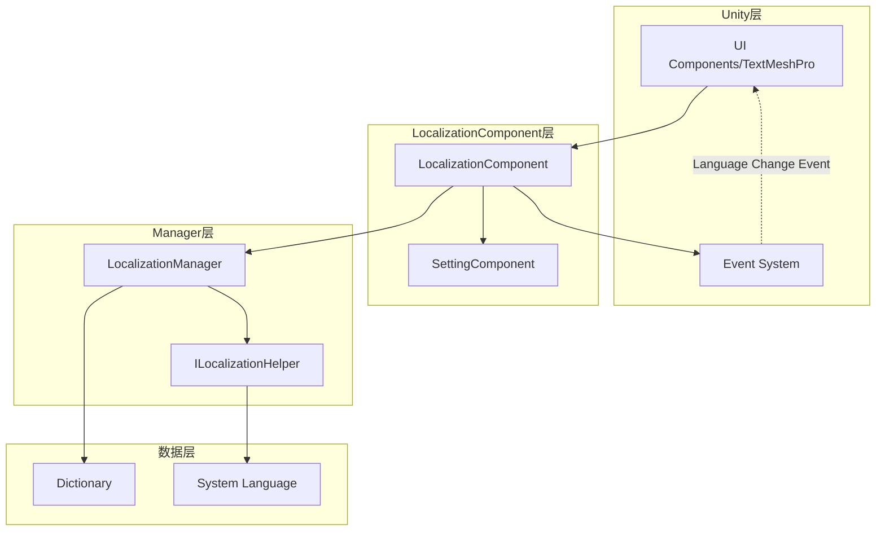

# Best Practices

This document provides best practices guide for the GameFrameX Localization component, helping developers implement multi-language functionality efficiently and properly.

## Overview

The GameFrameX Localization component provides a complete localization solution for Unity games. Following the best practices in this document can help you build a maintainable, scalable multi-language system and avoid common pitfalls and anti-patterns.

## Core Architecture Review



### Component Responsibilities

| Component | Responsibilities |
|-----------|-------------------|
| LocalizationComponent | Unity component layer, responsible for initialization and event triggering |
| LocalizationManager | Core manager, handles dictionary storage and string retrieval |
| ILocalizationHelper | System language detection interface, can be custom implemented |
| SettingComponent | Persist language settings |

## Best Practices

### 1. Key Naming Conventions

Adopt a hierarchical key naming strategy for easy management and lookup.

**Recommended Format:**

```csharp
// Format: feature_module_ui_element_specific_description
"main_menu_start_button"           // Main menu - Start button
"main_menu_settings_button"        // Main menu - Settings button
"game_hud_score_label"             // Game HUD - Score label
"game_dialog_confirm_message"      // Game dialog - Confirm message
"settings_audio_master_volume"     // Settings - Audio - Master volume
```

**Not Recommended:**

```csharp
// ❌ Irregular naming
"start"                            // Meaning unclear
"button1"                          // No context
"msg_001"                          // Hard to maintain
```

**Use Constants Class to Manage Key Names:**

```csharp
// It is recommended to create a dedicated constants class to manage key names
public static class LocalizationKeys
{
    public const string MainMenuStart = "main_menu_start_button";
    public const string MainMenuSettings = "main_menu_settings_button";
    public const string GameHudScore = "game_hud_score_label";
}
```

> Source: [LocalizationManager.cs](https://github.com/GameFrameX/com.gameframex.unity.localization/blob/main/Runtime/Localization/Localization/LocalizationManager.cs#L168-L177)

### 2. Default Language Setting

Always set a reasonable default language and use the `DefaultLanguage` property as a fallback mechanism.

**Basic Setup:**

```csharp
var localizationComponent = GameEntry.GetComponent<LocalizationComponent>();
// Set default language to Simplified Chinese
localizationComponent.DefaultLanguage = LocalizationCode.ChineseSimplified;
```

> Source: [LocalizationComponent.cs](parameterName=86-L110)

**Multi-layer Fallback Strategy:**

```csharp
// Design fallback chain: User setting -> System language -> Default language
// 1. First try to use user's saved language setting
// 2. If not set, use system language
// 3. If system language is not supported, fall back to default language
if (string.IsNullOrEmpty(savedLanguage))
{
    localizationComponent.Language = localizationComponent.SystemLanguage;
}
```

### 3. Parameterized String Handling

Use generic methods to handle dynamic content, supporting up to 16 parameters.

**Single Parameter Usage:**

```csharp
// Simple parameter replacement
string welcome = localizationComponent.GetString("game_welcome_message", playerName);
// Template: "Welcome back, {0}!" -> "Welcome back, ZhangSan!"
```

> Source: [LocalizationManager.cs](parameterName=205-L221)

**Multi Parameter Usage:**

```csharp
// Complex formatting
string levelInfo = localizationComponent.GetString("game_level_info", 
    currentLevel,      // T1
    maxLevel,          // T2
    playerScore);      // T3
// Template: "Level {0} / {1} total - Score: {2}"
```

> Source: [LocalizationManager.cs](parameterName=263-L279)

**Using params Array:**

```csharp
// Dynamic number of parameters
object[] args = { itemName, itemCount, playerGold };
string message = localizationComponent.GetString("shop_purchase_info", args);
```

> Source: [LocalizationManager.cs](parameterName=186-L195)

### 4. Language Change Event Handling

Listen to language change events to implement automatic UI refresh.

**Event Subscription:**

```csharp
private void OnLanguageChanged(object sender, LocalizationLanguageChangeEventArgs e)
{
    // Refresh all localized text
    RefreshAllLocalizedTexts();
    
    // Or reload current scene
    // SceneManager.LoadScene(SceneManager.GetActiveScene().name);
}

private void Start()
{
    var eventComponent = GameEntry.GetComponent<EventComponent>();
    eventComponent.Subscribe(LocalizationLanguageChangeEventArgs.EventId, OnLanguageChanged);
}
```

> Source: [LocalizationLanguageChangeEventArgs.cs](https://github.com/GameFrameX/com.gameframex.unity.localization/blob/main/Runtime/EventArgs/LocalizationLanguageChangeEventArgs.cs#L52-L58)

**Event Triggering Mechanism:**

```csharp
// Setting language in LocalizationComponent will automatically trigger event
localizationComponent.Language = LocalizationCode.English; 
// Triggers LocalizationLanguageChangeEventArgs event
```

> Source: [LocalizationComponent.cs](parameterName=131-L143)

### 5. Dictionary Management Strategy

**Organize Dictionaries by Functional Module:**

```csharp
// UI dictionaries
AddRawString("ui_main_menu_title", "Main Menu");
AddRawString("ui_main_menu_start", "Start Game");
AddRawString("ui_main_menu_settings", "Settings");

// In-game dictionaries
AddRawString("game_hud_health", "Health");
AddRawString("game_hud_energy", "Energy");
AddRawString("game_level_complete", "Level Complete!");

// Tip message dictionaries
AddRawString("tips_welcome", "Welcome to the game world");
AddRawString("tips_first_step", "Use arrow keys to move character");
```

**Dynamic Dictionary Addition:**

```csharp
// Load language pack at game startup
public void LoadLanguagePack(string languageCode)
{
    // Load language pack data from resource system
    var languageData = Resources.Load<TextAsset>($"Languages/{languageCode}");
    var lines = languageData.text.Split('\n');
    
    foreach (var line in lines)
    {
        var parts = line.Split('=');
        if (parts.Length == 2)
        {
            localizationComponent.AddRawString(parts[0].Trim(), parts[1].Trim());
        }
    }
}
```

> Source: [LocalizationManager.cs](parameterName=899-L913)

### 6. Performance Optimization

**Avoid Frequent GetString Calls in Update:**

```csharp
// ❌ Anti-pattern: Call every frame
void Update()
{
    text.text = localizationComponent.GetString("game_timer", currentTime);
}

// ✅ Correct pattern: Cache string, only update when value changes
private string _cachedTimeKey = "game_timer";
private float _lastUpdateTime;

void Update()
{
    if (Mathf.Abs(currentTime - _lastUpdateTime) > 0.1f)
    {
        text.text = localizationComponent.GetString(_cachedTimeKey, currentTime);
        _lastUpdateTime = currentTime;
    }
}
```

**Use HasRawString for Existence Check:**

```csharp
// Check if key exists to avoid returning error marker
if (localizationComponent.HasRawString(key))
{
    var value = localizationComponent.GetString(key);
}
```

> Source: [LocalizationManager.cs](parameterName=862-L870)

### 7. Custom Language Detection Helper

When the default system language detection does not meet requirements, you can extend `ILocalizationHelper`.

**Implement Custom Helper:**

```csharp
public class CustomLocalizationHelper : LocalizationHelperBase
{
    public override string SystemLanguage
    {
        get 
        {
            // Custom language detection logic
            // For example: Read language settings from player config
            var config = PlayerPrefs.GetString("language_preference");
            return string.IsNullOrEmpty(config) 
                ? base.SystemLanguage 
                : config;
        }
    }
}
```

> Source: [DefaultLocalizationHelper.cs](https://github.com/GameFrameX/com.gameframex.unity.localization/blob/main/Runtime/Localization/DefaultLocalizationHelper.cs#L41-L58)

### 8. Use Standard Language Codes

Use constants in the `LocalizationCode` class to ensure consistency of language codes.

```csharp
// ✅ Recommended: Use predefined constants
localizationComponent.Language = LocalizationCode.ChineseSimplified;  // "zh_CN"
localizationComponent.Language = LocalizationCode.English;             // "en_US"
localizationComponent.Language = LocalizationCode.Japanese;           // "ja_JP"

// ❌ Not recommended: Enter string manually
localizationComponent.Language = "zh-CN";  // Inconsistent format
```

> Source: [LocalizationCode.cs](https://github.com/GameFrameX/com.gameframex.unity.localization/blob/main/Runtime/Localization/LocalizationCode.cs#L1-L986)

### 9. Error Handling and Fallback

**Handle Missing Keys:**

```csharp
// GetString method automatically handles missing keys
// Returns format: <NoKey>key_name
string result = localizationComponent.GetString("nonexistent_key");
// Returns: <NoKey>nonexistent_key>
```

> Source: [LocalizationManager.cs](parameterName=170-L177)

**Add Custom Fallback Logic:**

```csharp
public string GetStringSafe(string key, string fallback = "")
{
    if (localizationComponent.HasRawString(key))
    {
        return localizationComponent.GetString(key);
    }
    
    Log.Warning($"Localization key not found: {key}");
    return fallback;
}
```

### 10. Editor Mode Support

Use editor mode to speed up development and testing.

```csharp
// Enable editor mode in LocalizationComponent
// m_IsEnableEditorMode = true;
// m_EditorLanguage = "zh_CN";

// In editor, you can quickly switch language to preview effect
// Does not affect runtime behavior
```

> Source: [LocalizationComponent.cs](parameterName=227-L236)

## Common Scenario Practices

### Scenario 1: In-game Language Switching

```csharp
public class LanguageSwitcher : MonoBehaviour
{
    public void SwitchToChinese()
    {
        var loc = GameEntry.GetComponent<LocalizationComponent>();
        loc.Language = LocalizationCode.ChineseSimplified;
    }

    public void SwitchToEnglish()
    {
        var loc = GameEntry.GetComponent<LocalizationComponent>();
        loc.Language = LocalizationCode.English;
    }
}
```

### Scenario 2: Localized Text Component

```csharp
public class LocalizedText : MonoBehaviour
{
    [SerializeField] private string _localizationKey;
    private TextMeshProUGUI _text;

    private void Start()
    {
        _text = GetComponent<TextMeshProUGUI>();
        RefreshText();
        
        // Subscribe to language change event
        GameEntry.GetComponent<EventComponent>()
            .Subscribe(LocalizationLanguageChangeEventArgs.EventId, OnLanguageChanged);
    }

    private void RefreshText()
    {
        var loc = GameEntry.GetComponent<LocalizationComponent>();
        _text.text = loc.GetString(_localizationKey);
    }

    private void OnLanguageChanged(object sender, GameEventArgs e)
    {
        RefreshText();
    }
}
```

### Scenario 3: Dynamic Formatted Text

```csharp
// Item information formatting
string itemDescription = localizationComponent.GetString(
    "game_item_description",
    itemName,      // Item name
    itemRarity,    // Rarity
    itemLevel,     // Item level
    itemDamage     // Attack power
);
// Template: "【{0}】\nRarity: {1}\nLevel: {2}\nAttack: {3}"
```

## Summary

Following the above best practices can help you build a high-quality multi-language system:

1. **Key Name Standardization** - Use hierarchical naming for easy maintenance and lookup
2. **Default Language Strategy** - Set a reasonable fallback mechanism
3. **Event-driven Updates** - Use language change events to refresh UI
4. **Performance Focus** - Avoid unnecessary repeated calls
5. **Extensibility Design** - Use interface system to customize behavior
6. **Standardized Code** - Use `LocalizationCode` constants class

---

## Related Links

- [Core Features - Get Localized Strings](./4-core-features.get-string)
- [Core Features - Dictionary Management](./4-core-features.dictionary-management)
- [Core Features - Language Switching and Events](./4-core-features.language-switching)
- [API Reference](./5-api-reference)
- [Configuration](./6-configuration)