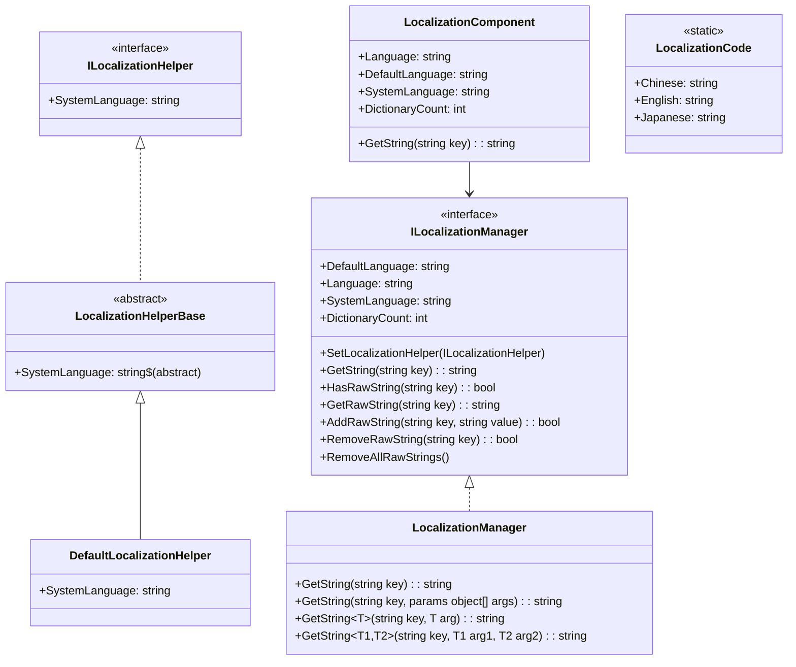
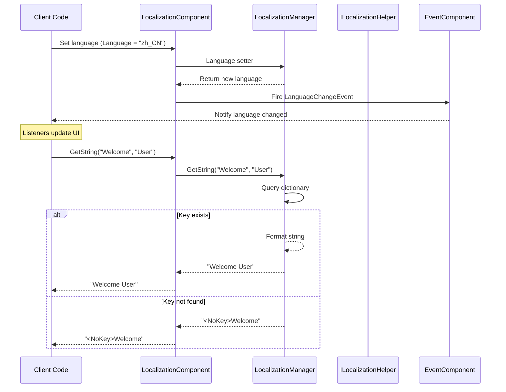

# API Reference

This document provides detailed information on all public API interfaces, classes, and methods provided by the GameFrameX Localization module.

## Overview

The GameFrameX Localization module provides a complete localization solution, including:
- Multi-language string management
- Runtime language switching
- Parameterized string formatting
- System language auto-detection
- Event-driven architecture

## Core Architecture



## ILocalizationManager Interface

`ILocalizationManager` is the core interface of the localization system, defining all required operations for managing localized strings.

> Source: [ILocalizationManager.cs](https://github.com/GameFrameX/com.gameframex.unity.localization/blob/main/Runtime/Localization/Localization/ILocalizationManager.cs#L34-L529)

### Properties

| Property | Type | Description |
|------|------|-------------|
| `DefaultLanguage` | `string` | Get or set the default localization language. Used when loading localization fails. |
| `Language` | `string` | Get or set the current localization language. |
| `SystemLanguage` | `string` | Get the system language. |
| `DictionaryCount` | `int` | Get the count of currently loaded dictionaries. |

### Methods

#### `SetLocalizationHelper`

```csharp
void SetLocalizationHelper(ILocalizationHelper localizationHelper)
```

Sets the localization helper, used to obtain system language information.

**Parameters:**
- `localizationHelper` (ILocalizationHelper): Localization helper instance.

> Source: [ILocalizationManager.cs](https://github.com/GameFrameX/com.gameframex.unity.localization/blob/main/Runtime/Localization/Localization/ILocalizationManager.cs#L71)

---

#### `GetString(string key): string`

Gets the dictionary content string according to the dictionary key.

```csharp
string GetString(string key)
```

**Parameters:**
- `key` (string): Dictionary key.

**Returns:** Dictionary content string, returns `<NoKey>{key}` formatted error message if key does not exist.

> Source: [LocalizationManager.cs](https://github.com/GameFrameX/com.gameframex.unity.localization/blob/main/Runtime/Localization/Localization/LocalizationManager.cs#L168-L177)

---

#### `GetString(string key, params object[] args): string`

Gets the dictionary content string according to the dictionary key and formats using parameter list.

```csharp
string GetString(string key, params object[] args)
```

**Parameters:**
- `key` (string): Dictionary key.
- `args` (params object[]): Format parameter list.

**Returns:** Formatted dictionary content string.

> Source: [LocalizationManager.cs](https://github.com/GameFrameX/com.gameframex.unity.localization/blob/main/Runtime/Localization/Localization/LocalizationManager.cs#L186-L195)

---

#### Generic GetString Methods

The system provides 17 generic overload methods, supporting 0 to 16 type-safe parameters:

| Method Signature | Description |
|----------|------|
| `GetString<T>(string key, T arg)` | Single parameter formatting |
| `GetString<T1, T2>(string key, T1 arg1, T2 arg2)` | Two parameter formatting |
| `GetString<T1, T2, T3>(string key, T1 arg1, T2 arg2, T3 arg3)` | Three parameter formatting |
| ... | ... |
| `GetString<T1, ..., T16>(string key, T1 arg1, ..., T16 arg16)` | Sixteen parameter formatting |

```csharp
// Example: Use generic GetString for type-safe formatting
string message = localizationManager.GetString("Welcome", "John", 25);
// Dictionary content: "Welcome {0}, you are {1} years old"
// Result: "Welcome John, you are 25 years old"
```

> Source: [LocalizationManager.cs](https://github.com/GameFrameX/com.gameframex.unity.localization/blob/main/Runtime/Localization/Localization/LocalizationManager.cs#L205-L855)

---

#### `HasRawString(string key): bool`

Checks whether the dictionary with the specified key exists.

```csharp
bool HasRawString(string key)
```

**Parameters:**
- `key` (string): Dictionary key.

**Returns:** Whether the dictionary exists.

> Source: [LocalizationManager.cs](https://github.com/GameFrameX/com.gameframex.unity.localization/blob/main/Runtime/Localization/Localization/LocalizationManager.cs#L862-L870)

---

#### `GetRawString(string key): string`

Gets the raw dictionary value (without formatting).

```csharp
string GetRawString(string key)
```

**Parameters:**
- `key` (string): Dictionary key.

**Returns:** Raw dictionary value, returns empty string if key does not exist.

> Source: [LocalizationManager.cs](https://github.com/GameFrameX/com.gameframex.unity.localization/blob/main/Runtime/Localization/Localization/LocalizationManager.cs#L878-L891)

---

#### `AddRawString(string key, string value): bool`

Adds a new dictionary entry.

```csharp
bool AddRawString(string key, string value)
```

**Parameters:**
- `key` (string): Dictionary key.
- `value` (string): Dictionary content.

**Returns:** Whether added successfully. Returns false if key already exists.

> Source: [LocalizationManager.cs](https://github.com/GameFrameX/com.gameframex.unity.localization/blob/main/Runtime/Localization/Localization/LocalizationManager.cs#L899-L913)

---

#### `RemoveRawString(string key): bool`

Removes the specified dictionary entry.

```csharp
bool RemoveRawString(string key)
```

**Parameters:**
- `key` (string): Dictionary key.

**Returns:** Whether removed successfully.

> Source: [LocalizationManager.cs](https://github.com/GameFrameX/com.gameframex.unity.localization/blob/main/Runtime/Localization/Localization/LocalizationManager.cs#L920-L928)

---

#### `RemoveAllRawStrings()`

Clears all dictionaries.

```csharp
void RemoveAllRawStrings()
```

> Source: [LocalizationManager.cs](https://github.com/GameFrameX/com.gameframex.unity.localization/blob/main/Runtime/Localization/Localization/LocalizationManager.cs#L933-L936)

---

## ILocalizationHelper Interface

`ILocalizationHelper` interface is used to abstract system language detection logic, allowing developers to implement custom language detection methods.

> Source: [ILocalizationHelper.cs](https://github.com/GameFrameX/com.gameframex.unity.localization/blob/main/Runtime/Localization/Localization/ILocalizationHelper.cs#L34-L47)

### Properties

| Property | Type | Description |
|------|------|-------------|
| `SystemLanguage` | `string` | Gets the system language. |

```csharp
public interface ILocalizationHelper
{
    string SystemLanguage { get; }
}
```

---

## LocalizationHelperBase Abstract Class

`LocalizationHelperBase` is the abstract base class for localization helpers, inherited from `MonoBehaviour` and implementing `ILocalizationHelper` interface.

> Source: [LocalizationHelperBase.cs](https://github.com/GameFrameX/com.gameframex.unity.localization/blob/main/Runtime/Localization/LocalizationHelperBase.cs#L35-L48)

```csharp
public abstract class LocalizationHelperBase : MonoBehaviour, ILocalizationHelper
{
    public abstract string SystemLanguage { get; }
}
```

---

## DefaultLocalizationHelper Class

`DefaultLocalizationHelper` is the default localization helper implementation, using .NET's `CultureInfo` to obtain system regional settings.

> Source: [DefaultLocalizationHelper.cs](https://github.com/GameFrameX/com.gameframex.unity.localization/blob/main/Runtime/Localization/DefaultLocalizationHelper.cs#L36-L58)

```csharp
public class DefaultLocalizationHelper : LocalizationHelperBase
{
    readonly string _regionName = CultureInfo.CurrentCulture.Name.Replace("-", "_");

    public override string SystemLanguage
    {
        get { return _regionName; }
    }
}
```

**Design Note:** The default implementation converts system region information (such as `zh-CN`) to underscore format (`zh_CN`), consistent with language codes defined in `LocalizationCode`.

---

## LocalizationComponent Class

`LocalizationComponent` is the Unity component wrapper class, inherited from `GameFrameworkComponent`, providing localization functionality seamlessly integrated with the Unity ecosystem.

> Source: [LocalizationComponent.cs](https://github.com/GameFrameX/com.gameframex.unity.localization/blob/main/Runtime/Localization/LocalizationComponent.cs#L38-L777)

### Properties

| Property | Type | Description |
|------|------|-------------|
| `EditorLanguage` | `string` | Editor language (only effective in editor). |
| `DefaultLanguage` | `string` | Default localization language. |
| `Language` | `string` | Current localization language. Setting this property triggers a language switch event. |
| `SystemLanguage` | `string` | Gets the system language. |
| `DictionaryCount` | `int` | Gets the dictionary count. |

### Methods

`LocalizationComponent` provides exactly the same method signatures as `ILocalizationManager`, including:

- `GetString(string key)` - Get localized string
- `GetString(string key, params object[] args)` - Format with parameters
- `GetString<T>(string key, T arg)` - Generic single parameter
- `GetString<T1, T2>(string key, T1 arg1, T2 arg2)` - Generic two parameters
- ... (17 overloads in total, supporting up to 16 parameters)
- `HasRawString(string key)` - Check if key exists
- `GetRawString(string key)` - Get raw value
- `AddRawString(string key, string value)` - Add dictionary
- `RemoveRawString(string key)` - Remove dictionary
- `RemoveAllRawStrings()` - Clear dictionary

### Usage Example

```csharp
// Get LocalizationComponent instance
var localization = GameEntry.GetComponent<LocalizationComponent>();

// Simple string retrieval
string greeting = localization.GetString("Greeting");

// String formatting with parameters
string message = localization.GetString("PlayerInfo", "ZhangSan", 100);
// Dictionary content: "Player {0}, Level {1}"
// Result: "Player ZhangSan, Level 100"

// Switch language
localization.Language = "en_US";

// Check dictionary
if (localization.HasRawString("ImportantKey"))
{
    string value = localization.GetRawString("ImportantKey");
}
```

---

## LocalizationCode Static Class

`LocalizationCode` provides standardized language code constants, following ISO 639-1 language codes and ISO 3166-1 country/region codes standard.

> Source: [LocalizationCode.cs](https://github.com/GameFrameX/com.gameframex.unity.localization/blob/main/Runtime/Localization/LocalizationCode.cs#L35-L985)

### Main Language Code Constants

| Constant | Code | Description |
|------|------|-------------|
| `Chinese` / `ChineseSimplified` | `zh_CN` | Simplified Chinese |
| `ChineseTraditionalTW` | `zh_TW` | Traditional Chinese (Taiwan) |
| `ChineseTraditionalHK` | `zh_HK` | Traditional Chinese (Hong Kong) |
| `Japanese` | `ja_JP` | Japanese |
| `Korean` | `ko_KR` | Korean |
| `English` | `en_US` | English (USA) |
| `EnglishUK` | `en_GB` | English (UK) |
| `French` | `fr_FR` | French |
| `German` | `de_DE` | German |
| `Spanish` | `es_ES` | Spanish |
| `Portuguese` | `pt_PT` | Portuguese |
| `Russian` | `ru_RU` | Russian |
| `Arabic` | `ar_SA` | Arabic |
| `Hindi` | `hi_IN` | Hindi |
| `Thai` | `th_TH` | Thai |
| `Vietnamese` | `vi_VN` | Vietnamese |
| `Indonesian` | `id_ID` | Indonesian |

**Usage Example:**

```csharp
// Use constants to set language
LocalizationComponent localization = GameEntry.GetComponent<LocalizationComponent>();
localization.Language = LocalizationCode.Chinese;      // Set to Simplified Chinese
localization.Language = LocalizationCode.English;       // Set to English
localization.Language = LocalizationCode.Japanese;      // Set to Japanese
```

---

## Event System

### LocalizationLanguageChangeEventArgs

Event triggered when language is switched.

> Source: [LocalizationLanguageChangeEventArgs.cs](https://github.com/GameFrameX/com.gameframex.unity.localization/blob/main/Runtime/EventArgs/LocalizationLanguageChangeEventArgs.cs#L5-L79)

```csharp
public sealed class LocalizationLanguageChangeEventArgs : GameEventArgs
{
    public static readonly string EventId = typeof(LocalizationLanguageChangeEventArgs).FullName;
    
    /// <summary>
    /// Current language
    /// </summary>
    public string Language { get; set; }
    
    /// <summary>
    /// Old language
    /// </summary>
    public string OldLanguage { get; set; }
    
    public static LocalizationLanguageChangeEventArgs Create(string oldLanguage, string language);
    public override void Clear();
    public override string Id { get; }
}
```

### Subscribe to Language Switch Event

```csharp
void OnLanguageChanged(object sender, LocalizationLanguageChangeEventArgs e)
{
    Debug.Log($"Language changed from {e.OldLanguage} to {e.Language}");
}

// Subscribe to event
var eventComponent = GameEntry.GetComponent<EventComponent>();
eventComponent.Subscribe(LocalizationLanguageChangeEventArgs.EventId, OnLanguageChanged);

// Unsubscribe
eventComponent.Unsubscribe(LocalizationLanguageChangeEventArgs.EventId, OnLanguageChanged);
```

---

## API Usage Flow



---

## Error Handling

### Error Return Values

When errors occur, the system returns specific formatted error messages:

| Error Type | Return Format | Example |
|----------|----------|-------------|
| Key does not exist | `<NoKey>{key}` | `<NoKey>Welcome` |
| Formatting error | `<Error>{key},{value},{args},{exception}` | `<Error>PlayerName,Player{0}...` |

### Exception Situations

| Scenario | Behavior |
|------|-------------|
| Set `Language` to `zxx` (unknown language) | Throws `GameFrameworkException` |
| Set `DefaultLanguage` to `zxx` | Throws `GameFrameworkException` |
| Access `SystemLanguage` without setting `ILocalizationHelper` | Throws `GameFrameworkException` |

---

## Related Links

- [Overview](./1-overview)
- [Installation](./2-installation)
- [Getting Started](./3-getting-started)
- [Core Features - Get Localized Strings](./4-core-features.get-string)
- [Core Features - Dictionary Management](./4-core-features.dictionary-management)
- [Core Features - Language Switching and Events](./4-core-features.language-switching)
- [Configuration](./6-configuration)
- [Best Practices](./7-best-practices)