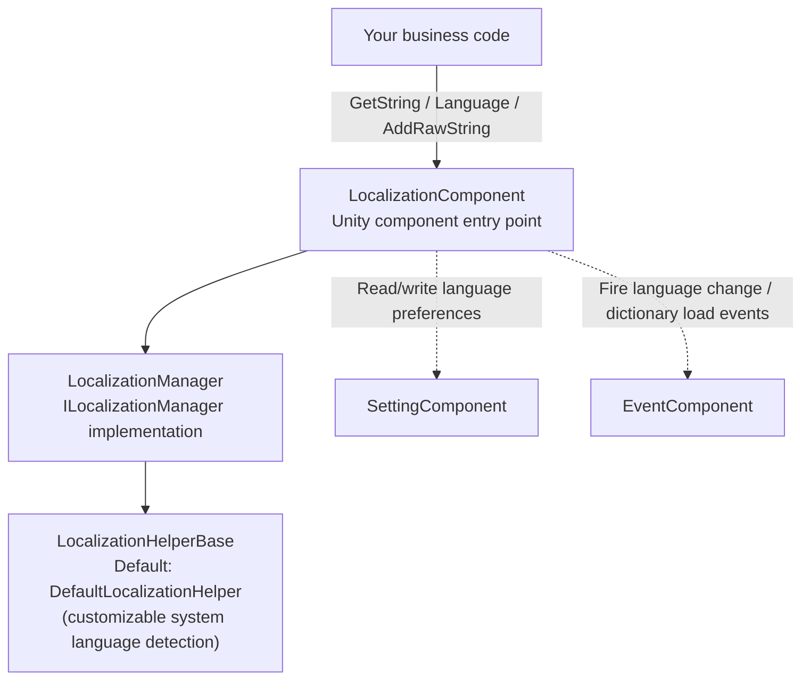

# Localization Package Overview: What It Can Do

Game Frame X Localization (`com.gameframex.unity.localization`) is a Unity localization package built on the GameFrameX framework: it manages multilingual strings using a "dictionary key → translated text" approach, supports parameterized formatting (up to 16 typed parameters), runtime language switching with event broadcasting, automatic system language detection, and persisting language preferences to the Setting system. The core entry point is the `LocalizationComponent` component — just attach it and you're ready to go.

It can provide your game with:

- **Dictionary-based localization** — Add, query, and remove translation entries at runtime (`AddRawString` / `GetString` / `RemoveRawString`)
- **Parameterized string formatting** — Generic `GetString` overloads with 1–16 typed parameters, supporting standard .NET placeholders such as `{0}`, `{1}`, `{2:P}`
- **Runtime language switching** — Setting the `Language` property triggers change events, allowing the UI to refresh instantly
- **System language detection and fallback** — Detects the device language via `CultureInfo` and falls back to the default language when loading fails
- **Language preference persistence** — Language and default language are automatically saved via `SettingComponent`
- **Editor mode** — Overrides the system language with a specified language in Play Mode, convenient for testing
- **180+ language code constants** — The `LocalizationCode` static class, e.g. `ChineseSimplified` (`zh_CN`), `Japanese` (`ja_JP`)
- **Replaceable Helper** — Inherit from `LocalizationHelperBase` to customize system language detection

## Quick Start

1. Edit your Unity project's `Packages/manifest.json` to add the GameFrameX scoped registry and the dependency:

```json
{
  "scopedRegistries": [
    {
      "name": "GameFrameX",
      "url": "https://gameframex.upm.alianblank.uk",
      "scopes": [
        "com.gameframex"
      ]
    }
  ],
  "dependencies": {
    "com.gameframex.unity.localization": "2.3.0"
  }
}
```

Source: [README.zh-CN.md](https://github.com/GameFrameX/com.gameframex.unity.localization/blob/main/README.zh-CN.md#L68-L84)

   Alternatively, you can specify a Git URL directly under `dependencies` (`https://github.com/gameframex/com.gameframex.unity.localization.git`), or download the repository and place it in the `Packages` directory.

2. Attach the component to a scene object: the menu path is `GameFrameX/Localization` (`LocalizationComponent` carries `[AddComponentMenu("GameFrameX/Localization")]` and automatically depends on `GameFrameXLocalizationCroppingHelper`). In the Inspector you can configure the Helper, `Default Language` (default `zh_CN`), editor mode, etc.; the component's serialized default values can be seen in the source code:

```csharp
[SerializeField] private string m_EditorLanguage = "zh_CN";

[SerializeField] private string m_DefaultLanguage = "zh_CN";

[SerializeField] private bool m_EnableLoadDictionaryUpdateEvent = false;
[SerializeField] private bool m_IsEnableEditorMode = false;

[SerializeField] private string m_LocalizationHelperTypeName = "GameFrameX.Localization.Runtime.DefaultLocalizationHelper";
```

Source: [LocalizationComponent.cs](https://github.com/GameFrameX/com.gameframex.unity.localization/blob/main/Runtime/Localization/LocalizationComponent.cs#L66-L75)

3. Get the component in code and use it:

```csharp
using GameFrameX.Localization.Runtime;

// Standard way: get it via GameEntry
var localization = GameEntry.GetComponent<LocalizationComponent>();
```

Source: [README.zh-CN.md](https://github.com/GameFrameX/com.gameframex.unity.localization/blob/main/README.zh-CN.md#L100-L105)

4. Add translation entries, switch languages, and fetch strings to get your first feature working:

```csharp
// Add a new entry (returns false if the key already exists or is null/empty)
bool added = localization.AddRawString("UI.Button.NewButton", "新按钮");

// Set the current language (triggers change events, persists automatically)
localization.Language = "zh_CN";
localization.Language = "en_US";

// Simple key lookup; returns "<NoKey>{key}" when the key does not exist
string okText = localization.GetString("UI.Button.OK");
```

Sources: [README.zh-CN.md](https://github.com/GameFrameX/com.gameframex.unity.localization/blob/main/README.zh-CN.md#L110-L116) · [README.zh-CN.md](https://github.com/GameFrameX/com.gameframex.unity.localization/blob/main/README.zh-CN.md#L134-L143) · [README.zh-CN.md](https://github.com/GameFrameX/com.gameframex.unity.localization/blob/main/README.zh-CN.md#L174-L179)

## How It Works at a Glance



The component responsibilities are clear at a glance: `LocalizationComponent` ([LocalizationComponent.cs](https://github.com/GameFrameX/com.gameframex.unity.localization/blob/main/Runtime/Localization/LocalizationComponent.cs#L51-L56)) holds three dependencies: `ILocalizationManager`, `EventComponent`, and `SettingComponent`. When reading `Language`, if the value is Unknown, it is first restored from Settings; when writing `Language`, the value is persisted and three consecutive events are fired (Before / Change / After):

```csharp
var localizationLanguageChangeBeforeEventArgs = LocalizationLanguageChangeBeforeEventArgs.Create(oldLanguage, value);
m_EventComponent.Fire(this, localizationLanguageChangeBeforeEventArgs);
var localizationLanguageChangeEventArgs = LocalizationLanguageChangeEventArgs.Create(oldLanguage, value);
m_EventComponent.Fire(this, localizationLanguageChangeEventArgs);
var localizationLanguageChangeAfterEventArgs = LocalizationLanguageChangeAfterEventArgs.Create(oldLanguage, value);
m_EventComponent.Fire(this, localizationLanguageChangeAfterEventArgs);
```

Source: [LocalizationComponent.cs](https://github.com/GameFrameX/com.gameframex.unity.localization/blob/main/Runtime/Localization/LocalizationComponent.cs#L155-L169)

## Common Capabilities Quick Reference

| Capability | Key API (`LocalizationComponent`) | Description |
|------------|----------------------------------|-------------|
| Current language | `Language` | If unset on get, falls back to Settings → system language; set triggers events and persists |
| Default language | `DefaultLanguage` | Fallback language when loading fails, persisted to Settings |
| System language | `SystemLanguage` | Language code detected on the device |
| Get translation | `GetString(key)` / `GetString<T1..T16>(key, ...)` | Returns `<NoKey>{key}` if the key doesn't exist; generic overloads avoid boxing |
| Check / get raw text | `HasRawString(key)` / `GetRawString(key)` | Raw unformatted value; returns `null` if not found |
| Add/remove entries | `AddRawString` / `RemoveRawString` / `RemoveAllRawStrings` | Manage the dictionary at runtime |
| Entry count | `DictionaryCount` | Total number of loaded entries |
| Language codes | `LocalizationCode.ChineseSimplified` etc. | 180+ constants in the `language_region` format |

Parameterized example (dictionary values use .NET placeholders such as `{0}`, `{1}`; if the parameters don't match, the result starts with `<Error>`):

```csharp
// Generic overload (recommended — avoids boxing of value types)
string info = localization.GetString<string, int, int>("UI.Info.Score", playerName, score, level);
```

Source: [README.zh-CN.md](https://github.com/GameFrameX/com.gameframex.unity.localization/blob/main/README.zh-CN.md#L156-L167)

## Events Overview

| Event class | Trigger condition | Key fields |
|-------------|-------------------|------------|
| `LocalizationLanguageChangeEventArgs` | When the `Language` property is set | `OldLanguage`, `Language` |
| `LoadDictionarySuccessEventArgs` | Dictionary asset loading completed | `DictionaryAssetName`, `Duration`, `UserData` |
| `LoadDictionaryFailureEventArgs` | Dictionary asset loading failed | `DictionaryAssetName`, `ErrorMessage`, `UserData` |
| `LoadDictionaryUpdateEventArgs` | Dictionary loading progress updated | `DictionaryAssetName`, `Progress`, `UserData` |

(There are also paired `LocalizationLanguageChangeBeforeEventArgs` / `LocalizationLanguageChangeAfterEventArgs` classes; see [Runtime/EventArgs](https://github.com/GameFrameX/com.gameframex.unity.localization/blob/main/Runtime/EventArgs/LocalizationLanguageChangeBeforeEventArgs.cs). All event classes use the GameFrameX reference pool, firing with zero allocations.)

## Next Steps

- Installation details and component Inspector field descriptions (`Enable Editor Mode`, `Editor Language`, etc.): see the repository [README.zh-CN.md](https://github.com/GameFrameX/com.gameframex.unity.localization/blob/main/README.zh-CN.md)
- A complete example of listening for language changes and refreshing the UI: [README.zh-CN.md #Listening for Language Changes](https://github.com/GameFrameX/com.gameframex.unity.localization/blob/main/README.zh-CN.md#L198-L244)
- Complete list of language code constants: [LocalizationCode.cs](https://github.com/GameFrameX/com.gameframex.unity.localization/blob/main/Runtime/Localization/LocalizationCode.cs)
- Custom system language detection (inherit from `LocalizationHelperBase`): [LocalizationHelperBase.cs](https://github.com/GameFrameX/com.gameframex.unity.localization/blob/main/Runtime/Localization/LocalizationHelperBase.cs)
- Manager interface and implementation: [ILocalizationManager.cs](https://github.com/GameFrameX/com.gameframex.unity.localization/blob/main/Runtime/Localization/Localization/ILocalizationManager.cs) · [LocalizationManager.cs](https://github.com/GameFrameX/com.gameframex.unity.localization/blob/main/Runtime/Localization/Localization/LocalizationManager.cs)
- Version history: [CHANGELOG.md](https://github.com/GameFrameX/com.gameframex.unity.localization/blob/main/CHANGELOG.md)