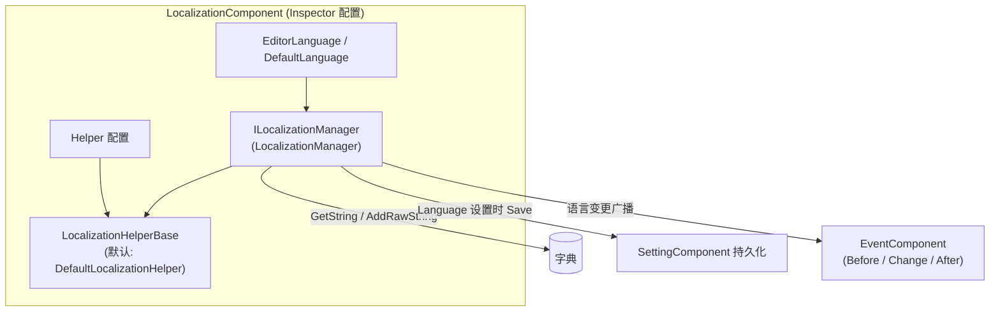

# Installation and First Run: Installing the Package, Adding the Component, Configuring the Inspector

This page walks you through getting GameFrameX Localization up and running: installing the UPM package, attaching the `LocalizationComponent` in your scene, configuring the language and Helper fields in the Inspector, and finally verifying with code that your first translated text can be retrieved correctly. The whole process takes only a few minutes.

## Quick Start

### 1. Install the Package

Choose any one of the following methods (Method 1 is recommended, as it makes it easier to upgrade GameFrameX series packages in a unified way):

- Edit the Unity project's `Packages/manifest.json`, add `scopedRegistries` and declare the dependency:

```json
{
  "scopedRegistries": [
    {
      "name": "GameFrameX",
      "url": "https://gameframex.upm.alianblank.uk",
      "scopes": [
        "com.gameframex"
      ]
    }
  ],
  "dependencies": {
    "com.gameframex.unity.localization": "2.3.0"
  }
}
```

`scopes` controls which packages are resolved through this registry; only packages whose names start with `com.gameframex` will be fetched from this registry.

Source: [README.zh-CN.md](https://github.com/GameFrameX/com.gameframex.unity.localization/blob/main/README.zh-CN.md#L68-L86)

- Alternatively, add the Git URL directly under the `dependencies` node of `manifest.json`:

```json
{
   "com.gameframex.unity.localization": "https://github.com/gameframex/com.gameframex.unity.localization.git"
}
```

Source: [README.zh-CN.md](https://github.com/GameFrameX/com.gameframex.unity.localization/blob/main/README.zh-CN.md#L88-L93)

- Or add it in Unity's `Package Manager` using the `Git URL` method: `https://github.com/gameframex/com.gameframex.unity.localization.git`.
- Or download the repository directly and place it in the Unity project's `Packages` directory; Unity will load and recognize it automatically.

Version requirements: Unity 2019.4 or later (see [README.zh-CN.md](https://github.com/GameFrameX/com.gameframex.unity.localization/blob/main/README.zh-CN.md#L9)). The component depends on GameFrameX's Event, Setting, and core runtime assemblies.

### 2. Add the Component

On the GameFrameX component host GameObject in your startup scene, add `LocalizationComponent` via the `Add Component` menu by selecting `GameFrameX/Localization`:

```csharp
[DisallowMultipleComponent]
[AddComponentMenu("GameFrameX/Localization")]
[HelpURL("https://datatracker.ietf.org/doc/html/rfc5646")]
[Preserve]
[RequireComponent(typeof(GameFrameXLocalizationCroppingHelper))]
public sealed class LocalizationComponent : GameFrameworkComponent
```

Source: [LocalizationComponent.cs](https://github.com/GameFrameX/com.gameframex.unity.localization/blob/main/Runtime/Localization/LocalizationComponent.cs#L46-L51)

Key points:

- `[RequireComponent(typeof(GameFrameXLocalizationCroppingHelper))]`: When adding this component, the cropping helper component is automatically attached as well—no manual setup needed.
- `[DisallowMultipleComponent]`: Only one instance can be attached per GameObject; Unity will block duplicate additions.

### 3. Configure the Inspector

The component's serialized fields and default values are listed below; all of them can be modified directly in the Inspector:

| Inspector Field | Default Value | Description |
|------|------|------|
| EditorLanguage | `zh_CN` | Editor language, only effective in-editor, convenient for testing different languages in Play mode |
| DefaultLanguage | `zh_CN` | Default localization language, used as a fallback when loading localization fails |
| EnableLoadDictionaryUpdateEvent | `false` | Whether to enable the dictionary loading progress update event |
| IsEnableEditorMode | `false` | Whether to enable editor mode |
| LocalizationHelperTypeName | `GameFrameX.Localization.Runtime.DefaultLocalizationHelper` | Localization Helper type name |
| CustomLocalizationHelper | `null` | Custom Helper; leave empty to use the default Helper above |

Field definitions in source code:

```csharp
[SerializeField] private string m_EditorLanguage = "zh_CN";
[SerializeField] private string m_DefaultLanguage = "zh_CN";
[SerializeField] private bool m_EnableLoadDictionaryUpdateEvent = false;
[SerializeField] private bool m_IsEnableEditorMode = false;
[SerializeField] private string m_LocalizationHelperTypeName = "GameFrameX.Localization.Runtime.DefaultLocalizationHelper";
[SerializeField] private LocalizationHelperBase m_CustomLocalizationHelper = null;
```

Source: [LocalizationComponent.cs](https://github.com/GameFrameX/com.gameframex.unity.localization/blob/main/Runtime/Localization/LocalizationComponent.cs#L66-L75)

Language codes follow the RFC 5646 style, such as `zh_CN`, `en_US`, `ja_JP` (the component's `HelpURL` points to the RFC 5646 specification).

### 4. First-Run Verification

Enter Play mode, first register a translation, then retrieve it with code:

```csharp
using GameFrameX.Localization.Runtime;

// Standard approach: get it via GameEntry
var localization = GameEntry.GetComponent<LocalizationComponent>();

// Add a translation at runtime (returns false if the key already exists or is null/empty)
bool added = localization.AddRawString("UI.Button.NewButton", "新按钮");

// Retrieve the translation; if the key does not exist, returns "<NoKey>{key}"
string text = localization.GetString("UI.Button.NewButton");
```

Sources: [README.zh-CN.md](https://github.com/GameFrameX/com.gameframex.unity.localization/blob/main/README.zh-CN.md#L100-L105) · [README.zh-CN.md](https://github.com/GameFrameX/com.gameframex.unity.localization/blob/main/README.zh-CN.md#L173-L176) · [README.zh-CN.md](https://github.com/GameFrameX/com.gameframex.unity.localization/blob/main/README.zh-CN.md#L134-L137)

Seeing `text` output "新按钮" means the installation succeeded. Note: if the key does not exist, the returned value is `<NoKey>{key}`; if the formatting arguments do not match, the result starts with `<Error>`. Either of these prefixes indicates a problem with the dictionary content or the arguments.

## How It Works at a Glance

The component follows a layered "component shell + manager + Helper" architecture: the Inspector configuration is ultimately handed to `LocalizationManager` for execution, and a language switch automatically writes to Setting and broadcasts events:



When `Language` is set, the component first writes to `SettingComponent` and calls `Save()`, then fires the three events `LocalizationLanguageChangeBeforeEventArgs`, `LocalizationLanguageChangeEventArgs`, and `LocalizationLanguageChangeAfterEventArgs` in sequence; when `Language`/`DefaultLanguage` is retrieved and the value is unknown, it is read from Setting first.

Source: [LocalizationComponent.cs](https://github.com/GameFrameX/com.gameframex.unity.localization/blob/main/Runtime/Localization/LocalizationComponent.cs#L140-L171)

## Common Errors

| Symptom | Cause | Fix |
|------|------|------|
| Retrieved text is `<NoKey>{key}` | The key does not exist in the dictionary | Register the entry first with `AddRawString`, or check first with `HasRawString` |
| Formatted result starts with `<Error>` | Placeholders do not match the provided arguments | Verify the `{0}`, `{1}` placeholders in the dictionary values against the number/type of the arguments passed in |
| Component reports missing dependencies | Dependent packages such as Event/Setting are not installed | Install the `com.gameframex` series packages together via the scoped registry |
| A second component cannot be attached to the same GameObject | `[DisallowMultipleComponent]` | Attach only one `LocalizationComponent` per scene host |

The basis for these error behaviors can be found in [README.zh-CN.md](https://github.com/GameFrameX/com.gameframex.unity.localization/blob/main/README.zh-CN.md#L167) and [LocalizationComponent.cs](https://github.com/GameFrameX/com.gameframex.unity.localization/blob/main/Runtime/Localization/LocalizationComponent.cs#L46-L51).

## What's Next

- Runtime language switching and event listening examples: see [README.zh-CN.md](https://github.com/GameFrameX/com.gameframex.unity.localization/blob/main/README.zh-CN.md#L194-L236)
- Parameterized formatting (`GetString` overloads with up to 16 typed parameters): see [README.zh-CN.md](https://github.com/GameFrameX/com.gameframex.unity.localization/blob/main/README.zh-CN.md#L146-L165)
- Language code constants `LocalizationCode` (180+ languages): see [LocalizationCode.cs](https://github.com/GameFrameX/com.gameframex.unity.localization/blob/main/Runtime/Localization/LocalizationCode.cs)
- Custom Helpers (inherit `LocalizationHelperBase` to override system language detection): see [LocalizationHelperBase.cs](https://github.com/GameFrameX/com.gameframex.unity.localization/blob/main/Runtime/Localization/LocalizationHelperBase.cs)
- Custom Inspector UI implementation: see [LocalizationComponentInspector.cs](https://github.com/GameFrameX/com.gameframex.unity.localization/blob/main/Editor/Inspector/LocalizationComponentInspector.cs)
- Official documentation: <https://gameframex.doc.alianblank.com/>