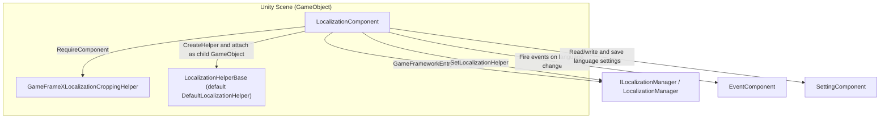

# How It Works: Division of Labor Among Component, Manager, and Helper

This package is organized into three layers: `LocalizationComponent` is the Mono façade attached to the Unity scene, `ILocalizationManager` / `LocalizationManager` is the framework core module (responsible for dictionary data and language state), and `ILocalizationHelper` / `LocalizationHelperBase` is the replaceable helper (responsible for capabilities such as the system language). Business code interacts only with `LocalizationComponent`; the latter two layers are wired up automatically by it at startup.

## Overview of the Three Layers

| Layer | Concrete Type | File | Responsibilities |
|------|----------|------|------|
| Component Layer | `LocalizationComponent : GameFrameworkComponent` | `Runtime/Localization/LocalizationComponent.cs` | Unity façade: holds Inspector configuration items, initializes the Manager/Helper, forwards calls such as `GetString` / `Language` to the Manager, and persists language settings to `SettingComponent` |
| Manager Layer | `ILocalizationManager` / `LocalizationManager` | `Runtime/Localization/Localization/` | Framework core module: obtained via `GameFrameworkEntry.GetModule<ILocalizationManager>()`, holds dictionary data, the current language, the default language, and the system language, and defines the constant `UnknownLocalization` |
| Helper Layer | `ILocalizationHelper` / `LocalizationHelperBase` / `DefaultLocalizationHelper` | `Runtime/Localization/` | Replaceable implementation: created by the component via `Helper.CreateHelper` and injected into the Manager; the interface declares only `SystemLanguage` |

Relationships among the three layers and collaborating components (all arrows correspond to verifiable calls in the source code):



The helper interface is very minimal, declaring only the system language:

```csharp
public interface ILocalizationHelper
{
    string SystemLanguage { get; }
}
```

Source: [ILocalizationHelper.cs](https://github.com/GameFrameX/com.gameframex.unity.localization/blob/main/Runtime/Localization/Localization/ILocalizationHelper.cs#L40-L47)

## Startup Initialization Flow

`LocalizationComponent` completes its wiring through two lifecycle methods, in the following order:

1. **`Awake()` — Acquire the core module**. Sets the implementation type and interface type, then obtains `ILocalizationManager` from the framework entry; on failure, it calls `Log.Fatal("Localization manager is invalid.")` and stops.

```csharp
protected override void Awake()
{
    ImplementationComponentType = Utility.Assembly.GetType(componentType);
    InterfaceComponentType = typeof(ILocalizationManager);
    base.Awake();
    m_LocalizationManager = GameFrameworkEntry.GetModule<ILocalizationManager>();
    if (m_LocalizationManager == null)
    {
        Log.Fatal("Localization manager is invalid.");
        return;
    }
}
```

Source: [LocalizationComponent.cs](https://github.com/GameFrameX/com.gameframex.unity.localization/blob/main/Runtime/Localization/LocalizationComponent.cs#L211-L222)

2. **`Start()` — Validate dependent components**. Obtains `BaseComponent`, `EventComponent`, and `SettingComponent` in turn via `GameEntry.GetComponent<T>()`; if any is missing, it calls `Log.Fatal("Base component is invalid." / "Event component is invalid." / "Setting component is invalid.")`.

3. **`Start()` — Create and inject the Helper**. Creates the helper using the Inspector's `m_LocalizationHelperTypeName` (default `"GameFrameX.Localization.Runtime.DefaultLocalizationHelper"`) or the `m_CustomLocalizationHelper` reference, names it `"Localization Helper"`, attaches it as a child GameObject of this component, and then calls `SetLocalizationHelper` to inject it into the Manager.

```csharp
LocalizationHelperBase localizationHelper = Helper.CreateHelper(m_LocalizationHelperTypeName, m_CustomLocalizationHelper);
if (localizationHelper == null)
{
    Log.Fatal("Can not create localization helper.");
    return;
}

localizationHelper.name = "Localization Helper";
Transform localizationHelperTransform = localizationHelper.transform;
localizationHelperTransform.SetParent(this.transform);
localizationHelperTransform.localScale = Vector3.one;
m_LocalizationManager.SetLocalizationHelper(localizationHelper);
```

Source: [LocalizationComponent.cs](https://github.com/GameFrameX/com.gameframex.unity.localization/blob/main/Runtime/Localization/LocalizationComponent.cs#L249-L260)

4. **`Start()` — Initialize the language**. In the editor, if `m_IsEnableEditorMode` is checked, uses `EditorLanguage` (default `"zh_CN"`); at runtime, if `Language` is still `UnknownLocalization`, falls back to `SystemLanguage`; `DefaultLanguage` follows the same fallback logic.

```csharp
#if UNITY_EDITOR
    if (m_IsEnableEditorMode)
    {
        Language = EditorLanguage != UnknownLocalization ? EditorLanguage : m_LocalizationManager.SystemLanguage;
    }
#else
    if (Language == UnknownLocalization)
    {
        Language = m_LocalizationManager.SystemLanguage;
    }
#endif
    DefaultLanguage = m_DefaultLanguage != UnknownLocalization ? m_DefaultLanguage : m_LocalizationManager.SystemLanguage;
```

Source: [LocalizationComponent.cs](https://github.com/GameFrameX/com.gameframex.unity.localization/blob/main/Runtime/Localization/LocalizationComponent.cs#L261-L272)

### Serialized Configuration Items on the Component

| Configuration Item | Default Value | Purpose |
|--------|--------|------|
| `m_EditorLanguage` | `"zh_CN"` | In-editor language (only effective in editor mode) |
| `m_DefaultLanguage` | `"zh_CN"` | Default localization language, used as a fallback when loading fails |
| `m_EnableLoadDictionaryUpdateEvent` | `false` | Whether to enable dictionary load progress update events |
| `m_IsEnableEditorMode` | `false` | Whether to enable editor-mode language |
| `m_LocalizationHelperTypeName` | `"GameFrameX.Localization.Runtime.DefaultLocalizationHelper"` | Fully qualified helper type name |
| `m_CustomLocalizationHelper` | `null` | Custom helper reference (takes precedence over the type name) |

Source: [LocalizationComponent.cs](https://github.com/GameFrameX/com.gameframex.unity.localization/blob/main/Runtime/Localization/LocalizationComponent.cs#L66-L75)

The component declaration itself also reflects a hard dependency on the cropping helper: `[RequireComponent(typeof(GameFrameXLocalizationCroppingHelper))]`, `[DisallowMultipleComponent]`, `[AddComponentMenu("GameFrameX/Localization")]` (see [LocalizationComponent.cs](https://github.com/GameFrameX/com.gameframex.unity.localization/blob/main/Runtime/Localization/LocalizationComponent.cs#L46-L51)).

## Data Flow of Language Switching

The setter of the `Language` property is a typical example of the component layer coordinating the Manager, Setting, and Event. When the value changes, it does four things in turn: updates the Manager's language and writes it to `SettingComponent` (saving it for persistence); then broadcasts the three language-change events in a fixed order (Before → Change → After).

```csharp
set
{
    if (m_LocalizationManager.Language != value)
    {
        var oldLanguage = m_LocalizationManager.Language;
        m_LocalizationManager.Language = value;
        m_SettingComponent.SetString(nameof(LocalizationComponent) + "." + nameof(Language), value);
        m_SettingComponent.Save();
        var localizationLanguageChangeBeforeEventArgs = LocalizationLanguageChangeBeforeEventArgs.Create(oldLanguage, value);
        m_EventComponent.Fire(this, localizationLanguageChangeBeforeEventArgs);
        var localizationLanguageChangeEventArgs = LocalizationLanguageChangeEventArgs.Create(oldLanguage, value);
        m_EventComponent.Fire(this, localizationLanguageChangeEventArgs);
        var localizationLanguageChangeAfterEventArgs = LocalizationLanguageChangeAfterEventArgs.Create(oldLanguage, value);
        m_EventComponent.Fire(this, localizationLanguageChangeAfterEventArgs);
    }
}
```

Source: [LocalizationComponent.cs](https://github.com/GameFrameX/com.gameframex.unity.localization/blob/main/Runtime/Localization/LocalizationComponent.cs#L155-L170)

The getter, on the other hand, is lazy: if the language in the Manager is still `UnknownLocalization`, it first reads the previously saved value from `SettingComponent` (with the key name `LocalizationComponent.Language`) and then feeds it back to the Manager.

The argument classes for the three language-change events are all located in `Runtime/EventArgs/`:

| Event Argument Class | File | When Triggered |
|------------|------|----------|
| `LocalizationLanguageChangeBeforeEventArgs` | `Runtime/EventArgs/LocalizationLanguageChangeBeforeEventArgs.cs` | The language is about to change (first) |
| `LocalizationLanguageChangeEventArgs` | `Runtime/EventArgs/LocalizationLanguageChangeEventArgs.cs` | The language has changed |
| `LocalizationLanguageChangeAfterEventArgs` | `Runtime/EventArgs/LocalizationLanguageChangeAfterEventArgs.cs` | Post-change cleanup (last) |
| `LoadDictionaryFailureEventArgs` | `Runtime/EventArgs/LoadDictionaryFailureEventArgs.cs` | Dictionary load failed |
| `LoadDictionarySuccessEventArgs` | `Runtime/EventArgs/LoadDictionarySuccessEventArgs.cs` | Dictionary load succeeded |
| `LoadDictionaryUpdateEventArgs` | `Runtime/EventArgs/LoadDictionaryUpdateEventArgs.cs` | Dictionary load progress update (controlled by `m_EnableLoadDictionaryUpdateEvent`) |

## How Business Calls Pass Through the Three Layers

Business code calls `LocalizationComponent.GetString(...)`, the component forwards it as-is to `m_LocalizationManager`, and the Manager looks up the value in the dictionary and formats it with the arguments. The component provides `GetString` overloads with 0 to 6 arguments, all of which are pure pass-throughs:

```csharp
public string GetString(string key)
{
    return m_LocalizationManager.GetString(key);
}

public string GetString(string key, params object[] args)
{
    return m_LocalizationManager.GetString(key, args);
}
```

Source: [LocalizationComponent.cs](https://github.com/GameFrameX/com.gameframex.unity.localization/blob/main/Runtime/Localization/LocalizationComponent.cs#L284-L303)

Therefore, at runtime, `LocalizationComponent` is just a façade: the actual dictionary data, language state, and load callbacks all live in `LocalizationManager`; and the Manager, in turn, delegates platform-related questions such as "what is the system language" to the `LocalizationHelperBase` implementation it holds. Replacing the Helper (e.g., switching to a custom system-language determination) only requires changing the helper type or reference in the Inspector — no changes to the component or business code are needed.

## Common Errors

| Symptom (Original Log.Fatal Message) | Root Cause | Fix |
|------|------|------|
| `Localization manager is invalid.` | `GameFrameworkEntry.GetModule<ILocalizationManager>()` returned null | Verify that the framework core is initialized and the package is imported correctly |
| `Base component is invalid.` | `BaseComponent` is missing from the scene | Add `BaseComponent` to GameEntry |
| `Event component is invalid.` | `EventComponent` is missing from the scene | Add `EventComponent` (language-change events depend on it) |
| `Setting component is invalid.` | `SettingComponent` is missing from the scene | Add `SettingComponent` (language persistence depends on it) |
| `Can not create localization helper.` | `m_LocalizationHelperTypeName` type name is wrong and no `m_CustomLocalizationHelper` is provided | Check the fully qualified helper type name or drag in a custom Helper reference directly |

All of the above messages originate from the validation logic in `Start()`/`Awake()` ([LocalizationComponent.cs](https://github.com/GameFrameX/com.gameframex.unity.localization/blob/main/Runtime/Localization/LocalizationComponent.cs#L217-L253)).

## Related Links

- [LocalizationComponent.cs](https://github.com/GameFrameX/com.gameframex.unity.localization/blob/main/Runtime/Localization/LocalizationComponent.cs) — Component-layer façade and initialization flow
- [ILocalizationManager.cs](https://github.com/GameFrameX/com.gameframex.unity.localization/blob/main/Runtime/Localization/Localization/ILocalizationManager.cs) — Manager interface
- [LocalizationManager.cs](https://github.com/GameFrameX/com.gameframex.unity.localization/blob/main/Runtime/Localization/Localization/LocalizationManager.cs) — Manager implementation
- [ILocalizationHelper.cs](https://github.com/GameFrameX/com.gameframex.unity.localization/blob/main/Runtime/Localization/Localization/ILocalizationHelper.cs) — Helper interface
- [LocalizationHelperBase.cs](https://github.com/GameFrameX/com.gameframex.unity.localization/blob/main/Runtime/Localization/LocalizationHelperBase.cs) — Helper base class
- [DefaultLocalizationHelper.cs](https://github.com/GameFrameX/com.gameframex.unity.localization/blob/main/Runtime/Localization/DefaultLocalizationHelper.cs) — Default helper
- [LocalizationComponentInspector.cs](https://github.com/GameFrameX/com.gameframex.unity.localization/blob/main/Editor/Inspector/LocalizationComponentInspector.cs) — Editor Inspector