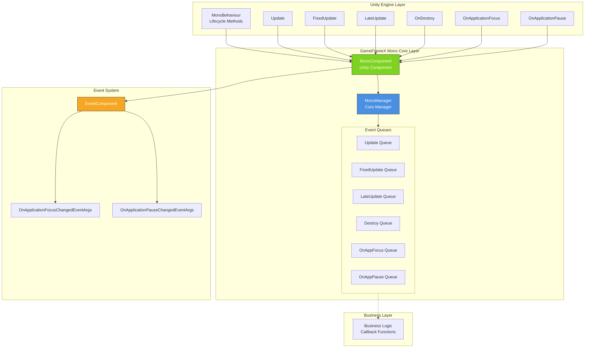

# Overview

GameFrameX Unity Mono component is one of the core modules of the GameFrameX game framework, specifically designed to uniformly manage Unity MonoBehaviour lifecycle events and provide a convenient event listening mechanism.

## Overview

In Unity development, MonoBehaviour lifecycle methods (such as `Update`, `FixedUpdate`, `LateUpdate`, `OnDestroy`, etc.) are the core carriers of game logic. However, traditional approaches have the following issues:

- **High Coupling**: Business logic directly written in MonoBehaviour, difficult to reuse and test
- **Management Chaos**: Multiple scripts may need to access the same lifecycle events, lacking unified management
- **Performance Issues**: Frequent creation and destruction of MonoBehaviour affects performance

GameFrameX Mono component solves these problems through the following design:

- **Unified Management**: Centralized management of all lifecycle event listeners through MonoManager
- **Observer Pattern**: Use callback functions to subscribe/unsubscribe events, decouple business logic
- **Thread Safety**: Use lock mechanism to ensure safety in multi-threaded environments
- **Event Integration**: Integration with Event component, supporting global event system

## Architecture Design



### Core Components

| Component | Description | Responsibilities |
|-----------|-------------|------------------|
| **MonoManager** | Core Manager | Unified management of all lifecycle event listeners and dispatch |
| **MonoComponent** | Unity Component | Provides Unity-level event entry, automatically forwards lifecycle events |
| **IMonoManager** | Interface Definition | Defines standard interface for MonoManager, facilitating testing and extension |

### Event Flow

```mermaid
sequenceDiagram
    participant Unity as Unity Engine
    participant MC as MonoComponent
    participant MM as MonoManager
    participant EC as EventComponent
    participant BL as Business Logic

    Unity->>MC: Unity lifecycle method call
    activate MC
    MC->>MM: Forward event
    activate MM
    MM->>BL: Iterate and call callback queue
    BL-->>MM: Execute callback
    deactivate BL

    MM-->>MC: Return
    deactivate MM

    alt Application Focus/Pause Events
        MC->>EC: Fire event
        activate EC
        EC-->>MC: Event dispatch
        deactivate EC
    end

    MC-->>Unity: Return
    deactivate MC
```

## Features

### 1. Lifecycle Event Management

MonoManager supports unified management of the following lifecycle events:

| Event | Description | Callback Parameters |
|-------|-------------|---------------------|
| **Update** | Called every frame | `(float elapseSeconds, float realElapseSeconds)` |
| **FixedUpdate** | Fixed frame rate call | `(float elapseSeconds, float fixedElapseSeconds)` |
| **LateUpdate** | Called after all Update | `(float elapseSeconds, float fixedElapseSeconds)` |
| **OnDestroy** | Called when object is destroyed | `()` |
| **OnApplicationFocus** | Application focus change | `(bool focusStatus)` |
| **OnApplicationPause** | Application pause change | `(bool pauseStatus)` |

### 2. Thread Safety

All event queue operations use `lock` mechanism to ensure thread safety:

```csharp
// Thread-safe listener addition example
public void AddUpdateListener(Action<float, float> action)
{
    if (action == null)
    {
        throw new ArgumentNullException(nameof(action));
    }

    lock (Lock)
    {
        _updateQueue.AddLast(action);
    }
}
```
> Source: [MonoManager.cs](https://github.com/GameFrameX/com.gameframex.unity.mono/blob/main/Runtime/Mono/MonoManager.cs#L176-L187)

### 3. Exception Handling

Each listener invocation is wrapped in a try-catch block to ensure that a single callback's exception does not affect the execution of other callbacks:

```csharp
private static void QueueInvoking(LinkedList<Action<float, float>> list, float elapseSeconds, float fixedElapseSeconds)
{
    lock (Lock)
    {
        foreach (var action in list)
        {
            try
            {
                action.Invoke(elapseSeconds, fixedElapseSeconds);
            }
            catch (Exception e)
            {
                Log.Error(e);
            }
        }
    }
}
```
> Source: [MonoManager.cs](https://github.com/GameFrameX/com.gameframex.unity.mono/blob/main/Runtime/Mono/MonoManager.cs#L364-L380)

### 4. Performance Optimization

- Use Unity Profiler for performance analysis
- Support active resource release (`Release()` method)
- Use LinkedList providing O(1) add/remove complexity

## Quick Start

### Basic Usage Flow

1. **Create MonoComponent**: Create GameObject with `MonoComponent` in scene
2. **Get Manager**: Get event listening capability through `MonoComponent`
3. **Register Listeners**: Add corresponding lifecycle event listeners
4. **Execute Business**: Write business logic in callback functions
5. **Unregister Listeners**: Remove listeners at appropriate time (to avoid memory leaks)

### Code Example

```csharp
public class MyGameController : MonoBehaviour
{
    private MonoComponent _monoComponent;

    private void Start()
    {
        // Get MonoComponent
        _monoComponent = GetComponent<MonoComponent>();

        // Register Update listener
        _monoComponent.AddUpdateListener(OnUpdate);

        // Register FixedUpdate listener
        _monoComponent.AddFixedUpdateListener(OnFixedUpdate);

        // Register application pause listener
        _monoComponent.AddOnApplicationPauseListener(OnApplicationPause);
    }

    private void OnUpdate(float elapseSeconds, float realElapseSeconds)
    {
        // Logic executed every frame
    }

    private void OnFixedUpdate(float elapseSeconds, float fixedElapseSeconds)
    {
        // Logic executed at fixed frame rate (e.g., physics calculation)
    }

    private void OnApplicationPause(bool pauseStatus)
    {
        Debug.Log($"Application pause status: {pauseStatus}");
    }

    private void OnDestroy()
    {
        // Remove all listeners
        if (_monoComponent != null)
        {
            _monoComponent.RemoveUpdateListener(OnUpdate);
            _monoComponent.RemoveFixedUpdateListener(OnFixedUpdate);
            _monoComponent.RemoveOnApplicationPauseListener(OnApplicationPause);
        }
    }
}
```
> Source: [MonoComponent.cs](https://github.com/GameFrameX/com.gameframex.unity.mono/blob/main/Runtime/Mono/MonoComponent.cs#L186-L210)

## Dependencies

GameFrameX Mono component depends on the following modules:

| Dependency Module | Version Requirement | Description |
|-------------------|-------------------|-------------|
| GameFrameX.Runtime | >=1.0.0 | Core framework, provides basic services |
| GameFrameX.Event | >=1.0.0 | Event system, supports global events |

```json
{
  "dependencies": {
    "com.gameframex.unity.runtime": ">=1.0.0",
    "com.gameframex.unity.event": ">=1.0.0"
  }
}
```
> Source: [GameFrameX.Mono.Runtime.asmdef](https://github.com/GameFrameX/com.gameframex.unity.mono/blob/main/Runtime/GameFrameX.Mono.Runtime.asmdef#L3-L6)

## Version Information

| Version | Update Content |
|---------|----------------|
| 1.1.0 | Current version |
| 1.0.0 | Initial version |

- **Unity Version Support**: 2017.1+
- **License**: MIT + Apache License 2.0 dual license

## Related Links

- [Installation](./2-installation.1-installation-methods)
- [Quick Start](./3-getting-started.1-basic-usage)
- [MonoManager Details](./4-core-components.1-monomanager)
- [MonoComponent Details](./4-core-components.2-monocomponent)
- [Event Types](./5-events.1-event-types)
- [Event Args](./5-events.2-event-args)
- [FAQ](./6-troubleshooting.1-faq)
- [GitHub Repository](https://github.com/GameFrameX/com.gameframex.unity.mono.git)
- [Official Documentation](https://gameframex.doc.alianblank.com/)
