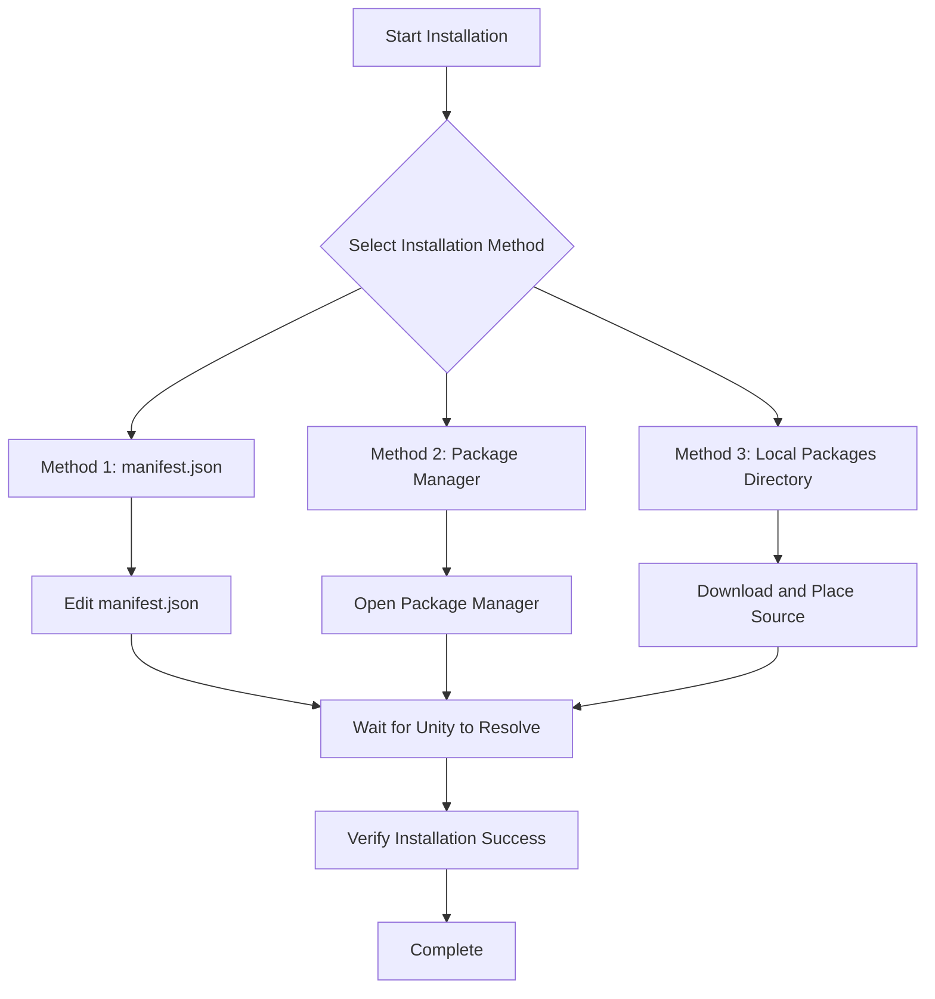

# Installation

This document describes how to install the GameFrameX Mono component into your Unity project.

## Overview

**GameFrameX Mono** is the MonoBehaviour lifecycle management component of the GameFrameX framework, providing a convenient way to listen to and manage Unity lifecycle events (such as Update, FixedUpdate, LateUpdate, OnDestroy, etc.).

### Prerequisites

| Requirement | Minimum Version |
|-------------|-----------------|
| Unity | 2017.1+ |
| GameFrameX.Runtime | Latest version |
| GameFrameX.Event.Runtime | Latest version |

> **Note**: Mono component depends on Event component. Please ensure [com.alianblank.gameframex.unity.event](https://github.com/GameFrameX/com.alianblank.gameframex.unity.event) is installed.

### Installation Methods Overview



---

## Installation Methods

### Method 1: Installation via manifest.json (Recommended)

This is the most recommended installation method, convenient for version management and team collaboration.

**Steps:**

1. Find your Unity project's `Packages/manifest.json` file
2. Add the following content under the `dependencies` node:

```json
{
  "dependencies": {
    "com.gameframex.unity.mono": "https://github.com/GameFrameX/com.gameframex.unity.mono.git"
  }
}
```

> Source: [README.md](https://github.com/GameFrameX/com.gameframex.unity.mono/blob/main/README.md#L46-L50)

3. After saving the file, Unity will automatically parse and download the package

**Advantages:**
- Convenient version management
- Automatic synchronization for team members
- Can lock specific versions

---

### Method 2: Installation via Unity Package Manager

Suitable for developers who prefer using GUI.

**Steps:**

1. Open Unity Editor
2. Go to **Window → Package Manager**
3. Click the **+** button in the upper left corner
4. Select **Add package from git URL**
5. Enter the following address:

```
https://github.com/GameFrameX/com.gameframex.unity.mono.git
```

6. Click **Add** button and wait for installation to complete

> Source: [README.md](https://github.com/GameFrameX/com.gameframex.unity.mono/blob/main/README.md#L50)

**Advantages:**
- Simple and intuitive operation
- No manual file editing required

---

### Method 3: Local Packages Directory Installation

Suitable for offline environments or scenarios requiring deep customization of source code.

**Steps:**

1. Clone or download the GitHub repository:

```bash
git clone https://github.com/GameFrameX/com.gameframex.unity.mono.git
```

2. Copy the downloaded folder to your Unity project's `Packages` directory
3. Unity will automatically recognize and load the package

> Source: [README.md](https://github.com/GameFrameX/com.gameframex.unity.mono/blob/main/README.md#L52)

**Advantages:**
- No network connection required
- Can directly modify source code for debugging

**Notes:**
- Manual update of package content required
- May be affected by Unity's auto-cleanup feature

---

## Installation Verification

After installation, you can verify success by:

### Method 1: Check Package Manager

In Unity, open **Window → Package Manager** and confirm `GameFrameX Mono` appears in the installed packages list.

### Method 2: Check Assembly Definition

Confirm the following assembly definition files exist:
- `Packages/com.gameframex.unity.mono/Runtime/GameFrameX.Mono.Runtime.asmdef`
- `Packages/com.gameframex.unity.mono/Editor/GameFrameX.Mono.Editor.asmdef`

### Method 3: Code Reference Test

Try referencing the Mono component namespace in your project:

```csharp
using GameFrameX.Mono.Runtime;

// Ensure IMonoManager and MonoComponent are available
public class TestComponent : MonoBehaviour
{
    private void Start()
    {
        var monoManager = MonoManager.Instance;
        Debug.Log("GameFrameX Mono installed successfully!");
    }
}
```

---

## Package Information

| Property | Value |
|----------|-------|
| Package Name | com.gameframex.unity.mono |
| Display Name | Game Frame X Mono |
| Version | 1.1.0 |
| Minimum Unity Version | 2017.1 |
| Category | Game Framework X |

> Source: [package.json](https://github.com/GameFrameX/com.gameframex.unity.mono/blob/main/package.json#L1-L10)

---

## Related Links

- [Overview](../1-overview.1-introduction)
- [Quick Start](../3-getting-started.1-basic-usage)
- [MonoManager Documentation](../4-core-components.1-monomanager)
- [MonoComponent Documentation](../4-core-components.2-monocomponent)
- [GitHub Repository](https://github.com/GameFrameX/com.gameframex.unity.mono.git)
- [Dependency Component: Event](https://github.com/GameFrameX/com.alianblank.gameframex.unity.event)
