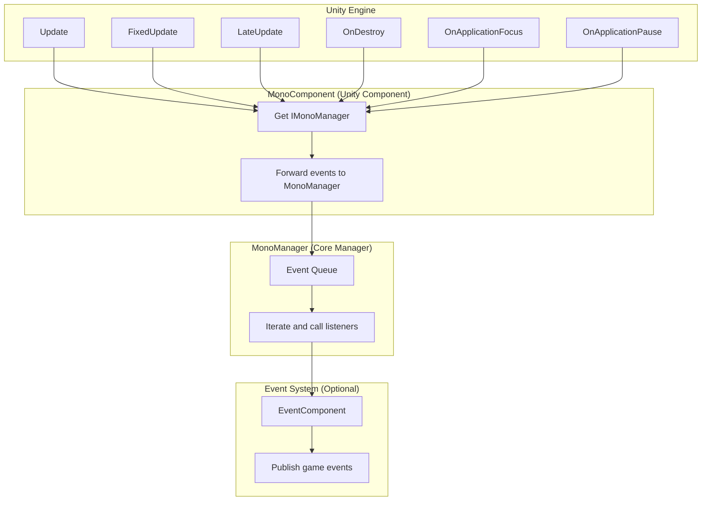
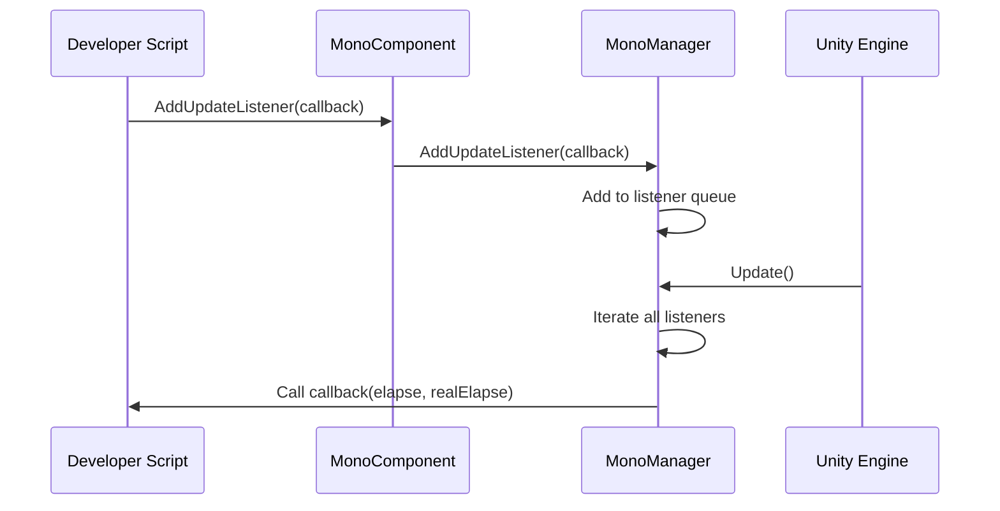

# Basic Usage

Basic usage guide for GameFrameX Mono lifecycle component, helping developers quickly get started and understand the framework's core usage.

## Overview

Mono lifecycle component is one of the core modules of the GameFrameX framework, used to uniformly manage various lifecycle events of `MonoBehaviour` in Unity. This component provides a simple listener pattern, allowing developers to conveniently subscribe to and manage events such as `Update`, `FixedUpdate`, `LateUpdate`, `OnDestroy`, `OnApplicationFocus`, and `OnApplicationPause` without separately handling these callbacks in every script.

> **Design Intent**: Centralize lifecycle callback logic scattered in various places into a unified event management system, avoiding code coupling, facilitating maintenance and extension.

## Architecture Overview



**Architecture Description:**
- **MonoComponent**: A Unity component mounted on GameObject, responsible for receiving Unity lifecycle callbacks and forwarding to MonoManager
- **MonoManager**: Core manager, maintains listener lists for each event, calls all listeners in sequence when callbacks are received
- **EventSystem**: Optional module, when focus or pause status changes, publishes game events via EventComponent for other modules to subscribe

## Core Concepts

### Listener Pattern

The framework uses a classic listener (Observer) pattern. Developers can subscribe to events they are interested in and receive notifications when events are triggered.



### Thread Safety Design

All listener add and remove operations are protected by `lock`, ensuring safety in multi-threaded environments. Listener invocations are also executed within the lock to prevent listeners from being unexpectedly modified during invocation.

> **Performance Optimization**: MonoManager uses `LinkedList<T>` to store listeners, supporting efficient add, remove, and traverse operations.

## Usage

### Step 1: Add MonoComponent

In Unity Editor, select the GameObject that needs to use lifecycle events, click **Add Component**, search for **GameFrameX/Mono** and add.

```csharp
// Source location: Runtime/Mono/MonoComponent.cs#L42-L44
[DisallowMultipleComponent]
[AddComponentMenu("GameFrameX/Mono")]
public class MonoComponent : GameFrameworkComponent
```

Or add dynamically via code:

```csharp
var monoComponent = gameObject.AddComponent<GameFrameX.Mono.Runtime.MonoComponent>();
```
> Source: [MonoComponent.cs](https://github.com/GameFrameX/com.gameframex.unity.mono/blob/main/Runtime/Mono/MonoComponent.cs#L42-L44)

### Step 2: Subscribe to Lifecycle Events

After obtaining the `MonoComponent` instance in a script, you can call corresponding methods to subscribe to events. Below is a complete usage example:

```csharp
using UnityEngine;
using GameFrameX.Mono.Runtime;
using System;

public class Example : MonoBehaviour
{
    private MonoComponent _monoComponent;

    private void Awake()
    {
        // Get MonoComponent instance
        _monoComponent = GetComponent<MonoComponent>();
    }

    private void Start()
    {
        // Subscribe to Update event
        _monoComponent.AddUpdateListener(OnGameUpdate);

        // Subscribe to FixedUpdate event
        _monoComponent.AddFixedUpdateListener(OnFixedUpdate);

        // Subscribe to LateUpdate event
        _monoComponent.AddLateUpdateListener(OnLateUpdate);

        // Subscribe to OnDestroy event
        _monoComponent.AddDestroyListener(OnGameObjectDestroy);

        // Subscribe to focus change event
        _monoComponent.AddOnApplicationFocusListener(OnApplicationFocus);

        // Subscribe to pause status change event
        _monoComponent.AddOnApplicationPauseListener(OnApplicationPause);
    }

    private void OnDestroy()
    {
        // Remove listeners when page is destroyed to avoid memory leaks
        if (_monoComponent != null)
        {
            _monoComponent.RemoveUpdateListener(OnGameUpdate);
            _monoComponent.RemoveFixedUpdateListener(OnFixedUpdate);
            _monoComponent.RemoveLateUpdateListener(OnLateUpdate);
            _monoComponent.RemoveDestroyListener(OnGameObjectDestroy);
            _monoComponent.RemoveOnApplicationFocusListener(OnApplicationFocus);
            _monoComponent.RemoveOnApplicationPauseListener(OnApplicationPause);
        }
    }

    // Update: Called every frame, first parameter is time since last frame, second parameter is real elapsed time
    private void OnGameUpdate(float elapseSeconds, float realElapseSeconds)
    {
        // Write game logic
    }

    // FixedUpdate: Called at fixed frame rate, suitable for physics-related logic
    private void OnFixedUpdate(float elapseSeconds, float fixedElapseSeconds)
    {
        // Write physics logic
    }

    // LateUpdate: Called after all Update calls, suitable for camera follow and other operations that need to execute after all movement logic
    private void OnLateUpdate(float elapseSeconds, float fixedElapseSeconds)
    {
        // Write logic that needs to execute last
    }

    // OnDestroy: Called when GameObject is destroyed, suitable for resource cleanup
    private void OnGameObjectDestroy()
    {
        // Clean up resources
    }

    // OnApplicationFocus: Called when application focus changes
    private void OnApplicationFocus(bool focusStatus)
    {
        if (focusStatus)
        {
            Debug.Log("Application gained focus");
        }
        else
        {
            Debug.Log("Application lost focus");
        }
    }

    // OnApplicationPause: Called when application pause status changes
    private void OnApplicationPause(bool pauseStatus)
    {
        if (pauseStatus)
        {
            Debug.Log("Game paused");
        }
        else
        {
            Debug.Log("Game resumed");
        }
    }
}
```

> Source: [MonoComponent.cs](https://github.com/GameFrameX/com.gameframex.unity.mono/blob/main/Runtime/Mono/MonoComponent.cs#L126-L300)

## Event Types Detail

| Event Type | Callback Parameters | Call Timing | Applicable Scenarios |
|-----------|---------------------|-------------|----------------------|
| **Update** | `(float elapseSeconds, float realElapseSeconds)` | Called first every frame | Game main loop logic, input detection |
| **FixedUpdate** | `(float elapseSeconds, float fixedElapseSeconds)` | Called at fixed frame rate (default 0.02s) | Physics engine related logic |
| **LateUpdate** | `(float elapseSeconds, float fixedElapseSeconds)` | After all Update calls | Camera follow, post-processing for character movement |
| **OnDestroy** | `()` | When GameObject is destroyed | Resource cleanup, event unsubscription |
| **OnApplicationFocus** | `(bool focusStatus)` | When app gains/loses focus | Pause game, record state |
| **OnApplicationPause** | `(bool pauseStatus)` | When app pauses/resumes | Save data, stop music |

### Parameter Description

- **elapseSeconds**: Time elapsed since last frame (seconds), affected by time scale
- **realElapseSeconds**: Real elapsed time (seconds), not affected by time scale
- **fixedElapseSeconds**: Elapsed time in fixed update mode
- **focusStatus**: Focus status, `true` means gained focus, `false` means lost focus
- **pauseStatus**: Pause status, `true` means paused, `false` means resumed

## Event System Integration

In addition to listener callbacks, `OnApplicationFocus` and `OnApplicationPause` events are also published through GameFrameX's event system. Developers can also use the event system to subscribe to these changes:

```csharp
using GameFrameX.Event.Runtime;
using GameFrameX.Mono.Runtime;

// Subscribe to focus change event
EventComponent.Subscribe<OnApplicationFocusChangedEventArgs>(OnFocusChanged);

// Subscribe to pause change event
EventComponent.Subscribe<OnApplicationPauseChangedEventArgs>(OnPauseChanged);

private void OnFocusChanged(OnApplicationFocusChangedEventArgs args)
{
    Debug.Log($"Focus changed: {args.IsFocus}");
}

private void OnPauseChanged(OnApplicationPauseChangedEventArgs args)
{
    Debug.Log($"Pause status: {args.IsPause}");
}
```

> **Note**: Event system publishing is implemented in MonoComponent. For details, refer to [Event System Documentation](../5-events.1-event-types).

## Best Practices

### 1. Remove Listeners Promptly

Remove listeners in `OnDestroy` or when component is disabled to avoid memory leaks and null reference exceptions:

```csharp
private void OnDestroy()
{
    // Check for null because Unity may clear references before destroying component
    _monoComponent?.RemoveUpdateListener(OnGameUpdate);
}
```

### 2. Don't Perform Time-consuming Operations in Listeners

Lifecycle events are called every frame. Time-consuming operations will block the game main thread and affect performance:

```csharp
// Not recommended: Perform time-consuming operations
private void OnGameUpdate(float elapse, float realElapse)
{
    LoadLargeResource(); // This will block the main thread
}

// Recommended: Use coroutines or async operations
private void OnGameUpdate(float elapse, float realElapse)
{
    StartCoroutine(LoadResourceAsync());
}
```

### 3. Exception Isolation

MonoManager implements exception isolation mechanism. A single listener's exception will not affect other listeners:

```csharp
// MonoManager internal implementation (source snippet)
private static void QueueInvoking(LinkedList<Action<float, float>> list, float elapseSeconds, float fixedElapseSeconds)
{
    lock (Lock)
    {
        foreach (var action in list)
        {
            try
            {
                action.Invoke(elapseSeconds, fixedElapseSeconds);
            }
            catch (Exception e)
            {
                Log.Error(e); // Log exception but continue executing other listeners
            }
        }
    }
}
```
> Source: [MonoManager.cs](https://github.com/GameFrameX/com.gameframex.unity.mono/blob/main/Runtime/Mono/MonoManager.cs#L364-L380)

### 4. Use Meaningful Listener Method Names

Use descriptive method names for listeners to improve code readability:

```csharp
// Recommended
_monoComponent.AddUpdateListener(UpdatePlayerMovement);
_monoComponent.AddFixedUpdateListener(SyncPhysicsState);

// Not recommended
_monoComponent.AddUpdateListener(Update);
_monoComponent.AddFixedUpdateListener(Fixed);
```

## Common Issues

### Q1: Where does MonoComponent need to be mounted?

MonoComponent needs to be mounted on the GameObject that needs to receive lifecycle events. It is recommended to mount on the game entry GameObject (such as GameManager), so all lifecycle events can be managed in one place.

### Q2: Will exceptions in listener callbacks affect game running?

No. MonoManager implements exception isolation. Exceptions in a single listener will be caught and logged, without affecting other listeners.

### Q3: What's the difference between Update, FixedUpdate, and LateUpdate?

- **Update**: Called every frame, time interval is not fixed, affected by frame rate. Suitable for most game logic.
- **FixedUpdate**: Called at fixed time intervals (default 0.02 seconds), suitable for physics calculations.
- **LateUpdate**: Called after all Update calls, suitable for camera follow and other operations that need to wait for other logic to complete.

### Q4: How to get MonoManager instance?

Get through GameFrameworkEntry:

```csharp
var monoManager = GameFrameworkEntry.GetModule<IMonoManager>();
```

### Q5: What's the difference between event listeners and event system?

- **Listeners**: Add callbacks through MonoComponent, called directly when events are triggered, suitable for one-to-one communication.
- **Event System**: Publish/subscribe events through EventComponent, supports multiple subscribers, suitable for one-to-many communication.

## Related Links

- [MonoManager Core Component Details](../4-core-components.1-monomanager)
- [MonoComponent Component Details](../4-core-components.2-monocomponent)
- [Event Types Details](../5-events.1-event-types)
- [Event Args Details](../5-events.2-event-args)
- [Installation Guide](../2-installation.1-installation-methods)
- [Overview](../1-overview.1-introduction)
